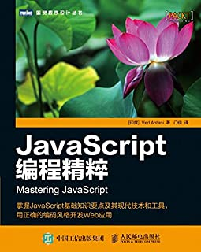

# 《JavaScript 编程精粹》


2017年8月第1版

这本书的内容并不是非常深入，也不够全面，营养内容不多。书中第三章关于正则，第五章关于设计模式、第六关于测试与调试因为主题不一致，未阅读摘录。

[[toc]]

## P24页：JS 自动插入分号机制 （automatic semicolon insertion, ASI)

> 关于 ASI 有过激烈的争论，在 JS 中语句结尾是否应该主动写分号，可自行搜索

ASI 的理念是使得行尾的分号成为可选的，ASI 能够帮助解析器判断一个语句什么时候结束，插入分号结尾。

那插入分号的标准是什么呢？

ASI 规定一个语句在下列情况下视为结束，会插入分号：
- 行终结符，指换行号之后是一个非法的词法单元，则视为此行语句结束。
- 遇到右大括号 `}`
- 抵达文件的尾部

```js
// 行终结符，指换行号之后是一个非法的词法单元，则视为此行语句结束
if (a < 1) a = 1 console.log(a)
// 出现在1后面的词法单元 console 是非法的，触发 ASI
if (a < 1) a = 1; console.log(a)

// 遇到右大括号 }
function add (a, b) { return a+ b }
// ASI 作用后
function add (a, b) { return a+ b; }
```

## P38页：作用域

- 作用域定义了变量的可访问范围和变量的生命周期。
- JS 是一门基于词法作用域的语言

## P44页：声明提升

关于JS声明提升需要理解以下几点：
- 不管是变量声明提升还是函数声明提升，都是在编译阶段发生的
- 当遇到变量和函数同名时，函数优先，提升后函数会覆盖同名的变量
- 变量声明提升只是提升声明部分，不包括赋值，提升后变量初始值是`undefined`，而函数声明提升是整体提升，包括函数体
- let const 声明变量提升会形成暂时性死区，并且提升后初始值并不是`undefined`

> 关于 var 提升与 let const 提升的区别，请点击查看

## P76页：典型继承中存在的问题

- 继承导致了耦合。子类继承父类，使得子类与其父类紧紧耦合在一起
- 继承导致了冗余。当从父类继承时，子类没有权利选择，会全部继承。这就是“当你想一要根香蕉，却得到了拿着香蕉的大猩猩和整片森林”的问题。


