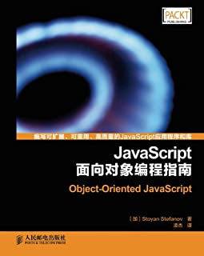

# 《JavaScript 面向对象编程》


2013年3月第1版

这本书的重点章节集中在 JS 核心的概念上：
- 函数：函数、作用域、闭包
- 对象：对象、原型、继承

另外还有一章对浏览器环境中的 BOM  DOM 讲解以值得看看。

[[toc]]

## P5：面向对象程序设计

OOP 面向对象程序设计中的概念：
- 对象：属性和方法
- 类
- 封装
- 聚合
- 多态
- 继承

对象：通过 《JavaScript 专家编程》一书我们了解到，在编程范畴内，对象是对现实中事物的一种隐喻表达，也就是本文中所说的，所谓对象，实质上是指现实事物在程序设计语言中的表现形式。而这里的“事物”可以是任何客观存在的对象，也可以是某些较为抽象的概念。所以对象的命名通常是名词形式，代表某类事物。

类：是对同一类对象中抽象出来共同的部分组成的对象模板。在传统的面向对象语言 C++ / JAVA，对象都是基于类这种模板创建的。但是在 JS 中，压根儿没有这种类的概念，该语言的一节都是基于对象的，对象的创建是基于另一对象的，JS 所依靠的是一套基于原型的系统。（原型也是一个对象）。
> 所以我们要明白，面向对象编程的实现有两种方式：一种是基于类的面向对象实现，一种是基于原型的面向对象的实现。<br> 这里说 JS 没有类的概念要与 ES6语法中  class 语法概念区分开。通过 JS 语言的演化历史，你就会发现，JS 这门语言始终在使用原型这套行系统去模拟实现 JAVA 的语言设施。

封装：两层意思
- 将对象的特征和表现通过对象的属性和方法进行封装，组成一个对象实例。（把抽象出来的数据（属性）和对数据的操作（方法）封装成对象）
- 另一层封装的意思指信息的隐藏，即数据被保护在对象内部，数据访问只能通过被授权的特权方法来访问对象成员（对象属性）。也包括对象属性和方法的可见性。

聚合：所谓聚合，也叫组合。实际上是指将几个现有对象合并成一个新对象的过程。强调将多个对象合而为一的能力。这个概念在 JS 实践较少，如果要达到组合多个对象属性和方法的效果，以前可以逐个对对象属性和方法进行遍历拷贝，但现代 ES6 中，可以使用 `Object.assign()`简单实现对象浅拷贝。

继承：继承的目的也是为了实现对现有代码的重用。在传统 OOP 中，继承都是指类与类之间的关系，但在JS中由于不存在类的概念，继承只发生在对象之间。
多态：函数重载（基于 JS 无限制函数参数数量的实现，arguments和 ES6的rest参数）和方法覆写（基于 JS 在原型链查找最近的属性实现）。

## P14：变量初始化

所谓变量初始化，实际上指的是变量首次被赋值的时机。可以有两种方法选择：
- 变量先声明，后赋值 `let i; i = 1;`
- 声明和赋值在一条语句中完成 `let i = 1;`

### P21: 指数表示法

在 JS 中，数值类型可以用指数形式表示：1e1 或者 1e+1。在理解上可以这样认为：
- 2e+3: 在数字后面加3个0，即2000
- 2e+3: 将数字2的小数点右移3位，即2000; 2e-3: 将数字2的小数点左移3位，即0.002。
> 假想在整数后跟一个小数。<br>在十进制中，e 代表指数根 10, e+3 理解为 10的3次方。 e-3 理解为 10的-3次方，即小数形式。

### P56：`parseInt(string, radix)`

该内置的全局方法的作用是将数值字符串转为十进制数，以前对这个方法有两个认知误区：
1. 以为第二参数radix是指想要的结果的进制，但事实上，第二个参数是用来表明当前第一个参数代表的进制，而不是该方法返回结果的进制，返回的结果只能是十进制数。
1. 第二参数缺省时，以为默认是10进制数，但事实上，方法会根据第一个参数的表示形式自动判断。

[MDN parseInt](https://developer.mozilla.org/zh-CN/docs/Web/JavaScript/Reference/Global_Objects/parseInt)如果 radix 是 undefined、0或未指定的，JavaScript会假定以下情况：

- 如果输入的 string以 "0x"或 "0x"（一个0，后面是小写或大写的X）开头，那么radix被假定为16，字符串的其余部分被解析为十六进制数。
- 如果输入的 string以 "0"（0）开头， radix被假定为8（八进制）或10（十进制）。具体选择哪一个radix取决于宿主的实现。ECMAScript 5 澄清了应该使用 10 (十进制)，但不是所有的浏览器都支持。因此，在使用 parseInt 时，一定要指定一个 radix。
- 如果输入的 string 以任何其他值开头， radix 是 10 (十进制)。
- 如果第一个字符不能转换为数字，parseInt会返回 NaN。

> 对于没有指定 radix 参数时的八进制解析，ECMAScript 5 规范不再允许parseInt函数的实现环境把以0字符开始的字符串作为八进制数值。但在以前 ECMAScript 3中，ECMAScript 3仅仅是不提倡这种做法但并没有禁止这种做法。所以直至2013年，很多实现环境并没有采取新的规范所规定的做法, 而且由于必须兼容旧版的浏览器，所以永远都要明确给出radix参数的值.

如果要将某个数转换返回指定进制的数，可以使用方法：`Number.prototype.toString(radix)`

```js
parseInt("0xF", 16) // 15
parseInt('015', 10) // 15
parseInt('015') // 15，现代浏览器大部分都遵循 ES5的实现，遇0按十进制转换，但也可以某个存在兼容性的浏览器按8进制转换，返回 13
parseInt('015', 8) // 13
parseInt('08', 8) // 0, 因为 8 在进制数中不是有效数字


16..toString(16) // F 如果直接数值打点，解释器会将第数字紧跟的第一点认为是小数点，小数点后面接字符会报错。所以数字要直接调用方法，需要两个点
Number(16).toString(16) // F, 用构造函数包装，隐式转成包装对象，打点调用方法
new Nubmer(16).toString(16) // F, 显式转换成包装对象打点调用
```

## P57：`parseFloat(string)`

不同于 parseInt， parseFloat只包含一个参数。将字符串解析为十进制的小数表示。

规则是：
- 如果 parseFloat 在解析过程中遇到了**正号（+）、负号（- U+002D HYPHEN-MINUS）、数字（0-9）、小数点（.）、或者科学记数法中的指数（e 或 E）**以外的字符，则它会忽略该字符以及之后的所有字符，返回当前已经解析到的浮点数。
- 第二个小数点的出现也会使解析停止（在这之前的字符都会被解析）。
- 参数首位和末位的空白符会被忽略。
- 如果参数字符串的第一个字符不能被解析成为数字,则 parseFloat 返回 NaN。
- parseFloat 也可以解析并返回 Infinity。
- parseFloat解析 BigInt 为 Numbers, 丢失精度。因为末位 n 字符被丢弃。
- parseFloat 也可以转换一个已经定义了 toString 或者 valueOf 方法的对象，它返回的值和在调用该方法的结果上调用 parseFloat 值相同。

```js
// 以下都返回 3.14
parseFloat(3.14);
parseFloat('3.14');
parseFloat('3.14.159');
parseFloat('  3.14  ');
parseFloat('314e-2');
parseFloat('0.0314E+2');
parseFloat('3.14some non-digit characters');
parseFloat({ toString: function() { return "3.14" } });

parseFloat("FF2"); // NaN
```

## P59: URI/URL的编码和返编码

- `encodeURI() / encodeURIComponent()`
- `decodeURI() / decodeURIComponent()`

在 URL (Uniform Resource Locator 统一资源定位符) 或 URI (Uniform Resource Identifier 统一资源标识符)中，有一些字符是具有特殊含义的，如果我们不转换原样进行传输的话，可能会与 JSON 格式中的特殊字符字符冲突，或者与其它网络协议中特殊字符冲突导致失败。此时我们就需要将包含特殊字符的 URL 进行转换包装一下再进行传输。

在全局对象中提供了转换包装的方法： encodeURI / encodeURIComponent

两者的不同在于：encodeURI能转换成一个可用的URL，相当于会智能识别正常URL部分的字符不进行转换。但 encodeURIComponent 则将要转换的入参都当作只是 URL 中需要转换的那一部分（component），将所有字符都进行了转换。

```js
let url = 'http://www.baidu.com/scr ipt.php?q=this and that';
encodeURI(url) // http://www.baidu.com/scr%20ipt.php?q=this%20and%20that
encodeURIComponent(url) // http%3A%2F%2Fwww.baidu.com%2Fscr%20ipt.php%3Fq%3Dthis%20and%20that   将正常的 http://www.baidu.com/ 中的特殊字符也转换了。
```
对应的也有两个反转义的函数 `decodeURI() / decodeURIComponent()`

```js
let url = 'http://www.baidu.com/scr ipt.php?q=this and that';
encodeURI(url) // http://www.baidu.com/scr%20ipt.php?q=this%20and%20that
encodeURIComponent(url) // http%3A%2F%2Fwww.baidu.com%2Fscr%20ipt.php%3Fq%3Dthis%20and%20that   将正常的 http://www.baidu.com/ 中的特殊字符也转换了。

decodeURI(encodeURI(url)) // http://www.baidu.com/scr ipt.php?q=this and that
encodeURIComponent(encodeURIComponent(url)) // http://www.baidu.com/scr ipt.php?q=this and that
```

## P85: 哈希表和索引数组

在一些程序设计语言中，通常都会存在着两种不同的数组形式：
- 一般性数组：也叫索引型数组，或叫枚举型数组（通常以数字为键值）
- 关联型数组：也叫哈希表，或叫散列表，是一种 key-value的数组结构（通常以字符串为键值）

在 JS 中，我们会用 Array 数组来表示索引数组，而用 Object 对象来表示关联数组。所以在 JS 中要表示哈希表，就必须用到对象

```js
// 索引型数组
const arr = ['a', 'b', 'c']

// 哈希表
const obj = {
  '1': 'a',
  '2': 'b',
  '3': 'c',
}
```

## P96: 内置对象 built-in Object

内置对象大致分为三类：
- 数据封装类：即对应基本类型的构造器对象，包括 Object / Array / Function / Boolean / String / Number
- 工具类对象：Math / Date / RegExp
- 错误类对象：Error / TypeError / RangeError 等。

> [漫话：为什么计算机起始时间是1970年1月1日0时0分0称？](https://biz.51cto.com/art/202005/616337.htm)<br>[计算机元年(纪年 Epoch Time)和UTC](https://zhuanlan.zhihu.com/p/72516872)<br>[UTC时间、GMT时间、本地时间、Unix时间戳](https://www.cnblogs.com/xwdreamer/p/8761825.html)

> Unix时间戳是秒，而通过 JS 的 new Date().getTime() 获取的时间戳是 毫秒 单位。

## P180： 继承的实现

在 JS 中，继承的目的是实例代码复用， 

继承的实现分为四种：
- `Object.create()`
- 构造器 `new + F`
- ES6新语法 Class
- 对象的属性的拷贝（浅拷贝和深拷贝）

具体看书中表中总结 

## P248：编程模式与设计模式

1. 什么是模式？

模式，简单说，就是专门为某些常见问题总结出的优秀的解决方案。

> 当我们面对一个新的编程问题时，往往会立刻发现眼前的这个问题与我们之前解决过的某个问题有很多相似之处。这个时候，你或许就会考虑将这些问题总结、抽象、归类，以寻求一个通用性的解决方案。而所谓模式，实际上就是一系列经过实战证明的，针对某类问题，具有可重用性的解决方案。模式被当做一个术语来使用，并命名，以使交流变得更容易而已。

本章讨论的模式分为两类：
- 编程模式： 一些专门为 JS 语言开发出的最佳实践方案
- 设计模式： 这些模式与具体语言实现无关，主要来自“GoF的《设计模式》”一书

> 《设计模式：可利用的面向对象软件的基础》是软件工程领域有关软件设计的一本书，提出和总结了对一些常见软件设计问题的标准解决方案，称为软件设计模式。该书的作者有四个人，通常称为“四人帮”（Gang of Four, GoF)

2. 编程模式

- 行为隔离（关注点分离）
- 命名空间
- 初始化分支
- 延迟定义
- 配置对象
- 私有变量和方法
- 特权方法
- 私有函数的公有化
- 自执行函数
- 链式调用

3. 设计模式

- 创建型模式： 涉及对象的创建和初始化
- 结构型模式： 描述了如何组合对象以提供新的功能
- 行为型模式： 描述了对象之间的通信