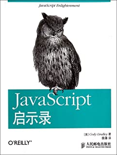

# 《JavaScritp 启示录》


2014年3月第1版

这不是一本关于JS概念很全的参考书，全书的内容主要集中在JS的核心内容：Object对象和Function对象。
- Object对象：对象创建、对象属性、对象原型
- Function对象：函数、作用域、闭包、this

这本书适合作为《深入理解 JavaScript》这本书的补充。两本书结合起来看更好。


[[toc]]

## 1. P22页， 订正：typeof 正则的结果也是对象

> 主流浏览器 IE/Firefox/Opera/Google 都返回 'object'，而 Sarfari，在3.x版本系统列中，返回的是‘function'，5.x版本后与其它浏览器调整为一致。 -----《JavaScript 语言精髓》 P104 译注
 
```js
var myRegExp = new RegExp('\\bt[a-z]+\\b');
console.log(typeof myRegExp);   // 输出 object，并不是 function
```
## 2. p28页，JavaScript 对象 和 Object() 对象不要混淆

- JavaScript 对象通常指表示 JavaScript 中所有可作为对象的值
- Object() 是一个通用对象的构造函数，或者说是用于生成通用对象的容器。其创建出来的对象是 JS 中一种特定类型的值，这个类型 Object 类型。就像 Array() 数组构造函数生成数组类型的对象一样。

## 3. p34页，delete 删除对象属性

- delete 操作符可以用于将属性从一个对象中完全删除，但不会删除在对象原型链上的属性。
- delete 是将属性从一个对象中删除的唯一方法。将属性赋值为 undefined 或 null 只能改变属性的值，并不会将属性从对象中删除。
- 如果要放弃一个对象类型的值，可以将整个对象值赋值为 null，这样切断该对象的所有引用，待JS垃圾回收时清空该对象存储对应的内存空间。

## 4. p37页，对象属性的引用

记住一点，当调用对象属性时，属性查找总是会发生，不是在对象自身属性中查找，就是在对象所属的原型链上查找属性。只有当链中最一个节点 `Object.prototype` 对象上还没有查找到需要引用的属性时，才视为未定义的属性，即返回 `undefined`。这个属性查找过程就是 JavaScript 处理继承和属性引用的过程。

## 5. P70页，如何确定 this 的值

- this 值会作为所有函数的默认参数，可以在函数体内直接使用。
- this 值基于在运行时调用函数的上下文对象。依据函数调用的方式主要有四种情况：
  - 函数作为对象方法调用时，this 指向该对象
  - 函数作为构造函数调用时，this 指向该构造函数创建的实例对象
  - 函数作为原型对象属性时，this 指向该原型的实例对象
  - 函数直接调用，此时函数视为在全局上下文中调用，this 指向全局对象
  - 使用函数对象自身的 `call / apply / bind`属性调用时，this 指向其显性传入的对象

## 6. p66页，使用 var 声明变量和不使用 var声明变量的细微差别

> [https://stackoverflow.com/questions/1470488/what-is-the-purpose-of-the-var-keyword-and-when-should-i-use-it-or-omit-it#answer-1471738](https://stackoverflow.com/questions/1470488/what-is-the-purpose-of-the-var-keyword-and-when-should-i-use-it-or-omit-it#answer-1471738)

共同点：成为全局对象的属性
- 在全局作用域下，使用var 声明的变量会成为全局对象 window 的属性
- 不管在哪里，如果直接赋值给一个未经声明的变量，那该变量都会成为全局变量，即成为全局对象 window 的属性

差别：
- var 声明的变量成为全局对象的属性后，不可删除，即该属性描述符中 configurable 值为false
- 未经声明的隐性全局变量，可删除，即该属性的描述符中 configrable 值为true

```js
// 在全局作用域下
var a = 123
b = 456

Object.getOwnPropertyDescriptor(window, 'a')
/**
    configurable: false
    enumerable: true
    value: 123
    writable: true
*/

Object.getOwnPropertyDescriptor(window, 'b')
/**
    configurable: true
    enumerable: true
    value: 123
    writable: true
*/

delete window.a // false, 在严格模式下报错
delete window.b // true
```

这里引申下 `delete` 操作符的一些特征

> [MDN delete 操作符](https://developer.mozilla.org/zh-CN/docs/Web/JavaScript/Reference/Operators/delete) 

- 如果你试图删除的属性不存在，那么delete将不会起任何作用，但仍会返回true
- 如果对象的原型链上有一个与待删除属性同名的属性，那么删除属性之后，对象会使用原型链上的那个属性（也就是说，delete操作只会在自身的属性上起作用）
- 任何使用 var 声明的属性不能从全局作用域或函数的作用域中删除。
- delete操作不能删除任何在全局作用域中的函数（无论这个函数是来自于函数声明或函数表达式）,但在对象(object)中的函数是能够用delete操作删除的。
- 任何用let或const声明的属性不能够从它被声明的作用域中删除。
- 不可设置的(Non-configurable)属性不能被移除。这意味着像Math, Array, Object内置对象的属性以及使用Object.defineProperty()方法设置为不可设置的属性不能被删除。

所以总结起来就是：
- 使用了 var let const function 声明的变量，其属性描述符的 configurable 值为 false。
- delete操作不能删除属性描述符 onfigurable 值为 false，在非严格模式下返回 false, 在严格模式下抛出语法错误（SyntaxError）

## 7. p81页，函数声明或定义时确定作用域，为词法作用域，而非调用时确定。
- 函数声明或定义时确定该函数的词法作用域，即静态作用域，在函数编译阶段时确定
- 函数作用域链是指词法作用域嵌套形成关系链，主要用于函数上下文内属性的查找。（即变量的引用沿作用域查找，对象属性的引用沿原型链查找，这是JS两套链式规则。）
- this 值的确定有点类似动态作用域的概念，在函数执行执行阶段确定。
- 闭包是由作用域引起的。

## 8. p84页，关于原型
- 任何JS函数，包括构造函数和普通函数，都实现了 `prototype` 属性，即 Fn.prototype 指向一个对象类型的值，称为原型对象
- 任何JS对象，都有一个内部属性`[[prototype]]`，指向其原型对象，与该对象的构造函数的`prototype`属性指向同一个原型对象。在实例对象中可以通过浏览器实现的`__proto__`非标准属性引用其原型对象，或通过ES6规定的标准方法`Ojbect.getPrototypeOf(obj)`来引用该原型对象。
- 原生的原型对象默认有一个`constructor`属性，指向实例对象的构造函数。如果用一个新对象替换了`prototype`属性，会删除默认的构造函数属性。

```js
function Foo () {}
const foo = new Foo()
console.log(foo.constructor === Foo) // true 此时实例对象foo引用的 constructor 属性其实是在其原型对象上查找到的。
console.log(foo.__proto__.constructor === Foo) // true
console.log(Object.getPrototypeOf(foo).constructor === Foo) // true

// 如果此时重写了 Foo 的原型对象，就会切断实例对象的构造函数引用
Foo.prototype = {}
console.log(foo.constructor === Foo) // false
console.log(foo.__proto__.constructor === Foo) // false
console.log(Object.getPrototypeOf(foo).constructor === Foo) // false

// 所以一般在面向对象继承中，如果需要更改原型对象时，需要重写constructor属性
Foo.prototype = {constructor：Foo}
```

## 9. p90页，js的动态性还体现在：继承原型属性的实例对象总是能够获得新的属性值

即当我们向原型添加一个新的属性时，该属性对所有基于该原型的实例对象都是可见的。

```js
function Foo(name) {
  this.name = name
}
Foo.prototype.getName = function() {
  return this.name
}

const foo_1 = new Foo(foo_1)
const foo_2 = new Foo(foo_2)
foo_1.getName()
foo_2.getName()

// 当在原型上新增一个属性时，之前创建的实例对象也能及时获取
Foo.prototype.getFullName = function() {
  return 'fullname: ' + this.name
}
foo_1.getFullName()
```