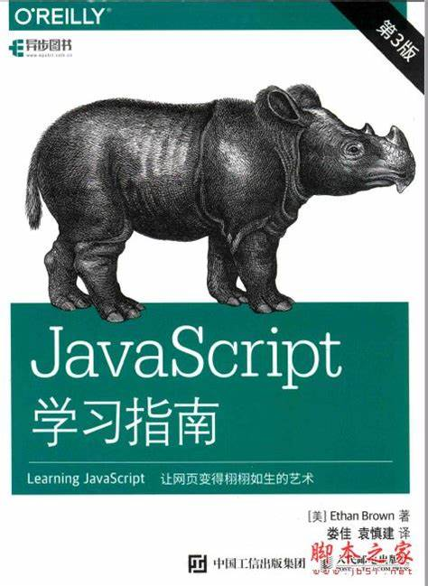

# 《JavaScritp 学习指南》


2017年7月第1版

这本书算是一个学习指南吧，罗列了 JS 学习基本的主题，但内容深度上也只是点到为止。在函数章节内容之间有点割裂，但好的地方是涉及的语法还是ES6较新的语法。

对自己有意义的章节：

- chapter 13: 函数和抽象思考的力量，总结内容见[函数高阶应用](/FE-Language/ES/fn-4-senior.html)
- chapter 12: 迭代器和生成器
- chapter 14: 异步编程： 回调 -> Promise -> 生成器

## P170：迭代协议

迭代器协议是说，如果一个类提供了一个符号方法`[Symbol.iterator]`，这个方法返回一个具有迭代行为的对象，即返回的对象中有 next 方法，同时 next 方法返回一个包含 value 和 done 的对象。

```js
class Log() {
  constructor() {
    this.messages = []
  }

  add(msg) {
    this.messages.push({message: msg, timestamp: Date.now()})
  }

  [Symbol.iterator]() {
    return this.messages.values()
  }
}
```
> 对一个数组直接使用 values 方法，返回的是一个可以遍历数组值的迭代器对象

使用上面的类生成一个实例对象
```js
const log = new Log()
log.add('first')
log.add('second')
log.add('three')

// 此时可以像数组一样迭代这个对象，因为其具有 迭代器协议
for (let { message, timestamp} of log) {
  console.log(`${message} @ ${timestamp}`)
}
```

## P172: 生成器

一般来说，常规函数会获取传入的参数，然后运行返回结果，但是函数调用者并没有办法控制函数在运行过程，只能按函数声明时定义好的逻辑执行。也就是说当调用一个函数的时候，实际上就是放弃了对函数的控制，直到函数返回。

有了生成器，就可以对函数的执行过程进行控制。生成器函数提供了两种能力：
- 控制函数执行的能力，使函数能够分步执行。生成器函数通过 yield 操作符，在函数运行时将控制权交还给调用方。
- 函数调用者与执行中的函数进行对象的能力，通过 next 方法传入值, yield 操作符返回传入的值

生成器还有一个特别之处是，当生成器函数调用时，并不是立即执行函数，而是返回一个迭代器对象，函数体的代码是在调用迭代器对象的 next 方法时执行的。

```js
function* rainbow() {
  yield 'red'
  yield 'orange'
  yield 'yellow'
  yield 'green'
}

const iterator = rainbow()
iterator.next() // { value: 'red', done: false }
iterator.next() // { value: 'orange', done: false }
iterator.next() // { value: 'yellow', done: false }
iterator.next() // { value: 'green', done: true }
iterator.next() // { value: 'undefined', done: true }
iterator.next() // { value: 'undefined', done: true }f

// 因为 rainbow 生成器返回一个迭代器，所以也可以使用 for of 循环
for (let color of rainbow() ) {
  console.log(color)
}
```

### 生成器与调用者的双向交流

生成器可以让其与调用者进行双向交流，这个功能是通过 yield 表达式实现的。

在 JS 语法中，表达式总是会计算出一个值，而 yield 操作符 组成的是一个表达式语句。 但区别于常规操作符计算返回后面表达式的值，yield 操作符返回的是调用都通过 next 方法传入的值。就好比 void 操作符不管接着什么表达式，总是返回 undefined 一样特殊。

```js
function* interrogate() {
  const name = yield "What is your name?"
  const color = yield "What is your favorite color?"
  return `${name} 's favorite color is ${color}`
}

const it = interrogate()
it.next().value // What is your name?
it.next('Tom').value // What is your favorite color?
it.next('orange') // Tom 's favorite color is orange
```

### 生成器函数返回值 return

yield 表达式本身并不能让生成器结束，即使它是生成器的最后一个语句。比如上面第一个例子中，持续调用 `iterator.next()` 仍然会返回对象，只不过 value 值是 undefined , done的值是 false 。

如果在生成器函数中任意位置调用 return 语句，都会使 done 失值变为 true，而 value 的值则是 return 需要返回的值。

```js
function* abcd() {
  yield 'a'
  yield 'b'
  return 'c'
  yield 'd'
}

const it = abcd()
it.next() // {value: 'a', done: false }
it.next() // {value: 'b', done: false }
it.next() // {value: 'c', done: true }
it.next() // {value: 'undefined', done: true }
```

> 建议不要在return 中提供一个对生成器有意义的值，如果想在生成之外使用某个值，应用使用 yield；<br> return 应该只被用做提前停止生成器。在生成器调用 return 的时候不提供返回值。

另外一点要注意，迭代器协议只在于 yield 表达式，并不会在意 done 为 true 时的值。像上例使用 return 返回的生成器函数，如果用 for...of 循环，"c" 是不会被打印的。

```js
for ( let v of abcd() ) {
  console.log(v) // a  b
}
```