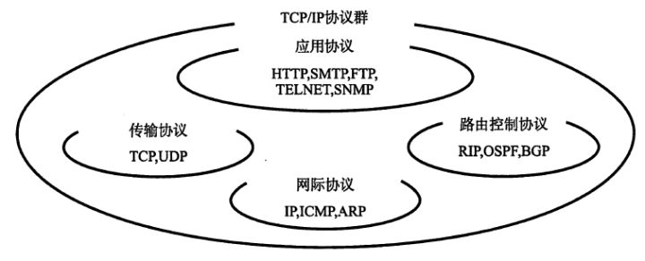
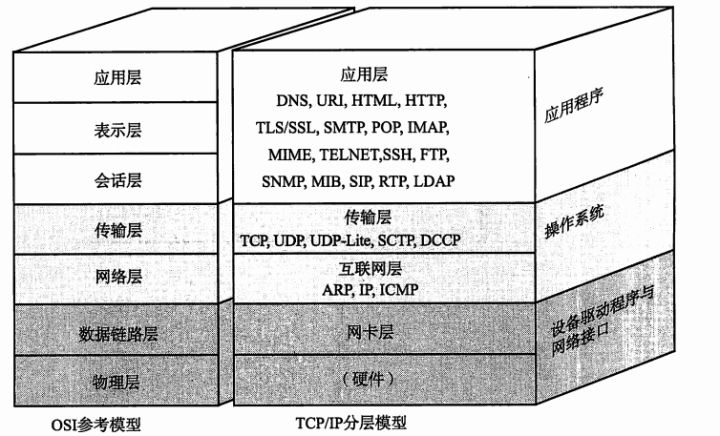
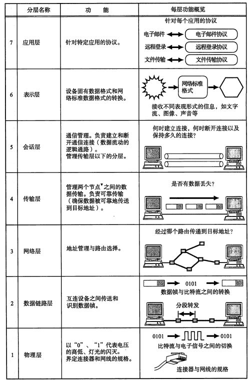
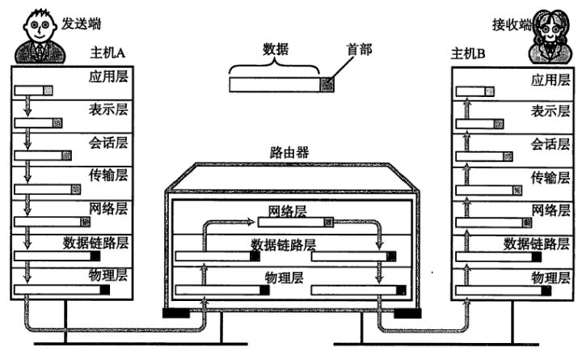
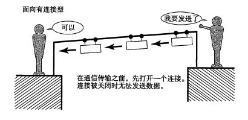
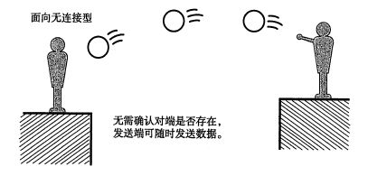
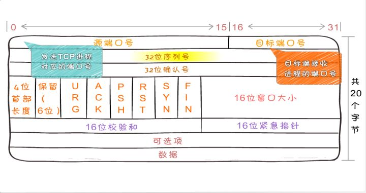
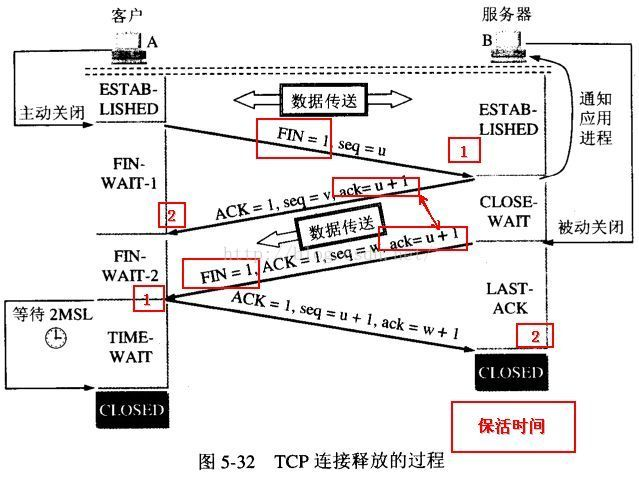

# 网络协议：TCP/IP协议详解

[[toc]]

## 协议

简单来说，协议就是计算机与计算机之间通过网络通信时，事先达成的一种 “约定”。这种“约定”使不同厂商的设备、不同的CPU以及不同操作系统组成的计算机之间，只要遵循相同的协议就能够实现通信。

协议分为很多种，每一种协议都明确界定了它的行为规范。两台计算机必须遵循相同协议进行处理，这样才能实现相互通信。

>协议就好比快递包裹的面单格式，双方约定好面单信息必须包括寄件信息（寄件人姓名，手机、地址），收件信息（收件人姓名、手机、地址），这样这个快递员才能准备投递。另外还要约定面单条码格式，这样快递在中转场地被自动化机器扫描识别。

所以不同协议约定的作用于特定的用途。

## TCP/IP协议族

TCP/IP协议，准确来说是TCP/IP协议族，是各类协议的一个集合。因为基于TCP和IP这两个最初的协议之上建立的其它不同的通信协议，所以就用TCP/IP协议来指代互联网通信协议的大集合。
> 后面简称TCP/IP，都是指代TCP/IP协议族

### 协议的分层

网络协议通常分不同层次进行开发，每一层分别负责不同的通信功能，不同的通信功能对应不同的协议规范。

TCP/IP协议族就是一组不同层次上的多个协议的组合。 

> 传统上来说 TCP/IP 是一个四层协议, 而ISO（国际标准化组织），制定了一个国际标准OSI七层协议模型，OSI协议以OSI参考模型为基础界定了每个阶层的协议和每个阶层之间接口相关的标准。

### 各层的功能：
- 应用层：为操作系统或网络应用程序提供访问网络服务的接口。应用层协议的代表包括：Telnet、FTP、HTTP、SNMP等。数据格式称为报文
- 表示层：将应用处理的信息转换为适合网络传输的格式，或将来自下一层的数据转换为上层能够处理的格式。通常是数据的加密、压缩。常用的格式：JPEG、ASCll、DECOIC等。
- 会话层：负责建立和断开通信连接（数据流动的逻辑通路），以及数据的分割等数据传输相关的管理。
- 传输层：管理两个节点之间的数据传输。负责可靠传输（确保数据被可靠地传送到目标地址）。代表协议：TCP、UDP
- 网络层：地址管理与路由选择（路由器）, 这一层数据的单位称为数据包（packet）。代表协议有：ICMP IGMP IP（IPV4 IPV6）。
- 链路层：互连设备之间传送和识别数据帧（交换机），用MAC地址访问介质。
- 物理层：维护物理实物的连接，比如：中继器、集线器、还有我们通常说的双绞线等就工作在物理层。以"0"、 "1"代表电压的高低，灯光的闪灭，在这一层，数据的单位称为比特（bit）。

### 各层的通信：
- 发送方由第七层到第一层 由上到下按照顺序传送数据，每个分层在处理上层传递的数据时，附上当前层协议所必须的 "首部"信息。
- 接收方由第一层到第七层 由下到上按照顺序传递数据，每个分层对接收到的数据进行 "首部"与"内容"分离，在转发给上一层。最终将发送的数据恢复为原始数据。

### 通信方式的分类

网络通信科根据数据发送方法有多种分类，常见的就是面向有连接型和面向无连接型。
- 面向有连接型
发送数据之前，需要在收发主机之间建立一条通信线路，在通信传输前后，专门进行建立和断开连接的处理，如果与对端之间无法通信，可避免发送无谓的数据

- 面向无连接型
无需确认对方端是否存在，发送端只管发送数据。

### 通信的数据单位：报文、帧、数据包
- 应用层：报文（message），一般指完整的信息，传输层实现报文交付，位于应用层的信息分组称为报文；
- 传输层：报文段（segment），组成报文的每个分组；
- 网络层：数据包（packet）是网络传输中的二进制格式单元，数据包（packet）是TCP/IP通信协议传输中的数据单位；是网络层传输数据基本单元，包含一个报头和数据本身，其中报头描述了数据的目的地及其与其他数据之间的关系；
- 链路层：帧（frame），数据链路层的协议数据单元，为了保证数据的可靠传输，把用户数据封装成帧；
- 物理层：PDU（bit），协议数据单元；

packet/frame/Datagram/segment是存在于同条记录中的，这些是基于所在协议层的不同取了不同的名字。

## IP 协议

IP协议：Internet Protocol 网际协议。

互联网上不同的在线设备都有唯一的地址，地址只是一个数字。计算机的地址就称为 IP 地址，访问任何网站实际上只是你的计算机向另外一台计算机请求信息。

> 就像收件地址类似，你只需要知道一个家庭的具体地址，就可以往这个地址发送包裹

如果要想把一个数据包从主机 A 发送给主机 B，那么在传输之前，数据包上会被附加上主机 B 的 IP 地址信息，这样在传输过程中才能正确寻址。

额外地，数据包上还会附加上主机 A 本身的 IP 地址，有了这些信息主机 B 才可以回复信息给主机 A。

这些附加的信息会被装进一个叫 IP 头的数据结构里。IP 头是 IP 数据包开头的信息，包含 IP 版本、源 IP 地址、目标 IP 地址、生存时间等信息。

- 上层将含有“极客时间”的数据包交给网络层；
- 网络层再将 IP 头附加到数据包上，组成新的 IP 数据包，并交给底层；
- 底层通过物理网络将数据包传输给主机 B；
- 数据包被传输到主机 B 的网络层，在这里主机 B 拆开数据包的 IP 头信息，并将拆开来的数据部分交给上层；
- 最终，含有“极客时间”信息的数据包就到达了主机 B 的上层了。

## UDP 协议
UDP协议：User Datagram Protocol 用户数据包协议。

IP 是非常底层的协议，只负责把数据包传送到对方电脑，但是对方电脑并不知道把数据包交给哪个程序。是微信还是QQ和数据无法区分。因此，需要基于 IP 之上开发能和应用打交道的协议，就是用户数据包协议（User Datagram Protocol），简称UDP协议。

UDP 中一个最重要的信息是定义了端口号，端口号其实就是一个数字，每个想访问网络的程序都需要绑定一个端口号。通过端口号 UDP 就能把指定的数据包发送给指定的程序了。

> 就好快递中有了地址，但不知道快递是谁的，这时就是需要规定快递面单上需要填写手机号。通过手机号找到包裹的主人。

>端口号的分配： 
知名端口号一般位于：1 --- 255 之间 
256 --- 1023的端口号，通常是由Unix系统占用（系统占用） 
1024 ---5000 是大多数TCP、IP实现的临时分配 
大于5000的一般是给其他服务预留的（Internet上并不常用的服务） 

和IP 头一样，端口号会被装进 UDP 头里面，UDP 头再和原始数据包合并组成新的 UDP 数据包。UDP 头中除了目的端口，还有源端口号等信息。

为了支持 UDP 协议，把前面的三层结构扩充为四层结构，在网络层和上层之间增加了传输层，如下图所示：

这样，IP 通过 IP 地址信息把数据包发送给指定的电脑，而 UDP 通过端口号把数据包分发给正确的程序。

但是在使用UDP协议传输数据时，存在两个问题：
- UDP 并不提供重发机制，在使用 UDP 发送数据时，有各种因素会导致数据包出错，虽然 UDP 可以校验数据是否正确，但是对于错误的数据包，只是丢弃当前的包，并不重包错误包；
- 大文件会被拆分成很多小的数据包来传输，这些小的数据包会经过不同的路由，并在不同的时间到达接收端，而 UDP 协议并不知道如何组装这些数据包，无法把这些数据包还原成完整的文件。

基于这两个问题，所以引入 TCP 协议替代UDP，来保证数据传输的准确性。

## TCP 协议

TCP协议：Transmission Control Protocol，传输控制协议。是一种面向连接的、可靠的、基于字节流的传输层通信协议。

相对于 UDP，TCP 有下面两个特点:
- 对于数据包丢失的情况，TCP 提供重传机制；
- TCP 引入了数据包排序机制，用来保证把乱序的数据包组合成一个完整的文件。

TCP 头除了包含了目标端口和本机端口号外，还提供了用于排序的序列号，以便接收端通过序号来重排数据包。

一个完整的 TCP 连接的生命周期包括了**建立连接**、**传输数据**、**断开连接**三个阶段。

- 首先，建立连接阶段

这个阶段是通过“三次握手”来建立客户端和服务器之间的连接。TCP 提供面向连接的通信传输。面向连接是指在数据通信开始之前先做好两端之间的准备工作。所谓三次握手，是指在建立一个 TCP 连接时，客户端和服务器总共要发送三个数据包以确认连接的建立。

- 其次，传输数据阶段

在该阶段，接收端需要对每个数据包进行确认操作，也就是接收端在接收到数据包之后，需要发送确认数据包给发送端。所以当发送端发送了一个数据包之后，在规定时间内没有接收到接收端反馈的确认消息，则判断为数据包丢失，并触发发送端的重发机制。同样，一个大的文件在传输过程中会被拆分成很多小的数据包，这些数据包到达接收端后，接收端会按照 TCP 头中的序号为其排序，从而保证组成完整的数据。

- 最后，断开连接阶段。

数据传输完毕之后，就要终止连接了，涉及到最后一个阶段“四次挥手”来保证双方都能断开连接。

总结：
- TCP 为了保证数据传输的可靠性，牺牲了数据包的传输速度，因为“三次握手”和“数据包校验机制”等把传输过程中的数据包的数量提高了一倍。
- UDP 不能保证数据可靠性，但是传输速度却非常快，所以 UDP 会应用在一些关注速度、但不那么严格要求数据完整性的领域，如在线视频、互动游戏等。

在讲三次握手，四次挥手前需要了解的信息：看上图的TCP报文头
- ACK ： TCP协议规定，只有ACK=1时有效，也规定连接建立后所有发送的报文的ACK必须为1
- SYN(SYNchronization) ： 在连接建立时用来同步序号。当SYN=1而ACK=0时，表明这是一个连接请求报文。对方若同意建立连接，则应在响应报文中使SYN=1和ACK=1. 因此, SYN置1就表示这是一个连接请求或连接接受报文。
- FIN （finis）即完，终结的意思， 用来释放一个连接。当 FIN = 1 时，表明此报文段的发送方的数据已经发送完毕，并要求释放连接。

### 三次握手 建立连接

TCP是 面向连接的协议，也就是说在收发数据之前，必须先和对方建立连接。

一个TCP连接必须要经过三次“对话”才能建立起来，其中的过程非常复杂，只简单的 描述下这三次对话的简单过程：
- 主机A向主机B发出连接请求数据包：“我想给你发数据，可以吗？”，这是第一次对话；
- 主机B向主机A发送同意连接和要求同步 （同步就是两台主机一个在发送，一个在接收，协调工作）的数据包：“可以，你什么时候发？”，这是第二次对话；
- 主机A再发出一个数据包确认主机B的要求同 步：“我现在就发，你接着吧！”，这是第三次对话。

三次“对话”的目的是使数据包的发送和接收同步，经过三次“对话”之后，主机A才向主机B正式发送数 据。

### 四次挥手 释放连接

- 当客户A 没有东西要发送时就要释放 A 这边的连接，A会发送一个报文（没有数据），其中 FIN 设置为1。服务器B收到后会相当于给应用程序传递了一口信说，这时A那边的连接已经关闭，即A不再发送信息（但仍可接收信息）。 
- A收到B的确认后进入等待状态，等待B请求释放连接。
- B数据发送完成后就向A请求连接释放，也是用FIN=1 表示， 并且用 ack = u+1(如图）
- A收到后回复一个确认信息，并进入 TIME_WAIT 状态， 等待 2MSL 时间

### 挥手断开连接为什么要等待呢？

是为了应对这种情况： 
B向A发送 FIN = 1 的释放连接请求，但这个报文丢失了， A没有接到不会发送确认信息， B 超时会重传，这时A在 WAIT_TIME 还能够接收到这个请求，这时再回复一个确认就行了。（A收到 FIN = 1 的请求后 WAIT_TIME会重新记时）

另外服务器B存在一个保活状态，即如果A突然故障死机了，那B那边的连接资源什么时候能释放呢？ 就是保活时间到了后，B会发送探测信息， 以决定是否释放连接。

### 为什么连接的时候是三次握手，关闭的时候却是四次握手？

因为当Server端收到Client端的SYN连接请求报文后，可以直接发送SYN+ACK报文。其中ACK报文是用来应答的，SYN报文是用来同步的。但是关闭连接时，**当Server端收到FIN报文时，很可能并不会立即关闭SOCKET，所以只能先回复一个ACK报文，告诉Client端**，"你发的FIN报文我收到了"。只有等到我Server端所有的报文都发送完了，我才能发送FIN报文，因此不能一起发送。故需要四步握手。

## HTTP 协议

[请转到网络模块 HTTP总结](/Network/HTTP/)

**参考资料**

[TCP/IP协议详解](https://zhuanlan.zhihu.com/p/33889997) 
[极客时间 浏览器工作原理与实践-TCP协议：如何保证页面文件能被完整送达浏览器？](https://time.geekbang.org/column/article/113550) 
[“三次握手，四次挥手”你真的懂吗？](https://zhuanlan.zhihu.com/p/53374516)

