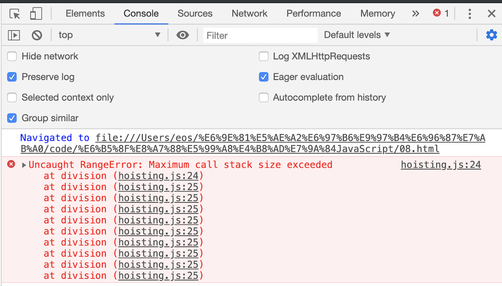
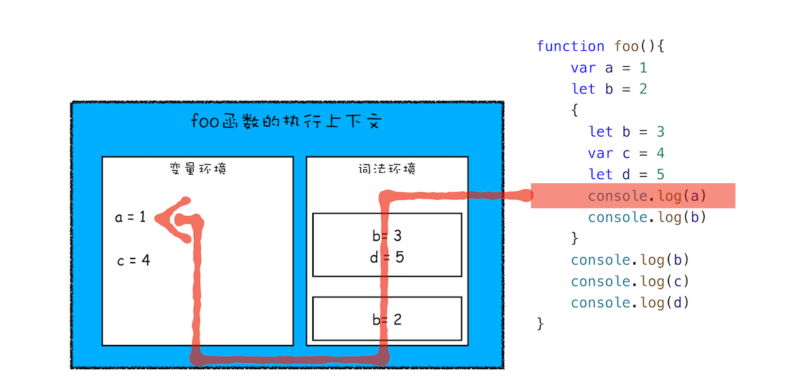
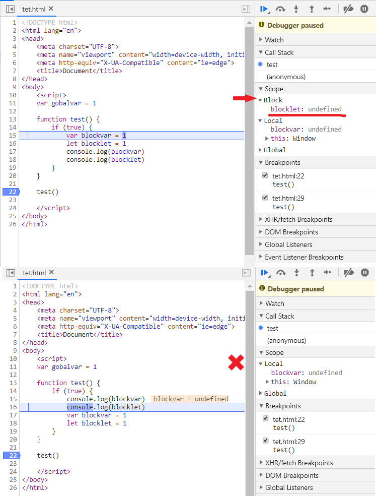
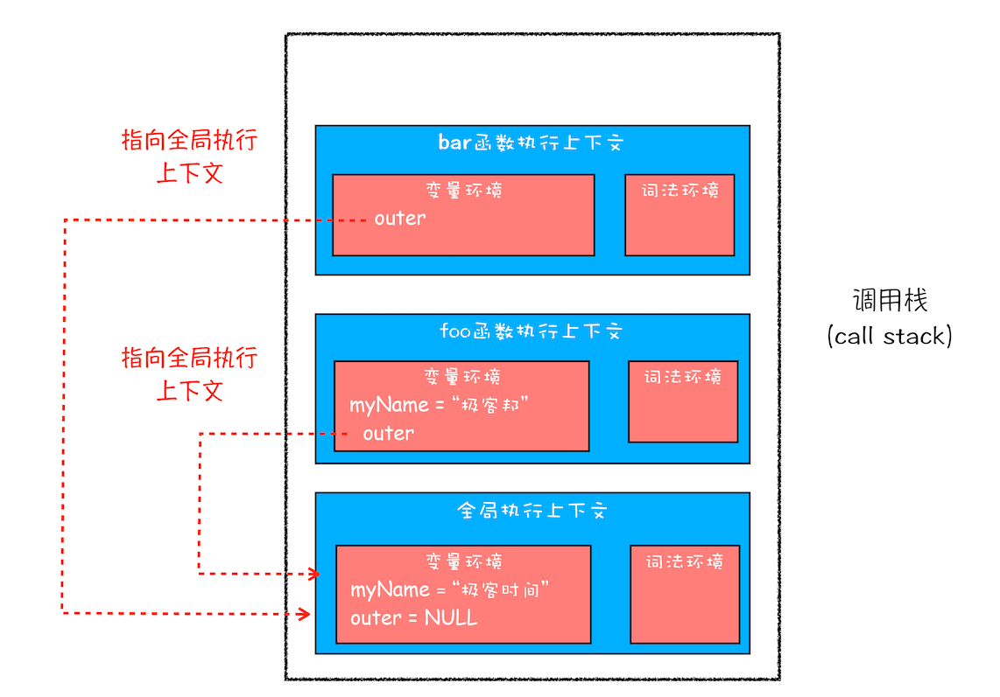
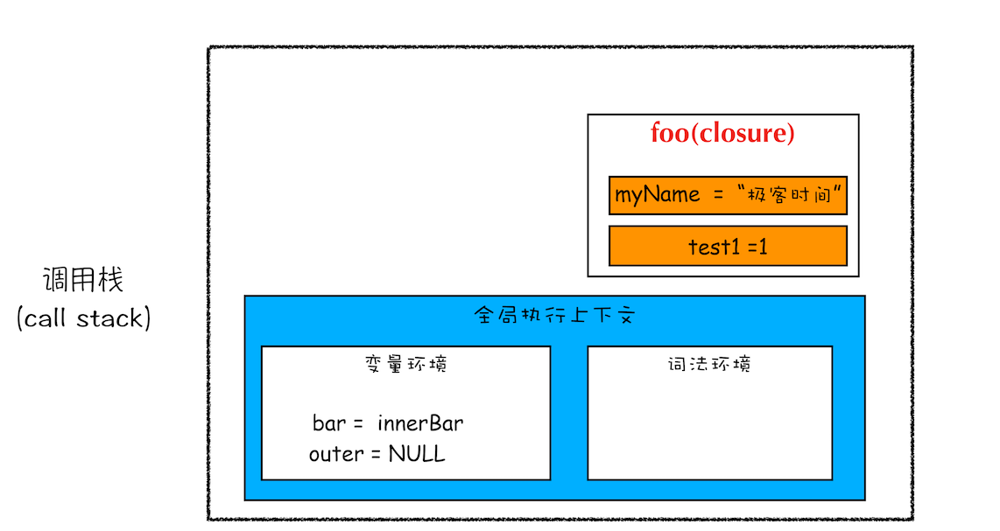

# JS 运行机制

- JS 运行机制：如何运行一段代码
    - “一段代码”的界定
    - 执行上下文 和 执行代码
        - 调用栈（执行上下文栈）: 调用栈查看、调用栈溢出
        - 变量环境（variable environment）：var、function、变量提升
        - 词法环境（Lexical environment）：let、const、暂时性死区
        - 外部环境（outer）：词法作用域、作用链
        - this对象：类似动态作用域
        - 闭包

这是上一篇V8 引擎翻译JS代码的流程图。这一节主要专注在执行上下文这块内容，这是JS代码运行的机制。


## “一段代码”的界定

上一节V8引擎工作过程讲解的最后，提到过，不管V8引擎翻译还是JS运行都是以一段代码为单位进行的。

编译一段代码，执行一段代码，当执行过程中遇到函数包裹的一段代码，或者其它以`{ }`包裹的一段代码，就又拿这段代码出来编译再执行。

其时函数体这段代码也是以`{ }`包裹的，所以可以简单理解为“一段代码”的界定就是以大括号`{ }`包裹的代码为段。包括以下形式：

```js
//函数块
function foo(){} 

//if块
if(condition){}

//while块
while(1){}

//for循环块
for(let i = 0; i<100; i++){}

//单独一个块
{ }
```

为什么是把的“段”的概念放在开头，因为我觉得理解这个点很重要，这也从另一个方面可以作为JS是解释型语言的一个理解。

- JS是解释型语言是因为使用解释器Interpreter将源代码转为字节码ByteCode后，字节码是逐行执行的，针对每一行字节码先转为机器码，再执行。
- 这个“段”或者叫“块”的概念，我自己延伸理解，V8或说JS是逐段编译执行的。遇到一段代码先拿出这段代码编译再执行。这个概念的理解是跟后面讲到的执行上下文调用栈关联起来。执行上下文是代码执行时遇到函数调用才开始创建的，而执行上下文的创建是在代码编译时产生的，所以推断JS代码是按段为单位先编译，再执行的。

> 在这里暂时不理解没关系，待讲完后面执行上下文及调用栈，再回头理解，现在只需要有这个印象：JS代码是按段为单位先编译，再执行的。

## 执行上下文 Execution context

从上图可以看出，一段 JavaScript 代码在执行之前需要被 JavaScript 引擎先编译，编译完成之后，才会进入执行阶段。

在编译阶段，JS引擎会申请三块内存空间，分别为代码空间、堆空间、栈空间。将可执行代码放入代码空间，将堆空间和栈空间给创建的执行上下文使用。
- 可执行代码会继续会被解析成AST，再到ByteCode，等待执行。
- 创建的执行上下文中会包括变量环境对象、词法环境对象、外部环境对象outer和this对象，每种对象空间中，依据JS关键字解析出变量值类型，将基本对象存放栈空间，将引用对象存入堆空间，并在栈空间中保持引用对象在堆空间存入的内存地址。

可以理解，执行上下文是 JavaScript 执行一段代码时的运行环境，但我理解成数据仓库，仓库中存储着代码执行时需要引用的各种变量数据。然后按这些变量数据按功能将仓库划分四个区分别存放对应的变量数据。

- 变量环境：使用var function关键字声明的变量存到执行上下文的变量环境中
- 词法环境：使用let const关键字声明的存到执行上下文的词法环境中
- 外部环境Outer：根据词法作用域（作用域的一种，也称为静态作用域，在编译时确定）规则，保持函数变量声明的位置嵌套关系
- this：类似动态作用域，是在代码执行时确定当前this对象的指代关系，this对象的引用值可以通过代码显性改变，如call/apply/bind。

前面讲“一段代码”的界定时，段或者叫块有三种，全局块、函数块、语句块（if for while 单独{}）。但这些块能产生执行上下文的只有全局块和函数块，其它块按声明位置归属全局块还是函数块中。

- 当 JavaScript 执行全局代码的时候，会编译全局代码并创建全局执行上下文，而且在整个页面的生存周期内，全局执行上下文只有一份。全局上下文编译时遇到函数，会将整个函数体作为值存储，不会进入函数体内编译代码。函数体内的代码编译只在调用该函数时才进行编译。
- 当调用一个函数的时候，之前存储的函数体内的代码会被读出来编译，并创建函数执行上下文，一般情况下，函数执行结束之后，创建的函数执行上下文会被销毁。


### 调用栈 call stack

一般程序中代码执行会有很多函数，函数间还有嵌套关系，每个函数调用都会创建执行上下文，那在整个程序运行周期内，由函数调用产生的这么多执行上下文怎么进行管理呢？

答案是通过一种叫栈的数据结构来管理的。那什么是栈呢？它又是如何管理这些执行上下文呢？

栈结构就好车厢装货，只有一个车门，货物进出需要遵循后进先出的顺序。

JavaScript 引擎正是利用栈的这种结构来管理执行上下文的。在执行上下文创建好后，JavaScript 引擎会将执行上下文压入栈中，通常把这种用来管理执行上下文的栈称为执行上下文栈，又称调用栈。函数执行完成后又会将该函数上下文弹出栈。

```js
function foo () { 
    function bar () {        
      return 'I am bar';
    }
    return bar();
}
foo();
```
上述代码的执行时，函数执行上下文的入栈、出栈示意图如下：


#### 利用浏览器查看调用栈的信息

Chrome浏览器打开“开发者工具”（按F12或ctrl+thift+i)，点击“Source”标签，选择 JavaScript 代码的页面，然后在第 3 行加上断点，并刷新页面。你可以看到执行到 add 函数时，执行流程就暂停了，这时可以通过右边“call stack”来查看当前的调用栈的情况，如下图：


从图中可以看出，右边的“call stack”下面显示出来了函数的调用关系：栈的最底部是 anonymous，也就是全局的函数入口；中间是 addAll 函数；顶部是 add 函数。这就清晰地反映了函数的调用关系，所以在分析复杂结构代码，或者检查 Bug 时，调用栈都是非常有用的。

#### console.trace() 打印调用栈信息

另外，还可以使用 console.trace() 来输出当前的函数调用关系，比如在示例代码中的 add 函数里面加上了 console.trace()，你就可以看到控制台输出的结果，如下图：


#### 调用栈溢出

执行上下文可以存在多个，因为代码中函数调用的数量是不固定的，虽然没有明确的数量限制，但如果超出栈分配的空间，会造成堆栈溢出。常见于递归调用，没有终止条件造成死循环的场景。
```js
function division(a,b){ 
    return division(a,b)
}
console.log(division(1,2))
```



### 变量环境 variable environment

在JS中，变量的使用是像下面语句这样写的：
```js
var myname = '极客时间'
```
这句代码实际可以看成两行代码的组成的：
```js
var myname 
myname = '极客时间'
```
其中第一句`var myname`是变量声明语句，第二名`myname = '极客时间'`是变量赋值语句


再来看看函数的声明和赋值，结合下面这段代码：
```js
function foo(){ 
    console.log('foo')
}

var bar = function(){ 
    console.log('bar')
}
```
第一个函数 foo 是一个完整的函数声明，也就是说没有涉及到赋值操作，但这个是具名函数，函数名foo，也是变量名foo，值是函数体；

第二个函数是先声明变量 bar，再把`function(){console.log('bar')}`赋值给 bar。这是函数表达式声明，将bar作为匿名函数的函数名。


所以从上面代码看，不管是普通变量名，还是函数名，都需要经过声明和赋值两个步骤。但实际在JS编译时，这个过程是分三步的：
- 变量创建
- 变量声明
- 变量赋值

在JS编译时，创建了执行了上下文后，会在执行上下文中生成一个变量环境的对象，这个对象是用来干什么的呢？上面讲执行上下文已经讲过了，这块区域是用存放var function关键字声明的变量的。

所以在编译阶段，JS引擎会扫描当前作用域中的代码，对使用var function关键字声明的变量，在变量环境对象中创建，并初始化值为undefined，待到代码执行到该变量的赋值语句时，会将变量环境中该对象的值改为代码中赋值语句的值。然后在其它使用该变量的语句中，从变量环境中查找该变量的值，用来代码执行。

用实际代码说明下过程：
```js
showName()
console.log(myname)
var myname = '极客时间'
function showName() { 
    console.log('函数showName被执行');
}
```
这段代码就故意将变量调用提前在变量声明前。因为JS代码在执行前会存在编译阶段，而编译阶段就会将代码执行需要的变量在变量环境对象中创建并初始化好了，所以这段代码执行不会报错。这也就是JS中变量声明提升的本质。

##### 编译阶段

- 第 1 行和第 2 行，由于这两行代码不是声明操作，所以 JavaScript 引擎不会做任何处理；
- 第 3 行，由于这行是经过 var 声明的，因此 JavaScript 引擎将在环境对象中创建一个名为 myname 的属性，并使用 undefined 对其初始化；
- 第 4 行，JavaScript 引擎发现了一个通过 function 定义的函数，所以它将函数定义（即函数体代码）存储到堆 (HEAP）空间中，并在环境对象中创建一个 showName 的属性，然后将该属性值指向堆空间中函数的引用位置（不了解堆也没关系，JavaScript 的执行堆和执行栈会在后续文章中介绍）。

这样就生成了变量环境对象。接下来 JavaScript 引擎会把声明以外的代码作为实际执行代码，编译为字节码，至于字节码的细节，已经在上一节V8引擎分析中讲过了。

现在有了执行上下文和可执行代码了，那么接下来就到了执行阶段了。

##### 执行阶段

- 当执行到 showName 函数时，JavaScript 引擎便开始在变量环境对象中查找该函数，由于变量环境对象中存在该函数的引用，所以 JavaScript 引擎便开始执行该函数，并输出“函数 showName 被执行”结果。
- 接下来打印“myname”信息，JavaScript 引擎继续在变量环境对象中查找该对象，由于变量环境存在 myname 变量，并且其值为 undefined，所以这时候就输出 undefined。
- 接下来执行第 3 行，把“极客时间”赋给 myname 变量，赋值后变量环境中的 myname 属性值改变为“极客时间”。

以上就是一段代码的编译和执行流程。实际上，编译阶段和执行阶段都是非常复杂的，包括了词法分析、语法解析、代码优化、代码生成等，具体看上一节V8引擎总结。这里阐述主要是为了说明执行上下文中变量环境的作用。

> 一段代码如果定义了两个相同名字的函数，或者声明的变量名和声明的函数名相同，最终生效的是最后一个声明，因为编译阶段代码的扫描也是从上到下的，重名变被覆盖。

总结：

- 执行上下文中的变量环境是用来存储var function声明的变量。
- 在编译阶段，变量和函数会被存放到变量环境中，变量的默认值会被设置为 undefined；在代码执行阶段，JavaScript 引擎会从变量环境中去查找自定义的变量和函数。
- 如果在编译阶段，存在两个同名的声明变量，不管是变量名还是函数名，最终存放在变量环境中的是最后定义的那个，这是因为后定义的会覆盖掉之前定义的。

### 词法环境 Lexical environment

上一节讲到执行上下文中的变量环境是用来存储JS代码中var function声明变量的。但是从ES6开始，JS变量的声明就不止这两种了，增加了let const，并带来了块级作用域和暂时性死区的概念。所以这节弄懂下面几点内容：

- 为什么要增加这两种声明方式呢？
- 块级作用域
- let/const声明的变量是存储在哪里的
- 暂时性死区

JS这门语言是一个早产儿，是当时网景员工Brendan Eich据说只花了十几天就开发出来，所以很多地方都只是按照最简单的方式来设计，并且为此还带来很多坑点，让后续学习有很多有违常规理解的概念，特别是跟Java、C/C++这类语言表现出不同的地方。

不像其它语言，没有块级作用域的概念，把作用域内部的变量统一提升无疑是最快速、最简单的设计，不过这也直接导致了函数中的变量无论是在哪里声明的，在编译阶段都会被提取到执行上下文的变量环境中，所以这些变量在整个函数体内部的任何地方都是能被访问的，这也就是 JavaScript 中的变量提升。

变量提升会带来几个问题：

```js
function foo(){ 
    for (var i = 0; i < 7; i++) {

    } 
    console.log(i); 
}

foo() // 输出结果：7
```

```js
var myname = "极客时间"
function showName(){ 
    console.log(myname); 
    if(0){ 
        var myname = "极客邦" 
    } 
    console.log(myname);
}

showName() // 输出结果：undefined
```
上面两段代码，JS的学习都会回答正确，但在Java、C/C++这类语言中运行类似逻辑的代码，输出结果是不一致的，比如C语言，第一段代码的逻辑i变量因为没定义是会报错的，第二段会查找到全局变量myname输出。

这就是JS隐含的变量提升带来的问题：
- for语句块中声明的本应销毁的变量没有被销毁，如第一段代码
- 变量容易在不被察觉的情况下被覆盖掉，如第二段代码

这和其他支持块级作用域的语言表现是不一致的，容易会给一些人造成误解，因为现今JS语言发展已经不是当初设计时的目的，为了更大范围的使用，和主流语言观念保持一致是非常有必要。所以为了解决var function声明的变量会造成变量提升带来的问题，新增了变量声明的方式：let const。

针对上面两段代码，使用let代替var声明变量，然后执行结果和Java、C/C++这类语言中运行结果预期一样。
```js
function foo(){ 
    for (let i = 0; i < 7; i++) {

    } 
    console.log(i); 
}

foo() // 输出结果：报错，i is not defined
```
```js
var myname = "极客时间"
function showName(){ 
    console.log(myname); 
    if(0){ 
        let myname = "极客邦" 
    } 
    console.log(myname);
}

showName() // 输出结果：极客时间

```

那这是怎么实现的呢？

##### 块级作用域

首先新增了块作用域的定义，除function关键字声明函数作用域外，其它声明语句带大括号`{ }`包裹的区域即块作用域，作用域块内使用let const声明的变量不影响块外面的变量。

##### let const 声明的变量存储在词法环境中

var function声明的变量存储在变量环境中，并且由于调用栈的后进先出的规则，使得var function声明的变量有了函数作用域的概念。当函数执行完要执行出栈操作，自然在函数体内var function声明的变量也就没有了，表现出来就是var function声明的变量作用范围在函数作用域下。

所以let const 声明的变量被存储在词法环境中，并且在词法环境内部，维护了一个小型栈结构，栈底是函数最外层的使用let或const声明的变量，进入一个块作用域后，就会把该作用域块内部的变量压到栈顶；当作用域执行完成之后，该作用域的信息就会从栈顶弹出，这就是词法环境的结构。

此时执行上下文中维护了两个存放变量的区域，那代码执行时，变量调用怎么查找呢？

具体查找方式是：
1. 沿着词法环境的栈顶向下查询，如果在词法环境中的某个块中查找到了，就直接返回给 JavaScript 引擎，如果没有查找到，那么继续在变量环境中查找。
1. 在变量环境中如果还没找到，就需要沿作用域链进入下一层执行上下文中沿上一步路径查找。（作用域链下一节讲）。

看个具体例子分析：
```js
function foo(){
    var a = 1
    let b = 2
    {
      let b = 3
      var c = 4
      let d = 5
      console.log(a)
      console.log(b)
    }
    console.log(b) 
    console.log(c)
    console.log(d)
}   
foo()
```
- 第一步：编译并创建执行上下文


上图结果是：
    - 函数内部通过 var 声明的变量，在编译阶段全都被存放到变量环境里面了。
    - 通过 let 声明的变量，在编译阶段会被存放到词法环境（Lexical Environment）中。
    - 在函数的作用域内部，通过 let 声明的变量并没有被存放到词法环境中。（因为JS编译和执行按“块”为单位的，只有执行到这块时，才把当前块代码编译->执行，但var function变量不限块作用域影响，只限函数作用域块编译）。

- 第二步：继续执行代码，进入块作用域


- 当执行到代码块里面时，变量环境中 a 的值已经被设置成了 1，词法环境中 b 的值已经被设置成了 2。因为经过赋值语句。
- 当进入函数的作用域块时，JS编译器会还是像函数调用时一样，会编译这块区域代码，将通过 let 声明的变量会被存储在词法环境中新增的一个单独的区域中，并将该存储区域压入词法环境栈顶。这样就实现了词法环境中不同块区域变量的隔离，它们都是独立的存在。

- 第三步：查找引用

再接下来，当执行到作用域块中的console.log(a)这行代码时，就需要在词法环境和变量环境中查找变量 a 的值了。


- 第四步：块作用域出栈

当作用域块执行结束之后，其内部定义的变量就会从词法环境的栈顶弹出


##### 暂时性死区

var function声明的变量可以在声明前使用，因为存在变量声明提升。那在let const声明的变量如果在声明前就使用会怎么样呢？

```js
// 正常使用
var gobalvar = 1
function test() {
    if (true) {
        var blockvar = 1
        let blocklet = 1
        console.log(blockvar)
        console.log(blocklet)
    }
}

test()
```
```js
// 声明前使用
var gobalvar = 1
function test() {
    if (true) {
        console.log(blockvar)
        console.log(blocklet) // Uncaught ReferenceError: Cannot access 'blocklet' before initialization
        var blockvar = 1
        let blocklet = 1
    }
}

test()
```


let const 声明的变量不能在声明前就使用，即块作用域开始，到该变量使用let声明开始的这段区域为死区，不能使用该变量。

并且看图示，此时连块作用域都不会创建，等于说这个说法错误在编译阶段就发现了。

##### 总结：

为了让JS实现符合主流语言块作用域的逻辑，使用词法环境来实现了一个执行上下文调用栈的逻辑。将var function的声明变量的逻辑浓缩在了词法环境中，但不同的是，对变量提升，实现了一种相反的逻辑，即暂时性死区。

仔细想想对比一下：
- 函数作用域使用执行上下文调用栈里的变量环境来管理var function  ---- 块作用域在词法环境中也使用栈结构来管理let const声明的变量
- var function 声明变量有变量提升，可以先使用后声明  -------------- let const 声明的变量有暂时性死区，限制先使用后声明
- var function 在各个调用栈中变量环境实现作用域链查找 ------------- let const 声明的变量也可以在词法环境的栈结构中跨块作用域查找
- 函数执行完毕，当前调用栈有出栈操作 ------------------------------ 当前块作用域执行完成，也会在词法环境栈中执行出栈操作

### 外部环境对象 Outer

上面变量环境和词法环境的讲解，我们知识了代码执行时如何在当前调用栈中查找变量。但当出现跨调用栈使用变量时，如何查找呢？

比如下面的代码例子：
```js
function bar() {
    console.log(myName)
}
function foo() {
    var myName = "极客邦"
    bar()
}
var myName = "极客时间"
foo()
```


函数bar执行时会创建一个执行上下文，但执行代码引用了外部调用栈中的变量。那到底是引用全局上下文的myname变量还是foo函数执行上下文中的myname变量呢？

其实在每个执行上下文的变量环境中，都包含了一个外部环境对象，用来指向外部的执行上下文，我们把这个外部环境对象称为 outer。

当一段代码使用了一个变量时，JavaScript 引擎首先会在“当前的执行上下文”中查找该变量，如果在当前的变量环境中没有查找到，那么 JavaScript 引擎会继续在 outer 所指向的执行上下文中查找。



bar 函数和 foo 函数的 outer 都是指向全局上下文的，这也就意味着如果在 bar 函数或者 foo 函数中使用了外部变量，那么 JavaScript 引擎会去全局执行上下文中查找。所以上述例子bar函数执行的输出结果是全局上下文变量myname的值“极客时间”。我们把这个查找的链条就称为作用域链。

现在知道变量是通过作用域链来查找的了，不过还有一个疑问没有解开，foo 函数调用的 bar 函数，那为什么 bar 函数的外部环境是全局执行上下文，而不是 foo 函数的执行上下文？

这是因为在 JavaScript 执行过程中，其作用域链是由词法作用域决定的。那什么是词法作用域呢？这要从作用域开始说起。

#### 作用域 全局作用域、函数作用域、块级作用域、静态作用域（词法作用域）、动态作用域

**作用域**就是变量和函数的可访问范围，控制着变量和函数的可见性与生命周期，换句话说，作用域决定了代码区块中变量和其他资源的可见性。作用域为您的代码提供了一定程度的安全性。因为计算机安全的一个常见原则是用户应该一次只能访问他们需要的东西，而作用域是最小访问原则。

按作用域范围划分：在JavaScript中变量的作用域有全局作用域、函数作用域、块作用域。
按作用域时期划分：静态作用域与动态作用域，JavaScript采用词法作用域(lexical scoping)，就是静态作用域。

**全局作用域**：在代码中任何地方都能访问到的对象拥有全局作用域。全局作用域的变量是全局对象的属性
> 1、没有用var声明的变量（除去函数的参数）都具有全局作用域，成为全局变量，所以声明局部变量必须要用var。<br>
2、window的所有属性都具有全局作用域<br>
3、最外层函数体外声明的变量也具有全局作用域

**函数作用域**，也称局部作用域
> 1、函数体内用var声明的变量具有局部作用域，成为局部变量<br>
2、函数的参数也具有局部作用域

**块级作用域**（ES6新增）：使用let和const关键字声明的变量，会在形成块级作用域。

全局作用域、函数作用域对应着全局执行上下文和函数执行上下文，维持在调用栈中，块作用域对应着词法环境中的调用栈。

这里重点说下静态作用域，即词法作用域。

**静态作用域**：指在词法分析阶段（V8引擎执行的第一个阶段）就确定了，不会改变，所以也叫词法作用域。变量的作用域是在定义时决定而不是执行时决定，也就是说词法作用域取决于源码，通过静态分析就能确定。所以通过它就能够提前确定outer变量的值，在执行过程中也就确定了如何查找变量。

**动态作用域**：是在运行时根据程序的流程信息来动态确定的，而不是在写代码时进行静态确定的。 动态作用域并不关心函数和作用域是如何声明以及在何处声明的，只关心它们在何处调用。JS中没有动态作用域，但this对象的实现类似动态作用域。

所以上面的答案根据词法作用域，foo 和 bar 的上级作用域都是全局作用域，所以如果 foo 或者 bar 函数使用了一个它们没有定义的变量，那么它们会到全局作用域去查找。也就是说，词法作用域是函数在哪声明就决定了，和函数是在哪调用没有关系。也就是说作用域链在JS词法分析时就确定了，跟代码执行没关系。

#### 块级作用域中的变量查找

上面的例了是跨函数作用域，即跨函数执行上下文查找变量。那在块级作用域中如何查找let const 声明的变量呢？

```js

function bar() {
    var myName = "极客世界"
    let test1 = 100
    if (1) {
        let myName = "Chrome浏览器"
        console.log(test)
    }
}
function foo() {
    var myName = "极客邦"
    let test = 2
    {
        let test = 3
        bar()
    }
}
var myName = "极客时间"
let myAge = 10
let test = 1
foo()
```
bra 函数引用了全局作用域中的变量test，输出结果是1，但这个查找过程，以及每个let变量在词法环境的存储位置是怎么的，顺便在作个回顾


现在是执行到 bar 函数的 if 语块之内，需要打印出来变量 test，那么就需要查找到 test 变量的值，其查找过程我已经在上图中使用序号 1、2、3、4、5 标记出来了。

- 首先在当前bar函数的执行上下文中的词法环境，此词法环境栈结构有两层，对应当前bar函数作用域和if块级作用域，按从上到下的块作用域查找，再到变量环境中查的。
- 在 bar 函数的执行上下文中的词法环境和变量环境都没有找到，所以根据词法作用域的规则，outer变量对应着全局作用域，下一步就在 bar 函数的外部作用域中查找，也就是全局作用域。

如果把bar函数的声明话在foo函数体内，刚作用域链的查找就是调用栈的从上到下的顺序啦。

### 闭包

闭包是跟作用域链紧密相关的。看下这段代码：

```js
function foo() {
    var myName = "极客时间"
    let test1 = 1
    const test2 = 2
    var innerBar = {
        getName:function(){
            console.log(test1)
            return myName
        },
        setName:function(newName){
            myName = newName
        }
    }
    return innerBar
}
var bar = foo()
bar.setName("极客邦")
bar.getName()
console.log(bar.getName())
```
首先看看当执行到 foo 函数内部的return innerBar这行代码时调用栈的情况，你可以参考下图：


innerBar 是一个对象，包含了 getName 和 setName 的两个方法（通常我们把对象内部的函数称为方法）。这两个方法都是在 foo 函数内部定义的，所以根据词法作用域，这两个方法的外部环境对象outer都指向foo函数。所以这两个方法内部都使用了 myName 和 test1 两个变量。

当 innerBar 对象返回给全局变量 bar 时，虽然 foo 函数已经执行结束，但是 getName 和 setName 函数依然可以使用 foo 函数中的变量 myName 和 test1。所以当 foo 函数执行完成之后，其整个调用栈的状态如下图所示：



从上图可以看出，foo 函数执行完成之后，其执行上下文从栈顶弹出了，但是由于返回的 setName 和 getName 方法中使用了 foo 函数内部的变量 myName 和 test1，所以这两个变量依然保存在内存中。这像极了 setName 和 getName 方法背的一个专属背包，无论在哪里调用了 setName 和 getName 方法，它们都会背着这个 foo 函数的专属背包。

之所以是专属背包，是因为除了 setName 和 getName 函数之外，其他任何地方都是无法访问该背包的，我们就可以把这个背包称为 foo 函数的闭包。

现在我们终于可以给闭包一个正式的定义了。

在 JavaScript 中，根据词法作用域的规则，内部函数总是可以访问其外部函数中声明的变量，当通过调用一个外部函数返回一个内部函数后，即使该外部函数已经执行结束了，但是内部函数引用外部函数的变量依然保存在内存中，我们就把这些**引用变量的集合称为闭包**。比如外部函数是 foo，那么这些变量的集合就称为 foo 函数的闭包。

那这些闭包是如何使用的呢？当执行到 bar.setName 方法中的myName = "极客邦"这句代码时，JavaScript 引擎会沿着“当前执行上下文–>foo 函数闭包–> 全局执行上下文”的顺序来查找 myName 变量，你可以参考下面的调用栈状态图：


从图中可以看出，setName 的执行上下文中没有 myName 变量，foo 函数的闭包中包含了变量 myName，所以调用 setName 时，会修改 foo 闭包中的 myName 变量的值。

同样的流程，当调用 bar.getName 的时候，所访问的变量 myName 也是位于 foo 函数闭包中的。

你也可以通过“开发者工具”来看看闭包的情况，打开 Chrome 的“开发者工具”，在 bar 函数任意地方打上断点，然后刷新页面，可以看到如下内容：


从图中可以看出来，当调用 bar.getName 的时候，右边 Scope 项就体现出了作用域链的情况：从“Local–>Closure(foo)–>Global”就是一个完整的作用域链。

- Local 就是当前的 getName 函数的作用域
- Closure(foo) 是指 foo 函数的闭包
- 最下面的 Global 就是指全局作用域

#### 闭包是怎么回收的

闭包是函数调用栈出栈后还遗留在内存的变量。如果闭包使用不正确，会很容易造成内存泄漏的，关注闭包是如何回收的能让你正确地使用闭包。

通常，如果引用闭包的函数是一个全局变量，那么闭包会一直存在直到页面关闭；但如果这个闭包以后不再使用的话，就会造成内存泄漏。

如果引用闭包的函数是个局部变量，等函数销毁后，在下次 JavaScript 引擎执行垃圾回收时，判断闭包这块内容如果已经不再被使用了，那么 JavaScript 引擎的垃圾回收器就会回收这块内存。

所以在使用闭包的时候，你要尽量注意一个原则：尽量让局部变量来引用闭包。如果该闭包会一直使用，那么它可以作为全局变量而存在；但如果使用频率不高，而且占用内存又比较大的话，那就尽量让它成为一个局部变量。

其实闭包是如何回收的还牵涉到了V8引擎的垃圾回收机制，而关于垃圾回收，会在后一节v8引擎的垃圾回收机制总结中讲解。


### this对象

#### this对象的引入是为了解决什么问题？

```js
var bar = {
    myName:"time.geekbang.com",
    printName: function () {
        console.log(myName)
    }    
}
function foo() {
    let myName = "极客时间"
    return bar.printName
}
let myName = "极客邦"
let _printName = foo()
_printName()
bar.printName()
```

根据前面讲的，由词法作用域决定的printName函数的作用域链，即外部环境对象outer指向的是全局作用域。所以结果输出的是“极客邦”。

但JS的这种代码执行逻辑与主流C/C++等语言直观逻辑又是不想符合的。

```c
#include <iostream>
using namespace std;
class Bar{
    public:
    char* myName;
    Bar(){
      myName = "time.geekbang.com";
    }
    void printName(){
       cout<< myName <<endl;
    }  
} bar;

char* myName = "极客邦";
int main() {
  bar.printName();
  return 0;
}
```
在这段 C++ 代码中，我同样调用了 bar 对象中的 printName 方法，最后打印出来的值就是 bar 对象的内部变量 myName 值——“time.geekbang.com”，而并不是最外面定义变量 myName 的值——“极客邦”。

所以在对象内部的方法中使用对象内部的属性是一个非常普遍的需求。

但是 JavaScript 的作用域机制并不支持这一点，但如果采用下面这种写法，对象内部再调用对象属性，实现并不优雅。
```js
var bar = {
    myName:"time.geekbang.com",
    printName: function () {
        console.log(bar.myName)
    }    
}
```
基于这个需求，JavaScript 又搞出来另外一套 this 机制。（说起来，还是因为JS的早产性，很多功能一出生时并不完善，所以也是在后续向主流编程言习惯改进时增加补丁的做法。只是增加了后人学习和理解的成本。）

所以上面代码段可以改成这样：
```js
var bar = {
    myName:"time.geekbang.com",
    printName: function () {
        console.log(this.myName)
    }    
}
```

所以说起来this的出现也是为了解决变量引用的问题，但是和作用域链引用变量是两种不同的机制。明确这点，可以避免你在学习 this 的过程中，和作用域产生一些不必要的关联。


#### JS中的this对象指向谁

通过前面执行上下文的图示，也知识，在创建执行上下文的时候，包含了变量环境、词法环境、外部环境对象outer，还有一个 this对象。

this 是和执行上下文绑定的，也就是说每个执行上下文中都有一个 this。

执行上下文主要分为三种——全局执行上下文、函数执行上下文和 eval 执行上下文，所以对应的 this 也只有这三种——全局执行上下文中的 this、函数中的 this 和 eval 中的 this。

> eval在语法上已经废弃，所以不用关注。

- 全局执行上下文中的 this：在JS严格模式下`use stirct`，全局this是undefined。在非严格模式下，全局this指向windows对象。
- 函数执行上下文中的 this：需要通过代码执行过程中，函数的调用情况来决定。即有点类似动态作用域的性质。基本也就三种情况：
    - 直接使用函数名执行函数，则函数体内的this指向全局windows对象。
    - 使用对象来调用其内部的一个方法（函数）时，该方法中的 this 是指向对象本身的。
    - 通过构造函数中调用的this是指向构造函数new出来的实例对象。

代码示例：
```js
// 函数名直接调用
function foo(){ 
    console.log(this)
}
foo() // 全局windows对象

// 对象方法调用
var myObj = { 
    name : "极客时间", 
    showThis: function(){ 
        console.log(this) 
    }
}
myObj.showThis() // myObj

// 构造函数内部调用
function CreateObj(){ 
    console.log(this)
    this.name = "极客时间"
}
var myObj = new CreateObj() // myObj
```

但是，有一个特殊的是，this对象的指向可以通过函数本身的方法`call/apply/bind`来改变指向，指向传入的参数对象。

```js
// call() 方法使用一个指定的 this 值和单独给出的一个或多个参数来调用一个函数。
// if(thisArg == undefined|null) this = window 如果第一参数是null或undefined，则thisArg指向windows
// if(thisArg == number|boolean|string) this == new Number()|new Boolean()| new String(),
// 返回值是thisArg使用传入参数进行函数调用返回的结果
fun.call(thisArg, arg1, arg2, ...)

// apply() 基本与call相同，只是第二个参数是作为一个数组（或类似数组对象）提供
func.apply(thisArg, [argsArray])

// bind()方法返回一个新的函数
// 在bind()被调用时，这个新函数的this被bind的第一个参数指定，其余的参数将作为新函数的参数供调用时使用。
function.bind(thisArg[,arg1[,arg2[, ...]]])
```

```js
myname = undefined
let bar = { 
    myName : "极客邦",
    test1 : 1
}

function foo(){ 
    this.myName = "极客时间"
}
foo()
console.log(myName) // 极客时间

console.log(bar.myName) // 极客邦
foo.call(bar)
console.log(bar.myName) // 极客时间
```

三者区别：apply, call是改变this指向后立即调用，bind绑定this指向后返回对应函数, 便于稍后调用。

[MDN: Function.prototype.call/apply/bind](https://developer.mozilla.org/zh-CN/docs/Web/JavaScript/Reference/Global_Objects/Function)


#### this 的设计缺陷以及应对方案

在[浏览器工作原理与实践](https://time.geekbang.org/column/article/128427)作者李兵看来，this 并不是一个很好的设计，因为它解决了一个问题，却带来更多的问题。它的使用方法都冲击人的直觉，在使用过程中存在着非常多的坑。

- 嵌套函数中的 this 不会从外层函数中继承

这是一个严重的设计错误，并影响了后来的很多开发者，让他们“前赴后继”迷失在该错误中。结合下面这样一段代码来分析下：

```js
var myObj = {
  name : "极客时间", 
  showThis: function(){
    console.log(this)
    function bar(){
        this.name = "极客邦"
        console.log(this)
    }
    bar()
  }
}
myObj.showThis()
```
现在的问题是：bar 函数中的 this 是什么？

如果你是刚接触 JavaScript，那么你可能会很自然地觉得，bar 中的 this 应该和其外层 showThis 函数中的 this 是一致的，都是指向 myObj 对象的，这很符合人的直觉。但实际情况却并非如此，执行这段代码后，你会发现函数 bar 中的 this 指向的是全局 window 对象，而函数 showThis 中的 this 指向的是 myObj 对象。这就是 JavaScript 中非常容易让人迷惑的地方之一，也是很多问题的源头。

针对上面的问题，在最新的ES6中，可以使用箭头函数来解决：
```js

var myObj = {
  name : "极客时间", 
  showThis: function(){
    console.log(this)
    var bar = ()=>{
      this.name = "极客邦"
      console.log(this)
    }
    bar()
  }
}
myObj.showThis()
console.log(myObj.name)
console.log(window.name)
```

因为 ES6 中的箭头函数并不会创建其自身的执行上下文，所以箭头函数中的 this 取决于它的外部函数。
> 正常函数执行会创建自身函数执行上下文，并且上下文中包括变量环境、词法环境、外部环境、this对象。而箭头函数可以看做是阉割版的函数，没有外部环境引用、没有this对象，但保有变量环境和词法环境。

- 普通函数中的 this 默认指向全局对象 window

这个设计也是一种缺陷，因为在实际工作中，我们并不希望函数执行上下文中的 this 默认指向全局对象，因为这样会打破数据的边界，造成一些误操作。如果要让函数执行上下文中的 this 指向某个对象，最好的方式是通过 call 方法来显示调用。

JavaScript 在严格模式`use strict`下，默认执行一个函数，其函数的执行上下文中的 this 值是 undefined，这就解决上面的问题了。


