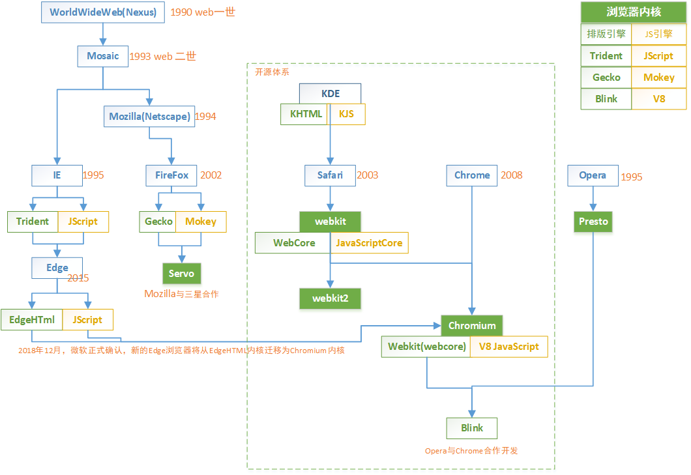

# 浏览器发展历史

[[toc]]

>“在Web的第一世代，蒂姆·伯纳斯-李创建了统一资源定位符（URL），超文本传输协议（HTTP）和HTML标准以及Unix为基础的服务器和浏览器原型WorldWideWeb（后更名为Nexus），一些人意识到Web可能比[Gopher](https://baike.baidu.com/item/gopher/611108)更好。。 在第二世代，马克·安德森和埃里克·比纳在伊利诺伊大学开发了NCSA Mosaic浏览器。几百万人突然发现Web可能比性爱还要棒。 在第三世代，安德森和比纳离开NCSA，成立了网景通信公司，开始了现代意义上的浏览器Netscape Navigator” 
— 鲍勃·梅特卡夫（Bob Metcalfe），《InfoWorld》，1995年8月21日，17卷，34期。

## 浏览器结构

浏览器一般由以下组件构成 ：

- 用户界面。包括地址栏、前进/后退按钮、书签菜单等。除了浏览器主窗口显示的您请求的页面外，其他显示的各个部分都属于用户界面。
- 浏览器引擎。在用户界面和呈现引擎之间传送指令。
- 呈现引擎。负责显示请求的内容。如果请求的内容是 HTML，它就负责解析 HTML 和 CSS 内容，并将解析后的内容显示在屏幕上。
- 网络。用于网络调用，比如 HTTP 请求。其接口与平台无关，并为所有平台提供底层实现。
- 用户界面后端。用于绘制基本的窗口小部件，比如组合框和窗口。其公开了与平台无关的通用接口，而在底层使用操作系统的用户界面方法。
- JavaScript 解释器。用于解析和执行 JavaScript 代码。
- 数据存储。这是持久层。浏览器需要在硬盘上保存各种数据，例如 Cookie。新的 HTML 规范 (HTML5) 定义了“网络数据库”，这是一个完整（但是轻便）的浏览器内数据库。

## 大事年表
- 1990年: WorldWideWeb(Nexus)诞生
- 1993年1月23日：Mosaic诞生
- 1994年12月：Netscape(Mozilla)诞生
- 1995年4月：Opera诞生
- 1995年8月16日：Internet Explorer诞生
- 2002年9月23日：Firefox诞生
- 2003年1月7日：Safari诞生
- 2008年9月2日：Chrome诞生

## 浏览器内核

浏览器内核主要包括三个技术分支：排版渲染引擎、 JavaScript引擎，以及其他。

## 参考链接

[Web的第一个（和第二个）浏览器](https://thehistoryoftheweb.com/web-first-and-second-browser/) 
[浏览器野史 UserAgent列传（上）](http://litten.me/2014/09/26/history-of-browser-useragent/) 
[浏览器野史 UserAgent列传（下）](http://litten.me/2014/10/05/history-of-browser-useragent2/) 
[浏览器内核](https://baike.baidu.com/item/%E6%B5%8F%E8%A7%88%E5%99%A8%E5%86%85%E6%A0%B8?fr=aladdin) 
[火狐的未来：既不会死，也不会活的很漂亮](https://36kr.com/p/213915) 
[历史在重演：从KHTML到WebKit，再到Blink](https://36kr.com/p/202396) 
[都用 WebKit 也并不意味 Web 的统一：WebKit 的前世今生](https://www.infoq.cn/article/2013/02/webkit-history-and-now/) 

>Gopher是Internet上一个非常有名的信息查找系统,在WWW出现之前，Gopher是Internet上最主要的信息检索工具