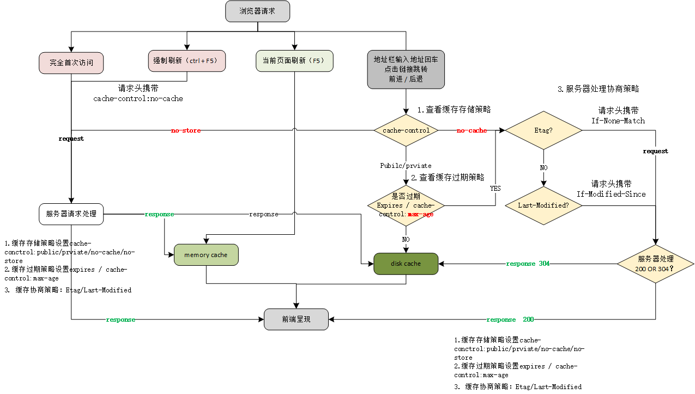
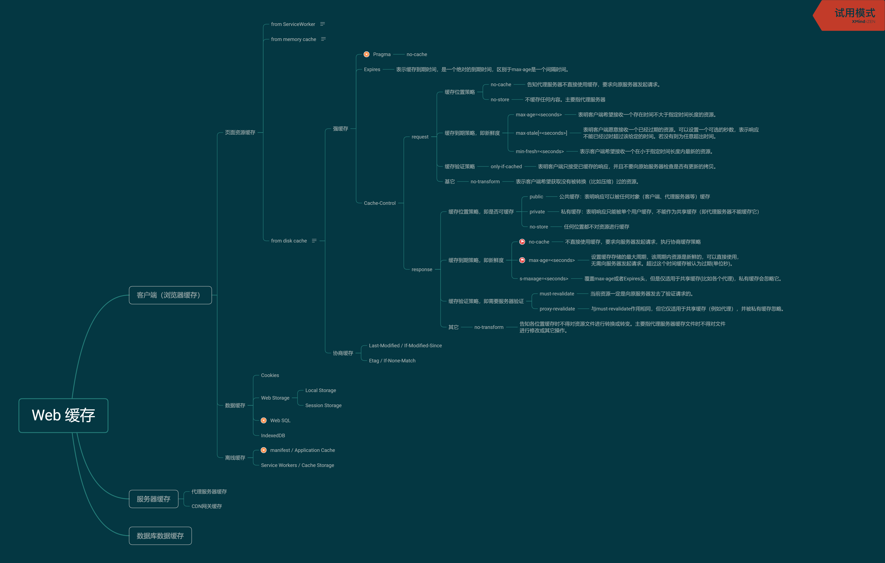

# Web Cache 资源缓存机制 

[[toc]]

## 什么是web缓存

web缓存指的是一个web资源（比如html页面、图片、js文件、数据等）存在于web服务器端或客户端（主要是指浏览器）的一个副本文件。

当一个资源的请求发生时，会根据对应的缓存机制来决定是直接使用缓存的副本文件来响应请求，还是向服务器重新请求最新的资源的文件。


## web缓存的作用

web缓存的主要作用是加快数据传输的速度。

站在前端角度来说，web缓存所要解决的就是如何提高页面资源加载速度的问题，使前端页面资源加载更快。

当然站在全局（全栈）角度来说，web缓存还能降低服务器压力，减少网络带宽的消耗。

- 减少网络延迟，加快页面打开速度。
- 降低服务器压力，因为缓存减少了对服务器的请求次数
- 减少网络带宽的消耗，带宽减少意味着运营成本的减少，因为带宽是付费的。

## web缓存的类型

简单点理解web世界，就是三点一线：客户端 --> 服务器端 --> 数据库端，其中的线就是网络连接

所以从三端的角度划分，web缓存分为：

### 客户端(浏览器缓存): 页面资源缓存 和 本地数据缓存

浏览器缓存分可进一步划分为页面资源缓存和本地数据缓存

页面资源缓存: 指的是html文件中所涉及到的各种源文件，如link中的样式表文件，src链接的图片音频视频等文件，js文件等，会依据http协议头中约定的缓存策略进行工作，（具体缓存策略后面会详细讲）。

本地数据缓存: 主要指可以不依赖服务器或数据库存储的数据，将它直接放在客户端本地进行存储，以减少存储到服务器或数据库中带来的读取和写入的网络请求。

### 服务器端：代理服务器缓存 和 CDN缓存

代理服务器主要指在客户端和服务器之间存在的中间服务器。浏览器先向这个中间服务器发起 Web 请求，经过处理后（比如权限验证，缓存匹配等），再将请求转发到源服务器。同浏览器缓存原理类似，可以在这些中间服务器作一些缓存，如果命中缓存，也就可以不用向源服务器发起请求啦。

CDN（Content delivery networks）缓存，也叫网关缓存、反向代理缓存。CDN 缓存一般是由网站管理员或运维人员部署。浏览器先向 CDN 网关发起 Web 请求，网关服务器后面对应着一台或多台负载均衡的源服务器，会根据它们的负载请求，动态将请求转发到合适的源服务器上。

### 数据库端：数据库数据缓存

Web 应用，特别是大型的应用，如 SNS 类型，往往逻辑关系比较复杂，数据库表繁多，如果频繁进行数据库查询，很容易导致数据库不堪重负。为了提高查询的性能，会将查询后的数据放到内存中进行缓存，下次查询时，直接从内存缓存直接返回，提供响应效率。 

## 浏览器缓存

作为前端我们肯定把焦点放在客户端即浏览器缓存。

一个资源的网络请求过程，可以简单的分三个步骤：请求，处理，响应。

1. 浏览器向服务器发起请求
1. 服务器处理请求
1. 服务器返回请求内容

```js
    ----------              ----------
    |        |   request    |        |
    | Client | -----------> | Server |
    |        | <----------- |        |
    |        |   response   |        |
    ---------               ----------
```
针对这个三步骤优化响应速度：
1. 如果压根不发起一次请求，直接从本地拿数据是不是最快？所以将第一次请求过来的资源都缓存到本地，下一次请求时直接从本地缓存取资源，从而避免发起请求，这是强缓存策略。
1. 但如果每次都是从本地取缓存文件，如果文件在远程更新了内容，那还从本地获取的缓存文件内容就不是最新的，此时另一种策略是发起一次请求，看下远程文件有没有更新，如果没有更新，只响应一个代表文件没有更新你可以用本地缓存文件的信息的状态码（304 Not Modified）就好，这样就会让响应传输的数据量更小，比你响应整个资源文件过来网络传输的时间更快。

所以浏览器端缓存的解决的方案是从要么减少请求次数，要么减少响应数据量加快数据传输两个方向来设置缓存策略。

根据需要缓存的资源类型：划分为页面资源缓存、数据缓存

### 页面资源缓存（三级缓存机制）：`from ServiceWorker` `from memory cache` `from disk cache`

在页面资源缓存中，根据缓存资源存放的位置：划分为：`from ServiceWorker` `from memory cache` `from disk cache` `http网络请求`。

这也是浏览器获取资源文件的路径：（由上到下寻找，找到即返回；找不到则继续向下查找，直到都没有就向服务器发起请求）

- Service Worker
- Memory Cache
- Disk Cache
- 发起网络请求


#### `from ServiceWorker`来自离线缓存中文件

`Service Worker`是一个独立于js主线程之外的一个线程。配合` Fetch` 和 `Cache Storage`这些HTML5新的API，实现了由程序开发者主动控制缓存的实现方式，是有别于传统 `memory cache`方式中浏览器自主控制缓存，或者 `disk cache` 中由服务器端通过设置http头控制缓存的方式。

一般只有网页注册了`Service Worker`服务才存在，可以从Chrome 的开发者控制面板中，Application -> Service Workers 中看到注册的sw服务 和 Cache Storage 缓存的资源文件。这个缓存是持久缓存，即关闭 TAB 或者浏览器，下次打开依然还在。有两种情况会导致这个缓存中的资源被清除：手动调用 API cache.delete(resource) 或者容量超过限制，被浏览器全部清空。

关于`Service Worker`可以查看更多资料了解：

[浏览器缓存、CacheStorage、Web Worker 与 Service Worker](https://juejin.im/entry/5a7a9fcf5188257a5c605369)<br>
[Web Worker、Service Worker 和 Worklet](https://juejin.im/entry/5c50f22ef265da616b1115a3)<br>
[Service Worker ——这应该是一个挺全面的整理](https://blog.csdn.net/huangpb123/article/details/89498418)<br>
[【PWA】Service Worker 全面进阶](https://blog.csdn.net/i10630226/article/details/78885664)

目前大部分的网页应用还没有应用到`Service Worker`，所以针对浏览器缓存理解还是要从内存缓存和硬盘缓存开始。

#### `from memory cache`来自内存中的缓存文件

`memory cache` 是内存中的缓存，按照操作系统的常理：先读内存，再读硬盘。所有内存缓存是浏览器加载资源最先查找的。

几乎所有的网络请求资源当被浏览器首次加载时，会自动加入到 `memory cache` 中。但是也正因为资源的数量会很多，但是浏览器占用的内存不能无限扩大这样两个因素，`memory cache` 注定只能是个“短期存储”。

常规情况下，浏览器当前TAB页面刷新时资源加载都是来自`memory cache` ，当 TAB 关闭后该次浏览的页面资源在 `memory cache` 便会被清空。而如果极端情况下 (例如一个页面的缓存就占用了超级多的内存)，那可能在 TAB 没关闭之前，排在前面的缓存就已经失效了，因为需要给其他 TAB 腾出内存空间。

测试一下，当你按F12打开控制台转到Network面板，任意打开一个网页，然后再刷新下网页，此时资源的加载几乎都是从 memory cache 中加载的。（查看size列）

#### `from disk cache`来自硬盘中的缓存文件

`disk cache` 也叫 `HTTP cache`，即常说的浏览器缓存或http缓存多半是指这部分内容。


`disk cache` 会严格根据 HTTP 头信息中的各类字段来判定哪些资源可以缓存，哪些资源不可以缓存；哪些资源是仍然新鲜可用的，哪些资源是过时需要重新请求。

常见的 HTTP 缓存只能存储 GET 响应，对于其他类型的响应则无能为力。缓存命中的关键主要包括request method和目标URI（一般只有GET请求才会被缓存）
当在`disk cache`里命中缓存之后，浏览器会从硬盘中读取资源，虽然比起从内存中读取慢了一些，但比起网络请求还是快了不少的。日常浏览器绝大部分的资源请求都来自 `disk cache`。


http缓存根据缓存策略，又可以划分为：强缓存 和 协商缓存

- 减少请求次数，即对部分资源进行强缓存 ---> 完全使用缓存副本文件，而不发起网络请求
- 减少响应数据量，即对部分资源进行协商缓存，也叫对比缓存 ---> 发起了网络请求，由服务器进行处理后只返回了可以使用本地缓存文件的状态码，而不返回响应资源数据。

[理解http浏览器的协商缓存和强制缓存](https://www.jqhtml.com/50359.html)

**强缓存策略**

依据http版本的发展，强制缓存策略先后使用过的http头字段：`Pragma` `Expires` `Cache-Control`

Cache-Control 是http1.1的规范，值可以设置：
- max-age：代表该资源的有效期，单位秒。
- no-cache: 需要进行协商缓存，发送请求到服务器确认是否使用缓存。
- no-store：禁止使用缓存，每一次都要重新请求数据。
- public：可以被所有的用户缓存，包括终端用户和 CDN 等中间代理服务器。
- private：只能被终端用户的浏览器缓存，不允许 CDN 等中继缓存服务器对其缓存。

```js
import path from 'path';
import Koa from 'koa';
 
//静态资源中间件
import resource from 'koa-static';
const app = new Koa();
const host = 'localhost';
const port = 7878;
 
app.use(async (ctx, next) => {
 // 设置响应头Cache-Control 设置资源有效期为300秒
  ctx.set({
    'Cache-Control': 'max-age=300' 
  });
  await next();
});
 
app.use(resource(path.join(__dirname, './static')));
 
app.listen(port, () => {
  console.log(`server is listen in ${host}:${port}`);
});
```

**协商缓存策略**

客户端向服务器端发出请求，服务端会检测是否有对应的标识，如果没有对应的标识，服务器端会返回一个对应的标识给客户端，客户端下次再次请求的时候，把该标识带过去，然后服务器端会验证该标识，如果验证通过了，则会响应304，告诉浏览器读取缓存。如果标识没有通过，则返回请求的资源。

协商缓存策略使用两组http头信息：  `Last-Modified/If-Modified-Since` `Etag/If-None-Match`

- Last-Modified/if-Modify-Since
    - 浏览器第一次发出请求一个资源的时候，服务器会返回一个last-Modify到hearer中. Last-Modify 含义是最后的修改时间。
    - 当浏览器再次请求的时候，request的请求头会加上 if-Modify-Since，该值为缓存之前返回的 Last-Modify. 
    - 服务器收到if-Modify-Since后，根据资源的最后修改时间(last-Modify)和该值(if-Modify-Since)进行比较，如果相等的话，则命中缓存，返回304，否则, 如果 Last-Modify > if-Modify-Since, 则会给出200响应，并且更新Last-Modify为新的值。
```js
import Koa from 'koa';
import path from 'path';
 
//静态资源中间件
import resource from 'koa-static';
const app = new Koa();
const host = 'localhost';
const port = 7788;
 
const url = require('url');
const fs = require('fs');
const mime = require('mime');
 
app.use(async(ctx, next) => {
  // 获取文件名
  const { pathname } = url.parse(ctx.url, true);
  // 获取文件路径
  const filepath = path.join(__dirname, pathname);
  const req = ctx.req;
  const res = ctx.res;
  // 判断文件是否存在
  fs.stat(filepath, (err, stat) => {
    if (err) {
      res.end('not found');
    } else {
      // 获取 if-modified-since 这个请求头
      const ifModifiedSince = req.headers['if-modified-since'];
      // 获取最后修改的时间
      const lastModified = stat.ctime.toGMTString();
      // 判断两者是否相等，如果相等返回304读取浏览器缓存。否则的话，重新发请求
      if (ifModifiedSince === lastModified) {
        res.writeHead(304);
        res.end();
      } else {
        res.setHeader('Content-Type', mime.getType(filepath));
        res.setHeader('Last-Modified', stat.ctime.toGMTString());
        // fs.createReadStream(filepath).pipe(res);
      }
    }
  });
  await next();
});
 
app.use(resource(path.join(__dirname, './static')));
 
app.listen(port, () => {
  console.log(`server is listen in ${host}:${port}`);
});
```
- ETag/if-None-Match

Tag的原理和上面的last-modified是类似的。ETag则是对当前请求的资源做一个唯一的标识。该标识可以是一个字符串，文件的size,hash等。只要能够合理标识资源的唯一性并能验证是否修改过就可以了。

ETag在服务器响应请求的时候，返回当前资源的唯一标识(它是由服务器生成的)。但是只要资源有变化，ETag会重新生成的。浏览器再下一次加载的时候会向服务器发送请求，会将上一次返回的ETag值放到request header 里的 if-None-Match里面去，服务器端只要比较客户端传来的if-None-Match值是否和自己服务器上的ETag是否一致，如果一致说明资源未修改过，因此返回304，如果不一致，说明修改过，因此返回200。并且把新的Etag赋值给if-None-Match来更新该值。

```js
import path from 'path';
import Koa from 'koa';
 
//静态资源中间件
import resource from 'koa-static';
const app = new Koa();
const host = 'localhost';
const port = 7878;
 
const url = require('url');
const fs = require('fs');
const mime = require('mime');
const crypto = require('crypto');
app.use(async(ctx, next) => {
  // 获取文件名
  const { pathname } = url.parse(ctx.url, true);
  // 获取文件路径
  const filepath = path.join(__dirname, pathname);
  const req = ctx.req;
  const res = ctx.res;
  // 判断文件是否存在
  fs.stat(filepath, (err, stat) => {
    if (err) {
      res.end('not found');
    } else {
      console.log(111);
      // 获取 if-none-match 这个请求头
      const ifNoneMatch = req.headers['if-none-match'];
      const readStream = fs.createReadStream(filepath);
      const md5 = crypto.createHash('md5');
      // 通过流的方式读取文件并且通过md5进行加密
      readStream.on('data', (d) => {
        console.log(333);
        console.log(d);
        md5.update(d);
      });
      readStream.on('end', () => {
        const eTag = md5.digest('hex');
        // 验证Etag 是否相同
        if (ifNoneMatch === eTag) {
          res.writeHead(304);
          res.end();
        } else {
          res.setHeader('Content-Type', mime.getType(filepath));
          // 第一次服务器返回的时候，会把文件的内容算出来一个标识，发给客户端
          fs.readFile(filepath, (err, content) => {
            // 客户端看到etag之后，也会把此标识保存在客户端，下次再访问服务器的时候，发给服务器
            res.setHeader('Etag', etag);
            // fs.createReadStream(filepath).pipe(res);
          });
        }
      });
    }
  });
  await next();
});
// 我们这边直接使用 现成的插件来简单的演示下。如果要比较的话，可以看上面的代码原理即可
import conditional from 'koa-conditional-get';
import etag from 'koa-etag';
app.use(conditional());
app.use(etag());
 
app.use(resource(path.join(__dirname, './static')));
 
app.listen(port, () => {
  console.log(`server is listen in ${host}:${port}`);
});
```

- last-modified 和 ETag之间对比
    1. 在精度上，ETag要优先于 last-modified。
    2. 在性能上，Etag要逊于Last-Modified，Last-Modified需要记录时间，而Etag需要服务器通过算法来计算出一个hash值。
    3. 在优先级上，服务器校验优先考虑Etag。


**新角度理解缓存策略**
根据现代浏览器对缓存机制的定义，主要利用`Cache-Control`来控制缓存，所以从一个新角度来理解http缓存，划分为：

- 缓存存储策略：
    ```js
    Cache-Control: public / private / no-store
    ```
- 缓存过期策略
    ```js
    Cache-Control: max-age=<seconds> 
    ```
- 缓存协商策略
    ```js
    Cache-Control: no-cache
    Etag / If-None-Match
    ```

由于兼容性考虑，现在大部分网页缓存策略对http头的设置都会对新旧字段同时设置，所以新字段的权重总是大于旧字段的，即会覆盖旧字段的定义。

定义强缓存时，`Pragma`字段基本淘汰了。 `Expires`的定义会被`Cache-Control：max-age=[second]`覆盖。
定义强缓存时，`Etag/If-None-Match` 优先级高于`Last-Modified/If-Modified-Since`。

关于http缓存中具体涉及缓存的header讲解见下一章节。

> 注意点： 关于Cache-Control头字段的定义在请求头和响应头中都是可以设置的，但相同值所表达的含义是不一样的。在协商缓存中，请求头可以携带`If-None-Match` `If-Modified-Since`，对应着响应头`Etag` `Last-Modified`。


### 数据缓存：Cookie、Web Storage、IndexedDB、Cache Storage

前端对一些不需要服务器处理的数据直接保存在客户端本地，也是直接减少网络请求的体现。浏览器为本地数据缓存方式依据发展时间分为：

- Cookie
- Web Storage (LocalfStorage / SessionStorage)
- Web SQL (已淘汰)
- IndexedDB
- Application Cache （manifest方式对应的缓存位置，该API已淘汰）
- Cache Storage （service workers方式对应的缓存位置）

具体关于 `Cookies / session` 和 `Web Storage (LocalfStorage / SessionStorage)`讲解见下一章节。

### 离线缓存

最新HTML5技术带来的离线缓存的方案，使用了`Service Workers`和`Cache Storage`方案。淘汰了老旧的`manifest`和`Application Cache`的方案。

## 缓存应用模式

### 模式 1：不常变化的资源，强缓存设置：cache-control: max-age=时长  或者 expires: 到期时间

```js
Cache-Control: max-age=31536000
```
通常在处理这类不常变化的资源资源时，给它们的 Cache-Control 配置一个很大的 max-age=31536000 (一年)，这样浏览器之后请求相同的 URL 会命中强缓存，未超过max-age设置的时间间隔就会直接使用缓存文件，通常为了浏览器兼容性，也会同时设置一个expires到期时间。

而为了解决更新的问题，通常就会在文件名(或者路径)中添加 hash串（此hash串不是URL中的hash值，通常是一个时间戳）， 版本号等动态字符，之后更改动态字符，达到更改引用 URL 的目的，从而让之前的强制缓存失效 (因为URL匹配不一样了，所以会请求新文件，而不是利用缓存文件了)。 在项目中对一些常用的类库 (如 jquery-3.3.1.min.js, lodash.min.js 等) 均采用这个模式。如果配置中还增加 public 的话，CDN 也会将其缓存起来，效果拔群。

这个模式的一个变体是在引用 URL 后面添加参数 (例如 ?v=xxx 或者 ?_=xxx)，这样就不必在文件名或者路径中包含动态参数，满足某些完美主义者的喜好。在项目每次构建时，更新额外的参数 (例如设置为构建时的当前时间)，则能保证每次构建后总能让浏览器请求最新的内容。


### 模式 2：经常变化的资源，协商缓存设置： cache-control:no-cache 配合 Etag 或者 Last-Modified

```js
Cache-Control: no-cache
Etag=sdfjkasjdf=
```
这里的资源不单单指静态资源，也可能是网页资源，例如博客文章。这类资源的特点是：URL 不能变化，但内容可以(且经常)变化。我们可以设置 Cache-Control: no-cache 来迫使浏览器每次请求都必须找服务器验证资源是否有效。

既然提到了验证，就必须配合 ETag 或者 Last-Modified 头的设置。这些字段都会由专门处理静态资源的常用类库(例如 koa-static)自动添加，无需开发者过多关心。这种模式下，节省的并不是请求数，而是请求体的大小。所以它的优化效果不如模式 1 来的显著，但也比每次都请求好。


## 浏览器的操作行为

所谓浏览器的行为，指的就是用户在浏览器上如何操作时（比如刷新、前进、后退等操作），会触发怎样的缓存策略。主要有 3 种：

#### 新开页面：disk cache
打开网页、地址栏输入地址、页面点击跳转链接、前进后退等操作： 查找 disk cache 中是否有匹配。如有则使用；如没有则发送网络请求。
### 普通刷新 (F5)：memory cache
普通刷新 (F5)：因为 TAB 并没有关闭，因此 memory cache 是可用的，会被优先使用(如果匹配的话)，其次才是 disk cache，最后才是网络请求。
### 强制刷新 (Ctrl + F5)：重新网络请求
强制刷新 (Ctrl + F5)：浏览器不使用任何缓存，因此发送的请求头部均带有 Cache-control: no-cache(为了兼容，可能还会带了 Pragma: no-cache)。服务器直接返回 200 和最新内容。


## 总结




## 参考链接

[MDN HTTP 缓存](https://developer.mozilla.org/zh-CN/docs/Web/HTTP/Caching_FAQ)提供了带Vary头的验证思路<br>
[【Web 缓存机制系列】1 – Web 缓存的作用与类型](http://www.alloyteam.com/2012/03/web-cache-1-web-cache-overview/)提供了web缓存分类的全局观点<br>
[一文读懂http缓存（超详细）](https://mp.weixin.qq.com/s/9QKYhlCr8za3oSCxl_yedA)提供了按页面资源缓存和数据缓存的思路<br>
[一文读懂前端缓存](https://mp.weixin.qq.com/s/cUqkG3NETmJbglDXfSf0tg)提供了`service worker` `memory cache` `disk cache`的思路<br>
[彻底弄懂 Http 缓存机制 - 基于缓存策略三要素分解法](https://mp.weixin.qq.com/s/qOMO0LIdA47j3RjhbCWUEQ?utm_source=caibaojian.com)提供了cache-control视角下缓存策略的三种划分思路<br>
[HTTP缓存控制小结](https://imweb.io/topic/5795dcb6fb312541492eda8c)提供了http缓存头的逐步演变的历史<br>
[浏览器缓存机制](https://www.cnblogs.com/skynet/archive/2012/11/28/2792503.html)

## 补充

Chrome浏览器命令，可以查看相关分类的信息，包括cache文件路径、cookie文件路径

在浏览器地址栏输入如下命令：
```js
chrome://about    // 所有命令列表
chrome://version  // 打开chrome基本信息，其中个人文件路径即包括cache、cookie、indexedDB等文件或文件夹
// 或者
about:version  // 也可以使用about:xx，会重定向到chrome:xx，如about:bookmarks 打开浏览器书签管理页
```

