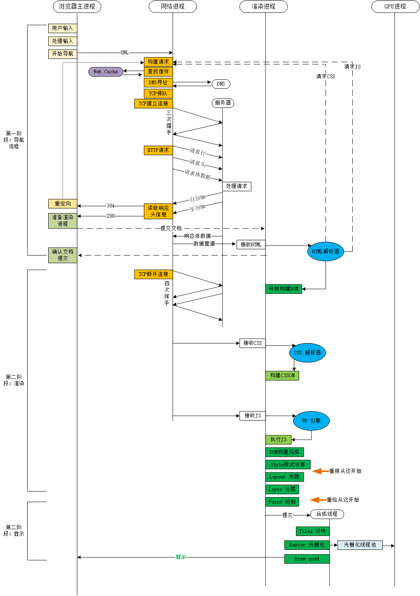

# 浏览器

#### 概述
- 浏览器历史
- 浏览器的架构
    - 进程与线程
    - 浏览器架构演化（Chrome）
#### 浏览器网络请求
- 网络协议
    - 协议概念
    - TCP/IP协议族
        - 协议的分层
        - 各层的功能
        - 各层的通信
        - 通信方式的分类
        - 通信的数据单位：报文、帧、数据包
    - IP 协议
    - UDP 协议
    - TCP 协议
        - 三次握手建立连接
        - 四次挥手断开连接
    - HTTP 协议
#### Web 缓存
- 什么是web缓存
- web缓存的作用
- web缓存的类型
    1. 客户端（浏览器缓存）
        - 1.1 页面资源缓存
        - 1.2 数据缓存
    2. 服务器缓存
        - 2.1 代理服务器缓存
        - 2.2 CDN缓存
    3. 数据库数据缓存
- 浏览器缓存
    1. 页面资源缓存（三级缓存机制）
        - 1.1 Service Worker：如果注册了SW服务，则从Cache Storage中读取缓存资源文件
        - 1.2 memory cache：当前浏览器TAB页未关闭情况下，从memory cache中即内存中读取缓存资源文件
        - 1.3 disk cache：也叫http缓存，如果当前在disk cache有命中缓存，则依据http头设置的缓存策略读取资源文件
            - 1.3.1 强缓存和协商缓存
            - 1.3.2 从cache-control中理解：缓存存储策略、缓存过期策略、缓存对比策略
    2. 数据缓存
    3. 离线缓存
- http缓存应用模式
    1. 强缓存设置：cache-control: max-age=时长  或者 expires: 到期时间
    2. 协商缓存设置： cache-control:no-cache 配合 Etag 或者 Last-Modified
- 浏览器操作行为
    1. 地址栏输入地址回车、点击链接跳转、前进、后退： 查找disk cache，如果有则使用，没有就发起网络请求
    2. 普通刷新（F5)：因为 TAB 并没有关闭，因此优先 memory cache ，其次才是 disk cache，最后才是网络请求
    3. 强制刷新 (Ctrl + F5)：浏览器不使用任何缓存，发起网络请求返回最新内容
#### 浏览器页面渲染过程
- 页面渲染：如何显示页面
    - HTML解析器 -> DOM
    - CSS解析器 -> CSSOM
    - DOM -> Sytle -> Layout -> Layer -> Paint -> tiles -> raster -> draw quad
- V8 引擎：如何解析一段JS代码
    - 编译器（Compiler）
    - 解释器（Interpreter）
    - 即时编译器（JIT：Just In Time）
    - 词元（Token）
    - 抽象语法树（AST）
    - 字节码（Bytecode）
    - 机器码（machine code）
- JS 运行机制：如何运行一段代码
    - “一段代码”的界定：编译一段，执行一段
    - 执行上下文 和 执行代码
        - 调用栈（执行上下文栈）: 调用栈查看、调用栈溢出
        - 变量环境（variable environment）：var、function、变量提升
        - 词法环境（Lexical environment）：let、const、暂时性死区
        - 外部引用（outer）：词法作用域、作用链
        - this对象：类似动态作用域
        - 闭包
        - 调用栈溢出
- JS内存机制：如何进行数据存储
    - 堆空间（Heap）和栈空间（Stack）
    - 垃圾回收：GC(Garbage Collection 碎片收集)
- 浏览器的事件循环机制
#### 浏览器安全
- 同源策略
- 安全沙箱
- 跨站脚本攻击（XSS：Cross Site Scripting）
- 跨站请求伪造（CSRF: Cross Site Request Forgery）

#### 流程梳理

在浏览器里，从输入 URL 到页面展示，这中间发生了什么？

1. 触发当前页的卸载事件和收集需要释放内存
1. **合成URL：**浏览器会根据用户输入的信息判断是搜索还是网址，如果是搜索内容，就将搜索内容+默认搜索引擎合成新的URL；如果用户输入的内容符合URL规则，浏览器就会根据URL协议，在这段内容上加上协议合成合法的URL。此时浏览器导航栏显示loading状态，但是页面还是呈现前一个页面，这是因为新页面的响应数据还没有获得。涉及[URI URL URN概念解释](/Network/HTTP/URI_MIME.html)
1. **传送URL：**浏览器通过进程间通信（IPC）将URL请求发送给网络进程
1. **查找缓存：**网络进程获取到URL，先去本地缓存中查找是否有缓存文件，如果有，拦截请求，直接200返回；否则，进入网络请求过程。涉及[web缓存知识](/Browser/04_web_cache.html#什么是web缓存)
1. **DNS寻址：**网络进程请求DNS返回域名对应的IP和端口号，如果之前DNS数据缓存服务缓存过当前域名信息，就会直接返回缓存信息；否则，发起请求获取根据域名解析出来的IP和端口号，如果没有端口号，http默认80，https默认443。如果是https请求，还需要建立TLS连接。
1. **TCP连接排队：**Chrome 有个机制，同一个域名同时最多只能建立 6 个TCP 连接，如果在同一个域名下同时有 10 个请求发生，那么其中 4 个请求会进入排队等待状态，直至进行中的请求完成。如果当前请求数量少于6个，会直接建立TCP连接。
1. **TCP建立连接：**TCP三次握手建立连接
1. **HTTP请求构建：**构建http请求，并且加上TCP头部——包括源端口号、目的程序端口号和用于校验数据完整性的序号，向下传输。涉及[HTTP总结](/Network/HTTP/introduce.html#http-%E6%A6%82%E8%BF%B0)
1. 网络层在数据包上加上IP头部——包括源IP地址和目的IP地址，继续向下传输到底层
1. 底层通过物理网络传输给目的服务器主机
1. 目的服务器主机网络层接收到数据包，解析出IP头部，识别出数据部分，将解开的数据包向上传输到传输层
1. 目的服务器主机传输层获取到数据包，解析出TCP头部，识别端口，将解开的数据包向上传输到应用层
1. 应用层HTTP解析请求头和请求体，如果需要重定向，HTTP直接返回HTTP响应数据的状态statusCode=301或者302，同时在请求头的Location字段中附上重定向地址，浏览器会根据statusCode和Location进行重定向操作；如果不是重定向，首先服务器还会根据请求头中是否有`If-None-Match` 或者`If-Modified-Since`字段的值来校验请求的资源是否被更新，如果没有更新，就返回304状态码，相当于告诉浏览器之前的缓存还可以使用，就不返回新数据了；否则，返回新数据，200的状态码，并且如果想要浏览器缓存数据的话，就设置相应的响应头字段：`Cache-Control 或 Expires`。涉及[HTTP Cache 缓存策略](/Network/HTTP/httpCache.html#http-cache)
1. 响应数据又顺着应用层——传输层——网络层——网络层——传输层——应用层的顺序返回到网络进程
1. 数据传输完成，**TCP四次挥手断开连接**。如果，浏览器或者服务器在HTTP头部加上如下信息`Connection:Keep-Alive`，TCP就一直保持连接。保持TCP连接可以省下下次需要建立连接的时间，提升资源请求加载速度，因为建立TCP连接是非常消耗资源和时间的。涉及[短连接/长连接/流水线连接](/Network/HTTP/session_connect_message.html#http-连接)
1. 网络进程将获取到的数据包进行解析，根据响应头中的`Content-type`来判断响应数据的类型，如果是字节流类型，就将该请求交给下载管理器，该导航流程结束，不再进行；如果是`text/html`类型，就通知浏览器进程获取到文档准备渲染。涉及[MIME 标识资源类型](/Network/HTTP/URI_MIME.html#mime-标识资源类型)
1. 浏览器进程获取到通知，根据当前页面B是否是从页面A打开的并且和页面A是否是同一个站点（根域名和协议一样就被认为是同一个站点），如果满足上述条件，就复用之前网页的进程，否则，新创建一个单独的渲染进程
1. 浏览器会发出“提交文档”的消息给渲染进程，渲染进程收到消息后，会和网络进程建立传输数据的“管道”，文档数据传输完成后，渲染进程会返回“确认提交”的消息给浏览器进程
1. 浏览器收到“确认提交”的消息后，会更新浏览器的页面状态，包括了安全状态、地址栏的 URL、前进后退的历史状态，并更新web页面，此时的web页面是空白页
1. 渲染进程对文档进行页面解析和子资源加载，HTML 通过HTM 解析器转成**DOM**（二叉树类似结构的东西），CSS通过CSS解释器转成**CSSOM**，JS执行会阻塞DOM解析，CSS加载解析会阻塞JS的执行。
1. DOM和CSSOM结合，形成**render**，主要是进行样式计算（不包含HTML的具体元素和元素要画的具体位置）。
1. **Layout**布局阶段：需要完成两件事：创建布局树和布局计算，计算出每个元素具体的宽高颜色位置。
1. 根据样式规则，进行分层**layer**
1. 根据分层信息，逐层开始绘制**Paint**
1. 绘制数据单独在合成线程进行分块**Tiles**
1. 每块进行光栅化**Rester**
1. 最后将光栅化后的像素信息提交给浏览器进行显示在屏幕中

**参考资料**

[极客专栏-浏览器工作原理与实践](https://time.geekbang.org/column/intro/216) 
[从输入URL到页面加载的过程？如何由一道题完善自己的前端知识体系！](http://www.dailichun.com/2018/03/12/whenyouenteraurl.html)