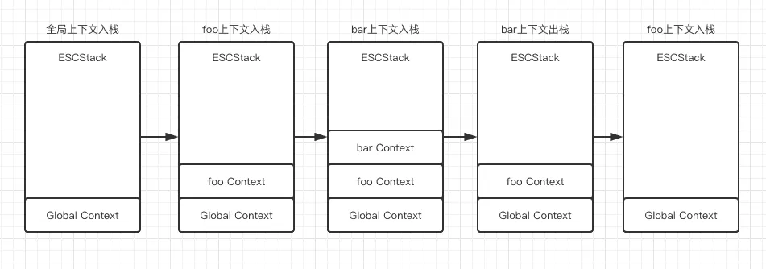
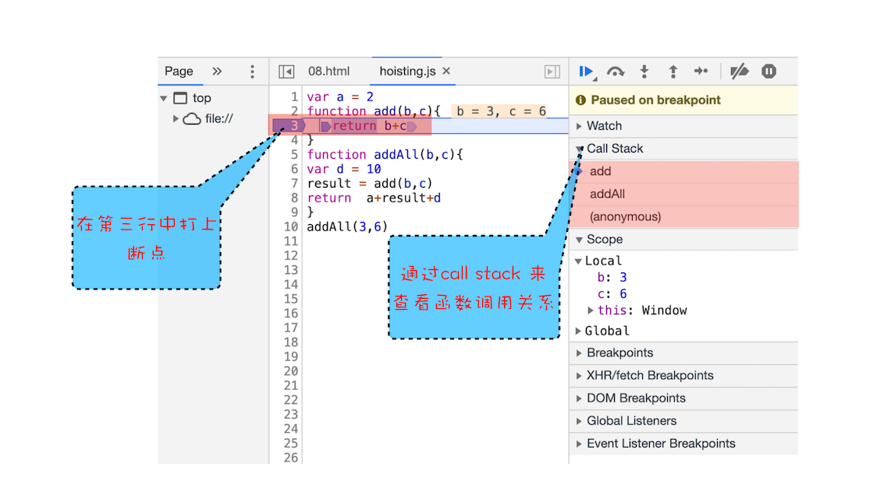
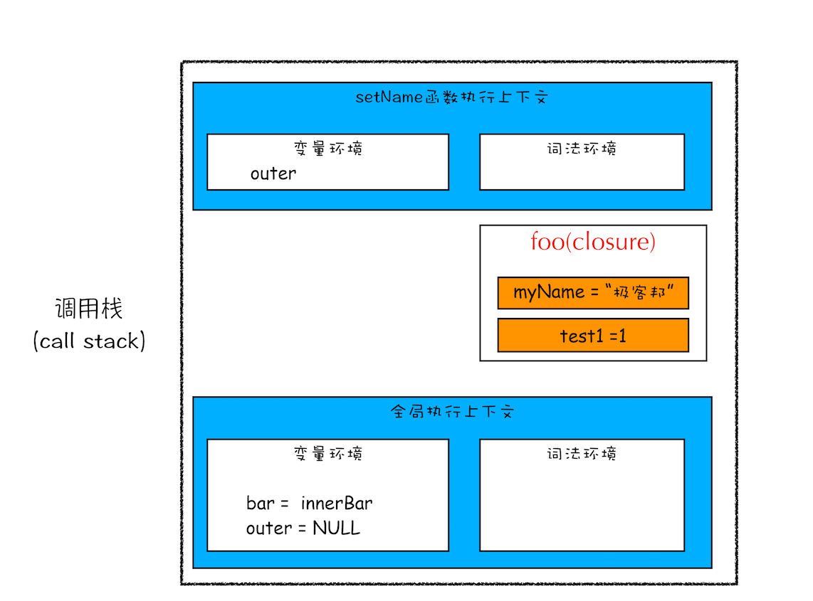

# 执行上下文

[[toc]]

这是上一篇V8 引擎运行 J S代码的流程图。这一节主要专注在执行上下文这块内容，这是JS代码运行的机制。


## 什么是执行上下文 Execution context

执行上下文是一个抽象出来的概念，执行上下文是 JavaScript 执行一段代码时的运行环境，JavaScript 标准把一段代码（包括函数），执行所需要的所有信息定义为“执行上下文”。

可以理解成数据仓库，仓库中存储着代码执行时需要引用的各种变量数据。

## 执行上下文的种类

- 全局执行上下文

这是默认或者说基础的上下文，任何不在函数内部的代码都在全局上下文中。它在宿主环境启动 V8 运行时就创建了。

比如宿主环境是浏览器，那全局上下文中包括了 window 对象，还有默认指向 window 的 this 关键字，另外还有一些 Web API 函数，诸如 setTimeout、XMLHttpRequest 等内容，以及V8 初始化的内置对象等都包含在其中。在整个页面的生存周期内，全局执行上下文只有一份。

- 函数执行上下文

每当一个函数被调用时, 都会为该函数创建一个新的上下文。这个函数上下文中保存着函数内声明的每个变量，以及函数隐含参数 arguments。

在一个程序中会定义多个函数，每个函数都有它自己的执行上下文，但只有当函数调用时，才会创建。v8 会按使用调用栈的方法来管理这些函数执行上下文，也就是管理函数调用。

- Eval 函数执行上下文

执行在 eval 函数内部的代码也会有它属于自己的执行上下文，但由于 JavaScript 开发者并不经常使用 eval，所以在这里我不会讨论它。

## 管理执行上下文 -- 调用栈 Call Stack

一般程序中代码执行会有很多函数，函数间还有嵌套关系，每个函数调用都会创建执行上下文，那在整个程序运行周期内，由函数调用产生的这么多执行上下文怎么进行管理呢？

答案是通过一种叫栈的数据结构来管理的。那什么是栈呢？它又是如何管理这些执行上下文呢？

栈结构就好车厢装货，只有一个车门，货物进出需要遵循后进先出的顺序。

JavaScript 引擎正是利用栈的这种结构来管理执行上下文的。在执行上下文创建好后，JavaScript 引擎会将执行上下文压入栈中，通常把这种用来管理执行上下文的栈称为执行上下文栈，又称调用栈。函数执行完成后又会将该函数上下文弹出栈。

```js
function foo () { 
    function bar () {        
      return 'I am bar';
    }
    return bar();
}
foo();
```
上述代码的执行时，函数执行上下文的入栈、出栈示意图如下：


### 利用浏览器查看调用栈的信息

Chrome浏览器打开“开发者工具”（按F12或ctrl+thift+i)，点击“Source”标签，选择 JavaScript 代码的页面，然后在第 3 行加上断点，并刷新页面。你可以看到执行到 add 函数时，执行流程就暂停了，这时可以通过右边“call stack”来查看当前的调用栈的情况，如下图：


从图中可以看出，右边的“call stack”下面显示出来了函数的调用关系：栈的最底部是 anonymous，也就是全局的函数入口；中间是 addAll 函数；顶部是 add 函数。这就清晰地反映了函数的调用关系，所以在分析复杂结构代码，或者检查 Bug 时，调用栈都是非常有用的。

### console.trace() 打印调用栈信息

另外，还可以使用 console.trace() 来输出当前的函数调用关系，比如在示例代码中的 add 函数里面加上了 console.trace()，你就可以看到控制台输出的结果，如下图：


### 调用栈溢出

因为栈在内存是一块连续的内存空间，限于内存使用容量，所以在通常情况下，JS 引擎对调用栈都有最大容量限制，这也就意味着，函数的嵌套调用次数过多，就会超出栈的最大使用范围，从而导致栈溢出。常见于递归调用，没有终止条件造成死循环的场景。

```js
function division(a,b){ 
    return division(a,b)
}
console.log(division(1,2))
```


### 栈如何管理函数调用？

栈如何管理函数调用？或者换个说法，程序是如何知道出入栈位置的？

这里就涉及到数据结构栈结构的相关算法。涉及C语言相关概念：栈帧、指针、寄存器 esp 、寄存器 esp

参考资料：
[堆和栈：函数调用是如何影响到内存布局的？](https://time.geekbang.org/column/article/221928)


## 执行上下文里有什么？

这部分内容经历了比较多的版本，所以导致在社区文章中的各种定义，比较混乱，这里我们先来理一下不同时期中各个版本中执行上下文的内容。

- 执行上下文在 ES3 中，包含三个部分。
    - scope：作用域，也常常被叫做作用域链。
    - variable object：变量对象，用于存储变量的对象。
    - this value：this 值。
- 在 ES5 中，我们改进了命名方式，把执行上下文最初的三个部分改为下面这个样子。
    - lexical environment：词法环境，当获取变量时使用。
    - variable environment：变量环境，当声明变量时使用。
    - this value：this 值。
- 在 ES2018 中，执行上下文又变成了这个样子，this 值被归入 lexical environment，但是增加了不少内容。
    - lexical environment：词法环境，当获取变量或者 this 值时使用。
    - variable environment：变量环境，当声明变量时使用。
    - code evaluation state：用于恢复代码执行位置。
    - Function：执行的任务是函数时使用，表示正在被执行的函数。
    - ScriptOrModule：执行的任务是脚本或者模块时使用，表示正在被执行的代码。
    - Realm：使用的基础库和内置对象实例。
    - Generator：仅生成器上下文有这个属性，表示当前生成器。

> 以上内容引自极客时间[重学前端 - 执行上下文是怎么回事？](https://time.geekbang.org/column/article/83302)

随着 ES 语言版本的迭代和 JS 引擎的演进，可能执行上下文的内容还会一直变化。下面内容先以 ES5 版本内容的讲解

## 创建执行上下文

全局上下文是由宿主环境提供 V8 运行时环境时就创建好的

函数执行上下文是在函数调用时，由 V8 来创建

但两者创建执行上下文的结构基本一样（不同之处体现在环境记录的类型不同和外部环境引用值不同，具体见下面），主要会完成以下三件事：
- 创建词法环境组件。
- 创建变量环境组件。
- this 值的绑定

通过伪代码来表示：

```
ExecutionContext = {
  ThisBinding = <this value>,
  LexicalEnvironment = { ... },
  VariableEnvironment = { ... },
}
```

### 词法环境

ES 规范中的定义：
> 词法环境是一种规范类型，基于 ECMAScript 代码的词法嵌套结构来定义标识符和具体变量和函数的关联。一个词法环境由环境记录器和一个可能的引用outer词法环境或者空值组成。

解读上面的定义：
- 规范类型是数据类型章节提过，是语言规范使用的一种内部类型，主要用于指导 JS 引擎实现的。
- 词法环境结构也是key-value结构，把标识符与变量或者函数进行映射关联
- 词法环境内部有两个组件：环境记录器和外部环境引用outer
  - 环境记录器是存储变量和函数声明的实际位置。
  - 外部环境的引用意味着它可以访问其父级词法环境（作用域）。

伪代码表示：

```
LexicalEnvironment: {
  EnvironmentRecord: {}
  outer: <value>
}
```

由于执行上下文有三种类型：全局执行上下文、函数执行上下文、Eval执行上下文。所以对应的词法环境也有所不同，主要体现在环境记录器的类型和外部环境引用的值上。

在全局执行上下文中
- 环境记录器的类型是对象，也叫对象环境记录器，主要存储宿主环境实现的对象，和 V8 引擎实现的内置对象等。
- 外部环境引用 outer 是 null

在函数执行上下文中
- 环境记录器类型为声明，也叫声明式环境记录器，主要存储着函数内部自定义的变量，包括 function 声明的函数变量。另外也包含语言自己实现的自动传入函数的参数 arguments。
- 外部环境引用 outer 可能是全局环境，或者任何包含此内部函数的外部函数。

伪代码表示：
```
GlobalExectionContext = {
  LexicalEnvironment: {
    EnvironmentRecord: {
      Type: "Object",
      // 宿主环境和V8自己内置的各类对象标识符
    }
    outer: <null>
  }
}

FunctionExectionContext = {
  LexicalEnvironment: {
    EnvironmentRecord: {
      Type: "Declarative",
      arguments:<value>,
      // 函数自定义的变量标识符
    }
    outer: <Global or outer function environment reference>
  }
}
```
### 变量环境

变量环境同样是一个词法环境类型，所以变量环境同样有着跟上面定义的词法环境一样结构。

> 词法环境类型是一种语言内部类型，理解上要区别于执行上下文中的词法环境，你可以说执行上下文中包含的变量环境和词法环境都是一种词法环境类型

变量环境与词法环境不同的地方在于其环境记录器所持有的变量标识符种类不同：
- 变量环境中的环境记录器持有 var 声明的变量
- 词法环境中的环境记录器持有 function let const 声明的变量

用代码理解下：

```js
let a = 20;
const b = 30;
var c;

function multiply(e, f) {
 var g = 20;
 return e * f * g;
}

c = multiply(20, 30);
```
上述代码的执行上下文，用伪代码表示，看起来像这样：
```
GlobalExectionContext = {

  ThisBinding: <Global Object>,

  LexicalEnvironment: {
    EnvironmentRecord: {
      Type: "Object",
      a: < uninitialized >,
      b: < uninitialized >,
      multiply: < func >
    }
    outer: <null>
  },

  VariableEnvironment: {
    EnvironmentRecord: {
      Type: "Object",
      c: undefined,
    }
    outer: <null>
  }
}
 
// 只有当 multiply 函数调用时才会创建属于它的函数上下文，像这样：
FunctionExectionContext = {
  ThisBinding: <Global Object>,

  LexicalEnvironment: {
    EnvironmentRecord: {
      Type: "Declarative",
      Arguments: {0: 20, 1: 30, length: 2},
    },
    outer: <GlobalLexicalEnvironment>
  },

VariableEnvironment: {
    EnvironmentRecord: {
      Type: "Declarative",
      g: undefined
    },
    outer: <GlobalLexicalEnvironment>
  }
}
```

在上面伪代码中，你需要关注三点：
- let const 声明变量在未赋值前是 `< uninitialized >`，这就是 let const 声明的变量在声明前使用报错的原因，即“暂时性死区”的原因
- var 声明的变量在未赋值前是 `undefined`, var 声明的变量可以在声明前使用，但值是 undefined，即变量声明提升的原因
- function 声明的函数经过 V8 的[惰性解析](/Browser/Render/V8)，标识符 multiply 保持着函数的引用地址，并且函数体存储在`[[code]]`属性中，也就是函数调用可以出现在函数声明前的原因，即函数声明提升

### 为什么有了变量环境还要出现词法环境

为什么有了变量环境还要出现词法环境？或者换个问法：词法环境的出现是为了解决什么问题？

可以说词法环境的出现为了实现ES6的 “块级作用域” 和 “暂时性死区” 。

所以问题就变成了：为什么 ES 要引入块级作用域，并为块级作用域的实现引入 let const 声明变量的方式和词法环境。

#### 变量提升带来的困扰

JS这门语言是一个早产儿，是当时网景员工Brendan Eich据说只花了十几天就开发出来，所以很多地方都只是按照最简单的方式来设计，并且为此还带来很多坑点，让后续学习有很多有违常规理解的概念，特别是跟Java、C/C++这类语言表现出不同的地方。

不像其它高级语言，JS 没有块级作用域的概念，把作用域内部的变量统一提升无疑是最快速、最简单的设计，不过这也直接导致了函数中的变量无论是在哪里声明的，在编译阶段都会被提取到执行上下文的变量环境中，所以这些变量在整个函数体内部的任何地方都是能被访问的，这也就是 JavaScript 中的变量提升。

变量提升会带来几个问题：

```js
function foo(){ 
    for (var i = 0; i < 7; i++) {

    } 
    console.log(i); 
}

foo() // 输出结果：7
```

```js
var myname = "极客时间"
function showName(){ 
    console.log(myname); 
    if(0){ 
        var myname = "极客邦" 
    } 
    console.log(myname);
}

showName() // 输出结果：undefined
```
上面两段代码，JS的学习都会回答正确，但在Java、C/C++这类语言中运行类似逻辑的代码，输出结果是不一致的，比如C语言，第一段代码的逻辑i变量因为没定义是会报错的，第二段会查找到全局变量myname输出。

这就是JS隐含的变量提升带来的问题：
- for语句块中声明的本应销毁的变量没有被销毁，如第一段代码
- 变量容易在不被察觉的情况下被覆盖掉，如第二段代码

这和其他支持块级作用域的语言表现是不一致的，容易会给一些人造成误解，因为现今JS语言发展已经不是当初设计时的目的，为了更大范围的使用，和主流语言观念保持一致是非常有必要。所以为了解决var function声明的变量会造成变量提升带来的问题，新增了变量声明的方式：let const。

针对上面两段代码，使用let代替var声明变量，然后执行结果和Java、C/C++这类语言中运行结果预期一样。
```js
function foo(){ 
    for (let i = 0; i < 7; i++) {

    } 
    console.log(i); 
}

foo() // 输出结果：报错，i is not defined
```
```js
var myname = "极客时间"
function showName(){ 
    console.log(myname); 
    if(0){ 
        let myname = "极客邦" 
    } 
    console.log(myname);
}

showName() // 输出结果：极客时间

```

#### 块级作用域

块作用域的定义：

除 function 关键字声明函数作用域外，其它声明语句带大括号`{ }`包裹的区域即块作用域，块作用域内使用 let const 声明的变量不影响块外面的变量。

#### 词法环境中如何实现块级作用域？

var 声明的变量存储在变量环境的环境记录器中，并且由于调用栈的后进先出的规则，使得 var 声明的变量有了作用域的概念。当函数执行完要执行出栈操作，自然在函数体内 var 声明的变量也就没有了，表现出来就是 var 声明的变量作用范围在函数作用域下。

let const 声明的变量被存储在词法环境的环境记录器中，同 var 声明的变量利用函数调用栈实现作用域效果一样，在词法环境的环境记录器内部，维护一个小型栈结构。

栈底是函数最外层的使用 let const 声明的变量，进入一个块作用域后，就会把该作用域块内部的变量压到栈顶；当该作用域执行完成之后，该作用域的信息就会从栈顶弹出，这就是词法环境保存 let const 变量的结构。

#### 暂时性死区

var function声明的变量可以在声明前使用，因为存在变量声明提升。那在let const声明的变量如果在声明前就使用会怎么样呢？

```js
// 正常使用
var gobalvar = 1
function test() {
    if (true) {
        var blockvar = 1
        let blocklet = 1
        console.log(blockvar)
        console.log(blocklet)
    }
}

test()
```
```js
// 声明前使用
var gobalvar = 1
function test() {
    if (true) {
        console.log(blockvar)
        console.log(blocklet) // Uncaught ReferenceError: Cannot access 'blocklet' before initialization
        var blockvar = 1
        let blocklet = 1
    }
}

test()
```


let const 声明的变量不能在声明前就使用，即块作用域开始，到该变量使用let声明开始的这段区域为死区，不能使用该变量。

并且看图示，此时连块作用域都不会创建，等于说这个语法错误在 V8 引擎解析阶段就发现了。

#### 对比函数调用栈和块级作用域利用的小型栈

为了让JS实现符合主流语言块作用域的逻辑，使用词法环境来实现了一个小型调用栈的逻辑。将 var 的声明变量的逻辑浓缩在了词法环境中，但不同的是，对变量提升，实现了一种相反的逻辑，即暂时性死区。

仔细想想对比一下：
- 函数作用域使用执行上下文调用栈里的变量环境来管理var function  ---- 块作用域在词法环境中也使用栈结构来管理let const声明的变量
- var function 声明变量有变量提升，可以先使用后声明  -------------- let const 声明的变量有暂时性死区，限制先使用后声明
- var function 在各个调用栈中变量环境实现作用域链查找 ------------- let const 声明的变量也可以在词法环境的栈结构中跨块作用域查找
- 函数执行完毕，当前调用栈有出栈操作 ------------------------------ 当前块作用域执行完成，也会在词法环境栈中执行出栈操作

### 外部环境引用 outer

outer 引用的外部环境指的是函数声明时所处的外层函数。即函数的静态作用域决定了outer 引用外部环境的值。

看个例子对比：
```js
// 示例1
function bar1() {
  console.log(myName)
}
function foo() {
  var myName = "极客邦"
  bar1()
}
var myName = "极客时间"
foo() // 极客时间
```
```js
// 示例2
function foo() {
  var myName = "极客邦"
  function bar1() {
    console.log(myName)
  }
  bar1()
}
var myName = "极客时间"
foo() // 极客邦
```
对比示例1和示例2的输出结果不同，主要是因为 bar1 和 bar2 函数声明位置不同导致的。

```
bar1 的 outer: <GlobalLexicalEnvironment>
bar2 的 outer: <fooLexicalEnvironment>
```

### 变量查找路径

通过两个例子中变量引用路径的说明，来说明下上面词法环境中块作用域的出入栈管理，和 outer 外部引用环境的定义。

变量查找的路径：
1. 沿着词法环境中环境记录器维护的小型调用栈自顶向下查询，如果在词法环境中的某个块级作用域中查找到了，就直接返回给 JavaScript 引擎，如果没有查找到，那么继续在变量环境中查找。
1. 在变量环境中如果还没找到，就需要沿着 outer 外部环境引用形成的作用域链进入外层作用域，即外层执行上下文中的环境记录器查找。

#### 一、词法环境中块级作用域的出入栈

看个具体例子分析：
```js
function foo(){
    var a = 1
    let b = 2
    {
      let b = 3
      var c = 4
      let d = 5
      console.log(a)
      console.log(b)
    }
    console.log(b) 
    console.log(c)
    console.log(d)
}   
foo()
```
- 第一步：编译并创建执行上下文


上图结果是：
    - 函数内部通过 var 声明的变量，在编译阶段全都被存放到变量环境里面了。
    - 通过 let 声明的变量，在编译阶段会被存放到词法环境（Lexical Environment）中。
    - 在函数的作用域内部，通过 let 声明的变量并没有被存放到词法环境中。（因为JS编译和执行按“块”为单位的，只有执行到这块时，才把当前块代码编译->执行，但var function变量不限块作用域影响，只限函数作用域块编译）。

- 第二步：继续执行代码，进入块作用域


- 当执行到代码块里面时，变量环境中 a 的值已经被设置成了 1，词法环境中 b 的值已经被设置成了 2。因为经过赋值语句。
- 当进入函数的作用域块时，JS编译器会还是像函数调用时一样，会编译这块区域代码，将通过 let 声明的变量会被存储在词法环境中新增的一个单独的区域中，并将该存储区域压入词法环境栈顶。这样就实现了词法环境中不同块区域变量的隔离，它们都是独立的存在。

- 第三步：查找引用

再接下来，当执行到作用域块中的console.log(a)这行代码时，就需要在词法环境和变量环境中查找变量 a 的值了。


- 第四步：块作用域出栈

当作用域块执行结束之后，其内部定义的变量就会从词法环境的栈顶弹出


#### 二、outer 外部环境引用形成的作用域查找

```js
function bar() {
    console.log(myName)
}
function foo() {
    var myName = "极客邦"
    bar()
}
var myName = "极客时间"
foo()
```


函数bar执行时会创建一个执行上下文，但执行代码引用了外部调用栈中的变量。那到底是引用全局上下文的myname变量还是foo函数执行上下文中的myname变量呢？

其实在每个执行上下文的变量环境中，都包含了一个外部环境对象 outer，用来指向外部的执行上下文。

当一段代码使用了一个变量时，JavaScript 引擎首先会在“当前的执行上下文”中查找该变量，如果在当前的变量环境中没有查找到，那么 JavaScript 引擎会继续在 outer 所指向的执行上下文中查找。


bar 函数和 foo 函数的 outer 都是指向全局上下文的，这也就意味着如果在 bar 函数或者 foo 函数中使用了外部变量，那么 JavaScript 引擎会去全局执行上下文中查找。所以上述例子bar函数执行的输出结果是全局上下文变量myname的值“极客时间”。

我们把 outer 外部环境引用形成的链路称为作用域链。

现在知道变量是通过作用域链来查找的了，不过还有一个疑问没有解开，foo 函数调用的 bar 函数，那为什么 bar 函数的外部环境是全局执行上下文，而不是 foo 函数的执行上下文？

这是因为在 JavaScript 执行过程中，outer 外部环境的引用是由词法作用域决定的。

那什么是词法作用域呢？这要从作用域开始说起。

### 作用域

作用域也是一种逻辑上的抽象概念，可以把它理解变量访问权限的一种实现。“画地为牢”的意思，换句话说，作用域决定了代码区块中变量和其他资源的可见性。

- 按作用域范围划分：
  - 全局作用域
  - 函数作用域
  - Eval 作用域（很少用 Eval 语法）
  - 块作用域。
- 按作用域时机划分
  - 静态作用域，也称为词法作用域，但避免与词法环境混淆
  - 动态作用域
  
  JavaScript采用词法作用域(lexical scoping)，就是静态作用域。

#### 全局作用域

在代码中任何地方都能访问到的对象拥有全局作用域。全局作用域的变量是全局对象的属性

- window的所有属性都具有全局作用域
- 没有用var声明的变量（除去函数的参数）都具有全局作用域，成为全局变量，所以声明局部变量必须要用var。
- 最外层函数体外声明的变量也具有全局作用域

#### 函数作用域，与全局对应，也常称为局部作用域
- 函数体内用var声明的变量具有局部作用域，成为局部变量
- 函数的参数也具有局部作用域

#### 块级作用域

ES6新增，除函数的大括号外，其它大括号`{ }`包裹的区域会形成块级作用域。

全局作用域、函数作用域对应着全局执行上下文和函数执行上下文，维持在调用栈中。块作用域对应着词法环境中的调用栈。

这里重点说下静态作用域，即词法作用域。

#### 静态作用域

静态作用域指在在定义时决定而不是执行时决定。在 V8 代码解析阶段（V8引擎执行的第一个阶段）就确定了，不会改变，所以也叫词法作用域。所以在解析阶段，创建上下文的时候就能确定 outer 引用的值。

#### 动态作用域

运行时根据程序的流程信息来动态确定的。 动态作用域并不关心函数和作用域是如何声明以及在何处声明的，只关心它们在何处调用。

JS中没有动态作用域，但this对象的实现类似动态作用域。

所以上面的答案，根据词法作用域，foo 和 bar 的上级作用域都是全局作用域，所以如果 foo 或者 bar 函数使用了一个它们没有定义的变量，那么它们会到全局作用域去查找。也就是说，词法作用域是函数在哪声明就决定了，和函数是在哪调用没有关系。也就是说作用域链在JS词法分析时就确定了，跟代码执行没关系。

#### 变量查找的综合性例子

```js

function bar() {
    var myName = "极客世界"
    let test1 = 100
    if (1) {
        let myName = "Chrome浏览器"
        console.log(test)
    }
}
function foo() {
    var myName = "极客邦"
    let test = 2
    {
        let test = 3
        bar()
    }
}
var myName = "极客时间"
let myAge = 10
let test = 1
foo()
```
bra 函数引用了全局作用域中的变量test，输出结果是1，但这个查找过程，以及每个let变量在词法环境的存储位置是怎么的，顺便在作个回顾


现在是执行到 bar 函数的 if 语块之内，需要打印出来变量 test，那么就需要查找到 test 变量的值，其查找过程我已经在上图中使用序号 1、2、3、4、5 标记出来了。

- 首先在当前bar函数的执行上下文中的词法环境，此词法环境栈结构有两层，对应当前bar函数作用域和if块级作用域，按从上到下的块作用域查找，再到变量环境中查的。
- 在 bar 函数的执行上下文中的词法环境和变量环境都没有找到，所以根据词法作用域的规则，outer变量对应着全局作用域，下一步就在 bar 函数的外部作用域中查找，也就是全局作用域。

如果把bar函数的声明话在foo函数体内，刚作用域链的查找就是调用栈的从上到下的顺序啦。

### this 值绑定

#### this对象的引入是为了解决什么问题？

```js
var bar = {
    myName:"time.geekbang.com",
    printName: function () {
        console.log(myName)
    }    
}
function foo() {
    let myName = "极客时间"
    return bar.printName
}
let myName = "极客邦"
let _printName = foo()
_printName()
bar.printName()
```

根据前面讲的，由词法作用域决定的printName函数的作用域链，即外部环境对象outer指向的是全局作用域。所以结果输出的是“极客邦”。

但JS的这种代码执行逻辑与主流C/C++等语言直观逻辑又是不想符合的。

```c
#include <iostream>
using namespace std;
class Bar{
    public:
    char* myName;
    Bar(){
      myName = "time.geekbang.com";
    }
    void printName(){
       cout<< myName <<endl;
    }  
} bar;

char* myName = "极客邦";
int main() {
  bar.printName();
  return 0;
}
```
在这段 C++ 代码中，我同样调用了 bar 对象中的 printName 方法，最后打印出来的值就是 bar 对象的内部变量 myName 值——“time.geekbang.com”，而并不是最外面定义变量 myName 的值——“极客邦”。

所以在对象内部的方法中使用对象内部的属性是一个非常普遍的需求。

但是 JavaScript 的作用域机制并不支持这一点，但如果采用下面这种写法，对象内部再调用对象属性，实现并不优雅。
```js
var bar = {
    myName:"time.geekbang.com",
    printName: function () {
        console.log(bar.myName)
    }    
}
```
基于这个需求，JavaScript 又搞出来另外一套 this 机制。（说起来，还是因为JS的早产性，很多功能一出生时并不完善，所以也是在后续向主流编程言习惯改进时增加补丁的做法。只是增加了后人学习和理解的成本。）

所以上面代码段可以改成这样：
```js
var bar = {
    myName:"time.geekbang.com",
    printName: function () {
        console.log(this.myName)
    }    
}
```

所以说起来this的出现也是为了解决变量引用的问题，但是和作用域链引用变量是两种不同的机制。明确这点，可以避免你在学习 this 的过程中，和作用域产生一些不必要的关联。


#### JS中的this对象指向谁

通过前面执行上下文的图示，也知识，在创建执行上下文的时候，包含了变量环境、词法环境、外部环境对象outer，还有一个 this对象。

this 是和执行上下文绑定的，也就是说每个执行上下文中都有一个 this。

执行上下文主要分为三种——全局执行上下文、函数执行上下文和 eval 执行上下文，所以对应的 this 也只有这三种——全局执行上下文中的 this、函数中的 this 和 eval 中的 this。

> eval在语法上已经废弃，所以不用关注。

- 全局执行上下文中的 this：在JS严格模式下`use stirct`，全局this是undefined。在非严格模式下，全局this指向windows对象。
- 函数执行上下文中的 this：需要通过代码执行过程中，函数的调用情况来决定。即有点类似动态作用域的性质。基本也就三种情况：
    - 直接使用函数名执行函数，则函数体内的this指向全局windows对象。
    - 使用对象来调用其内部的一个方法（函数）时，该方法中的 this 是指向对象本身的。
    - 通过构造函数中调用的this是指向构造函数new出来的实例对象。

代码示例：
```js
// 函数名直接调用
function foo(){ 
    console.log(this)
}
foo() // 全局windows对象

// 对象方法调用
var myObj = { 
    name : "极客时间", 
    showThis: function(){ 
        console.log(this) 
    }
}
myObj.showThis() // myObj

// 构造函数内部调用
function CreateObj(){ 
    console.log(this)
    this.name = "极客时间"
}
var myObj = new CreateObj() // myObj
```

#### 主动改变 this 指向：call / apply / bind

有一个特殊的是，this对象的指向可以通过函数本身的方法`call/apply/bind`来改变指向，指向传入的参数对象。

```js
// call() 方法使用一个指定的 this 值和单独给出的一个或多个参数来调用一个函数。
// if(thisArg == undefined|null) this = window 如果第一参数是null或undefined，则thisArg指向windows
// if(thisArg == number|boolean|string) this == new Number()|new Boolean()| new String(),
// 返回值是thisArg使用传入参数进行函数调用返回的结果
fun.call(thisArg, arg1, arg2, ...)

// apply() 基本与call相同，只是第二个参数是作为一个数组（或类似数组对象）提供
func.apply(thisArg, [argsArray])

// bind()方法返回一个新的函数
// 在bind()被调用时，这个新函数的this被bind的第一个参数指定，其余的参数将作为新函数的参数供调用时使用。
function.bind(thisArg[,arg1[,arg2[, ...]]])
```

```js
myname = undefined
let bar = { 
    myName : "极客邦",
    test1 : 1
}

function foo(){ 
    this.myName = "极客时间"
}
foo()
console.log(myName) // 极客时间

console.log(bar.myName) // 极客邦
foo.call(bar)
console.log(bar.myName) // 极客时间
```

三者区别：apply, call 是改变 this 指向后立即调用，bind 绑定 this 指向后返回对应函数, 便于稍后调用。

[MDN: Function.prototype.call/apply/bind](https://developer.mozilla.org/zh-CN/docs/Web/JavaScript/Reference/Global_Objects/Function)


#### this 的设计缺陷以及应对方案

在[浏览器工作原理与实践](https://time.geekbang.org/column/article/128427)作者李兵看来，this 并不是一个很好的设计，因为它解决了一个问题，却带来更多的问题。它的使用方法都冲击人的直觉，在使用过程中存在着非常多的坑。

- 嵌套函数中的 this 不会从外层函数中继承

这是一个严重的设计错误，并影响了后来的很多开发者，让他们“前赴后继”迷失在该错误中。结合下面这样一段代码来分析下：

```js
var myObj = {
  name : "极客时间", 
  showThis: function(){
    console.log(this)
    function bar(){
        this.name = "极客邦"
        console.log(this)
    }
    bar()
  }
}
myObj.showThis()
```
现在的问题是：bar 函数中的 this 是什么？

如果你是刚接触 JavaScript，那么你可能会很自然地觉得，bar 中的 this 应该和其外层 showThis 函数中的 this 是一致的，都是指向 myObj 对象的，这很符合人的直觉。但实际情况却并非如此，执行这段代码后，你会发现函数 bar 中的 this 指向的是全局 window 对象，而函数 showThis 中的 this 指向的是 myObj 对象。这就是 JavaScript 中非常容易让人迷惑的地方之一，也是很多问题的源头。

针对上面的问题，在最新的ES6中，可以使用箭头函数来解决：
```js

var myObj = {
  name : "极客时间", 
  showThis: function(){
    console.log(this)
    var bar = ()=>{
      this.name = "极客邦"
      console.log(this)
    }
    bar()
  }
}
myObj.showThis()
console.log(myObj.name)
console.log(window.name)
```

因为 ES6 中的箭头函数并不会创建其自身的执行上下文，所以箭头函数中的 this 取决于它的外部函数。
> 正常函数执行会创建自身函数执行上下文，并且上下文中包括变量环境、词法环境、外部环境、this对象。而箭头函数可以看做是阉割版的函数，没有外部环境引用、没有this对象，但保有变量环境和词法环境。

- 普通函数中的 this 默认指向全局对象 window

这个设计也是一种缺陷，因为在实际工作中，我们并不希望函数执行上下文中的 this 默认指向全局对象，因为这样会打破数据的边界，造成一些误操作。如果要让函数执行上下文中的 this 指向某个对象，最好的方式是通过 call 方法来显示调用。

JavaScript 在严格模式`use strict`下，默认执行一个函数，其函数的执行上下文中的 this 值是 undefined，这就解决上面的问题了。


### 闭包

闭包是跟作用域链紧密相关的。看下这段代码：

```js
function foo() {
    var myName = "极客时间"
    let test1 = 1
    const test2 = 2
    var innerBar = {
        getName:function(){
            console.log(test1)
            return myName
        },
        setName:function(newName){
            myName = newName
        }
    }
    return innerBar
}
var bar = foo()
bar.setName("极客邦")
bar.getName()
console.log(bar.getName())
```
首先看看当执行到 foo 函数内部的return innerBar这行代码时调用栈的情况，你可以参考下图：


innerBar 是一个对象，包含了 getName 和 setName 的两个方法（通常我们把对象内部的函数称为方法）。这两个方法都是在 foo 函数内部定义的，所以根据词法作用域，这两个方法的外部环境对象outer都指向foo函数。所以这两个方法内部都使用了 myName 和 test1 两个变量。

当 innerBar 对象返回给全局变量 bar 时，虽然 foo 函数已经执行结束，但是 getName 和 setName 函数依然可以使用 foo 函数中的变量 myName 和 test1。所以当 foo 函数执行完成之后，其整个调用栈的状态如下图所示：


从上图可以看出，foo 函数执行完成之后，其执行上下文从栈顶弹出了，但是由于返回的 setName 和 getName 方法中使用了 foo 函数内部的变量 myName 和 test1，所以这两个变量依然保存在内存中。这像极了 setName 和 getName 方法背的一个专属背包，无论在哪里调用了 setName 和 getName 方法，它们都会背着这个 foo 函数的专属背包。

之所以是专属背包，是因为除了 setName 和 getName 函数之外，其他任何地方都是无法访问该背包的，我们就可以把这个背包称为 foo 函数的闭包。

现在我们终于可以给闭包一个正式的定义了。

在 JavaScript 中，根据词法作用域的规则，内部函数总是可以访问其外部函数中声明的变量，当通过调用一个外部函数返回一个内部函数后，即使该外部函数已经执行结束了，但是内部函数引用外部函数的变量依然保存在内存中，我们就把这些**引用变量的集合称为闭包**。比如外部函数是 foo，那么这些变量的集合就称为 foo 函数的闭包。

那这些闭包是如何使用的呢？当执行到 bar.setName 方法中的myName = "极客邦"这句代码时，JavaScript 引擎会沿着“当前执行上下文–>foo 函数闭包–> 全局执行上下文”的顺序来查找 myName 变量，你可以参考下面的调用栈状态图：



从图中可以看出，setName 的执行上下文中没有 myName 变量，foo 函数的闭包中包含了变量 myName，所以调用 setName 时，会修改 foo 闭包中的 myName 变量的值。

同样的流程，当调用 bar.getName 的时候，所访问的变量 myName 也是位于 foo 函数闭包中的。

你也可以通过“开发者工具”来看看闭包的情况，打开 Chrome 的“开发者工具”，在 bar 函数任意地方打上断点，然后刷新页面，可以看到如下内容：


从图中可以看出来，当调用 bar.getName 的时候，右边 Scope 项就体现出了作用域链的情况：从“Local–>Closure(foo)–>Global”就是一个完整的作用域链。

- Local 就是当前的 getName 函数的作用域
- Closure(foo) 是指 foo 函数的闭包
- 最下面的 Global 就是指全局作用域

#### 闭包是怎么回收的

闭包是函数调用栈出栈后还遗留在内存的变量。如果闭包使用不正确，会很容易造成内存泄漏的，关注闭包是如何回收的能让你正确地使用闭包。

通常，如果引用闭包的函数是一个全局变量，那么闭包会一直存在直到页面关闭；但如果这个闭包以后不再使用的话，就会造成内存泄漏。

如果引用闭包的函数是个局部变量，等函数销毁后，在下次 JavaScript 引擎执行垃圾回收时，判断闭包这块内容如果已经不再被使用了，那么 JavaScript 引擎的垃圾回收器就会回收这块内存。

所以在使用闭包的时候，你要尽量注意一个原则：尽量让局部变量来引用闭包。如果该闭包会一直使用，那么它可以作为全局变量而存在；但如果使用频率不高，而且占用内存又比较大的话，那就尽量让它成为一个局部变量。

其实闭包是如何回收的还牵涉到了V8引擎的垃圾回收机制，而关于垃圾回收，会在后一节v8引擎的垃圾回收机制总结中讲解。

## 参考资料

[(ES5版)深入理解 JavaScript 执行上下文和执行栈](https://mp.weixin.qq.com/s/IfLjuSVZorM_JT4u8Kffxg)<br>
[极客时间-浏览器工作原理与实践](https://time.geekbang.org/column/article/128427)<br>
[极客时间-V8引擎-堆和栈：函数调用是如何影响到内存布局的？](https://time.geekbang.org/column/article/221928)<br>
[极客时间-重学前端-执行上下文到底是怎么回事？](https://time.geekbang.org/column/article/83302)


