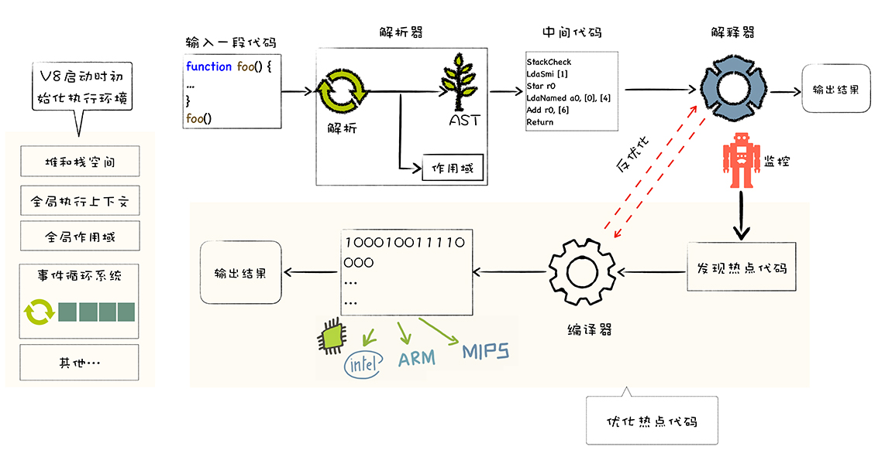
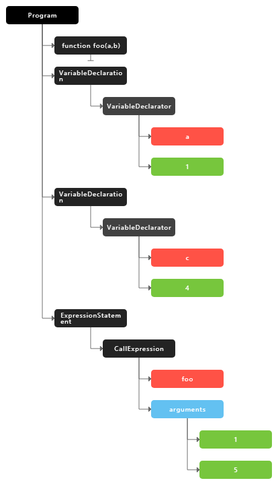
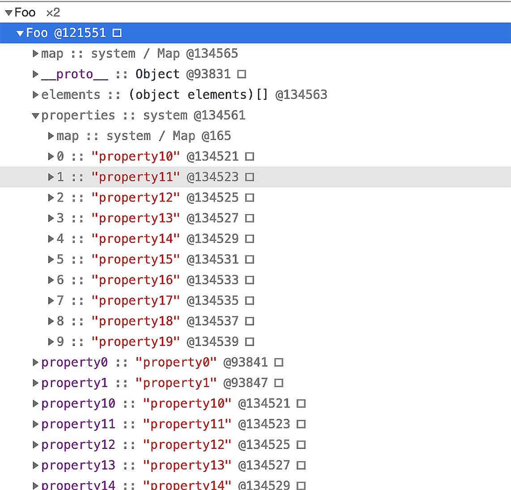

# V8 执行机制

[[toc]]

## V8 引擎

V8 是Chrome浏览器的JS引擎，像其它浏览器的JS引擎有：
- Microsoft IE/Edge浏览器的 Chakra。（在微软有一个类似Javascript的语言叫JScript）
- FireFox 浏览器的 SpiderMonkey,
- Safari 浏览器的 Javascript core
- Chrome 浏览器的 V8,

## JS引擎的作用

JavaScript 是一门高级语言，但是计算机能直接理解和执行的是机器指令码，也称机器码。

机器指令码是用于指挥计算机应该做的操作和操作数地址的一组二进制数，因为计算机最终能识别的只是0和1。

**JavaScript 引擎是一种用于将我们使用JavaScript语言编写的代码转换为计算机可读的机器指令码的虚拟机**，大白话讲就是一个翻译工具。

如果没有 JavaScript 引擎，您编写的代码对计算机来说简直是一堆“胡言乱语”。不仅仅是 JavaScript ，其他所有编程语言都需要一个类似的引擎，来将这些“胡言乱语”转换成对计算机有意义的机器指令码。

## JS 引擎转换JS代码遵循的规范：ECMAScript

JS 引擎是分析我们JS代码并将其翻译成机器码的工具。V8 是最受欢迎的 JavaScript 引擎之一，也是 Chrome 和 NodeJS 使用的引擎。它是用 C++（一种底层语言）编写的。

语言翻译要遵循语言的语法规范，ECMAScript标准就是JS的语言规范，该标准主要提供指导如何编写JS 引擎和 实现语言的所有语法规范。

## V8 的宿主依赖

有了语法规范，翻译机 V8 就可以开始翻译一段 JavaScript 代码了嘛？不，开始翻译工作前，至少得给翻译机提供工作环境和一些基础设施吧，比如一个办公桌和电源呢。

对 V8 来说，还需要宿主环境提供一个能够支持 V8 运行的环境，环境中需要提供一些支持 V8 运行的基础设施：

- 数据存取的内存空间：堆空间和栈空间
- 创建 JS 代码执行的全局执行上下文 和 全局作用域
- 宿主环境提供的扩展函数和对象
- 在渲染进程中提供一个 JS 运行的主线程
- 在主线程中构建事件循环系统
- 消息队列

### 什么是宿主环境

> 在生物学上，宿主是指为病毒等寄生物提供生存环境的生物，宿主有的自己的完整的代谢系统，而病毒则没有自己的代谢系统，也没有自己的酶系统，它只是由核酸长链和蛋白质外壳构成。因此，病毒想要生存，进行自我复制，就需要和宿主使用同一套代谢系统。<br>但是，如果病毒利用了太多的宿主细胞资源，也会影响到细胞的正常活动，另外，当病毒离开了宿主细胞，就不能进行任何生命活动，也不能独立自我繁殖的化学物质。

可以把 V8 和浏览器的渲染进程的关系看成病毒和宿主细胞的关系，浏览器提供支持 V8 运行的基础设施，而 V8 的核心功能是实现了 ECMAScript 标准，定义了一些对象和一些核心的函数，这包括了 Object、Function、String。除此之外，V8 另一功能是提供了垃圾回收器、协程等基础内容。

同样的，V8 自身实现的这些功能需要宿主环境的配合才能完整执行，离开宿主环境无法单独运行。并且，如果 V8 使用不当，比如不规范的代码触发了频繁的垃圾回收，或者某个函数执行时间过久，这些情况都会导致 V8 的执行占用宿主环境的主线程，从而影响到程序的执行效率，甚至导致宿主环境的卡死。

> 除了浏览器可以作为 V8 的宿主环境，Node.js 也是 V8 的另外一种宿主环境，它提供了不同的宿主对象和宿主的 API，但是整个流程依然是相同的，比如 Node.js 也会提供一套消息循环系统，也会提供一个运行时的主线程。

## V8 的运行过程



V8 执行一段 JS 代码，简单说需要经过两个阶段：
- 编译阶段，也叫解析阶段，即**解析器**作用的过程
- 执行阶段，即**解释器**和**编译器**作用的过程

所有 JavaScript 引擎都有相同的架构：那就是拥有一个解析器和某种解释器/编译器流程。

> 编译阶段的编译指的是将源代码编译为字节码的过程，区别于执行阶段中编译器编译成机器码的过程

线性展开上面两个阶段的过程，就是 JS Engine 内部的工作流程图：


下面对照流程图，解释下每个阶段的概念

## 解析阶段

### 词法分析 tokenize -> 词元 token

- 词法分析 tokenize：就是将一行行的源码拆解成一个个词元 token。
- 词元 token：指的是语法上不可能再分的、最小的单个字符或字符串。


分解 token 示意图从图中可以看出，通过`var myName = “极客时间”`简单地定义了一个变量，其中关键字“var”、标识符“myName” 、赋值运算符“=”、字符串“极客时间”四个都是 token，而且它们代表的属性还不一样。

### 语法分析 parse -> 语法树 AST

语法分析，也是解析 parse 词元的过程，将上一步生成的 token 数据，根据语法规则转为 AST。（通过各种 JavaScript 关键字来识别，比如var function let const class等）。如果源码符合语法规则，这一步就会顺利完成。但如果源码存在语法错误，这一步就会终止，并抛出一个“语法错误”。

在这个过程中，还会创建**执行上下文**，执行上下文就是代码执行的环境，环境中保存着代码执行要用到的信息，比如变量信息、函数信息、this对象、指向外部引用的作用域链对象等。我们会在[执行上下文](/Browser/js_execute)中重点讲解。

### 抽像语法树 AST：Abstract Syntax Tree 

AST：它将源代码语法结构抽象为以树状结构表示。

高级语言是开发者可以理解的语言，但是让编译器或者解释器来理解就非常困难了。对于编译器或者解释器来说，它们可以理解的就是 AST 了。所以无论你使用的是解释型语言还是编译型语言，在编译过程中，它们都会生成一个 AST。这和渲染引擎将 HTML 格式文件转换为计算机可以理解的 DOM 树的情况类似。

结合下面这段代码来直观地感受下什么是 AST：

```js
var myName = "极客时间"
function foo(){ 
    return 23;
}
myName = "geektime"foo()
```
这段代码经过[javascript-ast](https://resources.jointjs.com/demos/javascript-ast)站点处理后，生成的 AST 结构如下：


从图中可以看出，AST 的结构和代码的结构非常相似，其实你也可以把 AST 看成代码的结构化的表示，编译器或者解释器后续的工作都需要依赖于 AST，而不是源代码。

AST有着广泛的应用，比如：
- Babel 的工作原理就是先将 ES6 源码转换为 AST，然后再将 ES6 语法的 AST 转换为 ES5 语法的 AST，最后利用 ES5 的 AST 生成 JavaScript 源代码。
- ESLint 是一个用来检查 JavaScript 编写规范的插件，其检测流程也是需要将源码转换为 AST，然后再利用 AST 来检查代码规范化的问题。

### 惰性解析

所谓惰性解析是指解析器在解析的过程中，如果遇到函数声明，那么会跳过函数内部的代码，并不会再为内部函数生成 AST 和字节码，而仅仅生成顶层代码的 AST 和字节码，而将函数体代码作为值存到函数对象的`[[code]]`属性中。只有当执行到该函数时，再重复上述过程执行解析和执行。

所以说 JS 代码是分段执行的，这个分段的理解是以函数分块。

V8 并不是一次性将所有的 JavaScript 解析为中间代码，这主要是基于加快速度和节省内存考虑：

首先，如果一次解析和编译所有的 JavaScript 代码，过多的代码会增加编译时间，这会严重影响到首次执行 JavaScript 代码的速度，让用户感觉到卡顿。因为有时候一个页面的 JavaScript 代码都有 10 多兆，如果要将所有的代码一次性解析编译完成，那么会大大增加用户的等待时间；

其次，解析完成的字节码和编译之后的机器代码都会存放在内存中，如果一次性解析和编译所有 JavaScript 代码，那么这些中间代码和机器代码将会一直占用内存，特别是在手机普及的年代，内存是非常宝贵的资源。

看下示例：

```js

function foo(a,b) {
    var d = 100
    var f = 10
    return d + f + a + b;
}
var a = 1
var c = 4
foo(1, 5)
```
当把这段代码交给 V8 处理时，V8 会至上而下解析这段代码，在解析过程中首先会遇到 foo 函数，由于这只是一个函数声明语句，V8 在这个阶段只需要将该函数转换为函数对象，将函数体存到函数对象的`[[code]]`属性中。并有没有解析和编译 foo 函数内部的代码，所以也不会为 foo 函数的内部代码生成抽象语法树。


然后继续往下解析，由于后续的代码都是顶层代码，所以 V8 会为它们生成抽象语法树，最终生成的结果如下所示：


代码解析完成之后，V8 便会按照顺序自上而下执行代码，首先会先执行“a=1”和“c=4”这两个赋值表达式，接下来执行 foo 函数的调用，过程是从 foo 函数对象中取出函数代码，然后重复上一个过程，V8 会先编译 foo 函数的代码，编译时同样需要先将其编译为抽象语法树和字节码，然后再解释执行。

### 预解析：支持函数闭包 closure

不过在 V8 实现惰性解析的过程中，需要支持 JavaScript 中的闭包特性，这会使得 V8 的解析过程变得异常复杂。

我们先来看看闭包的特性，然后再来分析为什么闭包影响到了 V8 的解析流程。

- JavaScript 语言允许在函数内部定义新的函数
- 内部函数中可以访问外层父函数中定义的变量，但外层函数不能访问内层函数的变量
- 因为函数是一等公民，所以函数可以作为返回值

```js
// 一个经典的闭包示例
function foo() {
    var d = 20
    return function inner(a, b) {
        const c = a + b + d
        return c
    }
}
const f = foo()
```
根据 JS 代码运行时调用栈的情况，当 foo 函数 return 返回 inner 函数之后，foo 函数的执行上下文出栈。

按照常规的做法：V8 需要对 foo 函数分配的执行上下文销毁，以便执行垃圾回收，收回内存空间。

但是由于存活的函数 inner 依然引用了 foo 函数中的变量 d，这样就会带来两个问题：

- 当 foo 执行结束时，变量 d 该不该被销毁？如果不应该被销毁，那么应该采用什么策略？
- 如果采用了惰性解析，那么当执行到 foo 函数时，V8 只会解析 foo 函数，并不会解析内部的 inner 函数，那么这时候 V8 要怎么知识 inner 函数中是否引用了 foo 函数的变量 d？

对于第二个问题的答案是：V8 引入预解析器。

当解析顶层代码的时候，遇到了一个函数，那么预解析器并不会直接跳过该函数，而是对该函数做一次快速的预解析，其主要目的有两个：

- 一个是判断当前函数是不是存在一些语法上的错误
- 另外的一个重要的功能就是检查函数内部是否引用了外部变量，如果引用了外部的变量，预解析器会将栈中的引用的值复制到堆中，创建一个`closure`闭包环境来保存这个引用变量，在下次执行到该函数的时候，将这个`closure`闭包环境作为函数执行上下文中的一部分。变量查找顺序：词法环境 -> 变量环境 -> 闭包环境，这样就解决了闭包所带来变量引用的问题。

所以在上述在执行 foo 函数的阶段，虽然采取了惰性解析，不会解析和执行 foo 函数中的 inner 函数，但是 V8 还是会通过预解析器判断 inner 函数是否引用了 foo 函数中的变量，来解决闭包带来的变量引用问题。

## 执行阶段

[JavaScript 引擎中的解释器/编译器流程](https://zhuanlan.zhihu.com/p/38202123)

### 字节码 ByteCode

字节码就是介于 AST 和机器码之间的一种代码。字节码需要通过解释器将其转换为机器码后才能执行。


从图中可以看出，机器码所占用的空间远远超过了字节码，所以使用字节码可以减少系统的内存使用。

> 其实一开始 V8 并没有字节码，而是直接将 AST 转换为机器码，由于执行机器码的效率是非常高效的，所以这种方式在发布后的一段时间内运行效果是非常好的。但是随着 Chrome 在手机上的广泛普及，特别是运行在 512M 内存的手机上，内存占用问题也暴露出来了，因为 V8 需要消耗大量的内存来存放转换后的机器码。为了解决内存占用问题，V8 团队大幅重构了引擎架构，引入字节码，并且抛弃了之前的编译器，最终花了将进四年的时间，实现了现在的这套架构。

### 机器码 machine code

计算机能直接理解和执行的代码是机器指令码，也称机器码。

机器指令码是用于指挥计算机应做的操作和操作数地址的一组二进制数，因为计算机最终能识别的只是0和1。

### 解释器（Interpreter）和 编译器（Compiler）

通常，将代码转换成机器可读代码的方法有两种：
- Interpreter 逐行将源代码转换为等效的机器代码，并立即执行。在每次运行时都需要通过解释器对程序代码进行动态解释和执行。例如 JavaScript
- Compiler 在一开始就读取您的整个代码，经过编译器的编译，并且编译之后会直接保留机器能读懂的机器码二进制文件。编程过程中可以对代码进行优化处理。这样每次运行程序时，都可以直接运行该二进制文件，而不需要再次重新编译了。例如 C/C++、GO 等都是编译型语言。


**两者优缺点：**

看下例子：
```js
// 将两个数字相加并返回总和。
function add(a, b) {
    return  a+b
}

// 循环调用了 add 函数1000次求和输出
for ( let i = 0; i < 1000; i++) {
   let ret = add(1 + 1)
   console.log(ret)
}
```
- Interpreter 接收上面的代码后，它将逐行读取并立即执行代码，直到循环结束。它的工作仅仅是实时地将代码转换为我们的计算机可以理解的机器码。代码中函数 add 被调用了1000次，虽然它的输出保持不变，但是 解释器Interpreter 还是会逐行执行，整体会显得比较慢。
- Compiler，它会先完整地读取整个程序，对我们要执行的代码进行分析，并生成电脑可以读懂的机器语言。在同样的情况下，Compiler 可以通过用2代替循环（因为 add 函数每次都是执行1 + 1）来进行一些优化。Compiler 最终给出的优化代码可以在更短的时间内执行完成。

所以两种的优缺点是：
- Interpreter 的优点是无需等待编译即可立即执行代码，但不会进行优化。这对在浏览器中运行 JS 提供了极大的便利，因为所有用户都不想浪费时间在等待代码编译这件事上。但是，当有大量的 JS 代码需要执行时会运行地比较慢。
- Compiler 虽然需要花费一些时间来编译代码，但是会生成对执行时更优的代码。

因此，考虑到编译器和解释器的优缺点，我们是不是可以同时利用两者的优点呢？

同时利用解释器和编译的器的技术称为**即时编译（JIT）**。通俗讲就是在解释器运行的同时执行编译器的工作。Java 和 Python 的虚拟机也都是基于这种技术实现的。

具体到 V8，就是指解释器 Ignition 在解释执行字节码的同时，通过分析工具收集代码信息，当它发现某一部分代码被频繁执行（称为热点代码HotSpot）就会交与编译器 TurboFan 把热点的字节码转换为机器码，并把转换后的机器码保存起来，以备下次使用。
> V8 引擎对解释器和翻译器的取名很有意思。解释器 Ignition 是点火器的意思，编译器 TurboFan 是涡轮增压的意思，寓意着代码通过点火器慢慢发动，一旦代码变热，涡轮增压介入，其执行效率随着执行时间越来越高效率，因为热点代码都被编译器 TurboFan 转换了机器码，直接执行机器码就省去了字节码“翻译”为机器码的过程。


### 变量查找

变量查找可以分为两部分：自身执行上下文中查找和沿作用域链到外部执行上下文中查找。

具体涉及到执行上下文中的词法环境、变量环境、和外部环境引用形成的作用域。更具体的内容可以查看[执行上下文](/Browser/Render/js_execute.html)。


这里给出一个例子：

```js
function bar() {
    var myName = "极客世界"
    let test1 = 100
    if (1) {
        let myName = "Chrome浏览器"
        console.log(test)
    }
}
function foo() {
    var myName = "极客邦"
    let test = 2
    {
        let test = 3
        bar()
    }
}
var myName = "极客时间"
let myAge = 10
let test = 1
foo() // 1
```
现在是执行到 bar 函数的 if 语块之内，需要打印出来变量 test，那么就需要查找到 test 变量的值，其查找过程已经在上图中使用序号 1、2、3、4、5 标记出来了。

- 首先在当前bar函数的执行上下文中的词法环境，此词法环境栈结构有两层，对应当前bar函数作用域和if块级作用域，按从上到下的块作用域查找，再到变量环境中查的。
- 在 bar 函数的执行上下文中的词法环境和变量环境都没有找到，所以根据词法作用域的规则，outer变量对应着全局作用域，下一步就在 bar 函数的外部作用域中查找，也就是全局作用域。


### 对象属性查找

同变量查找一样，对象属性查找也可以分为两部分：对象自身结构中查找和沿原型链在原型对象上查找。

这里涉及到对象在内存的存储的结构，以及 V8 为对象存储所做的各种优化，也涉及到数据结构中线性的数组结构和非线性的哈希字典对应操作场景的优势。

具体可以查看[数据类型-对象](/FE-Language/ES/type-6-object.html)。

这里简单贴个图说明下：

对象模型主要由三个部分构成，分别是隐藏类（Hidden Class），Property 还有 Element。

- 隐藏类（Hidden Class）: 描述对象结构
- 序列属性 elements
  - FastElements
  - SlowElements
- 命名属性 properties
  - 对象内属性（in-object properties）
  - 快属性（fast properties）
  - 慢属性（slow properties）



总结起来就是：
- 如果是序列化属性，在对象的模型中的 Elememts结构中查找
    - 序列化属性中，如果是紧密数组，则使用 fastElements ，即线性数组结构存取
    - 序列化属性中，如果是有很空洞的稀疏数组，则使用 showElements，即非线性的哈希结构存取
- 如果是命名属性，数量不多（V8 目录是10个以内，则在对象内属性（in-object properties）
- 如果超过10个，则超出部分存取中 properties 结构中。
    - 此时，如果数量较少，则使用快属性（fast properties）
    - 如果数量较多，则使用慢属性（slow properties）
- 如果属性在对象自身中查找不到，则沿原型链查找。
- 对象声明的方式和delete操作，都会影响隐藏类的结构变化。即 transition 链或树结构变化。


JavaScript 是一门解释型语言吗？<br>
> JavaScript 是，但不完全是一门解释型语言。Brendan Eich 最初是在 JavaScript 的早期阶段在网景浏览器中创建 JavaScript 引擎 “ SpiderMonkey” 的。该引擎只有一个解释器Interpreter 告诉浏览器该怎么执行代码。但是现在我们的引擎不仅包括了 Interpreter，还有 Compiler。我们的代码不仅可以被转换成 ByteCode，还可以被编译输出优化后的代码。因此，从技术上讲，这完全取决于引擎是如何实现的。


## 参考资料

[V8 是怎么跑起来的 —— V8 中的对象表示](https://www.cnblogs.com/chargeworld/p/12236848.html#top)<br>
[JavaScript 引擎基础：Shapes 和 Inline Caches](https://zhuanlan.zhihu.com/p/38202123)<br>
[快属性和慢属性：V8采用了哪些策略提升了对象属性的访问速度？](https://time.geekbang.org/column/article/213250)
[从Chrome源码看系列](https://zhuanlan.zhihu.com/p/26169639)<br>
[V8 Object 内存结构与属性访问详解](https://zhuanlan.zhihu.com/p/24982678)<br>
[JS 类型对象的内存布局总结](https://www.anquanke.com/post/id/185339)<br>
[再谈js对象数据结构底层实现原理-object array map set](https://www.cnblogs.com/zhoulujun/p/10881639.html)<br>
[探究JS V8引擎下的“数组”底层实现](https://mp.weixin.qq.com/s/np9Yoo02pEv9n_LCusZn3Q)<br>
[数组在 V8 中的元素种类及性能优化](https://zhuanlan.zhihu.com/p/29638866)--避免空洞数组（稀疏数组）和 类数组转为数组操作更优
