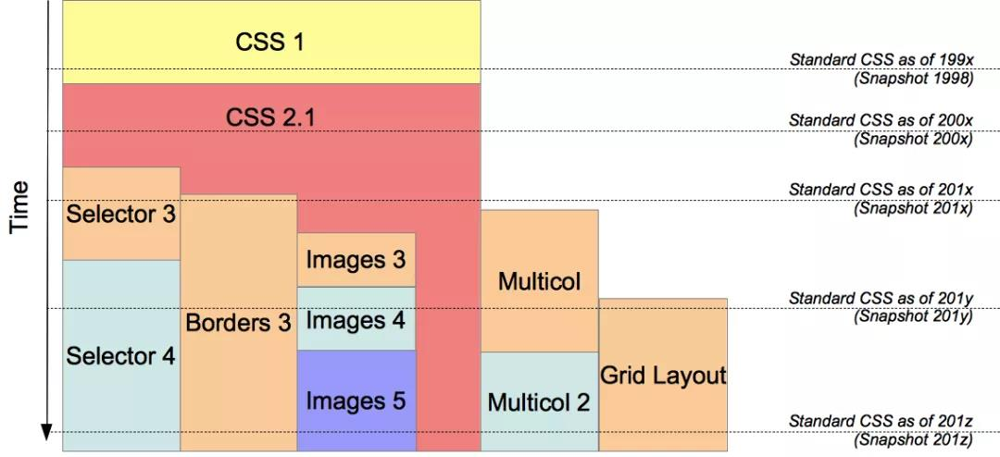
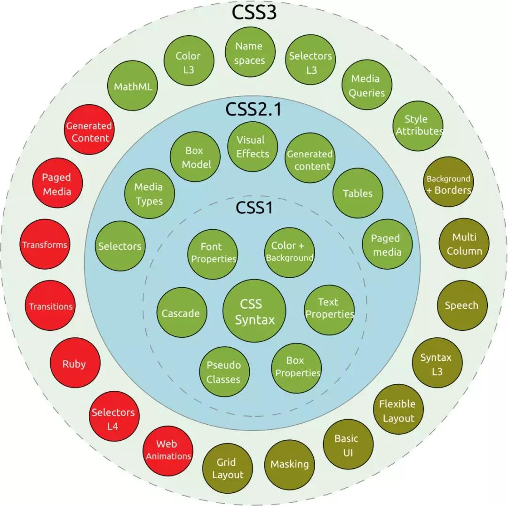

# CSS

## CSS 历史

CSS 是开放网络的核心语言之一，由 W3C 规范 实现跨浏览器的标准化，但CSS并不是最初www系统规范文档之一。

HTML 和 CSS 是那么密不可分，以至于你可能会觉得它们是一起出现的。实际上，自 1989 年 Tim Berners Lie 发明互联网后的多年中，这个世界上都不存在一个名为 CSS 的事物，Web 的原始版本根本就没有提供这种装饰网页的方法。

HTML 规范虽然规定了网页中的标题、段落应该使用的标签，但是没有涉及这些内容应该以何种样式(比如大小、位置、间距、缩进等属性)呈现在浏览器中。
不过，在随后仅短短10年后，CSS就被一个现代的 Web 社区全面采用，这期间的发生了一系列有趣的故事，有兴趣的可以看一下 [A Look Back at the History of CSS](https://thehistoryoftheweb.com/look-back-history-css/)。

### CSS1

1994年，Håkon Wium Lie (哈肯·维姆·莱) 和 Bert Bos (伯特·波斯) 合作设计CSS。他们在1994年首次在芝加哥的一次会议上第一次展示了CSS的提议。

1996年12月，发表的 CSS1，第一版主要规定了选择器、样式属性、伪类 、对象几个大的部分。

### CSS2

CSS2 在 1998 年 5月 由 W3C 发布，CSS2 规范是基于 CSS1 设计的，扩充和改进了很多更加强大的属性。包括选择器、位置模型、布局、表格样式、媒体类型、伪类、光标样式。

Cascading Style Sheets Level 2 Revision 1，通常被称为“ CSS 2.1” ，修复了 CSS 2中的错误，删除了支持不良或不能完全互操作的特性，并为规范增加了已经实现的浏览器扩展。为了遵守 W3C 标准化技术规范的过程，CSS 2.1 在 Working Draft (WD) 状态和 Candidate Recommendation (CP) 状态之间来回了很多年。

CSS 2.1于 2004 年 2 月 25 日首次成为 Candidate Recommendation (CR)标准，但在 2005 年 6 月 13 日又回到 Working Draft (WD) 中进行进一步审查。它于 2007 年 7 月 19 日回到 Candidate Recommendation (CP) 标准，然后在 2009 年更新了两次。然而，由于作出了修改和澄清，它再次回到了2010年12月7日的 Last Call Working Draft 。

### CSS3

CSS3 是层叠样式表（Cascading Style Sheets）语言的最新版本，旨在扩展CSS2.1。

CSS Level 2 经历了 9 年的时间（从 2002 年 8 月到 2011 年 6 月）才达到 Recommendation（推荐） 状态，主要原因是被一些次要特性拖了后腿。为了加快那些已经确认没有问题的特性的标准化速度，W3C 的 CSS Working Group  作出了一项被称为 Beijing doctrine 的决定，将 CSS 划分为许多小组件，称之为模块。这些模块彼此独立，按照各自的进度来进行标准化。其中一些已经是 W3C Recommendation 状态，也有一些仍是 Early Working Drafts（早期工作草案）。当新的需求被肯定后， 新的模块也会同样地添加进来。

所以从版本来讲，已经不存在CSS4了，W3C会按模块级别数（level）发布标准，在每个时间点上为 CSS 标准定义一个 snapshots（快照），列出各个成熟的模块的级别。W3C 会定期按年份发布这些 snapshots，如 2007, 2010, 2015 或 2017。

有一张图可以更加直观的表示当前 CSS3 Modules 的分类和状态： 

<!--  -->

> 补充：W3C 规范制定流程

按照 W3C 的 Process Document，一个推荐标准的发展需要通过不同的阶段。

其中几个主要的阶段分别为：
- WD 工作草案（Working draft）
- CR 候选推荐标准（Candidate recommendation）
- PR 提案推荐标准（recommendation）
- REC W3C推荐标准（W3C recommendation）

