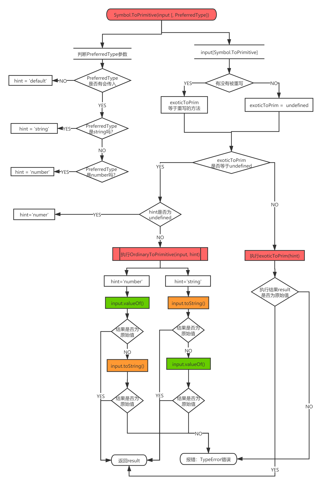
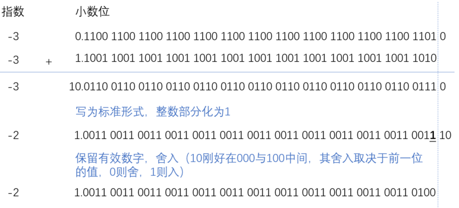
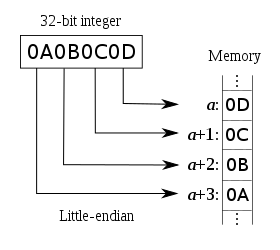

# 数据及数据类型

[[toc]]

再次回顾下程序的概念：程序是由数据和指令组成的。所以在进一步讲解JS语法之前，我们先要明白数据是如何在计算机存储并参与计算的。

## 数据在计算机中是以二进制数表示的

> 下面内容引用自《程序是如何运行的》

计算机的核心是由IC（ Integrated Circuit 集成电路）电子部件组成的。而IC电路的所有引脚的直流电压只有0V和5V两种高低电压状态。也就是说IC中的一个引脚只能表示两个状态。IC的这个特性刚好和二进制的计数方式相吻合，所以计算机的信息数据只能用二进制计数规则来处理。

> 当然二进制的计数方式并不是专门为计算机的IC电路设计的。二进制运算法则的提出者是德国数学家莱布尼兹，[二进制运算法则的历史起源](https://zhidao.baidu.com/question/1177745006240062179.html)

计算机在处理二进数的几种单位：

- 位（bit），也就是 Binary digit的缩写，表示二进数中的一位，是计算机中数据的最小单位。
- 字节（Byte），8位二进数被称为一个字节，是最小计量单位（具体参考字符存储一节说明）。

早期计算机中的IC电路设计中使用8个引脚的微处理器来处理数据，也就是8位CPU一次性可以处理8位二进制数，所以字节是计算机的基本处理单位，同时也是计算机的基本计量单位，内存和磁盘都使用字节来表示存储数据的容量和读写数据的速度。`1GB = 1024MB = 1024*1024B = 1024*1024*8bit`。

随着现代计算机硬件的发展，计算机微处理器从8位、32位，到现在普遍的64位，具有64个引脚的IC用于信息的输入和输出，也就是说现代计算机CPU一次可以处理64位（8个字节）的二进制序列。

计算机内部只用进二制数来表示信息，但计算机不会区分这个二进制序列是数值还是文字又或是某种图片数据。某个二进制序列到底代表什么只能由编写的程序来控制，所以在程序中需要定义数据的类型。

比如二制数`01000001`，可以视为纯粹的数值（十进制数65）进行算术运算如加减乘除，也可以视为是字母`A`显示（ASCII编码65），实际到底是以数值进行计算还是以文本进行显示，就需要依据程序定义这个数据时指定的类型来处理。


## 数据类型

数据类型是程序预设的一组定义数据存储方式和存储空间的规则。

定义了数据类型，这样储存数据时需要向系统申请的内存空间的大小就可以确定了，并且也确定了该类型数据系统运算的逻辑规则。比如number数值类型的数据需要在栈内存中开放64位（8个字节）空间来存放数据的二进制序列,并且以双精度浮点数的规则表示数值大小。

根据语言设定的数据类型规则，数据存储的内存空间由系统自动分配和自动释放。这样带来的好处就是，内存可以及时得到回收，更加容易管理内存空间。比如基本类型（原始类型）数据存储在栈空间中，引用类型（对象类型）数据存储在堆空间中并把堆空间的引用地址指针存储在栈空间中。以比如变量值为null时会被垃圾回收（GC），释放内存空间。


JavaScript中定义了8种数据类型：分为两大类：基本类型和引用类型

- 7种基本类型（也称原始类型）：
  1. Null类型： 值为：null
  1. Undefined类型： 值为undefined
  1. Boolean 布尔值：只有true / false
  1. Number 数值：123（十进制） 056（八进制） 0xff（十六进制）
  1. String 字符串: 'abc'
  1. Symbol类型：是唯一且不可改变的一个值。(ES6新增)
  1. BigInt大整数：可以安全地存储和操作任意精度的大整数，甚至可以超过数字的安全整数限制。（ES10新增）
- 引用类型值（也统称为对象类型Object，包括Object / Array / RegExp / Date）

在 JavaScript 中，数据类型在底层都是以二进制形式表示的，如下所示：

- 000 - 对象，数据是对象的应用
- 001 - 整型，数据是31位带符号整数（语言内部使用，比如数组索引值、位操作符时）
- 010 - 双精度类型，数据是双精度数字
- 100 - 字符串，数据是字符串
- 110 - 布尔类型，数据是布尔值

> 类型标识的二进制前三位为 0 会被 typeof 判定为对象类型，而null值都是0，所以`typeof null === 'object'`

### 基本类型和引用类型的区别

基本类型又称原始类型，引用类型又称复杂类型或对象类型。

主要区别为以下几点：

1. 内存的分配不同
  - 基本类型： 数据存放在栈内存中，它们是按值存放的
  - 引用类型： 数据存放在堆内存当中，然后将堆内存地址存入在栈内存中，即它们是按引用地址存放的

2. 访问机制不同
  - 基本类型：数据是按值访问
  - 引用类型：数据是按引用地址访问。在访问一个对象时，需要先从栈中获得对象的地址指针，然后通过地址指针找到堆中的所需要的数据。

3. 操作机制不同
  - 基本数据类型：在赋值或参数传递时，是原始值的拷贝。比如`a=b`是将b中保存的原始值的副本赋值给新变量a，a和b完全独立，互不影响。
  - 复杂数据类型：在赋值或参数传递时，是数据堆内存地址的复制，指向的堆内存中的同一份数据。比如`a=b`将b保存的对象内存的引用地址赋值给了新变量a; 此时a和b指向了同一个堆内存地址，其中一个值发生了改变，另一个也会改变。
  ```js
  // 基本类型
  let a1 = 10
  let b1 = a1
  console.log(a1, b1) // 10 10
  b1 = 20
  console.log(a1, b1) // 10 20
  
  // 引用类型
  let a2 = {
    age: 10
  }
  let b2 = a2;
  b2.age = 20;
  console.log(a2.age); // 20
  ```

### 静态类型和动态类型

在编程语言的语义中，静态一般是指“编译时”，动态指的是“运行时”。

静态类型是指变量在代码编译时就能确定数据类型，如C或类C的高级语言中，变量在声明时就指定了数据类型，之后数据类型不可变，会在编译期间对数据类型进行检查。

动态类型是指变量的数据类型是在代码执行到那一刻确定的。并且在代码执行期间同一变量可以被赋予不同的类型的数据。

### 强类型和弱类型

强类型语言和弱类型语言主要指是否允许不兼容的数据类型进行运算。

强类型语言：不同类型的数据是不可以进行运算的，由错误类型值构成的表达会导致错误，如`7*false`会报错。C或类C的高级语言属强类型语言。

但JS属于弱类型语言，两种不同类型的数据在运算时JS语言会在底层调用类型转换方法进行类型的隐式转换，来使得两个数据可以进行运算。

所以总结：
1. 静态语言和动态语言的区分主要是编译时确定类型还是运行时确定类型。
1. 强类型语言和弱类型语言指是否允许不兼容的类型进行运算。
1. JavaScript是一门动态的弱类型语言，指的就是数据类型是在运行时根据赋值动态确定的，并且两种不同类型的数据在运算时JS语言会在底层调用对应类型的转换方法进行数据类型的隐式转换。

### 原始值和包装对象

要理解JS的隐式转换，我们就要先理解原始值和包装对象的概念。

#### 原始值
什么是原始值？我们先看下JS中引用类型数据的定义：

```js
// 对象
let obj = {
  str: 'abc',
  num: 123,
  isTure: false,
  anyValue: undefined,
  subObj: null
}

// 数组
let arr = ['abc', 123, false, true, undefined, null, obj]
```

上面代码是直接使用字面量的方式声明了两个变量，一个是对象变量obj，一个是数组对象arr。从对象的属性值，和数组元素值可以看出来，这些值都是基本类型的数据。所以不管是对象还是数组，或者更大范围说引用类型的数据不过是对基本类型的值作了一层包装表示成另一种形式。

所以相对于引用类型来说，像undefined / null / true / false / 123 / 'abc'这些值都是原始值，值最原本的样子。

所以JS中对值的划分也就非常简单明了了：原始值也就是上面基本类型能赋予的值，其它值都是对象。

所以JS中的数据类型也可以直接划分为原始值类型和对象类型。更直接点说JS中值就分为原始值和对象。

所以说JS中一切都是对象也是不严谨的，之所以这么说是因为原始值也可以转为包装对象表示。

#### 包装对象

包装对象也是对象，对象的产生都是通过构造函数生成的。所以对于布尔值、数值和字符串，JS提供了三个对应的构造函数`Boolean()` `Number()` `String()`，这三个构造函数有两个作用：

- 作为构造函数，生成包装对象，对上述三个构造函数使用`new`产生出来的实例对象就叫做原始值的包装对象。
- 作为单纯的函数，将值转换为相应的原始值。

**包装**

>常见的其它叫法，如装箱操作和装包操作指的就是生成包装对象。这里写包装主要是想对应包装对象

如果要把一个原始值包装成一个对象，可以使用对应类型的构造函数生成，比如下面代码：
```js
// 把一个布尔类型的原始值包装成对象类型
let wrapBooleanTrue = new Boolean(true)
let wrapBooleanFalse = new Boolean(false)
let wrapNumber = new Number(123)
let wrapString = new String('abc')

console.log(typeof true) // boolean
console.log(typeof wrapBooleanTrue) // object
console.log(typeof wrapNumber) // object
console.log(typeof wrapString) // object
```
将基本类型的原始值包装成对象，除了对应类型的构造函数外，还可以直接调用`Object()`对象的构造函数，结果和上面一样。

```js
new Boolean(true) instanceof Boolean // true
Object(true) instanceof Boolean // true

new Boolean(123) instanceof Number  // true
Object(123) instanceof Number  // true

new String('abc') instanceof String  // true
Object('abc') instanceof String  // true
```
每一个原始值的包装对象都有个 `[[PrimitiveValue]]` 内部属性，他会显示该对象内部指向的原始值。可以在控制台输入`new Boolean(123)`查看。


**原始值从包装对象原型上借调方法**

已经有了原始值表示，为什么还要在程序语言中设计邮包装对象这种语法形式呢？

主要原因是，原始值是没有私有方法的，对原始值的操作都会从各自的包装对象中借调方法。准确上来说是从各自类型的构造函数的原型上借调方法。

比如我们常见的一些操作：
```js
console.log(1234.54656.toFixed(2))  
console.log('abc'.toLocalString())
```
可以在按制台打印出原型上的属性和方法：

```js
console.log(Boolean.prototype) // 布尔值基本没有自定义方法， toString() valueOf()是从Object.prototype上继承的，不过进行了改写
console.log(Number.prototype) // toFixed() toExponential() toPrecision() toLocaleString()
console.log(String.prototype) // charAt() indexOf() replace() slice()等等
```
这个调用的过程具体是怎么样的呢？

在非严格模式下，原始值会在执行过程中调用对应的类型的构造函数生成包装对象，然后调用包装对象继承的方法，调用结束后拆包装恢复原始值。

相当于运行了下面的伪代码：
```js
// 'abc'.toLocalString()
let strObj = new String('abc')
let ret = strObj.toLocalString()
strObj = null
```
上面的伪代码过程同样适用于布尔值和数值。

下面代码可以验证下：
```js
// 在构造函数原型上自定义一个方法，打印了当前调用对象this
String.prototype.testMethod = function() {
  console.log(typeOf this)
  console.log(this instanceof String)
}

'abc'.testMethod() // object true
```
> `use strict` 严格模式下有所有不同，但结果相同。

**包装对象与普通对象有什么不同**

包装对象与普通对象的主要区别在于对象的生命周期。

使用new主动创建的引用类型实例在执行离开当前作用域之前一直保存在内存中。但系统自动创建的包装对象则只存在于一行代码的执行瞬间，然后立即被销毁。比如上面的伪代码。
> 参考《JavaScript高级程序设计》P119
```js
let wrapString = new String('abc') // 包装对象wrapString一直都可以使用，除非手动置空 wrapString = null
'abc'.toLocalString() // 隐式创建包装对象，调用完toLocalString()方法立即被销毁
```
日常实际编码中并不需要我们自己主动去创建包装对象，只需要像对象一样调用其拥有的属性和方法即可。但需要明白背后发生了什么。

### 数据类型的隐式转换

从上面我们已经讲了，JS是一门弱类型语言，两种不同类型的数据在运算时会在底层进行数据类型的隐式转换，来使得两个数据可以进行运算。

```js
8 * false = 0
8 * true = 8
'2' * 2 = 4
'2' + 2 = '22'
[] == false // 返回 true
```
上面的现象一部分原因与运算符规则有关，更大一部分原因是与数据类型的隐式转换有关。
> 运算符决定左右运算子需要的是数值还是字符串，特别是对象转原始值时决定是先调用valueOf还是toString方法，具体见下面对象转原始值的`ToPrimitive()`方法的执行逻辑

隐式转换的目标是因为数据的操作最终是原始值的操作，更多场景下，是数值的操作。所以常见的两种隐式转换是对象类型需要转为原始值，或者非数值原始值需要转为数值的原始值。

> 这里将对象转为原始值常称为拆箱操作或拆包装，呼应上面生成包装对象的装箱操作。

所以在JS中数据类型的隐式转换有两个关注点：

- 原始值类型的隐式转换
- 对象类型的隐式转换

#### 原始值类型的隐式转换

上面讲包装对象时提到三个构造函数`Boolean()` `Number()` `String()`的另一作用就是被当作纯函数使用，将值转换为相应的原始值。

- Boolean() ：将传入参数转成布尔类型的原始值

  - 将undefined / null / false / 0 / NaN / ''这些假值转为false
  - 除此之外为true，（包括所有对象）

```js
Boolean(undefined) // false
Boolean({}) // true
Boolean(new Boolean(false)) // true，并不是false, 因为new Boolean(false)生成的是一个包装对象，所以对布尔值不能用这种方式拆包装
```

- Number() 将传入的参数转成数值类型的原始值

  - undefined => NaN
  - null => 0
  - false => 0
  - true => 1
  - 字符串会被解析，'12' => 12, '1bc' => NaN
  - 对象会选调用`toPrimitive`方法转换成原始值（具体见下面对象类型的隐式转换），然后依上面规则转换数值。

```js
Number(undefined) // NaN
Number('123') // 123
Number('1bc') // NaN
Number(new Number(123)) // 123
Number({}) // NaN

let obj = {
  [Symbol.toPrimitive](hint) {
    if (hint == 'number') {
      return 123;
    } else {
      return 'abc'
    }
  }
}
console.log(Number(obj)) // 123
```
- String() 将传入的参数都以字符串的表示的原始值

同样对象类型会先调用`toPrimitive`方法转换成原始值（具体见下面对象类型的隐式转换），然后再依下面原始值规则转换。
```js
String(true) // 'true'
String(false)  // 'false'
String(123) // '123'
String(null) // 'null'
String(undefined) 'undefined'
String({}) // '[object object]'

let obj = {
  [Symbol.toPrimitive](hint) {
    if (hint == 'number') {
      return 123;
    } else {
      return 'abc'
    }
  }
}
console.log(String(obj)) // abc
```

#### 对象类型的隐式转换

讲对象类型隐式转换，就需要知道所有对象都继承的三个重要的对象原型方法：`valueOf()` `toString()` `Symbol.toPrimitive()`

**toString()**

[MDN toString()](https://developer.mozilla.org/zh-CN/docs/Web/JavaScript/Reference/Global_Objects/Object/toString)

`obj.toString()`方法返回一个表示该对象原始值的字符串。默认情况下，`toString()` 方法被每个对象继承。如果此方法在自定义对象中未被覆盖，`toString()` 返回 "[object type]"，其中 type 是对象的类型。
```js
Object.prototype.toString.call(undefined)  // "[object Undefined]"
Object.prototype.toString.call(null)  // "[object Null]"
Object.prototype.toString.call(false) // "[object Boolean]"
Object.prototype.toString.call(123) // "[object Number]"
Object.prototype.toString.call('abc') // "[object String]"
Object.prototype.toString.call({}) // "[object Object]"
Object.prototype.toString.call([]) // "[object Array]"
toString.call(new Date()); // [object Date]
toString.call(new String()); // [object String]
toString.call(Math); // [object Math]
```
> 从 JavaScript 1.8.5 开始，toString() 调用 null 返回[object Null]，undefined 返回 [object Undefined]。
以上写法常用于数据类型的判断。但如果像下面这样调用，会与上面不同：

```js
let str = 'abc'
let num = 123
let arr = []
let obj = {}
let date = new Date()
str.toString() // abc
num.toString() // 123
arr.toString() // ''
obj.toString() // [object Object]
date.toString() // Sun Dec 29 2019 19:36:09 GMT+0800 (中国标准时间)
```
可以看到对具体类型值直接调用toString()方法都返回了对应原始值的字符串形式。其中对基本类型数据调用toString()，从上面包装对象的知识可以知道实际上是在对应的包装对象上调用toString()方法。
```js
// Object.prototype.toString.call('abc') 相当于
Object.prototype.toString.call(new String('abc'))

// 'abc'.toString() 相当于
new String('abc').toString()
```

另外，直接调用`'abc'.toString()`与使用对象原型调用`Object.prototype.toString.call('abc')`返回值不同，这是因为JavaScript的许多内置对象都重写了该函数，以实现更适合自身的功能需要。因此，不同类型对象的toString()方法的返回值都不同，但共同点是返回结果的类型都为字符串。

toString()方法总结：
- 直接在对象原型`Object.prototype`上调用，因为方法未被覆盖，会返回类型信息的字符串形式"[object Type]"，常用于数据类型的判断
- 直接在实例对象上（包括包装对象）调用，会返回对应实例对象的原始值的字符串形式。在语言内部常用于类型的隐式转换（下面会具体讲）

**valueOf()**

[MDN valueOf()](https://developer.mozilla.org/zh-CN/docs/Web/JavaScript/Reference/Global_Objects/Object/valueOf)

`valueOf()` 方法默认返回指定对象的本身。默认情况下，valueOf方法也是被每个对象继承。如果对象没有指向的原始值，即`[[PrimitiveValue]]`内部属性，则valueOf将返回对象本身。
```js
Object.prototype.valueOf.call(undefined)  // 报错：Uncaught TypeError: Cannot convert undefined or null to object
Object.prototype.valueOf.call(null)  // 报错：Uncaught TypeError: Cannot convert undefined or null to object
Object.prototype.valueOf.call(false) // false的包装对象
Object.prototype.valueOf.call(123) // 123的包装对象
Object.prototype.valueOf.call('abc') // abc的包装对象
Object.prototype.valueOf.call({}) // {}对象自身 
Object.prototype.valueOf.call([]) // []对象自身
valueOf.call(new Date()); // Sun Dec 29 2019 19:36:09 GMT+0800 (中国标准时间)
valueOf.call(new String()); // ''
valueOf.call(Math); // Math对象自身
```
可以看到对基本类型，直接使用对象原型上的valueOf()方法调用，会返回对应的包装对象。如果是对象类型则直接返回自身。

同样，JavaScript的许多内置对象都重写了该函数，以实现更适合自身的功能需要。因此，不同类型对象的valueOf()方法的返回值和返回值类型均可能不同。

```js
let str = 'abc'
let num = 123
let arr = []
let obj = {}
let date = new Date()
console.log(str.valueOf()) // 'abc'
console.log(num.valueOf()) // 123
console.log(arr.valueOf()) // []
console.log(obj.valueOf()) // {}
console.log(date.valueOf()) // 1577621476519
```
可以看到结果，在没有开发者自定义方法覆盖构造函数原型上的valueOf时，都返回自身，除 `undefined null`。

同toString()方法一样，在对基本类型直接调用valueOf()方法时，也是先将原始值转为包装对象，然后调用对象的valueOf()方法。
```js
// Object.prototype.valueOf.call(123) 相当于
Object.prototype.valueOf.call(new Number(123))

// 123.valueOf() 相当于
new Number(123).valueOf()
```

valueOf()总结：
- 直接在对象原型`Object.prototype`上调用，因为方法未被覆盖，都会返回对象自身，如果是原始值会生成包装对象。
- 直接在实例对象上（包括包装对象）调用，会返回自身。因为内置对象都重写了该函数，所以原始值调用也返回原始值，好像没变，但实际经过包装对象的过程

**Symbol.toPrimitive()**

[MDN Symbol.toPrimitive()](https://developer.mozilla.org/zh-CN/docs/Web/JavaScript/Reference/Global_Objects/Symbol/toPrimitive)

`Symbol.toPrimitive()` 是一个内置的 Symbol 值，作为对象的属性存在的，当一个对象类型转换为对应的原始值时，会调用此函数。理解该函数的实现算法，有助于我们理解类型的隐式转换。

> Symbol有很多有名的符号，比如@@toPrimitive，也代表Symbol.toPrimitive。

上面一开始的例子已经讲过，如果是原始值之间的类型转换，对直接调用目标类型的构造函数进行转换，但如果是对象类型转换成原始值，则语言内部会先调用`Symbol.toPrimitive()`，将对象转为原始值，再依原始值规则转换。

```js
Number('123') // 123
Number({}) // NaN
Number([]) // 0
```
`[]`和`{}`都是对象类型，为什么`Number({})`和`Number([])`结果不一样，中间经过什么？我们需要先学习`ToPrimitive()`

语法：

```js
/**
* @params  input 需要转换的对象
* @params  preferredType 代表希望转换后的类型。是可选参数，如果省略，除日期外都会返回Number数值类型,日期返回String类型
*/
ToPrimitive(input [, PreferredType])
```
具体执行逻辑如下：
1. 判断PreferredType参数是number还是string，默认导出number
1. 判断input对象是否重写了Symbol.toPrimitive()方法，如果是就执行input[Symbol.toPrimitive(PreferredType)]
1. 如果没有重写，则根据PreferredType参数类型，决定优先调用`input.valueOf()`还是`input.toString()`

具体见下图：



**参数资料**
- 《深入理解 JavaScript》P80
- [菜鸟前端的咸鱼之旅-第八天：类型转换-装箱，拆箱](https://zhuanlan.zhihu.com/p/63097499)
- [详解ECMAScript7规范中ToPrimitive抽象操作的知识（示例）](https://www.php.cn/js-tutorial-410318.html)
- [toString方法和valueOf方法以及Symbol.toPrimitive方法的学习](https://segmentfault.com/a/1190000016300245)


### Null 类型

Null类型只有一个值，即`null`。表示空值，常用于对象变量的初始化赋值。

> typeof null 结果为'object'的问题<br>null 不是一个对象，尽管 typeof null 输出的是 Object，这是一个历史遗留问题，JS 的最初版本中使用的是 32 位系统，为了性能考虑使用低位存储变量的类型信息，000 开头代表是对象，null 表示为全零，所以将它错误的判断为 Object 。

### Undefined 类型

Undefined类型也只有一个值，即`undefined`。

以下几中情况，值是`undefined`
- 变量声明后未初始化赋值，则变量默认为undefined
- 有参函数调用时未传入参数，则实参为undefined
- 函数return返回未指定具体值，默认返回undefined
- viod操作符的结果永远返回undefined

> undefined和null的渊源：<br>JS创造者 Brendan Eich在最初设计JS时参照了JAVA语言，将数据分为原始类型和对象类型，在JAVA中null表示非对象类型的值，所以JS也引入了null来表示“无”值的情形，null值虽是参照JAVA语言引用过来的，但在引用过来后却改造了null值的规则，遵循C语言的定义，在将null值隐式转换时变为0(JAVA语言不会)，这样在`5+null=5` `if(null)是假` `Number(null) => 0`。但是这样 Brendan Eich 遇到两个问题：一个是null在JAVA里是被当作对象处理的，但 Eich觉得即然null表示无值的情形最好就不要理解为对象，另一个问题是null会隐式转换会为0，在JS早期版本还没有错误处理机制时，发生数据类型不匹配时，null转化为0会导致错误不容易被发现。所以 Brendan Eich 又在JS中又引入了 undefined来解决上述两个问题，undefined表示一个“无”的原始值，在隐式类型转换时为`NaN`。这样在`5+null=NaN` `if(undefined)是假` `Number(undefined) => NaN`<br>所以在实践中null是一个表示"无"的对象，转为数值时为0，最佳实践中常用于对象类型数据的初始化，`let obj = null`，看代码就理解变量obj会是一个对象类型；undefined是一个表示"无"的原始值，转为数值时为NaN，常用于JS语言内部定义默认的初始值。最佳实践中定义基本类型的变量时常使用该类型的对应的空值， `let str = ""; let num = 0; let isFinish = false`。参考《深入理解JavaScript》P75和[阮一峰：undefined与null的区别](http://www.ruanyifeng.com/blog/2014/03/undefined-vs-null.html)

undefined有一个特殊的地方在于，它除了表示一个值，同时也是全局对象的一个属性，所以undefined可以作为一个全局变量使用。在浏览器环境中`window.undefined`输出的值undefined。所以在以前使用undefined需要注意很多地方，因为在ECMAScript 3中，`window.undefined`属性可以被赋予其它值来改变它默认的值。这样的使用全局变量undefined就变得很不安全。比如`if (x === undefined)判断就会不准`。但在ECMAScript 5版本之后，`window.undefined`已经变为只读了，所以也就不存在上述问题了。

### Boolean 布尔值

> 以19世纪英国数学家乔治布尔（George Boole）命名。在1847年出版了《逻辑的数学分析》，由于其在符号逻辑运算中的特殊贡献，很多计算机语言中将逻辑运算称为布尔运算，将其结果称为布尔值。

布尔值在JS中也叫真假值，它的值只有true 或 false 。

判断为假值(falsely)主要为以下几个值:
- null
- undefined
- false
- 0  NaN
- ''

除此之外的值判断为真值(truly)。

特别注意的是使用Boolean构造函数生成一个假值的包装对象，在if判断中也是真值，因为它是一个对象。这里涉及到基本类型的包装对象和原始值的隐性转换知识，具体见上面章节。
```js
let myFalse_1 = new Boolean(false) // myFalse_1是一个真值
let myFalse_2 = Boolean(false) // myFalse_2是一个假值
```

[关于boolean类型在内存中的二进制序列表示的讨论](https://www.jianshu.com/p/2f663dc820d0)

### Number 数值

对JS数值的学习，主要需要理解以下几个问题：

- 在JS中是如何表示整数和小数的
- 什么是浮点数
- JS中整数和小数的存储都有范围限制，大于或小于安全范围都会不准
- JS中数值计算精度丢失是怎么回事
- 最开始介绍数据类型的二进制编码001代表整形数值又是应用哪些地方？

JavaScript 中所有数字都是浮点数，整数是没有小数部分的浮点数，整数和小数统一为一种类型 — Number。它的实现遵循 IEEE 754 标准，使用 64 位固定长度来表示，也就是标准的 double 双精度浮点数。
> 这点与其它语言如 Java 和 Python 不同，比如JAVA中数值类型有byte/short/int/long/float/double

**总结：JS中使用64位双精度浮点数的方式来存储数值**

只用一种数值类型的存储结构的优点是可以**归一化处理整数和小数，节省存储空间**。

**浮点数**

首先我们需要知道：什么是浮点数？[为什么叫浮点数?](https://www.zhihu.com/question/19848808)

浮点数是相对于定点数来说的，都是小数在计算机内存中的存储方式。简单理解：用浮点数来表示小数，小数点位置是浮动不确定的，具体是根据浮点数的指数位来决定的。

以十进制数举例：

314.15968 = 31.415968 × 10<sup>1</sup> = 3.1415968 × 10<sup>2</sup> = 31415.968 × 10<sup>-2</sup>


采用浮点数在计算机内存中储存数据，存储的内存空间分为三部分表示：（以64位浮点数标准）

符号位S | 指数位E | 小数位F
--|--|--
占1位 | 占11位 | 占52位
第 63 位| 第62-52位 | 第51 - 0位
正负数符号位（sign）<br>0代表正数，1代表负数 | 存储指数（exponent）<br>用来表示2的几次方数 | 小数位（fraction）<br>超出的部分自动进一舍零

浮点数存储默认整数为一位且为1，即小数点前为1，所以这一位不用写到内存中，节约内存空间。

根据上面的约定，一个数字的值可以根据下面的公司算出：

(-1)<sup>sign</sup> × 1.fraction × 2<sup>exponent</sup>

特别要注意的是指数exponent，是一个无符号整数，在内存分配中占11位，这样能表示的数值范围是0-2047（2<sup>11</sup>-1）。理论上讲，当指数exponent为正时，上述公式计算出来的数值为正负整数，当指数exponent为负时，上述公式计算出来的就是小数了。这就是上面所说JS中用浮点数来表示数值的原因，可以用一种模型归一化表示整数和小数。

但因为指数exponent在划分的内存中是一个无符号整数，所以需要一个中间值，当小于这个中间值为负，表示小数，大于这个中间值为正，表示整数。而2047的中间值刚好是1023。因此指数也被分为四种情况：0，1-1022为负，1023-2046为正，2047。

其中各个分段规则约定为：
- 指数位全为0（0）：即参与计算的exponent=-1023，这时整数位就不再默认为1了，
  - 当整数位为0时，小数位fraction为也同时为0，那根据符号位就可以表示±0，
  - 当整数位还是1时，小数位fraction的未尾位为1，可以表示一个接近于0的很小的数字。
- 指数位全为1（2047）：即参与计算的exponent=1024时，
  - 如果小数位fraction全为0，表示±无穷大（正负取决于符号位s）；
  - 如果小数位fraction不全为0，表示这个数不是一个数（NaN）。
- 指数位位于（1~2046）。这时，浮点数就采用上面中间值的规则计算，即指数位实际值E的减去中间值1023，得到参与计算的exponent值（exponent = E -1023）。
  - （1-1022），即参与计算的exponent值为（-1022到-1），则为小数
  - （1023-2046），即参与计算的exponent值为（0-1023），则为整数。


**Number几个数值常量属性**

- 安全整数`Number.MAX_SAFE_INTEGER` / `MIN_SAFE_INTEGER`

从上面约定的规则最后一点，要表示整数，指数位可以位于（1023-2046），即参与计算的exponent值为（0-1023），但实际上因为小数位fraction最多能到52位，所以参与计算的exponent值为52时最安全，加上小数点前面默认的整数位1，则JS能够表示的安全正整数为：

1.1111(重复52个1)×2<sup>52</sup> 等于 2<sup>53</sup>-1

这个数字用十进制表示是`9007199254740991`（大约900万亿，即约为9*10<sup>15</sup>），所以JS中的最大安全整数：`Number.MAX_SAFE_INTEGER=9007199254740991`。

同理，若符号位sign为1，表示负数，`Number.MIN_SAFE_INTEGER=-9007199254740991`。

在这个范围内的整数都可以精确地表示，对于超过这个范围的整数，JavaScript 依旧可以进行运算，但却不保证运算结果的精度，因为存储超出内存空间会被舍去，就这就整数精度丢失的问题。（0舍1入，类似十进制数的四舍五入）

- 最大数 `Number.MAX_VALUE`

当指数位除去最大值2047（全为1时约定有特殊意义，表示正负无穷大和NaN), 能到达约定的最大值2046，此时参与计算的exponent=1023，然后小数位fraction全为1时，就是最大数`Number.MAX_VALUE`，即1.111（重复52个）×2<sup>1023</sup>


- 最小数数 `Number.MIN_VALUE`

当默认整数位为0，且小数位fraction最后一位为1，指数位除去约定的0，能到达约定的最小值1，此时参与计算的exponent=-1022，就是最小负数`Number.MIN_VALUE`，即0.000（重复51个0）1 × 2<sup>-1022</sup>，十进制数表示5 × 10<sup>-324</sup>

```js
Number.MAX_VALUE; // 1.7976931348623157e+308
Number.MIN_VALUE; // 5e-324
```
- 最接近1的浮点数与1的差值 `Number.EPSILON`，就是上面约定规则第一条第二点。


**浮点数精度丢失问题**

最常见的`0.1 + 0.2 != 0.3`来解释下原因：

在小数表示上，二进制的指数基是2，即2<sup>-xxx</sup>表示小数，所以分母是2的倍数时可以完整表示，比如 1/2，3/4=3/2<sup>2</sup>，1/8=1/2<sup>3</sup>，但如果是1/10 = 1/(2×5)，或者2/10=1/5，1/3这类分母不是2的倍数时，就会像十进制小数中1/3、1/6这样会出现无限循环的小数位。同理，1/10和1/5用二进制来表示也会出现无限循环的位数。此时当位数超出小数位fraction所能表达的最大52位时，会采用类似十进制中的四舍五入，在二进制中用舍0进1的规则。就是JS中小数计算精度丢失的原因。
> 不管是整数还是小数精度丢失，根本原因是数的存储是有位数限制的，超出就会被截断导致精度丢失。

```js
// 十进制的 0.1 转化为二进制，会得到如下结果：
0.0001 1001 1001 1001 1001 1001 1001 1001 …（1001无限循环）
// 而存储结构中的小数部分最多只能表示 52 位。为了能表示 0.1，只能模仿十进制进行四舍五入了，但二进制只有 0 和 1 ， 于是变为 0 舍 1 入 。 因此，0.1 在计算机里的二进制表示形式如下：
0.0001100110011001100110011001100110011001100110011001101
// 转换成上面公式的格式，即整数位保持1（下标2代表二进制）
(−1)0 × 2−4 × (1.1001100110011001100110011001100110011001100110011010)2

// 同样，0.2 也会舍去，二进制也可以表示为： 
(−1)0 × 2−3 × (1.1001100110011001100110011001100110011001100110011010)2 

// 在计算浮点数相加时，需要先进行 “对位”，将较小的指数化为较大的指数，即保持指数位一致，并将小数部分相应右移：
0.1=> (−1)0 × 2−3 × (0.11001100110011001100110011001100110011001100110011010)2
0.2=> (−1)0 × 2−3 × (1.1001100110011001100110011001100110011001100110011010)2
```
最终，“0.1 + 0.2” 在计算机里的计算过程如下：


```js
// 经过上面的计算过程，0.1 + 0.2 得到的结果也可以表示为：
(−1)0 × 2−2 × (1.0011001100110011001100110011001100110011001100110100)2

// 将这个二进制结果转化为十进制表示：
0.30000000000000004
```
这是一个典型的精度丢失案例，从上面的计算过程可以看出，0.1 和 0.2 在转换为二进制时就发生了一次精度丢失，而对于计算后的二进制又有一次精度丢失 。因此，得到的结果是不准确的。

**解决办法：**

关于 js 浮点数运算精度丢失的问题，不同场景可以有不同的解决方案。

-如果只是用来展示一个浮点数的结果（即保留几位小数），则可以借用 Number 对象的 toFixed 和 parseFloat 方法。下面代码片段中，fixed 参数表示要保留几位小数，可以根据实际场景调整精度。
```js
function formatNum(num, fixed = 10) { 
  return parseFloat(a.toFixed(fixed))
}
var a = 0.1 + 0.2;
console.log(formatNum(a)); //0.3
```
- 如果需要进行浮点数的加减乘除等运算，由上文可知，在小于 Number.MAXSAFEINTEGER 范围的整数是可以被精确表示出来的，所以可以先把小数转化为整数，运算得到结果后再转化为对应的小数。比如两个浮点数的加法：
```js
function add(num1, num2) { 
  var decimalLen1 = (num1.toString().split('.')[1] || '').length; //第一个参数的小数个数
  var decimalLen2 = (num2.toString().split('.')[1] || '').length; //第二个参数的小数个数  
  var baseNum = Math.pow(10, Math.max(decimalLen1, decimalLen2));  
  return (num1 * baseNum + num2 * baseNum) / baseNum;
}
console.log(add(0.1 , 0.2)); //0.3
```
- 采用第三方库，如numbers.js


**参考链接**
- [抓住数据的小尾巴 - JS浮点数陷阱及解法](https://zhuanlan.zhihu.com/p/30703042)
- [binaryconvert图形化验证](http://www.binaryconvert.com/result_signed_int.html?decimal=049050051051052052052)
- [细说 JavaScript 七种数据类型](https://www.cnblogs.com/onepixel/p/5140944.html)
- [JS中如何理解浮点数？](https://www.cnblogs.com/qcloud1001/p/10178391.html)


### String 字符串

学习字符串这节内容，需要理解以下几点内容：
- 字符串是如何转为二进制数字在计算机显示的
- 字符、字形、编码、解码
- Unicode / ASCII / UTF8 是什么关系
- 在HTTP请求`Content-Type：application/json;charset=utf-8`, 在script标签中设置`<script charset="utf-8" scr=""></script>`, HTML中`<meta charset='utf-8'>`的意义
- 字符转义格式：在XML/HTML中：`&#8733;` `&#x221d;`，在JS中使用`\u`：`\u221d`
- 在Javascript中，用如何处理字符串在内存中的存储的

上面开篇我们就说过了，在计算机内存中储存和操作的数据都是二进制数据，并且需要根据上下文的情况判断当前二进制数据是文本还是数值或其它什么东西。上面在数值中我们讲了数值是使用64位双精度浮点数的方式在内存中存取的。这一节我们理解字符是如何转为二进制存储的。

先说明几个概念：

你真的知道什么是字符嘛？

实际上我们在视图看到的，准确来说并不叫字符，而叫字形，即字符的图形化表示。
- 字符：是一个有名称的符号，也可以说字符是数字实体，即可以用数值编码表示的一个符号。
- 字符集：是一组字符的集合，也可以称字符表，其中每个字符都被指定了一个独有的整数，称为**码点**或称为**码位**。
- 字形：是字符的可视化图形。

对于程序员来说操作的是字符，而对于普通人看到的是字形。

比如Unicode编码规范表示百分号字符，它的名称是PERCENT SIGN，用Unicode约定的十六进制数字来表示它对应的码点是：U+0025，而我们实际看到的`%`是百分号的字形。

但不一定每个字符都有对应的字形表示，比如有些字符是存在的，有数字实体的，但没有字形，所以在视图中是不显示的。如空格字符SPACE(U+0020)、删除字符DELETE(U+007F)、换行符NewLine(U+000A)等。
> 这里遵循Unicode的约定，将字符以名称或十六进制数字表示，数字表示时带有前缀U+。在XML/HTML或JS也有另一种约定的表示规范，比如删除字符DELETE(`U+007F`)在HTML中表示`&#x007F;`，JS中表示`\u007F`，都是指同一个字符实体。具体在后面转义字符会讲。

一个字形也可能由多个字符组合而成，比如梵文、音乐符号、emoij表情等，同一个字形也可能代表不同的字符，比如`∑`可以用于表示希腊大写字母SIGMA，也可表示求和字符（SUMMATION SIGN），所以不要把字符和字形混淆。

- 编码：将数字、字符、图片等等这些高级信息转为以二进制位表示的过程称为编码；
- 解码：将二进制位数据还原为高级信息的过程称为解码。

要进行编码和解码，就像数据加密和解密一样，必然需要遵循同一种协议作为规范，在数值编码和解码中浮点数就是其中一种规范，而在字符编码和解码也存在许多规范，这些规范你可以理解为就是字符与二进制数之间的建立的一个映射表。

#### ASCII编码

因为计算机最初是在美国普世的，他们的语言体系就26个英文字母，所以如果要罗列所有字符，基本也就是26个英文字母，再加上一些普遍使用的标点和特殊符号等，把这些字符收集起来，就是字符集。然后对照着这个字符集约定每个字符用什么数字表示，这个字符集跟数字的映射表就是美国最早确定的ASCII字符集，它约定了128个字符，按最大数128需要7位二进制数1111111表示，又因为计算机的基本操作单位是字节（Byte）, 即8位二进制，所以在ASCII字符编码中最高位为0。即从00000000 - 01111111来表示1-127个字符，这就是ASCII编码。

可以看到ASCII即是一个字符集也是一个字符编码方案。也就是说ASCII即约定了所表示的字符，也直接确定了字符到计算机存储的二进制编码，所以也叫ASCII编码。
```
 --------            -------------
 | 字符 | --ASCII--> | 内存二进制 | 
 --------            -------------
```
#### 非ASCII编码

英语体系用128个字符编码就够了，但随着计算机在世界的普及，在其它语言体系中128个字符肯定是不够的。所以此后一段时间各个国家都根据本国的语言体系产生了很多其它的编码方案：

比如，在法语中，字母上方有注音符号，它就无法用 ASCII 码表示。于是，一些欧洲国家就决定，利用字节中闲置的最高位编入新的符号。比如，法语中的 é 的编码为130（二进制10000010）。这样一来，这些欧洲国家使用的编码体系，可以表示最多256个符号。

在亚洲国家的文字中，使用的符号就更多了，比如中国简体中文常见的编码方式是 GB2312，使用两个字节表示一个汉字，即一个汉字占用16个二进制位，并且约定两个字节的最高位都是1，以区别与ASCII编码方案的最高位为0，这样可以区别中文与西文（剩下的14个二进制位足够表示汉字字符）。

但是，这里又出现了新的问题。不同的国家有不同的字母，因此，哪怕它们都使用256个符号的编码方式，代表的字母却不一样。比如，130在法语编码中代表了é，在希伯来语编码中却代表了字母Gimel (ג)，在俄语编码中又会代表另一个符号。所以互联网要在世界范围内共享信息，就需要一种通用的编码方案。这就是Unicode编码产生的背景。

#### Unicode

在1987年，由于那时存在着众多互不兼容的编码方案，如8位的ASCII码、GB3212（简体中文）、Big5码（繁体中文）等，Joe Becker(Xerox公司员工)、Lee Collins(Apple员工)和Mark Davis(Apple员工)共同发起了Unicode规范（Universal Character Set，也简称UCS，通用字符集），旨在创建一个国际化的字符集。

- 1988年发布第一版Unicode草案
- 1991年1月31日，Unicode联盟成立。致力于开发、维护、促进软件国际化标准和数据（尤其是Unicode标准）发展的非营利组织。
- 1991年10月，Unicode 1.0版发布
- 1992年6月，Unicode 2.0版发布
......
- 2018年6月5日，Unicode 11.0

#### Unicode中概念

Unicode最初只用两个字节即16位（0x0000 - 0xFFFF范围）来定义所有字符，由于在每个版本中都会增加新的字符，所以在1996年7月中扩展到三个字节，但设计只使用 0x000000 - 0x10FFFF区间的范围。这意味着共有1114112个字符空间，但这也足够使用，截止Unicode 5.2版本中，只分配了大约100000个字，还余下很多范围空间。

##### 分层

在0-0x10FFFF整个范围内进行了层次划分，分为17层，每层称为一个平面（Plane），每层可用16位，65536个字符。

- 0x000000 - 0x00FFFF: 平面0，即BMP平面，表示多种语言的基本常用字符，日常使用编码字符都位于这个平面
- 0x010000 - 0x01FFFF: 平面1，即SMP平面，表示多种语言的辅助字符
- 0x020000 - 0x02FFFF: 平面2，即SIP平面，表示多种语言的辅助表意字符
- 平面3-13，暂未使用
- 0x0E0000 - 0x0EFFFF: 平面14，即SSP平面，表示特殊目的的字符
- 0x0F0000 - 0X0FFFFF: 平面15
- 0x100000 - 0x10FFFF: 平面16，同平面15一起作为私人使用区段的辅助区间。

以上除平面0外，平面1-16统称为辅助平面或星际平面。

因为最常用的字符都位于平面0，即基本平面。所以就以基本平面范围讲解Unicode中其它通用概念：

##### 区块 Block

在平面0中，聚集了世界上绝大多数语言常用字符，所以Unicode设计者将同类语言相似的字符聚在一起，以此将平面划分为多个区块。在平面0中大约有200个区块。

- 0x000000 - 0x00001F: 控制字符
- 0x000020 - 0x00007F: 基本拉丁字母，兼容ASCII的编码
- .......省略
- 0x003400 - 0x004DBF: 中日韩统一表意文字扩展A
- 0x004DC0 - 0x004DFF: 易经六十四卦符号
- 0x004E00 - 0x009FFF: 中日韩统一表意文字
- 0x00A000 - 0x00A48F: 彝文音节
- 0x00A490 - 0x00A4CF: 彝文字根
- .......省略

> 具体可以查的[Unicode®字符百科](https://unicode-table.com/cn/)

##### 码位（码点）

即区块中每个字符位置所在的数值，比如0x005144，可以直接写成0x5144（高位补0），即U+5144，表示汉字“兄”，处于基本平面中的中日韩统一表意文字区块。

这个0x5144就叫做字符“兄”的Unicode码位，或者说代码点。

现在是将字符“兄”映射到了数字编码0x5144，这个二进制数有两个字节16位，按ASCII编码的逻辑，我们理论上是可以直接向系统申请两个字节内存空间存储它的。但实际上，计算机如何知道连续的两个字节是代表一个字符的编码呢？如果是用到辅助平面的编码字符，我们需要三个字节的内存区间，计算又如何知道这三个字节要连起来代表一个字符编码呢？

这就是Unicode编码系统与ASCII编码的不同，上面我们画了图，ASCII编码因为字符数量少，只占用一个字节空间，所以可以直接将ASCII码编码进内存中。但Unicode规范虽然实现了所有字符的数字映射，但因为超出了一个字节编码，所以不能直接将编码写入内存，在将Unicode码位写入计算机内存的二进制机器码还需要进行**再编码**。自然再编码过程又需要一套通用协议，这就是UTF32 / UTF16 / UTF8 这些编码规范起作用的地方，通常也称UTF32/16/8这种编码方案是Unicode字符集的实现。

> Unicode 编码系统，可分为编码方式和实现方式两个层次。

> 但也有另外一种理解：<br>字符集和字符编码不是一个概念，字符集定义了文字和二进制的对应关系，为字符分配了唯一的编号，而字符编码规定了如何将文字的编号存储到内存中。<br>所以按这个逻辑，Unicode只是作为一个字符集的概念，所以也称Unicode字符集。而UTF8之类才是字符编码。<br>有的字符集在制定时就考虑到了编码的问题，是和编码结合在一起的，像ASCII，即叫ASCII字符集也叫ASCII编码；有的字符集只管制定字符的编号，至于怎么编码，是其他人的事情，如Unicode系统。

```
 --------               -------                 --------------------
 | 字符 | --Unicode --> | 码位 | --UTF32/16/8-- | 内存二进制（码元） | 
 --------               -------                 --------------------
```
> 码元：即一个字符实际在内存中存储的二进制数。在ASCII编码中，码位等于码元，但在Unicode系统中视不同的编码规则不同

##### UTF-32

从上面码位内容可知，Unicode码位到内存机器码的主要问题是：**如何让计算机识别连续的字节是表示一个字符编码？**。解决这个问题的方案之一就是UTF32编码。

UTF32编码简单粗暴，直接将每个字符分配固定长度的内存。因为Unicode目前设计最大的码位是0x10FFFF，即32位3个字节，那就直接固定死所有字符在内存中的存储长度为三个字节32位，不足的高位补0。

如果是字符串，就是一串连续的字符序列，它们在内存中就按次序挨着存放，

这种方案最简单，直接将字符编号放入内存中即可，不需要任何转换，并且以后在字符串中定位字符、修改字符都非常容易。但缺点也很显示，就是占用内存空间大。

在互联网世界中，英文体系的字符仍占绝大多数，所以英文字母和阿拉伯数字在 Unicode 中的编号都非常小，用一个字节足以容纳（这是在Unicode设计之初，为了兼容 ASCII，在设计时刻意保留了原来 ASCII 中字符的编码），即使象形文字体系的亚洲国家，如汉字，也只需要两个字节，所以像UTF32编码方案会造成很多内存浪费。自然也就会催生更优的方案。

##### UTF-16

UFT-16，是一种比较折中的编码方案，它使用 2 个或者 4 个字节来存储。

- 对于 Unicode字符码位范围在 0 ~ FFFF 之间基础平面的字符，UTF-16 使用两个字节存储，并且直接存储 Unicode 编号，不用进行编码转换，这跟 UTF-32 非常类似。
- 对于 Unicode字符码位范围在 10000~10FFFF 之间辅助平面的字符，UTF-16 使用四个字节存储。
  - 需要先将码位减去0x10000（基本平面和辅助平面的分界值）等到差值
  - 然后的具体的（从前往后）第1个字节高位固定110110，，第3个字节高位固定为110111，剩余位按顺序填充差值。

> 因为减去了0x10000，所以第1字节高位的值基本就是固定的0xD8，称为前导代理。第3个字节基本固定为0xDC，称为后尾代理。

Unicode 范围<br>十六进制 | 具体的 Unicode 字符<br>二进制（码位） | UTF-16 编码（码元）	| 编码后的字节数
--|--|--|--
0000 0000 ~ 0000 FFFF |	xxxxxxxx xxxxxxxx |	xxxxxxxx xxxxxxxx	| 2
0001 0000---0010 FFFF |	yyyy yyyy yyxx xxxx xxxx | 110110yy yyyyyyyy 110111xx xxxxxxxx | 4

示例：
字符 | Unicode码位<br>十六进制 | Unicode 字符<br>二进制（码位） | 减去分界值后差值<br>二进制 | UTF-16 编码（码元）	| 码元十六进制 |编码后的字节数
--|--|--|--|--|--|--
国 | 56FD |	0101 0110 1111 1101	| | 0101 0110 1111 1101 | 56FD | 2
🐄 |	1F404 | 0001 1111 0100 0000 0100 | 0000 1111 0100 0000 0100 | 11011000 00111101 11011100 00000100 | D8 3D DC 04 | 4

所以对ASCII编码范围内的拉丁字符，UTF16编码也会产生内存浪费，因为正常一个字节就可以存储却用了两个字节的内存空间。所以UTF-16编码方案对根本问题解决并不彻底。所以出现UTF8编码方案。

##### UTF-8

UTF-8 的编码的设计逻辑很简单：如果字符用一个字节存储就可以那就申请一个字节内存空间，如果需要两个字节，那就申请两个字节空间，依次类推。所以UTF-8是一种变长的编码方案。

但它需要解决一个问题：不像UTF32是固定长度存储，取一个字符知道是三个字节，UTF16也有规则判断取一个字符是读取两个字节还是四个字节。但UTF-8采用可变长度编码，计算机如何知道一个字符该读取一个字节还是两个字节或是更多字节呢，比如汉字字符“兄” `U+5144`，怎么知道是51表示一个字符，还是5144表示一个字符呢？

所以UTF-8编码约定如下规则：
- 对于编号较小的、用一个字节足以容纳的字符，我们就可以规定这个字符编号的最高位（Bit）必须是 0，（同ASCII编码一样）；
- 对于编号较大的、要用两个字节存储的字符，我们就可以规定这个字符编号的高字节的高位必须是 110，低字节的最高位必须是 10；
- 对于编号更大的、需要三个字节存储的字符，我们就可以规定这个字符编号的高字节的高位都必须是 1110，其后每个字节高位是10。

> 即左边第一个高字节有几个1，就可解读为需要几个字节。其它字节高位固定以10开头

具体的表现形式为：

- 0xxxxxxx：单字节编码形式，这和 ASCII 编码完全一样，因此 UTF-8 是兼容 ASCII 的；
- 110xxxxx 10xxxxxx：双字节编码形式；
- 1110xxxx 10xxxxxx 10xxxxxx：三字节编码形式；
- 11110xxx 10xxxxxx 10xxxxxx 10xxxxxx：四字节编码形式。

字符 | 具体的 Unicode 字符（码位）<br>二进制 / 十六进制 | UTF-8 编码（码元）	| 编码后的字节数
--|--|--|--
N |	01001110 / 4E |		01001110	| 1
æ |	11100110 / E6 | 	11000011 10100110 | 2
⻬ | 00101110 11101100 / 2E EC | 	11100010 10111011 10101100 | 3

程序在定位字符时，从前往后依次扫描，如果发现当前字节的最高位是 0，那么就把这一个字节作为一个字符编号。如果发现当前字节的最高位是 1，那么就继续往后扫描，如果后续字节的最高位不在是10，则停止，把之前字节合并为一个字符编码；

对于常用的字符, Unicode 码位范围是 0 ~ FFFF，用 1~3 个字节足以存储，只有及其罕见，或者只有少数地区使用的字符才需要 4~6个字节存储。所以UTF-8是目前最普遍的编码方案。但也不是最优编码方案，具体要看设计者依怀表权衡采用合适编码方案。

比如有些汉字字符，如上面的“齐”字，Unicode码位是两个字节，使用UTF-8编码，因为标识位在存在，实际在内存中存储的码元就需要三个字节。但如果使用UTF-16编码，实际存储仍然是两个字节空间。

##### 宽字符和窄字符

有的编码方式采用 1~n 个字节存储，是变长的，例如 UTF-8、GB2312、GBK 等；如果一个字符使用了这种编码方式，我们就将它称为多字节字符，或者称为窄字符。

有的编码方式是固定长度的，不管字符编号大小，始终采用 n 个字节存储，例如 UTF-32、UTF-16 等；如果一个字符使用了这种编码方式，我们就将它称为宽字符。

所以Unicode 字符集可以使用窄字符的方式存储，也可以使用宽字符的方式存储。ASCII 只有一个字节，无所谓窄字符和宽字符。

##### 位顺序标识（BOM）

对于定长编码方式，比如UTF32 / UTF16，还细分出两种码元具体存储的不同方式，即大尾序（big-endian）和小尾序（little-endian）储存形式。

举例说：UTF16编码基本平面的字符使用两个字节，在内存存储中，到底是高位字节+低位字节，还是低位字节+高位字节的呢？

- 大尾序方式：高位字节+低位字节，（也称大端序）（默认方式）
- 小尾序方式：低位字节+高位字节，（也称小端序）




示例：

```
依上面字符“齐”，unicode码位：U+2EEC
如果使用UTF-16BE大端序方式存储，码元表示为：2EEC （00101110 11101100）
如果使用UTF-16LE小端序方式存储，码元表示为：EC2E （11101100 00101110）
```
在以UTF-16编码的文件的编码开头，都会放置一个U+FEFF字符作为位顺序标识符（Byte Order Mark BOM):其中UTF-16LE以FFFE代表，UTF-16BE以FEFF代表，以显示这个文字档案是以UTF-16编码时以何种存储方式写入。

> U+FEFF字符在UNICODE中代表的意义是ZERO WIDTH NO-BREAK SPACE，顾名思义，它是个没有宽度也没有断字的空白。刚好可以用来作为标识。

但现在使用BOM来标识存储顺序很少用，因为现在广泛采用的都是UTF-8编码，它是变长编码方案，不需要BOM。对于定长的编码方案都有各自指明的UTF-16BE / UTF-16LE / UTF-32BE / UTF-32LE。所以BOM头也用不到。

##### UCS-2编码

上面介绍了Unicode的几种编码方案，那在JavaScript中具体使用哪种编码方案对字符在内存中进行编码呢？答案是上述方案都没有采用。

**JS对字符采用 UCS-2编码**

这个情况是有历史原因的。

互联网还没出现的年代，曾经有两个团队，不约而同想搞统一字符集。一个是1988年成立的Unicode团队，另一个是1989年成立的UCS团队（Universal Character Set，也简称UCS，通用字符集）。等到他们发现了对方的存在，很快就达成一致：世界上不需要两套统一字符集。

1991年，两个团队决定合并字符集。也就是说，从今以后只发布一套字符集，就是Unicode，并且修订此前发布的字符集，UCS的码点将与Unicode完全一致。也是这一年合并成立了Unicode联盟。

因为UCS的开发进度快于Unicode，1990年就公布了第一套编码方法UCS-2，固定使用2个字节表示已经有码点的字符。（那个时候只有一个平面，就是基本平面，所以2个字节就够用了。）UTF-16编码迟至1996年7月才公布，明确宣布是UCS-2的超集，即基本平面字符沿用UCS-2编码，辅助平面字符定义了4个字节的表示方法。

两者的关系简单说，就是UTF-16取代了UCS-2，或者说UCS-2整合进了UTF-16。所以，现在只有UTF-16，没有UCS-2。

**为什么JavaScript不选择更高级的UTF-16，而用了已经被淘汰的UCS-2呢？**

因为在JavaScript语言出现的时候，还没有UTF-16编码。1995年5月，Brendan Eich用了10天设计了JavaScript语言；10月，第一个解释引擎问世；次年11月，Netscape正式向ECMA提交语言标准。对比UTF-16的发布时间（1996年7月），就会明白Netscape公司那时没有其他选择，只有UCS-2一种编码方法可用！

- 1990年，UCS编码发布，固定2个字节编码字符
- 1995.5，JavaScript诞生
- 1995.10，Netscape导航者浏览器中实现JS解释器
- 1996.7，UTF-16发布，取代UCS-2
- 1996.11，Netscape向ECMA提JavaScript语言标准

由于JavaScript采用UCS-2编码，也就支持UTF-16中基本平面字符的编码，并且UCS-2标准对所有字符都是2个字节。如果是辅助平面内3个字节的字符，会当作两个双字节的字符处理。

因此JavaScript的部分字符函数都受到这一点的影响，无法返回正确结果。

###### 字体长度计算

`string.length` 对于基础平面区的字符，码位最大是16位，JS中使用UCS-2编码方案存储字符，在基本平面同UTF-16编码完全一样。在内存空间中存储的码元表示时也是两个字节16位。所以字符长度计算跟字符的码位个数、码元个数都是一致的。即一个字符长度等于两个字节。

比如:

```js
let str = 'AB';
console.log(str === "\u0041\u0042"); // 即 str = 'AB'
console.log(str.length); // 2
```
但如果某个字符的码位是超出基础平面区，在辅助平面内的，比如字形：&#128004;，它的码位是`U+1F404`，那根据UTF-16编码规范，辅助平面区的字符在内存存储时需要4个字节空间。4个字节的编码不属于UCS-2，JavaScript不认识，只会把它看作单独的两个字符。

比如，下面这个emoij字符：

```js
let str = '🐄'
console.log(str.length) // 2
console.log(str === '\ud83d\udc04') // true
```

字符 | 码位 | 码位二进制 | 减去BMP平面临界值<br>0x10000 | UTF-16编码存储的码元<br>二进制 | UTF-16编码存储的码元<br>十六进制 | 转义字符表示
-- | -- | -- | -- | -- | -- | --
🐄 | `U+1F404` |  0001 1111 0100 0000 0100 | 0000 1111 0100 0000 0100 | 11011000 00111101 11011100 00000100 | d8 3d dc 04	| `\ud83d` `\udc04`


这就造成了在HTML中直接写转义字符`&#128004;`解码显示没有问题，但如果在JS中用转义字符直接表示`\u1F404`，在解码显示会转为两个字符，所以此时如果获取这个字符的长度就会为2而不是视图上看到的1。

当然作为JS语言的规范ECMAScript也在不断弥补这个问题，大幅增强了Unicode支持。

1. ES6可以自动识别4字节的码点。因此，最新遍历API遍历字符串不会出错。
```js
let str = '🐄'
console.log(str.length) // 2
console.log(str === '\ud83d\udc04') // true

let num = 0
for (let s of str ) {
  num++
  console.log(s) // 🐄
}
console.log(num) // 1

```
2. 转义字符改善
```js
'🐄' === '\u1F404' // false
'🐄' === '\u{1F404}' // true
```

3. 正则表达式添加u修饰符
```js
/^.$/.test('🐄') // false
/^.$/u.test('🐄') // true
```

4. 字符串ES6处理函数

ES6新增了几个专门处理4字节码点的函数。
```js
// String.fromCodePoint()：从Unicode码点返回对应字符
// String.prototype.codePointAt()：从字符返回对应的码点
String.fromCodePoint(0x1F404) // 🐄
'🐄'.codePointAt().toString(16) // 1F404
```

5. normalize方法

允许"Unicode正规化"，即将两种方法转为同样的序列。[MDN normalize](https://developer.mozilla.org/zh-CN/docs/Web/JavaScript/Reference/Global_Objects/String/normalize)

6. 第三方库解决 

这个问题可以通过第三库解决，例如 Punycode.js。

```js
var puny = require('puycode')
puny.ucs2.decode(str).length  // 1
```

##### Unicode的解码

上面讲了字体到内存空间的编码，那在前端开发中，更多的是接收数据在web端或其它视图层，将编码的字符进行解码显示，所以需要指示解码采用哪种规范。

- 如果文件是通过HTTP(S)获取的，那么其编码由`Content-Type`响应头字段指定。如`Content-Type: text/html;charset='utf-8'`
- 对JS脚本文件，也可以在`<script>`标签指定，设置`<script charset="utf-8" scr=""></script>`
- 如果都没有保证解码规范，那最终会获取HTML中`<meta charset='utf-8'>`

所以一般建议在HTTP请求响应中设置解码规范，以及在HTML文件元信息标签中设置，而且`<meta charset='utf-8'>`标签应该位于head标签第一个元素。


##### 转义字符表示

为了避免解码时解码规则不匹配，比如某个字形用UTF8 或 UTF16可能是两个不同的字符，但如果直接在HTML或JS中使用Unicode的码位表示字符，则不管解码规则如何都是正确的字形，这称为转义字符。

在XML/HTML中，直接将所需字符的码位放在`&#`和`;`中间即可使用码位转义一个字符。码位可以直接用十六进制表示也可以再转成十进制表示。如果是十六进制表示，前面需要加`x`
```
数学运算符 `∝` 的码位是 221d（十六进制）,转成十进制是8733，
所以在HTML中转义字符可以表示为：`&#x221d;` 或 `&#8733;`
```
在JS中，转义字符我们使用`\u`开头，后面接四位十六进制，所以同样的运算符在JS可以表示为：`\u221d`，如果是辅助平面内的字符`U+1F404`，因为上述JS采用UCS-2编码的问题会解码成两个字符，所以要用ES6最新的写法：`\u{1F404}`。
```js
'🐄' === '\u1F404' // false
'🐄' === '\u{1F404}' // true
```

另外在Unicode的语义中表示某个字符可以用数字实体表示，即使用`U+`开头，`U+221d`

##### 参考资料

[阮一峰 字符编码笔记：ASCII，Unicode 和 UTF-8](http://www.ruanyifeng.com/blog/2007/10/ascii_unicode_and_utf-8.html)<br>
[阮一峰 Unicode与JavaScript详解](http://www.ruanyifeng.com/blog/2014/12/unicode.html)<br>
[字符编码的概念（UTF-8、UTF-16、UTF-32都是什么鬼）](https://blog.csdn.net/guxiaonuan/article/details/78678043)<br>
[大端序和小端序](https://www.cnblogs.com/flysnail/archive/2011/10/25/2223721.html)<br>
《深入理解JavaScript》P354<br>
《JavaScript程序设计》P355

### Symbol 唯一值

### BigInt 大整数

### 类型检测 typeof instanceof


**参考链接**

[再谈js对象数据结构底层实现原理-object array map set](https://www.cnblogs.com/zhoulujun/p/10881639.html)


