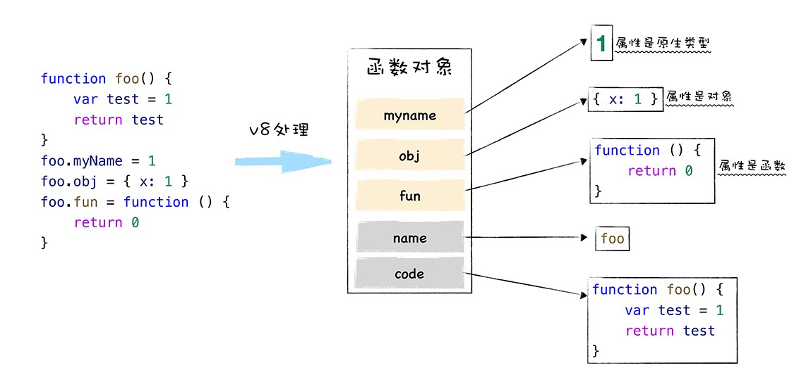

# 函数是特殊的对象

[[toc]]

## 函数是什么

在ES规范定义这门语言时描述过：

> JavaScript 标准对基于对象的定义：“语言和宿主的基础设施由对象来提供，并且 JavaScript 程序即是一系列互相通讯的对象集合”。

我们常说“JS世界一切皆对象”，所以本质上，函数也一种特殊的对象。

我们知道对象是一种键值对(key-value)的数据结构，函数作为一类特殊的对象，特殊的地方在于函数可以被“调用”。这种实现的原理在于语言为函数对象添加了两个隐藏属性，分别`[[name]]`和`[[code]]`属性。

### name属性

隐藏的`[[ame]]`属性的值就是函数的名称，如果函数是一个匿名函数，则name属性值就是`anonymous`，表示该函数对象没有被设置名称。

虽然在语言规范中`name`属于隐藏属性，但各浏览器在JS引擎实现时，函数对象都对外开放了`name`属性，使用`fn.name`可以获取

### code属性

`code`属性，其值表示函数代码，以字符串的形式存储在内存中。

当执行到一个函数语句时，JS引擎便会从函数对象中取出code属性值，也就是函数代码，然后引擎便会解释执行这段函数代码。

## 函数是第一类对象

在JS世界中，函数是第一类对象，也常将函数称为“一等公民”，函数在JS中的使用非常灵活，所以JS通过函数实现了很多特性。

- 可以像值一样用于赋值、入参、当作返回值等操作
- 声明提升中函数优先：函数声明优先，值或对象声明忽略
- 函数也作为对象，具有动态创建和分配属性

### name属性

### length属性

### `call()`

### `apply()`

### `bind()`

## 总结

ES语言中，理解一个函数可以有三个角度：

- 函数作为对象，有自己的属性，比如`name / length / call() / apply() / bind()`等内置属性，也可以自定义属性。
- 函数的特殊之处在于可以“被调用”，所以有函数运行时的相关概念，如“执行上下文、作用域、作用域链、闭包”等。
- 函数是一等公民，函数可以作为值一样传递、赋值、返回等行为，形成高阶函数应用。