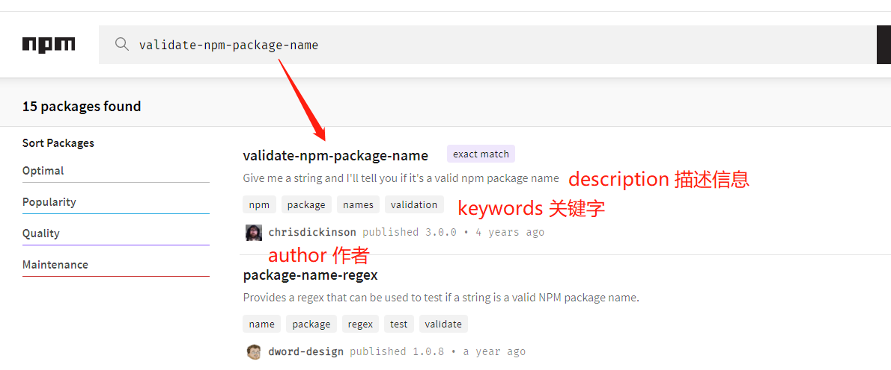
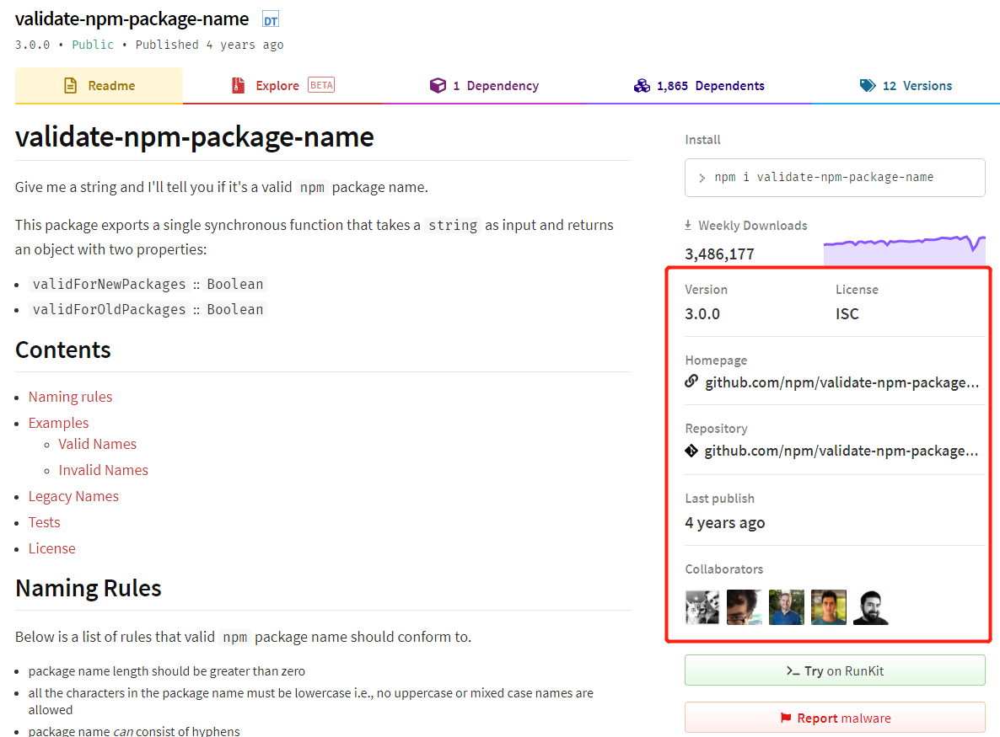

# package.json

[[toc]]

## What: 是什么

`package.json`文件是项目的描述文件，一般建立在项目根目录下。要求遵循 `json` 文件定义，以便程序能以编程的方式访问它。

虽然对于应用程序来说，`package.json`中的内容没有固定要求，即使用是一个空对象也行`{}`。但是现在前端项目的`package.json`基本包含很多字段来表述这个项目相关的信息：
- 描述类属性：项目基本信息、作者、主页、仓库地址;
- 限制类属性：主要用于 npm 上发布的库，表明使用该库的前提环境要求
- 目录/入口文件：如命令行的 bin 字段、项目主入口文件 main 字段等
- 语义化版本规范
- 依赖：生产依赖、开发依赖、兼容依赖、可选依赖
- 命令脚本和配置信息
- 其它


大致分为以下几类：
```json
{
  // 一、描述类属性
  // 1.1：基本信息
  "name": "project_name",               // 项目名称
  "description": "",                    // 项目描述信息
  "keywords": "",                       // 关键字
  // 1.2：作者
  "author": "",                         // 主要作者
  "contributors": [],                   // 贡献者数组形式
  // 1.3：地址
  "homepage": "",                       // 项目主页
  "repository": "",                     // 项目仓库地址
  "bugs": "",                           // 问题提交地址，一般指向仓库的 issue

  // 二、限制类属性
  "private": false,      // 如果设置为 true，则可以防止应用程序/软件包被意外发布到 npm 上
  "preferGlobal": false,
  "publicConfig": {},
  "os": [],
  "cpu": [],
  "engines": {},
  "browserslist": [],   // browsersList 配置，指定目标浏览器，以便某些依赖包作兼容性处理
  "license": "",         // 开源协议 MIT GPL Apche

  // 三、目录/入口文件相关属性
  "main": "",
  "bin": "",
  "module": "",
  "files": [],
  "directories": {},
  "man": [],

  // 四、版本规范
  "version": "1.0.0.alpha.12",           // 遵循 Semantic Version 语义化版本规范

  // 五、依赖
  "dependencies": {},                    // 生产依赖
  "devDependencies": {},                 // 开发依赖
  "peerDependencies": {},                // 兼容依赖（对等依赖），即要使用该项目，必须要安装 peerDependencies 指定的依赖
  "optionalDependencies": {},            // 可选依赖，可有可无，但业务代码中要做好缺省的逻辑
  "bundleDependencies": [],              // 打包依赖，注意值是数组形式

  // 六、命令脚本和配置信息
  "script": {},
  "config": {},

  // 七、项目依赖包特有的配置，视具体依赖包定
  "babel": {},          // babel 配置，但一般都指定 babel.config.json 文件
  "vuePlugins": {},     // vue cli 配置自定义插件
}
```

## 描述类属性

### name 名称

`name` 属性定义了应用程序或软件包的名称。

1. 命名规范

如果应用程序打算作为 npm 包发布的话，则应该符合下列命名规范：
- 名称长度应大于零，但不超过 214
- 所有字符都必须小写，不允许使用大写或大小写混合的名称
- 名称不应以点号`.`和下划线`_`和连字符`-`开头，但中间可以包含下划线和连字符。
- 名称不得包含任何非URL安全字符（因为名称最终成为URL的一部分）
- 名称应该不包含任何前导或尾随空格，以及下列字符：~)('!*
- 名称不能与`node.js / io.js`核心模块相同，也不可以是保留/列入黑名单的名称。如`http / stream / node_modules / favicon.ico`等。

2. 名称有效性校验方法

在应用程序中可以使用 `validate-npm-package-name` 包来校验名称的规范性。
```sh
# 下载
npm i -D validate-npm-package-name
```
```js
const  validateNpmPackageName  = require （“ validate-npm-package-name ”） 

const validateResult = validateNpmPackageName("some-package-name")
// 如果校验成功，会返回一个对象，包含两个属性，对于现代 Npm 包，我们只要关注 validForNewPackages 即可。
validateResult = {
  validForNewPackages: true,
  validForOldPackages: true
}

// 如果失败，除了以上两个属性为 false 外，还有一个报错信息
// errors 报错信息会指明不符合以上规范的哪一条。
validateResult = {
  validForNewPackages: false,
  validForOldPackages: false,
  errors: [
    'name cannot contain leading or trailing spaces', // 名称不能包含前导或尾随空格
    'name can only contain URL-friendly characters'   //  名称不得包含任何非URL安全字符
  ]
}
```

如果你的包名与现有的包名太相近导致你不能发布这个包，推荐将这个包发布到你的作用域下。比如常见的 `@babel/core  @vue/cli` 等。

3. 检查名称是否已被占用

通过 `validate-npm-package-name` 可以检查名称是否有效，如果包名有效，下一步还要检查这个有效名称是否在 npm 上已经被注册，可以使用 npm 命令校验 `npm view packageName`，或者在 [npm 官网](https://www.npmjs.com/)上直接搜索，如果有搜索结构就说明该名称已被使用。

```sh
# 如果有返回名称的基本信息，即该名称已被注册；如果返回报错信息，则名称可用。
npm view packageName
```

### 其它描述信息

其它项目描述信息包括：
- description 用于添加模块的的描述信息，方便别人了解你的模块
- keywords 用于给你的模块添加关键字

描述地址信息的字段有三个：
- homepage 用于指定该模块的主页
- repository 用于指定模块的代码仓库，可以直接仓库地址的字符串形式，也可能对象形式：{type,url},指明 type 仓库的类型 git / svn ，url 仓库地址
- bugs 指定一个地址，对你的模块存在疑问的人可以到这里提出问题，一般指向仓库的 issue。

描述开发人员的字段有两个：
- author 指包的主要作者，一个 author 对应一个人。
- contributors 指贡献者信息，一个 contributors 对应多个贡献者，值为数组，一个数组项对应一个贡献都的描述

不管是作者 author 还是数组内单个贡献者信息描述可以字符串形式，也可以是对象形式。

如果是字符串形式：username + email + url 组成的字符串，如果是对象就是这个三属性键值对。

```json
{
  "author": "username <mail@qq.cn> (http://qq.cn)", // 也可以只有 name 属性
  "contributors": ["username1 <mail@qq.cn> (http://qq.cn)", "username2 <mail@qq.cn> (http://qq.cn)"],

  // 或者命名用对象形式
  "author": {
    "name": "usename",
    "email": "mail@qq.cn",
    "url": "http://qq.cn"
  },
  "contributors": [
    {
      "name": "username",
      "email": "mail@qq.cn",
      "url": "http://qq.cn"
    }
  ]
}
```

下面是 `vue` 的 `package.json` 信息
> 大型开源项目贡献都大多，一般不会放在这里列出。
```json
{
  "name": "vue",
  "version": "2.6.12",
  "description": "Reactive, component-oriented view layer for modern web interfaces.",
  "keywords": [
    "vue"
  ],
  "author": "Evan You",
  "homepage": "https://github.com/vuejs/vue#readme",
  "repository": {
    "type": "git",
    "url": "git+https://github.com/vuejs/vue.git"
  },
  "bugs": {
    "url": "https://github.com/vuejs/vue/issues"
  },
}
```
如果应用作为 NPM 包发布的话，完善这些信息，能够更好地在 npm 搜索结果中展示。




## 项目发布限制类属性

```json
/*
  如果将 private 属性设置为 true，npm将拒绝发布它，这是为了防止一个私有模块被无意间发布出去。
*/
"private": false,

/*
  如果你的 node.js 模块是用于安装到全局的命令行工具，那么该值设置为 true 。当用户将该模块安装到本地时，将得到一个警告。

  这个配置并不会阻止用户安装，而是会提示用户防止错误使用而引发一些问题。
*/
"preferGlobal": true,

/*
  你可以配置只发布某个指定的 tag，或者配置只发布到的私有 npm 源。
  更详细的发布配置项，可以参考 [npm-config](https://docs.npmjs.com/cli/v6/using-npm/config)
*/
"publicConfig": {
  "registry": "https://yourself.npmjs.org/",
  "tag": "latest", // 如果你用 npm 安装一个包，但没有指定具体版本号时，就是依据这里的 tag 安装，默认是安装 latest 版本包。
},

/*
  使用 os 属性指定你的模块只能被安装在某些系统下，或者指定一个不能安装的系统黑名单。

  在node环境下可以使用 process.platform 来判断操作系统。
*/
"os" : [ "linux" ],  // 指定该模块只能在 linux 系统下运行
"os" : [ "!win32" ], // 添加 ! 号，表明该系统不能在 window 32位系统上运行，安装时报错。

/*
  和上面的 os 类似，我们可以用 cpu 属性更精准的限制用户安装环境
  同样 ! 号表示禁止，没有表示允许

  在node环境下可以使用 process.arch 来判断 cpu 架构
*/
"cpu" : [ "x64", "ia32" ],
"cpu" : [ "!arm", "!mips" ],

/*
  设置此软件包，或应用程序运行所依赖的 Node.js 版本，或其他依赖条件
*/
"engines": {
  "node": ">= 6.0.0",
  "npm": ">= 3.0.0",
  "yarn": "^0.13.0",
},

/*
  这个不是 npm 默认的配置项，是 browserslist.js 库的配置项，指明要兼容的目标浏览器，以便某些依赖包以此作兼容性处理，比如autoprefix.js 依此为 CSS 属性添加浏览器前缀、babel 作相应的 profils 处理等。

  放在这里一起说，是便于 engines 一般用于指定 node browserslist 可以用于指定浏览器环境。

  更具体的 browserslist 的解析可以看 FE-Engineering/Browserslist/README.md
*/
"browserslist": [
  "> 0.5%",
  "last 2 versions",
  "Firefox ESR",
  "not dead"
],

/*
  软件协议可分为开源和商业两类，对于商业协议，会有专门的法律声明、许可授权协议。

  license 指明软件包开源的开源协议，开源协议里面详尽表述了其他人获得你代码后拥有的权利，可以对你的的代码进行何种操作，何种操作又是被禁止的。
  
  常见的有：
  MIT：只要用户在项目副本中包含了版权声明和许可声明，他们就可以拿你的代码做任何想做的事情，你也无需承担任何责任。
  Apche：类似于 MIT，同时还包含了贡献者向用户提供专利授权相关的条款。
  GPL：修改项目代码的用户再次分发源码或二进制代码时，必须公布他的相关修改。

  关于开源协议更多内容请查看 [阮一峰：开源许可证教程](http://www.ruanyifeng.com/blog/2017/10/open-source-license-tutorial.html)
*/
"license": "MIT",
```

## 目录/入口文件相关属性

```json
/*
  指定程序的主入口文件
  当发布成一个 npm 包时，代码语句 import pkg from 'package' 或者 const pkg = require('package')，导入的就是 main 字段指定文件导出的内容。
*/
"main": "src/main.js",

/*
  指定命令行工具入口文件

  当你的模块是一个命令行工具时，你需要为命令行工具在 bin 字段中指定一个入口文件，即指定你的命令和指定文件的对应关系。
  
  如果是全局安装，npm 将会使用符号链接把可执行文件链接到 /usr/local/bin；
  如果是本地安装，会链接到 ./node_modules/.bin/。

  具体搜索查看 npm run 原理。
*/
"bin": "",

/*
  目前 pkg.module 还只是一个提案，并不是 package.json 文件标准格式的一部分。但它极有可能会成为标准的一部分，因为它目前已经是事实上的标准了

  module 字段指明了该程序包使用 ES module 模块规范的入口文件。以此兼容现在大范围 npm 包是 CommonJS 模块规范以 main 字段指定入口文件的写法。使得打包工具在指明 ESM 规范编译时可以使用 Tree Shaking 功能。

  参考链接：
  - https://github.com/sunyongjian/blog/issues/37
  - [package.json中你还不清楚的browser，module，main 字段优先级](http://www.manongjc.com/detail/16-necjnfrkpylvjvn.html)
*/
"module": "dist/dist.es.js",

/*
  files 属性用于指定 npm publish 发布时需要推送到 npm 服务器的文件列表，如果指定文件夹，则文件夹内的所有内容都会包含进来。

  另外，你还可以通过配置一个 .npmignore 文件来排除一些文件, 防止大量的垃圾文件推送到 npm, 规则上和你用的 .gitignore 是一样的。
*/
"files": ["dist", "lib", "es"],

/*
  一个基于 CommonJS 模块化规范实现的 npm 程序包，一般要求包含以下标准目录：
    bin：存放可执行二进制文件的目录
    lib：存放js代码的目录
    doc：存放文档的目录
    test：存放单元测试用例代码的目录
    example: 存入演示例子的目录

  但如果你的项目中并没有按上述约定标准建立目录结构，此时就可以使用directories 属性来指定你的目录结构和上述的规范的标准结构的对应关系。

  不过官方文档表示，虽然目前这个属性没有什么重要作用，不排除未来可能会整出一些花样出来。
*/
"directories": {
  "lib": "src/lib/",
  "bin": "src/bin/",
  "man": "src/man/",
  "doc": "src/doc/",
  "example": "src/example/"
},

/*
  man 命令是 Linux 系统平台下的帮助指令，通过 man 命令可以查看某个指令帮助、配置文件帮助和编程帮助等信息。

  如果你的 node.js 模块是一个全局的命令行工具，在 package.json 通过 man  属性可以指定 man 命令查找的文档地址。

  man 文件必须以数字结尾，或者如果被压缩了，以 .gz 结尾。数字表示文件将被安装到 man 的哪个部分。如果 man 文件名称不是以模块名称开头的，安装的时候会给加上模块名称前缀。

  如果像下面配置，则在命令行终端上输入 man npm-audit 会输出 npm-audit 命令的帮助信息。同 npm-audit --help
*/
"man": [
  "/Users/isaacs/dev/npm/cli/man/man1/npm-audit.1"
],
```

## 语义化版本规范
```json
"version": "3.0.0-alpha.1",
```

### 语义化版本：Semantic Version
> [语义化版本 2.0.0](https://semver.org/lang/zh-CN/)

语义化版本(Semantic Version)是社区中对软件版本管理的一种约定：

基本格式遵循：主版.次版本.补丁版本 ( major.minor.patch )，各个元素以非负整数表示，且数字前面不补零，如 `2.6.12`。

如果有先行版本，则继续往后添加。常见的先行版本规范如下：
- alpha 内部版本: major.minor.patch.alpha.1
- beta 公测版本：major.minor.patch.beta.2
- rc (Release Candiate) 正式版本前的候选版本: major.minor.patch.rc.3

npm 查看包版本号：
-  `npm view package_name version` 查看包当前最新稳定版
- `npm view package_name versions` 查看包所有历史版本，注意后面的 s

```
// 查看 vue 所有的历史版本号：npm view vue versions。
// 因为太多，下面截取 vue 最近的一部分版本:
'2.5.17-beta.0',  '2.5.17',               '2.5.18-beta.0',
'2.5.18',         '2.5.19',               '2.5.20',
'2.5.21',         '2.5.22',               '2.6.0-beta.1',
'2.6.0-beta.2',   '2.6.0-beta.3',         '2.6.0',
'2.6.1',          '2.6.2',                '2.6.3',
'2.6.4',          '2.6.5',                '2.6.6',
'2.6.7',          '2.6.8',                '2.6.9',
'2.6.10',         '2.6.11',               '2.6.12',
'3.0.0-alpha.0',  '3.0.0-alpha.1',        '3.0.0-alpha.2',
'3.0.0-alpha.3',  '3.0.0-alpha.4',        '3.0.0-alpha.5',
'3.0.0-alpha.6',  '3.0.0-alpha.7',        '3.0.0-alpha.8',
'3.0.0-alpha.9',  '3.0.0-alpha.10',       '3.0.0-alpha.11',
'3.0.0-alpha.12', '3.0.0-alpha.13',       '3.0.0-beta.1',
'3.0.0-beta.2',   '3.0.0-beta.3',         '3.0.0-beta.4',
'3.0.0-beta.5',   '3.0.0-beta.6',         '3.0.0-beta.7',
'3.0.0-beta.8',   '3.0.0-beta.9',         '3.0.0-beta.10',
'3.0.0-beta.11',  '3.0.0-beta.12',        '3.0.0-beta.13',
'3.0.0-beta.14',  '3.0.0-beta.15',        '3.0.0-beta.16',
'3.0.0-beta.17',  '3.0.0-beta.18',        '3.0.0-beta.19',
'3.0.0-beta.20',  '3.0.0-beta.21',        '3.0.0-beta.22',
'3.0.0-beta.23',  '3.0.0-beta.24',        '3.0.0-rc.1',
'3.0.0-rc.2',     '3.0.0-rc.3',           '3.0.0-rc.4',
'3.0.0-rc.5',     '3.0.0-rc.6',           '3.0.0-rc.7',
'3.0.0-rc.8',     '3.0.0-rc.9',           '3.0.0-rc.10',
'3.0.0-rc.11',    '3.0.0-rc.12',          '3.0.0-rc.13',
'3.0.0',          '3.0.1',                '3.0.2',
'3.0.3',          '3.0.4',                '3.0.5'
```

### 版本升级

当发布新的版本时，不是随心所欲地增加数字，还要遵循以下规则：
- 当进行不兼容的 API 更改时，则升级主版本 major。
- 当以向后兼容的方式添加功能时，则升级次版本 minor。
- 当进行向后兼容的缺陷修复时，则升级补丁版本 patch。
- 当有破坏性 breaked change 更改，需要升级主版本前，基本需要通过内部发行 alpha、小范围公测发行 beta、确定候选发行 rc 阶段，再到正式主版本 major 发行。

npm 升级包版本号
- npm version major 升级主版本号
- npm version minor 升级次版本号
- npm version patch 升级补丁版本号

### 版本大小对比

可以使用 `semver.js` 这个库，它是由 npm 的团队维护的，实现了版本范围的解析、计算、比较、校验等操作。

> 更析 api 可以查看 https://github.com/npm/node-semver
```js
// 安装：npm install --save-dev semver
// 使用：
import semver from 'semver'

// 校验
semver.valid('1.2.3') // '1.2.3'，如果无效返回 null
semver.parse('1.2.3') // 返回一个 new Semver 实例对象， 有 raw / major / minor / patch / version 属性外，还有一系列原型方法 inc / toString / format / compare 等。
semver.clean('  =v1.2.3   ') // '1.2.3'

// 范围匹配
semver.satisfies('1.2.3', '1.x || >=2.5.0 || 5.0.0 - 7.2.3') // true
semver.gt('1.2.3', '9.8.7') // false
semver.lt('1.2.3', '9.8.7') // true

// 版本增加
semver.inc('1.2.3', 'prerelease', 'beta') // '1.2.4-beta.0'
```

### 依赖包版本管理

因为 npm 设置了一些规则，用于在 package.json 文件中选择要将软件包更新到的版本（当运行 npm update 或 npm install 时）。

```json
// package.json
{
  "dependencies": {
    "lodash": "^4.17.13",
    "moment": "^2.24.0",
  },
  "devDependencies": {
    "jest": "^24.3.1",
    "eslint": "^6.1.0",
  },
}
```
具体符号规则：
```
^:  锁定主版本，次版本和补丁版本使用最新，主版本为0时，锁定次版本，更新补丁版本。 
    如果写入的是 ^0.13.0，则当运行 npm update 时，可以更新到 0.13.1、0.13.2 等，但不能更新到 0.14.0 或更高版本。 如果写入的是 ^1.13.0，则当运行 npm update 时，可以更新到 1.13.1、1.14.0 等，但不能更新到 2.0.0 或更高版本。
~:  锁定主版本和次版本，补丁版本使用最新。
    如果写入的是 〜0.13.0，则当运行 npm update 时，会更新到补丁版本：即 0.13.1 可以，但 0.14.0 不可以。
>:  接受高于指定版本的任何版本。
>=: 接受等于或高于指定版本的任何版本。
<=: 接受等于或低于指定版本的任何版本。
<:  接受低于指定版本的任何版本。
=:  接受确切的指定版本。
-:  接受一定范围的版本。例如：2.1.0 - 2.6.2。
||: 组合集合。例如 < 2.1 || > 2.6。即使用小于 2.1 版本或大于2.6版本
""：版本是空字符串，接受任意版本
"*"：星号，接受任意版本
"latest": 使用可用的最新版本
"2.1.1": 固定版本，使用指定的版本
```

## 项目依赖

在项目的 package.json 文件中依赖对象：
```json
// package.json
{
  "dependencies": {
      "lodash": "^4.17.13",
      "moment": "^2.24.0",
  },
  "devDependencies": {
    "jest": "^24.3.1",
    "eslint": "^6.1.0",
  },
  "peerDependencies": {
    "vue": ">=2.6.12",
  },
  "optionalDependencies": {
    "pkg": "^1.4.1",
  },
  "bundledDependencies": ["package1" , "package2"]
}
```

### 依赖的配置

在 package.json 具体某个依赖包配置可以是以下几种：
```json
 "dependencies": {
    "antd": "ant-design/ant-design#4.0.0-alpha.8", 
    "axios": "^1.2.0",
    "test-js": "file:../test",
    "test2-js": "http://cdn.com/test2-js.tar.gz",
    "core-js": "^1.1.5",
 }
```
- package:version 遵循SemVer规范的版本号配置，npm install 时将到npm服务器下载符合指定版本范围的包。
- package:download_url download_url 是一个可下载的 tarball 压缩包的地址，模块安装时会将这个.tar下载并安装到本地。
- package:local_path local_path 是一个本地的依赖包路径，例如 file:../pacakges/pkgName。适用于你在本地测试一个npm包，不应该将这种方法应用于线上。
- package:github_url github_url即 github 的 username/modulename 的写法，例如：ant-design/ant-design#4.0.0-alpha.8，你可以在后面指定 tag 和 commit id。
- package:git_url git_url 即我们平时 git clone 代码库的 url，其遵循以下形式：
`<protocol>://[<user>[:<password>]@]<hostname>[:<port>][:][/]<path>[#<commit-ish> | #semver:<semver>]`

其中协议类型 `protocol` 可以是 `git / git+ssh / git+http / git+https`

例子：
```
git://github.com/user/project.git#commit-ish
git+ssh://user@hostname:project.git#commit-ish
git+ssh://user@hostname/project.git#commit-ish
git+http://user@hostname/project/blah.git#commit-ish
git+https://user@hostname/project/blah.git#commit-ish
```
### 依赖的类型

项目依赖类型包含：
- dependencies: Object 生产依赖
- devDependencies: Object 开发依赖
- peerDependencies：Object 兼容依赖（对待依赖）
- optionalDependencies：Object 可选依赖
- bundleDependencies：Array 打包依赖，数组形式

#### dependencies

`dependencies` 指定构建生产环境代码时需要一起打包的依赖，生产环境和开发环境运行都必须依赖的包
```json
 "dependencies": {
    "lodash": "^4.17.13",
    "vue": "^2.6.12",
 }
```

#### devDependencies

有一些包只是在开发环境中会用到，在生产环境构建打包时并不需要。

例如项目中用于检测代码规范的 eslint，或者用于单元测试的 jest 等。项目不安装这些依赖也可以正常运行，但它们有利于开发环境。此时你可以把这些依赖使用`npm install --save-dev package_name` 命令安装，就会自动添加到 `devDependencies` 对象中。同样在本地进行 `npm install` 时也会被安装和管理。
```json
"devDependencies": {
  "jest": "^24.3.1",
  "eslint": "^6.1.0",
}
```

#### peerDependencies

`peerDependencies`用于指定当前开发的包在运行需要强依赖的某些包。
> peer: n. 同等地位的人，同龄人；贵族

npm3 以前会要求 `peerDependencies` 所指定的依赖包强制安装，npm3 之后会在安装结束后，会检查本地安装的 `peerDependencies` 中强依赖的包版本是否符合其要求，如果不正确会给用户打印警告提示。

比如 `element-ui` 是用于 vue 项目的 UI 库，就必须要求项目中包含 `vue` 这个框架。所以它的 package.json 文件中：
```json
"peerDependencies": {
  "vue": "^2.5.17"
},
```
这里说明当我们在项目中使用 `element-ui` 库时，要求项目中已安装的 `vue` ，并且版本在 `2.5.17` （含）以上。否则会在终端提示警告。
```
npm warn element-ui@2.13.0 requires a peer of vue@^2.5.17 but none is installed. You must install peer dependencies youself.
```

#### optionalDependencies

某些场景下，依赖包可能不是强依赖的，这个依赖包的功能可有可无，当这个依赖包无法被获取到时，你希望 `npm install` 继续运行，而不会导致失败，你可以将这个依赖放到 `optionalDependencies` 中。

但要特别注意 `optionalDependencies` 中的配置将会覆盖掉 `dependencies` 所以只需在一个地方进行配置。

并且在业务代码中使用 `optionalDependencies` 中安装的依赖包时，一定要做好异常处理，否则在代码获取不到时依赖模块时会导致报错。

#### bundledDependencies

和以上几个不同，bundledDependencies 的值是一个数组，数组里可以指定一些模块，这些模块将在这个包发布时被一起打包。一般较少使用。
```json
"bundledDependencies": ["package1" , "package2"]
```

### 依赖包版本管理

见上面版本管理最后一节

### 依赖包相关 npm 命令

```sh
# 安装依赖
npm install --save / -S package_name        # 安装生产依赖
npm install --save-dev / -D package_name    # 安装开发依赖
npm install                                 # 不用任何参数执行时，npm 默认是开发部署，会同时将 package.json 中 dependencies 和 Devdependencies 列出的包。
npm install --production                    # 指定是生产部署，仅安装生产依赖包 dependencies

# 查看依赖
npm list                # 打印项目的依赖树
npm list --depth=0      # 仅获取顶层的软件包
npm list package        # 查看指定包的版本

# 查看项目下所有依赖更新情况，可以看到哪些依赖的版本有更新
npm outdated

# 更新依赖版本
npm update package_name
```

### npm install 依赖安装原理

> 参考链接 [npm install的实现原理？](https://www.zhihu.com/question/66629910/answer/273992383)

输入 `npm install` 命令并敲下回车后，会经历如下几个阶段（以 npm 5.5.1 为例）

1. 执行工程自身 preinstall

npm run-script 执行命令都有两个钩子命令 `pre` 和 `post`，所以如果当前工程 package.json 中的 script 字段中定义了 `preinstall` 钩子时就会被执行。

2. 解析确定首层依赖模块

首层依赖，就是项目 package.json 文件 `dependencies` 和 `devDependencies` 属性对象中的指定的依赖包。

工程本身是整棵依赖树的根节点，每个首层依赖模块都是根节点下面的一棵子树，npm 会开启多进程从每个首层依赖模块开始逐步寻找更深层级的节点。

3. 获取模块

获取模块是一个递归的过程，最终生成一份项目依赖树。主要过程分为以下几步：

```
1. 获取模块信息。
  在下载一个模块之前，首先要确定其版本，因为 package.json 中往往采用的是 semantic version（语义化版本）。
  此时如果项目依赖的描述文件 package-lock.json 中有该模块信息则直接读取即可，如果没有，则需要从远程仓库中获取。
  如 packaeg.json 中某个包的版本是 package^1.1.0，npm 就会去仓库中获取满足 1.x.x 形式的最新版本。

2. 获取模块实体。
  上一步会获取到模块的信息，npm 会用此信息根据一定算法检查本地缓存，缓存命中就直接取到模块实体；如果没有则从远程仓库下载。
  
  关于如何根据模块描述信息从缓存中查找模块实体，见下面依赖缓存内容。

3. 查找该模块依赖
   如果有依赖则回到第1步，如果没有则停止。
```

4. 模块扁平化 dedupe

上一步获取到的是一棵完整的依赖树，其中可能包含大量重复模块。比如 A 模块依赖于 loadsh，B 模块同样依赖于 lodash。

在 npm3 以前会严格按照依赖树的层级结构进行安装，因此会造成模块冗余。从 npm3 开始默认加入了一个 dedupe 的过程。它会遍历所有节点，逐个将模块放在根节点下面，也就是 node_modules 的第一层。当发现有**重复模块**时，则将其丢弃。

这里需要对重复模块进行一个定义，它指的是**模块名相同且 semver 兼容**。

每个 semver 都对应一段版本允许范围，如果两个模块的版本允许范围存在交集，那么就可以得到一个兼容版本，而不必版本号完全一致，这可以使更多冗余模块在 dedupe 过程中被去掉。

> 依赖版本 ^1.0.0 中的 ^ 表示锁定主版本 1，获取最新的次版本和补丁版本
比如 node-modules 下 foo 模块依赖 lodash@^1.0.0，bar 模块依赖 lodash@^1.1.0，则 ^1.1.0 为兼容版本。
而当 foo 依赖 lodash@^2.0.0，bar 依赖 lodash@^1.1.0，则依据 semver 的规则，二者不存在兼容版本。此时会将一个版本放在项目 node_modules 首层依赖中，另一个仍保留在 foo 包自身的依赖树里。

举个例子，假设一个依赖树原本是这样：
```
node_modules
  -- foo
      -- lodash@version1
  -- bar
    -- lodash@version2
```
假设 version1 和 version2 是兼容版本，则经过 dedupe 会成为下面的形式：
```
node_modules
  -- foo
  -- bar
  -- lodash（保留的版本为兼容版本）
```
假设 version1 和 version2 为非兼容版本，则后面的版本保留在依赖树中：
```
node_modules
  -- foo
  -- lodash@version1
  -- bar
    -- lodash@version2
```
具体被放在首层依赖的是 lodash@version1 还是 lodash@version2，取决于 foo 和 bar 模块安装的先后顺序。

5. 安装模块

如果是从远程仓库下载模块内容，则会更新以下内容：
5.1 执行模块中的生命周期函数（按照 preinstall、install、postinstall 的顺序）。
5.1 更新本地缓存模块内容
5.2 更新工程目录中的 node_modules


6. 执行工程自身生命周期

如果项目 run-script 中有定义相关钩子函数，则最后一步会执行项目的 `install / postinstall / prepublish / prepare`

全部依赖模块安装完成后，生成或更新项目依赖的描述文件 `package-lock.json`。

### package-lock.json 锁定项目依赖

> 参考链接：https://www.zhihu.com/question/62331583/answer/275248129

1. 是什么
`package-lock.json` 是当 `node_modules` 或 `package.json` 发生变化时自动生成的文件。

这个文件主要功能是确定当前项目所有依赖包的版本，以便后续重新安装 `npm install` 的时候构建相同的依赖，忽略有些依赖包远程已经发生了更新的版本。

2. 解决的问题：
- 因为依赖包远程更新了版本，那重新 `npm install` 时会导致前后项目所依赖的包版本不同，导致一些问题。
- 如果项目是多人协作，每个人 `npm install` 时项目依赖包版本也不同，导致代码兼容的问题。

3. 原理

在 package.json 中关于依赖版本使用的是语义化版本`"vue": "^2.5.17"`，描述的是这个依赖包的版本范围。

当使用 `npm install` 的时候具体要安装哪个版本，需要在解析后才能确定，如上面 npm install 安装步骤第3步第1点。
> 3.1. 获取模块信息。
>  在下载一个模块之前，首先要确定其版本，因为 package.json 中往往采用的是 semantic version（语义化版本）。此时如果项目依赖的描述文件 package-lock.json 中有该模块信息则直接读取即可，如果没有，则需要从远程仓库中获取。
>  如 packaeg.json 中某个包的版本是 package^1.1.0，npm 就会去仓库中获取满足 1.x.x 形式的最新版本。

从项目 package.json 递归到各个依赖包的 package.json 中解析到的依赖关系树，可以称之为逻辑树(logical tree)。

在 `node_modules` 文件夹下才是实际确定版本后安装的实体包文件，这个文件夹的树状结构可以称之为物理树(physical tree)。

从逻辑树到物理树，中间有一些去重算法，避免某些依赖包重复被安装。

而 `package-lock.json` 文件可以结合了逻辑树和物理树的一个快照（snapshot），里面有明确的各依赖包的版本号、实际安装的目录结构、也有依赖关系的逻辑树的结构等。

创建 `package-lock.json` 文件的好处就是当重复构建项目 `npm install` 时，同一个项目内实际被安装的依赖包版本都是一致的，因为依赖包的版本被锁定了。

4. package-lock.json 功能更新历史

- npm 5.0.x 版本，不管 package.json 怎么变，npm i 时都会根据 lock 文件下载。但是 [issue #16866](package-lock.json file not updated after package.json file is changed · Issue #16866 · npm/npm) 控诉了这个问题，明明手动改了package.json，为啥不给我升级包。
- 5.1.0 版本后， npm install 会无视lock文件 去下载最新的npm。但是 [issue #17979](https%3A//github.com/npm/npm/issues/17979) 又控诉了这个问题。
- 5.4.2版本后
  - 如果改了package.json，且package.json 和 lock 文件中依赖包版本不同，那么执行`npm i`时npm 会根据 package.json 中的版本号以及语义含义去下载最新的包，并更新至lock。
  - 如果两者是兼容状态，那么执行`npm i `都会根据 lock 下载，不会理会 package.json 实际包的版本是否有新。

5. package-loc.json 结构

```json
// 某个具体包在 package-lock.json 描述信息
"@antv/component": { // 包名
  "version": "0.6.3", // 实际版本
  "resolved": "http://192.168.102.232:6060/repository/npm-public/@antv/component/-/component-0.6.3.tgz", // 包具体的安装源
  "integrity": "sha1-O7TO2+mF6DG/s3ip5nKkbAQipac=", // 包 hash 值，基于 Subresource Integrity 来验证已安装的软件包是否被改动过、是否已失效
  "dev": true, // 开发依赖
  "requires": { // 对应子依赖的依赖包，与这个包中 package.json 中 dependencies 的依赖项相同。
    "@antv/dom-util": "~2.0.1",
    "tslib": "^1.10.0"
  },
  /**
    构和外层的 dependencies 结构相同，存储安装在子依赖 node_modules 中的依赖包。
    这里注意，并不是所有的子依赖都有 dependencies 属性，只有子依赖的依赖和当前已安装在根目录的 node_modules 中的依赖冲突之后，才会有这个属性。
  */
  "dependencies": {
    // 递归结构
    "@antv/g-base": {
      "version": "0.4.7",
      "resolved": "http://192.168.102.232:6060/repository/npm-public/@antv/g-base/-/g-base-0.4.7.tgz",
      "integrity": "sha1-dpj8TIyzgfK3iaMPvrJrHojEgZY=",
      "requires": {
        "detect-browser": "^5.1.0"
      }
    },
  }
},
```

### cache 依赖缓存

`npm install`或`npm update`命令，从远程仓库下载压缩包之后，都存放在本地的缓存目录。

在 Linux 或 Mac 默认目录是`${user.home}/.npm`，在 Windows 默认是`${user.home}/AppData/Roaming/npm-cache`，具体在 npm cofig 中也可以更改缓存存入目录。

```sh
# 查看缓存目录
npm config get cache # D:\nvm\node_cache 这是自定义的缓存路径
```
这个路径下有一个 `_cache` 目录，它里面有 `content-v2` 和 `index-v5` 的文件夹：
- content-v2 目录用于缓存具体包的内容
- index-v5 目录用于存储依赖包的 hash

npm 在执行安装时，可以根据 package-lock.json 中存储的 integrity、version、name 生成一个唯一的 key 对应到 index-v5 目录下的缓存记录，从而找到依赖包的 hash，然后根据 hash 去 content-v2 缓存目录下找到具体包的内容。
```json
// packag-lock.json 中关于 lodash 包的描述信息
"lodash": {
  "version": "4.17.11",
  "resolved": "https://registry.npmjs.org/lodash/-/lodash-4.17.11.tgz", // 包具体的安装来源 .tgz 是 tarball 的后缀
  "integrity": "sha512-cQKh8igo5QUhZ7lg38DYWAxMvjSAKG0A8wGSVimP07SIUEK2UO+arSRKbRZWtelMtN5V0Hkwh5ryOto/SshYIg==" // 包 hash 值，基于 Subresource Integrity 来验证已安装的软件包是否被改动过、是否已失效
},
```
总结：
- 缓存分2个，index-v? 是源信息 meta 的缓存，content-v? 是tar包的缓存
- 在有package-lock的情况下，根据lock里面的包名name、版本version、integrity 生成一个key出来去找meta信息。
- 没有lock就只能去请求 registry 了，请求下来也有一样的 meta 信息。根据 meta 里面的 shasum 字段去找tar包的缓存。

npm 缓存相关命令：

```sh
npm config get cache # 查看缓存目录

# 自定义缓存目录
npm config set cache "D:\Program Files\npm-cache"
npm config set prefix "D:\Program Files\npm_global"

npm cache clean --force # 清除 npm 缓存，清空的只是其中一个目录 __cacache，并不是所有的目录。
```

> 参考链接
> - [npm缓存现在是怎么做的？](https://www.zhihu.com/question/305539244)
> - [作为前端工程师你真的知道 npm install 原理么？](https://zhuanlan.zhihu.com/p/128625669)

## 命令脚本和配置信息
```json
/*
  config 字段用于配置脚本中使用的环境变量
  因为 package.json 字段都会以 npm_package_ 前缀添加到环境变量 process.env 上，所以在代码中可以使用 process.env.npm_package_config_xxx 进行获取对应配置值。
  如下面：process.env.npm_package_config_port 值就是 "8080"
*/
"config" : { "port" : "8080" },
"scripts": {
  "docs:dev": "vuepress dev docs",
  "docs:build": "vuepress build docs",
  "build": "npm run compile && npm run dist"
}
```

### npm 是如何管理和执行各种 scripts 的呢？

作为 npm 内置的核心功能之一，npm run 实际上是 npm run-script 命令的简写。当我们运行 npm run xxx 时，基本步骤如下：

- 从 package.json 文件中读取 scripts 对象里面的全部配置；
- 以传给 npm run 的第一个参数作为键，本例中为 xxx，在 scripts 对象里面获取对应的值作为接下来要执行的命令，如果没找到直接报错；
- 如果找到，开启一个 shell 进程，在系统默认的 shell 中执行上述命令，系统默认 shell 通常是 bash。所以凡是能在 shell 中允许的脚本，都可以写在npm scripts 中。

### 如何找到命令行中命令的执行文件？

当使用用 `npm install` 安装一个依赖包时，如果它的 `package.json` 的 `bin` 字段有值，就会把该值添加到 `node_modules/.bin`文件中。

然后 npm 在执行指定 script 之前会把 node_modules/.bin 加到环境变量 $PATH 的里面，执行完后再清除，

这意味着任何内含可执行文件的 npm 依赖都可以在 npm script 中直接调用，换句话说，你不需要在 npm script 中加上可执行文件的完整路径，比如 `./node_modules/.bin/eslint **.js`，只需要直接写 `eslint **.js`, 此时 eslint 命令的入口文件即 eslint 依赖包 package.json 中 bin 字段的值。

```json
// eslint 的 package.json
{
  "bin": {
    "eslint": "bin/eslint.js"
  },
}
```

### npm run 默认命令

npm 中有一些默认命令，在调用时可以不用加 `run`

```sh
npm start # npm run start
npm stop  # npm run stop
npm test  # npm run test
npm restart # 是一个复合命令： npm run stop && npm run restart && npm run start 的简写，
```

### npm run 钩子命令

npm 脚本命令都有 `pre` 和 `post` 两个钩子，不管是默认的命令 `start / install` 还是自定义的命令 `build` 等都有对应的钩子命令。

比如用户执行 `npm run build` 时，会自动按照下面顺序执行

```sh
npm run prebuild && npm run build && npm run postbuild
```
一般会在 pre 钩子中完成一些清理工作。比如项目构建前清理 dist 目录

```josn
"sccript": {
  "clean": "rimraf ./dist && mkdir dist",
  "prebuild": "npm run clean",
  "build": "cross-env NODE_ENV=production webpack",
  "postbuild": ""
}
```

另外，在正在运行的脚本代码中，可以通过 `process.env.npm_lifecycle_event` 变量，来判断当前命令执行的阶段。

```js
const TARGET=process.env.npm_lifecycle_event;

if(TARGET === 'test'){
  console.log(`Running the test task!`);
} else if(TARGET === 'pretest') {
  console.log(`Running the pretest task!`);
} else if(TARGET === 'posttest'){
  console.log(`Running the posttest task!`);
}
```

### npm run 中使用环境变量

#### npm run  注入的环境变量
执行 `npm run command` 脚本时候, npm 会设置一些特殊的 env 环境变量，包括：
- package.json 中的所有字段，都会被设置为以`npm_package_`开头的环境变量，
- npm 相关的所有配置也会被设置为以`npm_config_`开头的环境变量
- 还会设置一个比较特殊的环境变量`npm_lifecycle_event`，表示正在运行的脚本名称

注意：这些环境变量只能在 npm run 的执行脚本中拿到`process.env.npm_package_xx / process.env.npm_config_xx / process.env.npm_lifecycle_event`，正常执行的脚本文件是获取不到的。

另外要注意一点是要区分这里**环境变量**的意义。以上`npm_package_ / npm_config_ / npm_lifecycle_event` 是在`npm run xx`时附加到 `process.env`对象上的。

#### 系统平台下的环境变量

但 `process.env` 对象中还包含系统平台下本身的一些环境变量，以及软件安装时设置的环境变量。比如系统环境变量`%HOME`，我们安装 Node.js 时设置的环境变量 `%NODE_PATH` 等。

系统环境变量在不同的系统平台下，表示方式是不同的。
```sh
# linux 系统平台
env # 查看所有环境变量
echo $HOME                          # 查看具体某个环境变量值
export NODE_ENV=production          # 临时设置环境变量，退出当前 shell 后将失效
export path=$path:/home/download    # 追加环境变量
unset NODE_ENV                      # 删除某个环境变量

# 在 window 系统的 CMD 中操作环境变量。
set                                 # 查看所有环境变量
set HOME                            # 查看单个环境变量 
set NODE_ENV=production             # 临时设置环境变量，退出当前 shell 后将失效
set path=%path%;C:\web              # 追加环境变量值 set 变量名=%变量名%;追加的变量内容 
set NODE_ENV=                       # 删除某个环境变量

# 在 window 10 以上系统中使用 powershell 终端上操作环境变量。
ls env:                             # 查看所有环境变量，注意有冒号：
ls env:NODE*                        # 搜索以 NODE开头的环境变量，如 NODE_ENV
$env:NODE_ENV                       # 查看某个环境变量
$env:NODE_ENV=development           # 添加/更新环境变量 
$env:path+=";c:\your_path"          # 环境变量追加值
del evn:NODE_ENV                    # 删除环境变量  
```
不同于 `npm run` 设置的环境变量只能在当前执行的脚本文件中以 `process.env` 中获取和使用。这些系统平台下的环境变量，可以直接应用在 `npm run `命令行中。

```json
// package.json
"scripts": {
    "run:windwos": "set NODE_ENV=production && node test.js",
    "run:linux": "export NODE_ENV=production && node test.js",
    // 在 linux 平台下，可以省略 export
    "run": "NODE_ENV=production node test.js",
    "echo": "echo $path"
  },
```
需要注意的是：

命令行中设置和修改的环境变量只会在当前窗口下有效，设置和修改只是临时缓存，一旦关闭命令窗口，环境变量就会失效。

如果要设置真实的持久性的环境变量，可以去我的电脑->属性->更改设置->高级->环境变量，添加和设置环境变量，然后注销/重启。

正因为不同系统平台上环境变量的操作存在兼容性问题，所以在实际项目开发中，为了抹平不同系统对环境变量操作方式的差异，会使用相应的第三方包来解决。

- cross-env 提供一个设置环境变量的兼容方法，使得我们就能够以unix方式设置环境变量，然后在windows上也能够兼容执行。

```json
// package.json
"scripts": {
    "run": "cross-env NODE_ENV=production node test.js",
    // 多个环境变量
    "more": "cross-env FIRST_ENV=one SECOND_ENV=two node ./my-program"
  },
```

### npm run 命令传参

`npm run command` 执行某个命令时，要向命令行传入参数，可以直接在命令后设置，以空格分隔，然后在脚本中可以使用 `process.argv` 属性中访问。
```sh
node test.js a=1 b=2 c d
```
```js
// test.js
process.argv.forEach((val, index) => {
  console.log(`${index}: ${val}`);
});
```
```js
// 输出
0: D:\nodejs\node.exe
1: E:\develop\test\argstest.js
2: a=1
3: b=2
4: c
5: d
```
其中 ：
- `process.argv[0]` 表示当前 node 可执行文件(node.exe) 所在路径，通常情况下，也要以使用 `process.execPath`和`process.argv0`获取。但注意`process.argv0`稍有差异。
- `process.argv[1]` 表示正被执行的 JavaScript 文件的路径。
- 其余为传入的参数，以空格为边界输出。

但在现代库开发中，或脚手架工具对命令行传参都使用封装的包来处理命令行传入参数的解析，避免手动转换。被脚手架广泛使用的迷你包 `minimist`，约定：
- 以双横线 `--arg` 或单横线表示简写参数`-arg`。
- 赋值用等号 `--arg=value` 或空格分隔 `--arg value`，如果没有赋值，则该参数解析为布尔值，有传入则为 true
- 所有未使用双横线或单横线的参数会被存入 `_: []` 数组中。

```sh
node test.js -x 3 -y 4 -n5 -abc --beep=boop foo bar baz
```
```js
// test.js
const minimist = require('minimist')

var args = require('minimist')(process.argv.slice(2));
console.log(args);
```
```js
// 输出
{
  x: 3,
  y: 4,
  n: 5,
  a: true,
  b: true,
  c: true,
  beep: 'boop',
  _: [ 'foo', 'bar', 'baz' ],
}
```
`minimist`库被广泛使用，包括开发脚手架必备工具包 `commander.js / yargs.js` 中。 
> [minimist](https://github.com/substack/minimist) 是一个非常轻量的库，代码量只有几百行，可以试着阅读下其源码。

### npm run 任务的编排

#### 原生的 `&& / &`
npm run 命令的执行顺序有两种情况：
- && 表示任务串行：前一个任务成功，才执行下一个任务
- &  表示任务并行：同时的平行执行

```json
{
  "script": {
    "lint:js": "eslint *.js",
    "lint:css": "stylelint *.less",
    "build": "babel *.js",
    "parallel": "npm run lint:js & npm run lint:css", // js 和 css 校验同时执行
    "series": "npm run lint:js && npm run build", // .js 格式化后，再进行编译
  }
}
```

#### 第三方库 `npm-run-all`
也可以使用第三方库 `npm-run-all` 来编排命令。

```json
{
  "scripts": {
      "clean": "rimraf dist",
      "lint":  "eslint src",
      "build": "babel src -o lib",
      "series": "npm-run-all clean lint build", // 相当于 npm run clean && npm run lint && npm run build
      "parallel": "npm-run-all --parallel lint build" // 相当于 npm run lint & npm run build
  }
}
```
更多用法可以参考 [github npm-run-all](https://github.com/mysticatea/npm-run-all/blob/HEAD/docs/npm-run-all.md)

#### 脚本文件组织代码

但是对于更多更复杂的命令，可以文件来组装代码。

我们因为 npm run 执行命令相当于 shell 进程中执行文件。所以可以使用
- 使用 .js 文件组织代码，在命令行中调用 `node example.js` 即可。
```json
{
  "scripts": {
      "example": "node example.js",
  }
}
```

- 使用 shell 文件组织代码：在.js 文件开头添加 `shebang 行:（就是 sharp (#) + bang (!) 的意思）`，来指引操作系统使用接下来指定的程序运行此文件，采用绝对路径

```js
#!/usr/bin/env node
process.argv.forEach((val, index) => {
  console.log(`${index}: ${val}`);
});
```
此时在package.json 中配置：

```json
{
  "scripts": {
      "example": "./example.js",
  }
}
```

> #!/usr/bin/env NAME这个语法的意思是，让 Shell 查找 $PATH 环境变量里面第一个匹配的 NAME。如果你不知道某个命令的具体路径，或者希望兼容其他用户的机器，这样的写法就很有用。
> /usr/bin/env bash的意思就是，返回 bash 可执行文件的位置，前提是 bash 的路径是在 $PATH 里面。
> 其他脚本文件也可以使用这个命令。比如 Node.js 脚本的 Shebang 行，可以写成这样 /usr/bin/env node。

关于 bash 更多内容可以查看 `Backend/Bash/README.md`