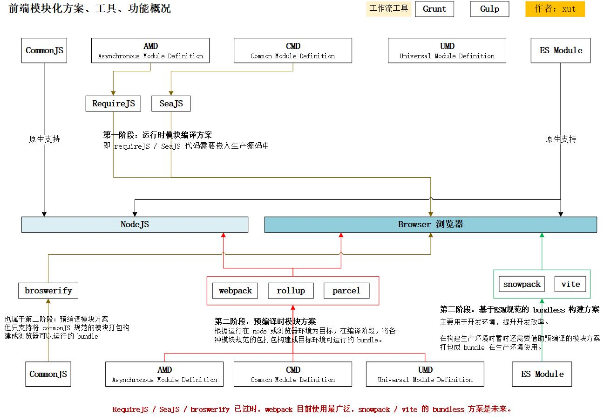

# webpack 简介

> WWHD方法论：what是什么、why为什么用它解决什么问题、how如何使用、deep深入理解

[[toc]]

## What: webpack 是什么

`webpack` 最初目的是一个模块打包工具`（module bundler）`，它会把遵循模块规范`(CommonJS / ES Module)`开发的 `js` 代码，打包构建成一个 `bundle.js` 供浏览器使用。

但随着 `webpack` 逐步发展，功能越来越丰富:
- 不在受限于只打包 js 代码，依赖社区开发的各种 `loader` ，基本前端依赖的各种资源`（HTML/CSS/Image等）`都能进行处理。
- 而且 `webpack` 实现的插件机制和社区开发的无数 `plugin`，也模糊了 `webpack` 只能打包`(module bundler)` 和工作流中 tasks 的界限，使得 `webpack` 集成了 `workflow` 工具 `grunt / gulp` 的功能。
- 打包输出的 `bundle.js` 也不在局限浏览器使用，也可打包构建出 node 环境可以使用的制品。

> Packs CommonJs/AMD modules for the browser. Allows to split your codebase into multiple bundles, which can be loaded on demand. Support loaders to preprocess files, i.e. json, jsx, es7, css, less, ... and your custom stuff.
>
> 打包CommonJs/AMD模块供浏览器使用，并且允许将你的代码库分割成多个bundle，根据需要加载。提供加载器 loader 预处理文件，如 json, jsx, es7, css, less，…还可以使用 Plugin 定制你需要的功能。

## Why：webpack 解决了什么问题

伴随着 `node.js` 在前端工程和工具中广泛使用，前端代码开发基本都是用模块化来组织文件，但受限于浏览器不支持 `CommonJS` 模块规范和浏览器需要网络请求的主要原因，不管是在本地开发服务器，还是生产服务器上，都是需要把模块代码打包成 `bundle` 在浏览器中使用。这种需求就激发了 `browserify / webmake / webpack / rollup / parcel` 等打包工具的产生。

现在伴随着 `ES module` 规范在各大浏览器都支持的情况下，产生了 `bundless` 思路的打包工具 `snowpack / vite`，在开发服务器上可以充分利用浏览器来管理和组织 `ESM` 规范的模块。但在现实的前端项目中会有非常多的模块文件关联，受限于浏览器网络请求的原因，在生产环境中不可能产生瀑布式请求，仍然需要减少资源请求的发送，所以未来在本地开发使用 `bundless`的打包工具，生产环境构建使用 `bundle` 的打包工具相结合会成为主流。

> 前端模块化发展历史和模块构建工具的发展，请参考 [FE-language/ES/Module]()



## webpack 诞生的历史

> 参考链接：[Webpack 诞生记](https://zhuanlan.zhihu.com/p/71640308)

`webpack`创建者是 Tobias Koppers，网络昵称叫 sokra，德国人。

sokra 一开始是写 `Java` 的，Java 里面有个很出名的技术叫 `GWT（Google Web Toolkit）`，`GWT` 主要目的是把 `Java` 代码转换成 `JavaScript`，能让后端开发直接写前端代码。`GWT` 里面有个特性功能叫 `code splitting`。于是，sokra 给它当时用来做前端项目打包的工具 [modules-webmake](https://github.com/medikoo/modules-webmake)提了一个 [issue](https://github.com/medikoo/modules-webmake/issues/7)，希望他们也能在工具中实现这个功能，但是 `modules-webmake` 维护者一直没有实现这个功能，这个 issues 现在还 open 着。于是 sokra 就 follow 了一份 modules-webmake 代码 ，在 github 上开了一个新的项目 webpack，来实现并验证 `code splitting` 功能。时间是 2012年3月10号，Webpack这个伟大的项目就这样诞生了，估计 sokra 当时也没想日后 Webpack 会这么流行，成为前端开发的标配。

`Webpack` 诞生了，但它是怎么流行起来了的呢？

2013 年，Facebook 将 `React` 开源了，这是它们在 2012 年内部使用的一个前端框架。也就是在 2013 年，Facebook 收购了 Instagram，所以 Instagram 也是用的 React ，Instagram 是一个图片的社交网站，图片还是高清的，所以对页面性能要求非常高。

在 2014 OSCON 大会（OSCON 是动物书 O'Reilly 组织的），Instagram 的前端团队分享了他们对前端页面加载性能优化，其中很重要的一件事就是用到的 `Webpack` 的 `code splitting`功能。这就在当时引起了很大的轰动，之后大家纷纷开始使用 `webpack`，并给 `Webpack` 贡献了无数的 `loader` 和 `plugins`。

所以大家看到 2014年后 `Webpack` 发展非常迅猛，版本更新非常快，最后这些 `plugins` 也模糊了 `module bundler` 和 workflow 工具中 `tasks` 的界限，于是 webpack 把前端 workflow 工具 `grunt/gulp` 的功能也基本取代了。

## How：webpack 安装和基本使用

前端工具基本都遵循同样的结构，提供了以下工具：
- 核心功能库： webpack
- 命令行工具： webpack-cli
- 配置文件： webpack.config.js
- 插件体系：plugins
- webpack 特有的 loader 

安装：

截止 2021-02-10 日，目前最新版本： webpack@5.21.2 webpack-cli@4.5.0
```sh
npm install --save-dev webpack webpack-cli # 本地安装
npm install -g webpack webpack-cli # 全局安装
```

基本使用：

```js
// src/index
import hello from '.hello.js'
hello('webpack')

// hello.js
export default function hello(str) {
  console.log(`hello ${str}`)
}
```
命令行打包
```sh
# 如果本地安装
npx webpack src/index.js -o dist/bundle.js 

# 如果全局安装
webpack src/index.js -o dist/bundle.js
```
使用配置文件 `webpack.config.js`
```js
const path = require('path');  
module.exports = {
  entry: 'src/index.js',
  output: {
    path: path.resolve(__dirname, './dist'),
    filename: 'bundle.js'
  },
  mode: 'none'
};
```
`Webpack` 会自动寻找到根目录的配置文件，并使用其配置信息进行打包。
```sh
npx webpack
```

配置文件里的代码解释：

因为 `Webpack` 是基于 `Node.js` 执行的，所以在配置文件中导出也要遵循 `CommonJS`规范，使用`module.exports`导出一个对象。该对象的属性就是`Webpack`打包要使用的参数。
- `entry`指定`Webpack`构建的入口文件，
- `output`指定打包后资源输出文件，其中`path`表示输出的路径，`filename`表示输出的文件名
- `mode`指定Webpack的打包模式，默认是`production`，表示给生产环境打包的。现在我们设置成`none`，这样代码就不会压缩了。
- `path`是`Node.js`里的路径解析模块，你可以将其看成是一个JS普通对象，该对象有一些方法可以供我们使用。我们现在使用了其`resolve`方法，该方法的作用是将方法参数解析成一个绝对路径返回。`__dirname`是`Node.js`的当前模块范围内的一个全局变量，表示当前文件的路径。这样，`path.resolve(__dirname, './dist')`表示的其实就是当前文件夹根目录的绝对路径`/dist`。

## 配置文件

`webpack.config.js`配置文件可以导出一个对象、导出一个函数、导出一个 Promise 对象、或者导出多个对象或多个函数来执行。

```js
// 导出一个对象
const path = require('path');  
module.exports = {
  entry: 'src/index.js',
  output: {
    path: path.resolve(__dirname, './dist'),
    filename: 'bundle.js'
  },
  mode: 'none'
};

/**
 * 导出一个函数
 * 函数接受两个入参：env , argv
 * - env: 是一个对象，来自 webpack-cli 在命令行使用时配置的环境变量。比如：
 *    webpack --env.production --env.platform=web
 *    那么此时函数入参 env = {production: true, platform: 'web'} 具体在 cli 如何配置环境选项参考[https://www.webpackjs.com/api/cli/#%E7%8E%AF%E5%A2%83%E9%80%89%E9%A1%B9]
 * - argv: 也是一个对象，包含了 webpack-cli 在命令行时使用的配置参数

 */
```
也可以导出一个函数，函数接受两个入参 `env, argv`：
- env: 是一个对象，来自 webpack-cli 在命令行使用时对 `--env` 选项的配置值。
- argv: 也是一个对象，包含了 webpack-cli 在命令行时使用的其它配置参数

比如：
`webpack --env.prod --env.platform=web --optimize-minimize --output-path='./dist' --output-filename=bundle.js`

则函数入参：
```js
env: {
  prod: true,
  platform: 'web',
}

argv: {
  'optimize-minimize': true,
  'output-path': './dist',
  'output-filename': 'bundle.js',
}
```
```js
module.exports = function config(env, argv) {
  mode: env.prod ? 'production' : 'development',
  entry: 'src/index.js',
  output: {
    path: path.resolve(__dirname, argv['output-path'] || 'dist' ),
    filename: argv['output-filename'] || 'bundle.js',
  },
  plugins: [
    new webpack.optimize.UglifyJsPlugin({
      compress: argv['optimize-minimize'] // 只有传入 -p 或 --optimize-minimize
    })
  ],
}
```

配置文件也可以导出一个 Promise 对象，或者使用数组同时导出多个对象或函数，但这种一般不常用。具体可以查看官网示例[https://www.webpackjs.com/configuration/configuration-types/](https://www.webpackjs.com/configuration/configuration-types/)


## webpack：一切皆模块 module

在模块化编程中，开发者将程序分解成离散功能块(discrete chunks of functionality)，称之为**模块**。

每个模块具有比完整程序更小的接触面，使得校验、调试、测试轻而易举。 精心编写的模块提供了可靠的抽象和封装界限，使得应用程序中每个模块都具有条理清楚的设计和明确的目的。

但应用程序运行又要整合各个模块功能，就像积木通过凹凸点拼装成整体玩具一样，各个模块间也需要使用统一的模块规范来定义模块导入和导出的接口。从模块规范发展的时间顺序，包括`CommonJS / AMD / CMD / UMD / ES Module`。

在 webpack 世界中，可以视一切皆模块。比如代码中以下使用以下语句导入的文件都会被视为模块进行处理：
- ES module 规范中的 `import xx from xx` 语句和动态导入语句 `import()`
- CommonJS 规范的 `require()` 语句
- AMD `define / require` 语句
- css/sass/less 文件中的 `@import` 语句。
- css 样式属性值中的 `url(...)`
- HTML 文件``中的图片链接(image url)