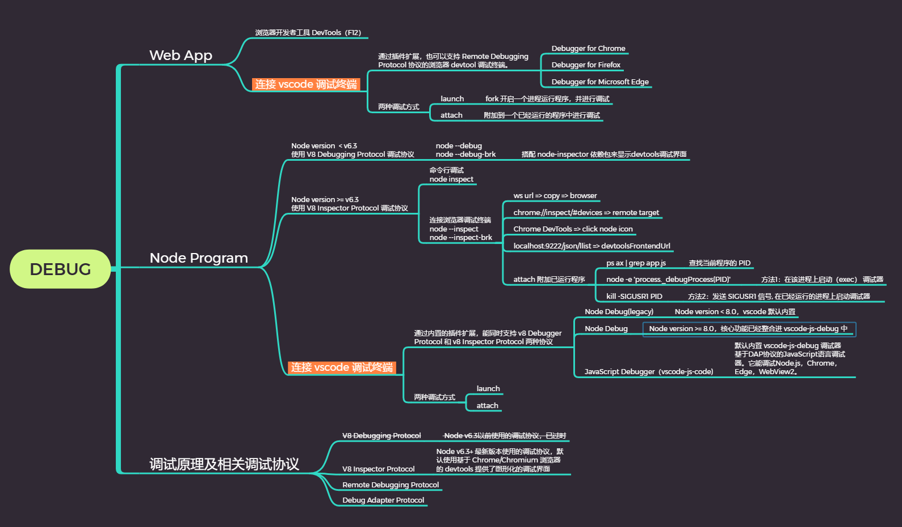
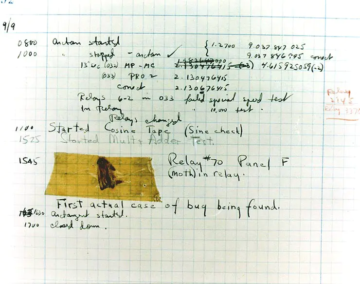
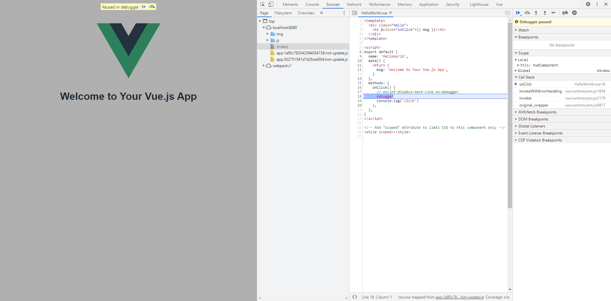
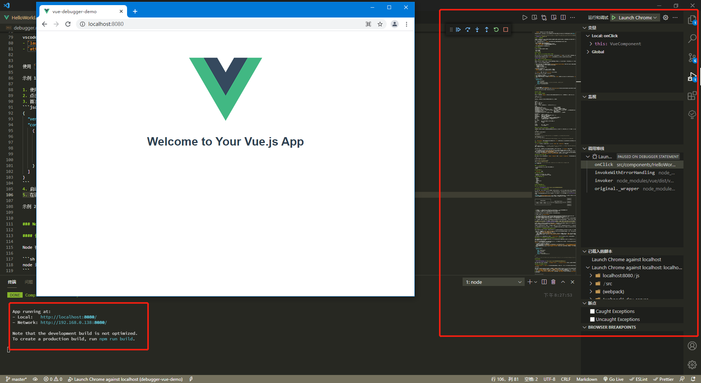
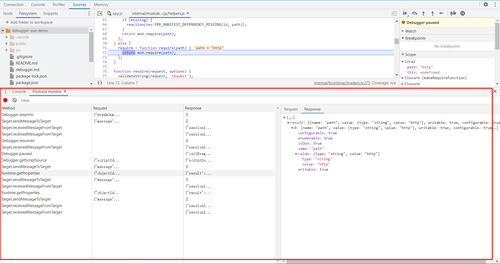

# 调试 Debug

> WWHD
- What: 什么是调试(debug)、BUG、断点(breakpoint)
- Why: 为什么需要调试
- How: 如何调试
  - Web 应用调试
    - 浏览器的开发者工具 DevTools
    - vscode 调试 web 应用
      - lauch
      - attach
  - Node 程序调试
    - Node 程序启动调试的几种方式及对应的 GUI 界面：命令行形式、DevTools、vscode
    - Node 已运行程序附加调试的方法
    - vscode 调试 node 程序
      - launch
      - attach
  - vscode 调试案例总结
- Deep：调试的原理
  - 各种调试协议：
    - 浏览器: `Remote Debugging Protocol`
    - v8: `V8 Debugging Protocol`、`V8 Inspector Protocol`
    - vscode：`Debug Adapter Protocol`



## What: 调试的相关概念

我们利用不同的语言描述业务逻辑，然后运行它看效果，当代码的逻辑比较复杂的时候，难免会出错，所以程序运行的**错误**叫做 `bug`。

为查找解决这个问题(BUG)，我们希望能够一步步运行或是运行到某个点停下来，这个点叫做**断点`breakpoint`**，通常情况下，它的表现真的是个点，比如 vscode 里红色的点，还有浏览器开发者工具中调试面板上在序号前的绿色箭头，或者代码语句中添加 `debugger` 语句等方式都能让程序运行到此停下来。

此时可以查看断点所在的上下文环境中的作用域变量、函数参数、函数调用堆栈等信息，能够完成这个功能的程序叫**调试器`debugger`**。

> 1947 年 9 月 9 日，哈佛大学在测试马克 II 型艾肯中继器计算机的时候，一只飞蛾粘在一个继电器上，导致计算机无法正常工作，操作员把飞蛾移除之后，计算机又恢复了正常运转。于是他们将这只飞蛾贴在了他们当时记录的日志上，并在日志最后写了这样一句话：First actual case of bug being found。这是他们发现的第一个真正意义上的 bug，这也是人类计算机软件历史上发现的第一个 bug。他们也提出了一个词，“debug（调试）”了机器，由此引出了计算机调试技术的发展。
> 

## Why: 为什么需要调试

在纷繁复杂的代码世界中，出错是难免的，调试代码是你最快找到问题原因的便捷途径。使用断点调试的主要好处就是可以观察程序运行的实际情况，而不用做假设。另一方面，在调试器中可以手动控制代码执行的逻辑，比如暂定执行，或者逐行运行，甚至修改内存中的值，让它走到另一个分支里。

对于简单的问题调试，可以使用 `console` API 来打日志，但是这种排除问题的方式有很多缺点：

- 不能完全展现代码逻辑当前的上下文信息，
- 同添加 `debugger` 语句一样，调试代码入侵了业务代码。
- `console` 或 `debugger` 方式需要刷新页面或重启应用程序。

所以我们需要更高效的应用程序调试的方式。

## How: 如何调试

在前端开发中的调试场景可以分为两种：

- Web 应用调试
- Node 程序调试

### Web 应用调试

#### 1.使用浏览器自带的 `DevTools` 调试器

web 应用都是运行在浏览器上的，各大浏览器都有自己的开发者工具界面，按 `f12` 可以打开，其中都会有一个调试的面板，比如 `Chrome DevTools`和`Microsoft Edge DevTools`中的 `source` 面板，`Firefox DevTools` 的 `debugger` 面板。

这是最常见的网页应用调试的方式。具体 `DevTools` 提供的各种面板的使用可以单独查阅资料，这里不作介绍。



#### 2.使用 vscode 调试 web 应用程序

这种方式是大多数开发者不太熟悉的，也是本文关注的重点。因为源代码是使用 vscode 编辑器，所以如果调试也能在一个工具上完成，也是非常高效的一种方式。只是配置方式相对浏览器直接`f12`有些麻烦，但配置也是一次性。

vscode 开启 web 应用程序调试的前置条件：

1. 安装 vscode 对接 js 语言的调试器的插件：`JavaScript Debugger(vscode-js-debug)`，这个插件 vscode 是默认安装的。
1. 安装 vscode 对接浏览器 DevTools 调试面板的插件，比如：
   - Debugger for Chrome
   - Debugger for Firefox
   - Debugger for Microsoft Edge

vscode 调试程序分两种模式：
- `launch`： vscode 开启一个进程运行程序，并进行调试。`launch` 译为发起，即独立开启进程。
- `attach`：vscode 附加到一个已经运行的程序中进行调试。`attach` 译为“附加”，实际"监听"更合适。

使用 `@vue/cli` 生成一个最简单的 `Hello World` 的 vue 项目。

**示例 1： vscode launch 模式调试一个 vue 应用**

1. 使用 vscode 打开 vue 项目
2. 点击 vscode 调试图标（昆虫的图标），进入调试视图。
3. 首次进入需要创建调试的启动配置文件`launch.json`，选择 `Chrome` 的调试环境，vscode 自动在项目根目录下创建`.vscode`目录，并生成 `launch.json`
```json
{
  "version": "0.2.0",
  "configurations": [
    {
      "type": "pwa-chrome",
      "request": "launch",
      "name": "Launch debug vue", // 该值会显示在顶部的运行和调试下拉选项中
      "url": "http://localhost:8080",
      "webRoot": "${workspaceFolder}"
    }
  ]
}
```
4. 启动 vue 本地服务 `npm run service`
5. 在调试视图的顶部的调试下拉选项中选择 `Launch debug vue`，点击运行或按f5，vscode 会自动打开当前运行应用的 web 页，并且 vscode 编辑器中显示断点和调试按钮。



**示例 2： vscode attach 模式调试一个正在运行的 vue 应用**

绝大多数情况下，我们是已经开启本地项目，并在浏览器中打开了应用页面进行开发。如果在开发的过程需要调试某个功能，并且想使用 vscode 内置调试器。

这种情况下如果使用上述 `"request": "launch"` 的配置，会使得 vscode 再开启一个应用的调试页面，我们更希望 vscode 调试能对接到当前已运行的页面服务。则可以使用 vscode 调试的另一种模式 `attach`。

1. 已启动 vue 本地服务 `npm run service`
2. 以远程调试模式运行 Chrome 浏览器：
  - 右键单击Chrome快捷方式（没有可以新建一个），然后选择属性，在“target”字段中附加 `--remote-debugging-port=9222`
  - 或者直接在命令行提示符下执行 `start chrome.exe --remote-debugging-port=9222` 打开启用了远程调试模式的 Chrome
3. 在浏览器中输入 `http://localhost:8080`，打开应用页面
4. vscode 编辑打开 `launch.json` 文件，在右下角点击添加配置按钮，选择 `Chrome Attach`，插入一个新的调试配置项：
```json
  "version": "0.2.0",
  "configurations": [
    {
      "type": "pwa-chrome",
      "request": "attach",
      "name": "Attach debug vue",
      "port": 9222,
      "webRoot": "${workspaceFolder}"
    },
  ]
```
3. 在调试视图的顶部的调试下拉选项中选择 `Attach debug vue`，点击运行或按f5

如果你此时遵照上面步骤进行调试，大概率会提示失败: 无法联调到目标调试地址 `Cannot connect to the target: connect ECONNREFUSED 127.0.0.1:9222`，最常见的原因是当使用 `attach` 附加到已开启远程调试的浏览器时，只允许当只存在一个正在运行的 Chrome 实例，如果打开了当前多个chrome 页面就会导致错误。

> [解决方案看这里](https://marketplace.visualstudio.com/items?itemName=msjsdiag.debugger-for-chrome#cannot-connect-to-the-target%3a-connect-ECONNREFUSED-127.0.0.1%3a9222)

### Node 程序调试

#### 使用内置调试器 Debugger 

Node 有一个核心模块 `debugger`，实现了 node 调试器的功能。要对某个应用程序开启内置调试器，简单地在程序启动添加 `inspect` 参数即可。

```
node inspect app.js             # 通过 --inspect 标志生成一个新的子进程，然后在当前主进程运行 node 内置的 CLI 调试器。
node inspect --port=xxx app.js  # 自定义调试端口号，默认 9229
```

此时命令行进入交互模式，输入相应的调试命令可对程序进行调试。

```
# 单步执行
cont, c:  继续执行
next, n:  单步执行下一行
step, s:  单步进入
out, o:   单步退出
pause:    暂停运行中的代码（类似于开发者工具中的暂停按钮）

# 断点
setBreakpoint(), sb():                              在当前行上设置断点
setBreakpoint(line), sb(line):                      在指定行上设置断点
setBreakpoint('fn()'), sb('fn()'):                  在函数体的第一个语句上设置断点
setBreakpoint('script.js', 1)、 sb(path, line):     在 script.js 文件的第一行上设置断点
setBreakpoint('script.js', 1, 'num < 4')、 sb(path, line, condition): 在 script.js 的第一行上设置条件断点，仅当 num < 4 计算为 true 时才会中断
clearBreakpoint(), cb():                            清除所有断点
clearBreakpoint(line), cb(line):                    清除指定行上的断点
clearBreakpoint('script.js', 1), cb(path, line):    清除 script.js 中第一行上的断点

# 查看信息
backtrace, bt:    打印当前执行帧的回溯
list(5):          列出脚本源码的 5 行上下文（前后各 5 行）
watch(expr):      将表达式添加到监视列表
unwatch(expr):    从监视列表中移除表达式
watchers:         列出所有的监视器和它们的值（在每个断点上自动地列出）
repl:             打开调试器的 repl，用于调试脚本的上下文中的执行
exec expr:        在调试脚本的上下文中执行一个表达式

# 执行的控制
run:              运行脚本（在调试器启动时自动地运行）
restart:          重启脚本
kill:             杀死脚本

# 其它
scripts:          列出所有已加载的脚本
version:          显示 V8 的版本
```

上述测试在 window 系统上大概率会报错 `Timeout (2000) waiting for 127.0.0.1:9229 to be free`，原因是在win10中使用 node inspect 命令启动调试器时需要调用系统接口分配端口，代码中设定的超时时间是2秒，而win10分配端口耗时较长，大约需要 3-5 秒，超过了2秒，因此会报错。[见此处 node inspect 报错](https://github.com/nodejs/node-inspect/issues/48)，最新的 Node v12.19.0 和 v15.0.1 现在已修复（超时设置为 9999 毫秒）。

#### 早期的第三方依赖 `node-inspector` 开启 GUI 调试

上面这种原始的命令行调试模式，除了要知道各种调试命令，视觉上也非常不直观，基本很少直接使用，所以出现了一个第三方模块 `node-inspector` 实现了 node 调试的可视化，它帮助我们在 `Chrome DevTools` 上能可视化地调试 Node.js 程序。

```
# 安装依赖
npm install -g node-inspector

# 启动inspector服务：
node-inspector

# 以debug模式运行node.js应用，要求 node 版本在 6.3 以下。你可以使用 nvm 来控制本地 node 版本。
# nvm use 6.2.1
node --debug=5858 index.js

# 浏览器打开 http://127.0.0.1:8080/debug?port=5858，后台会提供一个类似于 chrome devtools 的 UI 调试界面。
```

由于 `node-inspector` 很大程度提升了 Node 的调试体验，在 `v6.3` 的时候，Node.js 官方直接把这个能力给整合了进去，不再使用 `--debug` 参数启动调试程序，而是改为 `--inspect` 参数启动调试程序。

#### 使用 DevTools 作为 GUI 调试终端

使用 `v6.3+` 的 Node.js 中调试程序时，执行添加了 `--inspect` 或 `--inspect-brk` 参数的命令。

```
node --inspect index.js                     # 启用 debuger 模块开启监听器，默认 127.0.0.1:9229。对直接运行完成就结束的 node 程序，需要提前使用 debugger 语句设置程序断点，才能让调试器捕获到调试信号
node --inspect=[host:port] index.js         # 自定义监听的主机和端口
node --inspect-brk index.js                 # 与 --inspect 基本功能一样，但是它会自动在程序运行的第一行代码中断，所以解决了手动添加 debugger 语句设置断点的问题
node --inspec-brkt=[host:port] index.js     # 自定义监听的主机和端口
```

此时 Node 已经开启了调试模式，监听调试端口的信号。我们有以下几种方式来打开一个 `DevTools` 调试器终端。

- 打开 Chrome 浏览器，输入 `chrome://inspect/#devices` 地址后回车，弹出的页面中点击显示远程目标（remote target) 下的 inspect 文字按钮。（首次使用时需要勾选 Discover network targets ，然后点击 Configure 设置地址和端口，添加默认使用的 9229 端口，然后点击完成），切换到 sources 面板，首次时需要点击 `+ Add folder to workspace` 授权浏览器读取本地文件，将调试文件加载进来。
- 打开 Chrome 浏览器，f12 打开 `Chrome DevToo` 控制台，看到一个 NODE 图标，点击打开对接 node 调试器的调试容器。

#### 已运行的 node 程序附加调试

如果 Node.js 程序在启动的时候没有带 `--inspect / --inspect-brk` 参数，默认情况下 Node.js 的 Debugger 模块是不会启动的，这种情况下并非就不能调试了，我们可以手动来启动调试模块：

```
ps -aux | grep 'yourscript.js' # linux 下找到对应的 Node.js 进程的 PID
netstat -ano | findstr 8080 # window 下只能通过当前端口号查找 node 进程的 PID

# 方法1：在该进程上启动（exec） 调试器
node -e 'process._debugProcess(PID)'

# 方法2：或者给这个 PID 发送 SIGUSR1 信号, 在已经运行的进程上启动调试器，即启用 debugger 模块。但是 SIGUSR1 在 Windows 下不可用
kill -SIGUSR1 PID
```

#### 使用 vscode 调试 Node 程序

使用 vscode 调试 Node 程序也同上面一样，有两种模式：
- `launch`： vscode 开启一个进程运行程序，并进行调试。 `launch` 译为发起，即独立开启进程。
- `attach`：vscode 附加到一个已经运行的程序中进行调试。`attach` 译为“附加”，实际"监听"更合适。

一段基本 node 程序 `app.js`
```js
const http = require('http')
const server = http.createServer((req, res) => {
  debugger // 或者在 vscode 中添加断点
  res.end('Hello Node Debugging')
})
server.listen(8080, () => {
  console.log('server is runnig localhost:8080')
})
```

示例1： vscode launch 模式调试一个 node 程序

在 `launch.json` 中添加配置，选择 `Node.js: Launch Program` 模板：
```json
{
  "version": "0.2.0",
  "configurations": [
    {
      "type": "pwa-node",
      "request": "launch",
      "name": "Launch Node Program",
      "program": "${workspaceFolder}/app.js", // 输入 node app.js 启动的路径
      "skipFiles": [
        "<node_internals>/**"
      ],
    },
  ]
}
```

此时在调试视图中选择 `Launch Node Program` 调试顶后，点击调试或按f5，vscode 会自动开启 node 服务。在浏览器中输入服务访问地址`localhost:8080`，即可在 vscode 中执行到断点处停止，等待调试信号。

示例2： vscode attach 调试一个已经运行的 node 程序

在 `launch.json` 中添加配置，选择 `Node.js: Attach Program` 模板：

```json
{
  "version": "0.2.0",
  "configurations": [
    {
      "type": "pwa-node",
      "request": "attach",
      "name": "Attach Node Program",
      "port": 9229,
      "skipFiles": [
        "<node_internals>/**"
      ],
    },
  ]
}
```

1. 找到已运行 node 服务的进程PID：`netstat -ano | findstr 8080`
2. 对该进程的 node 进程启动调试模式：`node -e 'process._debugProcess(PID)'`
3. vscode 调试视图中选择 `Attach Node Program` 运行
4. 在程序中添加断点，然后浏览器访问当前服务，即可进入vscode 调试面板

另一种方式是省略第2步，将第1步查询的进程 PID 直接写入配置文件中。
```json
{
  "version": "0.2.0",
  "configurations": [
    {
      "type": "pwa-node",
      "request": "attach",
      "name": "Attach Node Program",
      // "port": 9229,
      "processId": "19556", // PID， 使用该属性时，调试端口是根据Node.js版本（和所使用的协议）自动确定的，无法明确配置。因此，请不要指定port属性。
      "skipFiles": [
        "<node_internals>/**"
      ],
    },
  ]
}
```

## vscode 调试总结

1. vscode 可调试的程序类型，大体分为 web 应用、node 程序两大类，其它还包括 vscode 插件开发等调试
   - `type: pwa-chrome` Chrome 浏览器 web 应用调试
   - `type: pwa-msedge` Microsoft Edge 浏览器 web 应用调试
   - `type: pwa-node` node 程序调试
   - `type: pwa-extensionHost` vscode 扩展插件
2. vscode 调试的两种模式
  - `launch`: vscode 自己在开启一个独立进程来启动应用。 launch 译为发起，即独立开启进程。
  - `attach`: 调试一个已运行的应用，vscode 监听程序已经运行的进程进行调试。attach 译为“附加”，实际"监听"更合适。
3. vscode 内置变量替换
   - `${workspaceFolder}`：项目文件夹在 VS Code 中打开的路径
   - `${file}`：当前开打开（激活）的文件
   - `${relativeFile}`：相对于 `{workspaceFolder}` 的文件路径
   - `${fileBasename}`：当前打开文件的名称
   - `${fileBasenameNoExtension}`：当前打开文件的名称，不带扩展名的
   - `${fileExtname}`：当前打开文件的扩展名
   - `${fileDirname}`：当前打开文件的文件夹名称
4. `launch.json` 配置项

下面是针对一些常用的配置项，更多其它配置属性查阅 [vscode-js-debug/options](https://github.com/microsoft/vscode-js-debug/blob/main/OPTIONS.md)

```json
{
  "version": "0.2.0",
  "configurations": [
    // pwa-node launch 模式可用配置项
    {
      // 必填属性
      "name": "Launch",
      "type": "node",
      "request": "launch", // 当前调试的模式 launch，如果选择的是Launch，那么接着按下F5就可以启动调试了

      
      // request: "launch | attach"  共同配置属性
      "localRoot": "${workspaceRoot}", // 包含调试程序的本地目录
      "cwd": "${workspaceRoot}", // 在该目录中启动要调试的程序
      "remoteRoot": null, // 节点的根目录
      "smartStep": true, // 尝试自动跳过不会映射到源文件的代码
      "skipFiles": [
        // 自动跳过这些glob模式所覆盖的文件
        "${workspaceFolder}/node_modules/**/*.js", // 项目中node_modules 文件夹中的所有代码都将被跳过。
        "<node_internals>/**/*.js" // 跳过Node.js的内置核心模块
      ],
      "trace": false, // 启用诊断输出
      "timeout": 10000, // 重新启动会话时，请在此毫秒数后放弃
      "restart": false, // 终止时重新启动连接
      // 环境相关
      "env": {
        // 可选的环境变量。此属性期望环境变量作为字符串类型的键/值对的列表。
        "NODE_ENV": "development"
      },
      "envFile": "${workspaceFolder}/.env", // 从外部加载包含环境变量定义的文件的路径
      // sourceMaps 相关
      "sourceMaps": true,
      "sourceMapPathOverrides": {
        "webpack:///./~/*": "${workspaceFolder}/node_modules/*",
        "webpack:////*": "/*",
        "webpack://?:*/*": "${workspaceFolder}/*",
        "webpack:///([a-z]):/(.+)": "$1:/$2",
        "meteor://💻app/*": "${workspaceFolder}/*"
      },
      "resolveSourceMapLocations": [
        "**",
        "!**/node_modules/**"
      ],
      "runtimeSourcemapPausePatterns": [],
      "pauseForSourceMap": false,

      "outDir": null,
      "outFiles": [
        "${workspaceFolder}/**/*.js",
        "!**/node_modules/**"
      ], // 用于指定需要进行 source-map 源码映射的文件。即仅对bin夹中文件的.js 文件进行源码映射

      "outputCapture": "console",
      "preLaunchTask": null, // 如需在启动前执行某些任务，在.vscode 目录下建立 task.json 文件
      "autoAttachChildProcesses": true, // 自动将调试器附加到新的子进程。
      "cascadeTerminateToConfigurations": [],
      "customDescriptionGenerator": null,
      "customPropertiesGenerator":null,
      "enableContentValidation": true,
      "showAsyncStacks": true,


      // launch 特有配置属性
      "program": "${workspaceRoot}/app.js", // 要调试的Node.js程序的绝对路径
      "args": [], // 传递给程序的参数进行调试。该属性的类型为array，并且期望将各个参数作为数组元素。
      "runtimeExecutable": "node", // 要使用的运行时可执行文件的绝对路径。默认值为node, 也可以是 npm / gulp 等
      "runtimeArgs": [
        // 传递给运行时可执行文件的可选参数， 如 npm run debug
        "run-script",
        "debug"
      ],
      "runtimeVersion": "default", // 如果使用“ nvm ”（或“ nvm-windows ”）或“ nvs ”来管理Node.js版本，则此属性可用于选择特定版本的Node.js
      "stopOnEntry": false, // 程序启动时在首行立即中断
      "attachSimplePort": null,
      "console": "internalConsole", // internalConsole：VS Code 的调试控制台; integratedTerminal：VS Code 的集成终端; externalTerminal：VS Code 外部的集成终端
      "killBehavior": "forceful",
      "profileStartup": false,
    }

    // pwa-node attach 模式可用配置项
    {
      // 必填属性
      "name": "Attach",
      "type": "node",
      "request": "attach",

      // request: "launch | attach"  共同配置属性
      "localRoot": "${workspaceRoot}",
      "cwd": "${workspaceRoot}",
      "remoteRoot": null,
      "smartStep": true,
      "skipFiles": [
        "${workspaceFolder}/node_modules/**/*.js", 
        "<node_internals>/**/*.js", // node 内部模块
      ],
      "trace": false,
      "timeout": 10000,
      "restart": false,
      "websocketAddress": null,
      // 环境相关
      "env": {
        "NODE_ENV": "development"
      },
      "envFile": "${workspaceFolder}/.env",
      "externalConsole": "internalConsole",
      // sourceMaps 相关
      "sourceMaps": true,
      "sourceMapPathOverrides": {
        "webpack:///./~/*": "${workspaceFolder}/node_modules/*",
        "webpack:////*": "/*",
        "webpack://?:*/*": "${workspaceFolder}/*",
        "webpack:///([a-z]):/(.+)": "$1:/$2",
        "meteor://💻app/*": "${workspaceFolder}/*"
      },
      "resolveSourceMapLocations": [
        "**",
        "!**/node_modules/**"
      ],
      "runtimeSourcemapPausePatterns": [],
      "pauseForSourceMap": false,

      "outDir": null,
      "outFiles": [
        "${workspaceFolder}/**/*.js",
        "!**/node_modules/**"
      ],
      "preLaunchTask": null,
      "autoAttachChildProcesses": true, // 自动将调试器附加到新的子进程。
      "cascadeTerminateToConfigurations": [],
      "customDescriptionGenerator": null,
      "customPropertiesGenerator":null,
      "enableContentValidation": true,
      "showAsyncStacks": true,

      // attch 特有配置属性
      "protocol": null, // 使用的调试协议，开启调试时会自动匹配相关插件
      "port": 9229, // 使用调试端口
      "address": "localhost", // 调试端口的TCP / IP地址
      "processId": null, // 调试器在发送USR1信号后尝试附加到该进程。使用此设置，调试器可以附加到尚未在调试模式下启动的已经运行的进程。使用该processId属性时，调试端口是根据Node.js版本（和所使用的协议）自动确定的，无法明确配置。因此，请不要指定port属性。
      "continueOnAttach": false, // 如果在附加到该进程时已暂停，是否继续该进程。如果使用启动程序，此选项很有用--inspect-brk
      "attachExistingChildren": true, // 是否尝试附加到已生成的子进程。
      
    }

    // pwa-Chrome launch 模式可用配置项
    {
      // 必填属性
      "type": "pwa-chrome",
      "request": "launch",
      "name": "Attach",

      // request: "launch | attach"  共同配置属性
      "browserLaunchLocation": "workspace", // 强制浏览器附加到一个位置,用于连接到远程计算机上的浏览器而不是本地浏览器。
      "cascadeTerminateToConfigurations": [], // 调试会话列表，当此调试会话终止时，也将停止。
      "customDescriptionGenerator": null, // 自定义调试器为对象（局部变量等）输出显示方法的配置。
      "disableNetworkCache": true, // 控制是否为每个请求跳过网络缓存
      "enableContentValidation": true, // 设置是否验证磁盘上文件的内容与运行时加载的内容匹配。这在各种场景中都很有用，并且在某些场景中是必需的
      "profileStartup": false, // 是否在启动后立即开始性能分析，对应 profile 面板的功能
      "showAsyncStacks": true, // 显示导致当前调用堆栈的异步调用。
      "smartStep": true,
      "timeout": 10000, // 端口通信连接超时时间
      "trace": false, // 是否输出问题信息

      // sourceMaps以及 path 相关
      "sourceMaps": true, // 使用 sourceMaps 文件，如果存在的话。
      "sourceMapPathOverrides": { // 一组映射，用于将源文件的位置映射到到磁盘上的位置。
        "webpack:///./~/*": "${webRoot}/node_modules/*",
        "webpack:////*": "/*",
        "webpack://?:*/*": "${webRoot}/*",
        "webpack:///([a-z]):/(.+)": "$1:/$2",
        "meteor://💻app/*": "${webRoot}/*"
      },
      "pauseForSourceMap": true, // 是否等待为每个运行的脚本完成 sourceMap 文件的加载，这会产生性能开销，如果运行在磁盘时可以安全地禁用
      "perScriptSourcemaps": "auto", // 是否使用包含源文件基本名称的唯一源映射单独加载脚本。可以设置为在处理许多小脚本时优化源地图的处理。如果设置为“自动”，我们将检测合适的已知情况。
      "resolveSourceMapLocations": null, // 可使用源映射解析本地文件的位置（文件夹和 URL）的最小匹配模式列表。这可用于避免错误地破坏外部源映射代码。模式可以以“！”为前缀 排除他们。可以设置为空数组或 null 以避免限制。
      "vueComponentPaths": [ // 用于查找*.vue组件的文件 glob 模式列表。默认情况下，搜索整个工作区。由于 Vue 的源映射需要在 Vue CLI 4 中进行额外查找，因此需要指定此项。您可以通过将其设置为空数组来禁用此特殊处理。
        "${workspaceFolder}/**/*.vue",
        "!**/node_modules/**"
      ],
      "outFiles": [ // 如果启用了源映射 sourceMaps: true，这些 glob 模式会指定生成的 JavaScript 文件。如果模式以!文件开头，则排除。如果未指定，则生成的代码应与其源代码位于同一目录中。
        "${workspaceFolder}/**/*.js",
        "!**/node_modules/**"
      ],
      "skipFiles": ["${workspaceFolder}/node_modules/**/*.js"], // 调试时要跳过的文件或文件夹名称或路径 glob 的数组。
      "pathMapping": {}, // URL/路径到本地文件夹的映射，用于将浏览器中的脚本解析为磁盘上的脚本
      "outputCapture": "console", // 设置消息输出方式：console / std
      "inspectUri": null,

      "webRoot": "${workspaceFolder}", // 指定了 Web 服务器根目录的工作区绝对路径，用于解析磁盘上的文件路径
      "url": null, // 调试页面的 url 地址，如本地vue页面：http://localhost:8080
      "urlFilter": "*", // 也附加到与 glob 匹配的多个页面
      "port": 0, // 用于远程调试浏览器的端口，--remote-debugging-port 在启动浏览器时给出，默认 9222。
      

      // launch 特有配置
      "cwd": null, // 运行时可执行文件的可选工作目录。
      "runtimeExecutable": "stable", // canary / stable / custom 或浏览器可执行文件的路径 C:\Program Files (x86)\Google\Chrome\Application\chrome.exe。如果选择 custom 自定义，意味着需要自定义包装器、自定义构建或 CHROME_PATH 环境变量。
      "runtimeArgs": null, // 传递给 runtimeExecutable 设置的可执行文件执行时的参数
      "includeDefaultArg": true, // 默认浏览器启动参数包含在启动程序中。
      "userDataDir": true, // 默认情况下，浏览器在临时文件夹中使用单独的用户配置文件启动。设置为 false 将使用您的默认用户配置文件启动。
      "cleanUp": "wholeBrowser", // 关闭正在调试的选项，即调试会话完成后要做什么清理。
      "env": {}, // 设置环境变量
      "file": null, // 指定要在浏览器中打开的本地 html 文件，如 index.html
    }

    // pwa-Chrome attach 模式可用配置项
    {
      // 必填属性
      "type": "pwa-chrome",
      "request": "attach",
      "name": "Attach debug vue",

      // request: "launch | attach"  共同配置属性
      "browserLaunchLocation": "workspace", 
      "cascadeTerminateToConfigurations": [],
      "customDescriptionGenerator": null,
      "disableNetworkCache": true,
      "enableContentValidation": true,
      "profileStartup": false,
      "showAsyncStacks": true,
      "smartStep": true,
      "timeout": 10000,
      "trace": false,

      // sourceMaps以及 path 相关
      "sourceMaps": true,
      "sourceMapPathOverrides": {
        "webpack:///./~/*": "${webRoot}/node_modules/*",
        "webpack:////*": "/*",
        "webpack://?:*/*": "${webRoot}/*",
        "webpack:///([a-z]):/(.+)": "$1:/$2",
        "meteor://💻app/*": "${webRoot}/*"
      },
      "pauseForSourceMap": true,
      "perScriptSourcemaps": "auto",
      "resolveSourceMapLocations": null,
      "pathMapping": {},
      "vueComponentPaths": [
        "${workspaceFolder}/**/*.vue",
        "!**/node_modules/**"
      ],
      "outFiles": [
        "${workspaceFolder}/**/*.js",
        "!**/node_modules/**"
      ],
      "skipFiles": [],
      "outputCapture": "console",
      "inspectUri": null,

      "webRoot": "${workspaceFolder}",
      "url": null,
      "urlFilter": "*",
      "port": 0,

      // attach 特有配置
      "address": "localhost", // 需要侦听的浏览器 IP 地址或主机名。
      "restart": false, // 浏览器连接关闭时是否重新连接
      "targetSelection": "automatic", // 是附加到与 urlFilter 值匹配的所有目标（“自动”）还是要求选择一个（“选择”）。
    }
  ]
}
```


### vscode 调试 Web 应用

- launch：开启一个进程运行程序进行调试。
```json
{
  "version": "0.2.0",
  "configurations": [
    {
      "type": "pwa-chrome",
      "request": "launch",
      "name": "Launch debug vue", // 该值会显示在顶部的运行和调试下拉选项中
      "webRoot": "${workspaceFolder}",
      "url": "http://localhost:8080",
    }
  ]
}
```
- attach：附加到一个已经运行的程序中进行调试
  
> 前置条件
> 安装 vscode 对接浏览器 DevTools 调试面板的插件：Debugger for Chrome
> 以远程调试模式运行 Chrome 浏览器：--remote-debugging-port=9222
```json
  "version": "0.2.0",
  "configurations": [
    {
      "type": "pwa-chrome",
      "request": "attach",
      "name": "Attach debug vue",
      "webRoot": "${workspaceFolder}",
      "address": "localhost",
      "port": 9222,
    },
  ]
``` 

### vscode 调试 Node 程序

- launch：开启一个进程运行程序进行调试。
1. program
```json
{
  "version": "0.2.0",
  "configurations": [
    {
      "type": "pwa-node",
      "request": "launch",
      "name": "Launch Node Program",
      "runtimeExecutable": "node", // 默认 node ，前端基本都是在 node 环境下，所以可省略
      "runtimeArgs": null, // 可同 runtimeExecutable 一起省略
      "program": "${workspaceFolder}/app.js", // 输入 node app.js 启动的路径
      "args": [], 
      "stopOnEntry": true, // 程序启动时在首行立即中断
      "skipFiles": [
        "${workspaceFolder}/node_modules/**/*.js", 
        "<node_internals>/**"
      ],
    },
  ]
}
```
2. npm
```json
{
  "version": "0.2.0",
  "configurations": [
    {
      "type": "node",
      "request": "launch",
      "name": "Launch via NPM",
      "runtimeExecutable": "npm",
      "runtimeArgs": [
        "run-script",
        "debug"
      ],
      "stopOnEntry": true, // 程序启动时在首行立即中断
      "port": 9229,
      "skipFiles": [
        "${workspaceFolder}/node_modules/**/*.js", 
        "<node_internals>/**"
      ]
    },
  ]
}
```

在源码阅读时，开启调试模式，逐步阅读会更加程序逻辑，所以对常见的一些框架类库开启调试的配置如下：

3. webpack
两种方式：
- 使用 npm 命令调试，添加run-script：`"debug": "webpack --config=./dev-demo/webpack.config.js",`，然后如上面添加 npm 调试的配置文件
- program: 直接使用 webpack 启动文件，因为其本质也是一个 node 程序。
```json
{
  "version": "0.2.0",
  "configurations": [
    {
      "type": "pwa-node",
      "request": "launch",
      "name": "webpack debug",
      "program": "${workspaceFolder}/node_modules/webpack/bin/webpack.js", // 输入 webpack 的启动路径
      "args": ["--config=./dev-demo/webpack.config.js"], 
      "stopOnEntry": true, // 程序启动时在首行立即中断
      "skipFiles": [
        "${workspaceFolder}/node_modules/**/*.js", 
        "<node_internals>/**"
      ],
    },
  ]
}
```
4. vue-cli-server
```json
{
  "version": "0.2.0",
  "configurations": [
    {
      "type": "pwa-node",
      "request": "launch",
      "name": "vue-cli-server debug",

      // 对应 vue 本地开发启动命令："vue-cli-service serve
      "program": "${workspaceFolder}/node_modules/@vue/cli-service/bin/vue-cli-service.js",
      "args": ["serve"], 
      "stopOnEntry": true, // 程序启动时在首行立即中断
      "skipFiles": [
        "${workspaceFolder}/node_modules/**/*.js", 
        "<node_internals>/**"
      ],
    },
  ]
}
```
5. jest

调试当前 vscode 打开的某个 jest 测试文件
```json
{
  "version": "0.2.0",
  "configurations": [
    {
      "type": "pwa-node",
      "request": "launch",
      "name": "jest debug",
      "program": "${workspaceFolder}/node_modules/jest/bin/jest.js",
      "args": ["--runInBand", "--no-cache", "${fileBasename}"], 
      "stopOnEntry": true, // 程序启动时在首行立即中断
      "skipFiles": [
        "${workspaceFolder}/node_modules/**/*.js", 
        "<node_internals>/**"
      ],
    },
  ]
}
```

- attach：附加到一个已经运行的程序中进行调试

> 前置条件：对该进程的 node 进程启动调试模式：`node -e 'process._debugProcess(PID)'`，或者添加 "processId": PID,
```json
{
  "version": "0.2.0",
  "configurations": [
    {
      "type": "pwa-node",
      "request": "launch",
      "name": "Launch Node Program",
      "address": "localhost", // 调试端口的TCP / IP地址
      "port": 9229, // 使用调试端口
      // "processId": "19556",
      "skipFiles": [
        "${workspaceFolder}/node_modules/**/*.js", 
        "<node_internals>/**/*.js"
      ],
    },
  ]
}
```

## Deep: 深入理解调试原理

### 浏览器开发者工具 DevTools

> 以下内容摘自[Web 调试技术详解](https://juejin.cn/post/6844903828756627463)

#### DevTools 作为浏览器内核的调试终端

对于 web 前端而言，我们每天都在使用浏览器内置的开发者工具 DevTools 进行查看 dom 结构、js 断点和查看网络请求等操作。基本各大主流浏览器都可以通过 `F12` 打开内置的 DevTools 调试窗口。

以最常用的 `Chrome DevTools` 为例，它其实也是一个用 HTML，JavaScript 和 CSS 写的 Web 应用程序，被集成在浏览器中。

Chrome 开发者工具不仅仅可以嵌入在当前的浏览器页面中打开，它也可以作为一个独立的客户端（开源: [Chrome DevTools](https://github.com/ChromeDevTools)），用来调试任何支持远程调试协议（`Remote Debugging Protocol`）的 Webkit 内核程序。

**远程调试协议**（`Remote Debugging Protocol`），是 Webkit 在 2012 年就已经引入，目前所有 Webkit 内核的浏览器都支持这个调试协议。远程调试协议基于 WebSocket，利用 WebSocket 通信使得外部的 GUI 调试器（如 DevTools） 能够和浏览器内核建立快速的数据通道，Chrome 的 DevTools 仅仅只是 Webkit 远程调试协议的一个实现。

```
                                                                                        +----------+
+------------------------------------------+                                            | DevTools |
|                                          |                                            +----------+
|              Chrome Browser              |
|                                          |          Remote Debug Protocol             +----------+
|  +------+  +------+  +------+  +------+  +-------->                       +-------->  | DevTools |
|  | Tab1 |  | Tab2 |  | Tab3 |  | ...  |  <---------+ (Webbsocket Service) <-------+   +----------+
|  +------+  +------+  +------+  +------+  |
|                                          |                                            +----------+
+------------------------------------------+                                            | DevTools |
                                                                                        +----------+

                                                                                          ...

```

- 远程调试协议基于 WebSocket，利用 WebSocket 建立连接 DevTools 和浏览器内核的快速数据通道
- 浏览器拥有多个 Tab，并为每个 Tab 单独提供 Websocket 的 Endpoint URI
- 每个 DevTools 实例只能检视一个 Tab，即只能与一个 Tab 保持通讯

我们可以查看 DevTools 与浏览器内核之间 websocket 实际通信的数据情况：

打开调试协议的监听器：`Protocol Monitor`:

1. 点击 devtools 工具右上角菜单图标，进入“settings”，左边选择“Experiments”tab，将“Protocol Monitor”打上勾。
2. 当你修改了某个选项后，头上会提示你重启 devtools ，如果没有提示可以关闭开发者工具后再打开。
3. 点击 devtools 工具右上角菜单图标，再进入“More Tools”，选择“Protocol monitor"
4. 然后随便选项一个调试面板，比如 Element 面板，鼠标滑过 DOM 或者点击展开 DOM，Protocol Monitor 都会有对应的数据输出。

对于每个页面的所有操作，远程调试协议将其划分成了不同的命令域，如 Browser、Dom、Debugger、Network、runtime 等等，每个域定义了不同的命令和事件。



在开发调试过程中，浏览器内核和远程客户端通过 WebSocket 发送消息进行通信，为了更加方便 Chrome 浏览器扩展插件的开发，Chrome 调试器提供了更高级别的 API: [Chrome Debugger API](https://github.com/ChromeDevTools/debugger-protocol-viewer)，也是 [Chrome DevTools Protocol](https://github.com/ChromeDevTools/devtools-protocol) 协议实现的 API。

此 API 封装了原始 websocket 通信的数据信息，因此允许通过 sendCommand 在回调函数调用中处理结果，每个 command 包含 request 和 response 两部分，request 部分指定所要进行的操作以及操作说要的参数，response 部分表明操作状态（成功或失败）及返回的数据结果，具体可以通过打开的 `Protocol Monitor` 面板查看。

从上面我们已经知道，Devtools 是如何基于远程调试协议（RDP) 与浏览器内核进行交互的了，此时 DevTools 作为 websocket service 的 GUI 客户端，浏览器内核视为 WebSocket Service 的服务端，两者都集成在了 Chrome 浏览器中。

然而，不仅仅如此，Chrome Devtools 还对外开放，作为独立的调试服务终端，与外部遵循远程调试协议的 websocket 服务端相连，比如作为 NODE 程序调试的 GUI 终端。

#### DevTools 作为独立的调试终端，与外部调试服务端相连。

2016 年，Node 将 Chrome 浏览器的"开发者工具 DevTools "作为官方的 GUI 调试工具，使得 Node 脚本也可以使用图形界面调试，这大大方便了开发者。

- node 程序开启调试服务：`node --inspect-brk index.js`，程序运行的同时，核心模块 debugger 也同时开启了 websocket serveice，此时该模块作为远程调试的 server 端。
- DevTools 作为调试服务的 client 端接入 node 调试服务：
  -  浏览器中输入 `chrome://inspect/#devices`
  -  首次使用时需要勾选 Discover network targets ，然后点击 Configure 设置地址和端口，添加默认使用的 9229 端口，确认 Done 后，刷新一下界面
  -  可以看到 Remote target 中出现 `node --inspect=9229 yourScript.js` 启动的脚本，点击 `inspect`文字按钮进入调试界面。专属 Node 的 DevTools 只有 `Console / Source / Memory / profier` 4 个面板，移除了和服务器脚本调试无关的部分。

当以 DevTools 自身作为调试终端时，我们可以通过 `Protocol Monitor` 面板查看 websoket service 双方的通信数据。

#### DevTools 作为远程调试的中介，允许外部调试终端接入浏览器进行 web 应用调试。

绝大多数情况下，web 应用程序的调试都可以直接使用浏览器自带的 DevTools 来调试，但它也没有被浏览器强绑定，浏览器也开放了服务端口，允许使用外部的 GUI 调试器来与浏览器内核进行调试。比如使用 vscode 的调试器视图代替内嵌的 DevTools 调试器，调试在浏览器运行的程序。

如果让浏览器内核的调试接入外部 GUI 调试终端时，当浏览器开启远程调试模式后，浏览器默认开放本地 9222 端口，供外部调试终端接入，此时内核的调试信息会通过浏览器本地的 9222 端口与外部调试终端通信。此时我们可以输入 `localhost:9222/json/list` 查看当前调试服务的 websoket url。

- 浏览器需要以远程调试模式打开调试应用：
  - 右键单击Chrome快捷方式（没有可以新建一个），然后选择属性，在“target”字段中附加 `--remote-debugging-port=9222`
  - 或者在命令提示符下执行 `C:\Program Files (x86)\Google\Chrome\Application\chrome.exe --remote-debugging-port=9222` 打开启用了远程调试模式的 Chrome
- 接入外部调试终端，比如 vscode 通过安装 `debugger for chrome` 插件，实现在 vscode 编辑器中调试正在开启远程调试的 web 应用。
```json5
{
  "version": "0.1.0",
  "configurations": [
    {
      "name": "Attach Chrome",
      "type": "pwa-chrome",
      "request": "attach",
      "port": 9222,
      "url": "localhost:8080",
      "webRoot": "${workspaceFolder}"
    }
  ]
}
```
> debugger for chrome 插件实现了 vscode 遵循的 Debug Adaptor Protocol 协议与浏览器的 Remote Debugging Protocol 协议的互通。

### Node 调试器

> 以下内容参考：
> [解密 VS Code 断点调试的原理](https://juejin.cn/post/6844904007555612680#heading-1)

Node 的版本历史中，提供过两个调试协议 `v8 Debugger Protocol` 和 `v8 Inspector Protocol`，允许第三方调试客户端或者IDE的调试器监测和介入 Node(v8) 运行过程，进行调试。

#### 旧协议：v8 Debugger Protocol

`v8 Debugger Protocol` 是 `Node v6.3` 之前的版本就支持的调试协议，Node 内部开放了一个 TCP 端口（通常默认 5858）与 Client/IDE 进行调试交互。

手动连接 node 的 debugger 示例见[解密 VS Code 断点调试的原理](https://juejin.cn/post/6844904007555612680#heading-1)

> 但是这个 demo 跑不起来，node 会报错：
> ```
> D:\nodejs\node.exe: [DEP0062]: `node --debug` and `node --debug-brk` are invalid. Please use `node --inspect` and `node --inspect-brk` instead.
> ```

由于手动连接调试信息是太麻烦了，不仅得知道各种指令的名称，还得知道指令的参数、协议的规范、sequence 的计数等等，因此就有了比较流行的第三方调试工具 `node-inspector` ，虽然名为 `inspector`，但实际使用的是早期的 `v8 Debugger Protocol` 协议，其工作原理如下：
1. 使用 `node --debug-brk=5858 yourScript.js` 启动你的 js 脚本，则 node 在运行脚本的同时，会将 5858 作为调试端口
2. 启动 `node-inspector`，它会开启一个服务进程，通过 `http://127.0.0.1:8080` 提供 http 服务。
3. 在浏览器中打开 `http://127.0.0.1:8080/?port=5858` 则会连接到 `node-inspector` 服务进程，同时告诉`node-inspector`连接使用 5858 作为调试端口的 node 进程。此时 `node-inspector` 服务会提供一个类似于 `chrome devtools` 的 UI 调试界面。

```
+---------------------+
|  +--------------+   |
|  | Node Program |   |
|  +----+--+------+   |
|       |  ^          |
|       |  |          |                   +------------------+
|       |  |          |                   |                  |
|  +----v--+-------+  |                   |  Chrome DevTools |
|  | Node Debugger |  |                   |                  |
|  +---------------+  |                   +-------+-----^----+
+---------------------+                           |     |
        |   ^                                     |     |
        |   |                             Chrome DevTools Protocol
V8 Debugging Protocol                             |     |
        |   |           +----------------+        |     |
        |   +-----------+                <--------+     |
        |               | Node-inspector |              |
        +--------------->                +--------------+
                        +----------------+
```
简单来说，node inspector 通过 Chrome Devtool 对外开放了与 `Chrome DevTools Protocol` 协议建立的通道，然后通过 `V8 Debugging Protocol` 与 node 程序的 Debugger 模块建立了连接，于是开发者就可以在 Chrome 上通过可视化操作来实现 Node.js 的调试了，所以我称它为“调试代理”，就是一个协议中转服务。

#### 新协议 v8 Inspector Protocol

由于 node-inspector 很大程度提升了 Node 的调试体验，2016 年在 node v6.3 的时候，Node.js 官方直接把这个能力给整合了进去，形成了一套新的调试协议：`v8 Inspector Protocol` ，该协议通过 websocket （通常默认 9229 端口）与 Client/IDE 交互；并且将基于 Chrome/Chromium 浏览器的 DevTools 的开发者工具作为官方的 GUI 调试工具，使得 Node 脚本也可以使用图形界面调试。也就是说 `v8 Inspector Protocol` 是一种兼容 `Chrome DevTools Protocol` API 的 node 调试协议。

1. 使用 `node --inspect-brk yourScript.js`，启动你的 js 脚本，则 node 在运行脚本的同时，会默认将 9229 作为调试端口。
2. 浏览器中输入 `chrome://inspect/#devices`，首次使用需要勾选 Discover network targets ，然后点击 Configure 设置地址和端口，添加使用的 9229 端口。确认 Done 后，刷新一下界面，然后可以看到 Remote target 中出现 `node --inspect=9229 yourScript.js` 启动的脚本，点击 inspect 进入调试界面。

```
+---------------------+
|  +--------------+   |
|  | Node Program |   |
|  +----+--^------+   |
|       |  |          |
|       |  |          |                   +------------------+
|       |  |          |                   |                  |
|  +----v--+-------+  |                   |  Chrome DevTools |
|  | Node Debugger |  |                   |                  |
|  +---------------+  |                   +-------+-----^----+
+---------------------+                           |     |
       |   ^                                      |     |
       |   |                                      |     |
       |   |                                      |     |
       |   |                                      |     |
       |   |      V8 Debugging Protocol           |     |
       |   +--------------------------------------+     |
       +------------------------------------------------+
```

此时我们也可以通过 `Protocol Monitor` 来查看双方 websocket 通信的信息。

> node v6.3 之后就同时支持 `v8 Debugger Protocol` 和 `v8 Inspector Protocol` 两种调试协议了，但高版本更常用的是 `v8 Inspector Protocol`。

### vscode 调试器

通过上面知识我们可以知道，如果自己做调试工具或实现一个有调试功能的 IDE，如果要实现能调试 node 程序就需要对接 `V8 Inspector Protocol` 协议，如果要调试一个 js 的 web 应用就需要对接 `Rmote Debugging Protocol`。

作为一个 IDE 实现的话，不可能只实现一种语言，那么 python、c# 等肯定也有自己的调试协议，如果一个个实现太过麻烦。

换个角度，站在同一种语言的实现，每个不同的 IDE：Vscode / SublimeText / Atom 都实现一个对接 V8DP 协议的调试终端，这样重复也是没有必要的。

所以后来出现了一个适配层（中间层）协议:`DAP: Debugger Adaptor Protocol`，它是微软提出的一套通用调试协议，目前已经成为了社区的事实标准。

```
 Development Tools                                       DA:Debug Adaptor       Language Debugger

+-------------------+
|IDE                |
|      +----------+ |                                     +----------------+     +---------+
|      | Generic  | +-------+                             |  Node.js       |     | Node.js |
|      | Debugger | |       |                      +------>  Debug Adaptor +----->         |
|      +----------+ |       |                      |      +----------------+     +---------+
+-------------------+       |                      |
                            |                      |
+-------------------+       |                      |
|Editor             |       |       +----------+   |      +---------------+      +---------+
|      +----------+ |       +-------> Debug    +---+      | Python        |      | Python  |
|      | Generic  | +---------------> Adaptor  |----------> Debug Adaptor +------>         |
|      | Debugger | |       +-------> Protocol +---+      +---------------+      +---------+
|      +----------+ |       |       +----------+   |
+-------------------+       |                      |
                            |                      |
+-------------------+       |                      |
|Other Tool         |       |                      |      +---------------+      +-------+
|      +----------+ |       |                      |      | C#            |      |  C#   |
|      | Generic  | +-------+                      +------> Debug Adaptor +------>       |
|      | Debugger | |                                     +---------------+      +-------+
|      +----------+ |
+-------------------+


```

在 IDE 上仅实现一次对 DAP 协议的通讯和 UI 适配，就可以调试所有的语言，你需要做的只有：
- 社区有目标语言的 DAP 实现么，如果有，直接拿过来用，可以快速适配，搞定调试
- 如果没有，利用上面我们学到的知识，实现一个 DA(Debug Adapter)，贡献给社区
  
这套协议规范了 5 块内容：
- Base Protocol，描述了请求、响应、事件、出错等通讯格式
- Events，描述了初始化、完成配置、输出、断点、停止等十几种事件标准
- Request，描述了调试的各种指令的请求格式
- Response，描述了调试的各种指令的响应格式
- Types，描述了以上各种内容中涉及到的类型和接口描述
  
原则上，规范中提到的内容都需要在 DA 中实现，即便语言的底层引擎中没有这种能力，也应该抛一个错误出来，这样才能保证一致性。

> vscode 内置对 js / node 支持的 DA 插件 `vscode-js-debug`，无需手动安装。


## 参考链接

- [Web 调试技术详解](https://juejin.cn/post/6844903828756627463) -- 1. bug 和 debug 的来源；2. 远程调试协议 Remote Debugging Protocol
- [写 Node.js 代码，从学会调试开始](https://mp.weixin.qq.com/s/0LLtnL-4R2B1loXhv7Qrpw) -- 断点 breakpoint
- [解密 VS Code 断点调试的原理](https://juejin.cn/post/6844904007555612680#heading-1) -- 介绍并调试了 Node 两种调试协议：V8 Debugging Protocol 和 V8 Inspect Protocol
- [JavaScript Debugger 原理揭秘](https://juejin.cn/post/6961790494514872333#heading-11)
- [microsoft/vscode-js-code](https://github.com/microsoft/vscode-js-debug)
- [microsoft/vscode-js-code/OPTIONS.md](https://github.com/microsoft/vscode-js-debug/blob/main/OPTIONS.md) -- launch.json 的配置项
- [VSCode 代码调试器](https://geek-docs.com/vscode/vscode-tutorials/vscode-code-debugger.html)
- [Debugger for Chrome](https://marketplace.visualstudio.com/items?itemName=msjsdiag.debugger-for-chrome#cannot-connect-to-the-target%3a-connect-ECONNREFUSED-127.0.0.1%3a9222) -- vscode 调试 web 应用的配置和常见错误解决方案
- [Nodejs调试的各种姿势](https://segmentfault.com/a/1190000020205396) -- 提供了 node 调试步骤的截图
