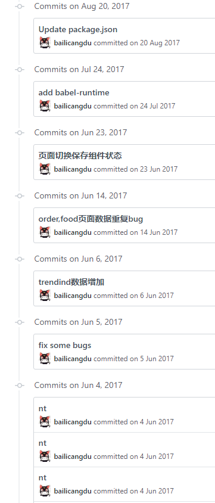
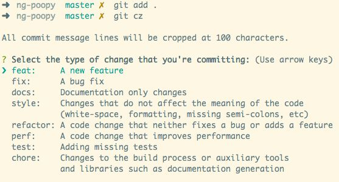

# Git Commit 提交规范

[[toc]]

git 是现在市面上最流行的版本控制工具，书写良好的 commit message 能大大提高代码维护的效率。但是在日常开发中由于缺少对于 commit message 的约束，导致填写内容随意、质量参差不齐，可读性低亦难以维护。

- 常见的不规范的效果：



- 规范的效果


## 规范化提交的意义

1. 提供更多的历史信息，方便快速浏览。

```js
git log HEAD --pretty=format:%s
```

使用上面命令，打印提交记录，每个 commit 占据一行。你只看行首，就知道每次提交的目的。


2. 通过工具 conventional-changelog 可以直接从 commit message 记录中生成 Change log。


3. 可读性好，清晰，不必深入看代码即可了解当前 commit 的作用。
4. 为 Code Reviewing 做准备
5. 提高项目的整体质量，提高个人工程素质

## 用什么规范

最早因为 Angular 团队的 Commit Message 提交记录格式实践的最好，慢慢在社区中被推广。

受到了 Angular 提交准则的启发，并在很大程度上以其为依据，在社区中定义了**约定式提交规范（Conventional Commits）**，它是一种具有更可读含义的轻量级约定。 它在基于 Angular 团队内部的准则基础上预定义了一组用于创建清晰的提交历史的简单规则；

> 官网 [约定式提交规范（Conventional Commits）](https://www.conventionalcommits.org/zh-hans/v1.0.0-beta.4/)

## 规范的格式

规范约定提交消息的格式：

```
<type>(<scope>): <subject>
<BLANK LINE>
<body>
<BLANK LINE>
<footer>
```

同 HTTP 消息的格式差不多，规范格式分为 header body footer 三部分，并以空行分隔。

### type: 提交消息的类型

type 用于指定 commit 的类型。依据 Angular 规范，提供了 type 类型包括：

- fix: 修复 bug
- feat: 增加新功能
- refactor: 即不是 BUG 修复，也不是新功能的代码改动
- style: 不影响代码含义的改动，例如去掉空格、改变缩进、增删分号
- perf: 提高性能的改动
- test: 添加测试或者修改现有测试
- build: 构造工具的或者外部依赖的改动，例如 webpack，npm, gulp, broccoli 等
- chore: 不修改 src 或者 test 的其余修改，例如构建过程或辅助工具的变动
- ci: 与 CI（持续集成服务）有关的改动，例如 Travis, Circle, BrowserStack, SauceLabs
- docs: 只改动了文档相关的内容
- revert: 执行 git revert 打印的 message

当然也可以使用后面介绍的`commitlint`工具可以自定义 `type-enum` 的值。但 fix feat 一般都是必要的，并且如果 type 为 feat 和 fix，则该 commit 将肯定出现在 Change log 之中。

### scope：用于描述改动的范围

scope 用于描述改动的范围，格式为项目名/模块名，例如： `node-pc/common` `rrd-h5/activity`。

- 如果一次 commit 修改多个模块，建议拆分成多次 commit，以便更好追踪和维护。
- 如果你的修改影响了不止一个 scope，你可以使用\*代替。

### subject: 简短的描述

描述字段是必须的，紧接在 类型/作用域 前缀的空格之后。一般都有字符长度限制，通常是 50 字符。

并注意：

- 以动词开头，使用第一人称现在时，比如 change，而不是 changed 或 changes
- 第一个字母小写
- 结尾不加句号（.）

### body: 正文

body 正文可选，如果有，必须与 subject 之间空一行，作为此次提交更为详细的描述。

描述通常使用第一人称现在时，比如使用 change 而不是 changed 或 changes。并且应该说明代码变动的动机，以及与以前行为的对比。

### footer：脚注内容

如果需要 footer , 同样需要与 body 正文之间空一行。脚注通常用于描述以下两类内容：

- Breaking Changes: 不兼容性的改变描述，且必须以大写的 `BREAKING CHANGE:`开头。如 `BREAKING CHANGE: isolate scope bindings definition has changed.`
- close issue: 关闭的 issue id。如 `Closes #234`

### revert

还有一种特殊情况，如果当前 commit 用于撤销以前的 commit，则必须以 revert:开头，后面跟着被撤销 Commit 的 Header。

```js
revert: feat(pencil): add 'graphiteWidth' option
```

## 约束规范的工具 Commitlint

> 与其费尽心思地告诉别人要遵守某种规则，以规避某种痛苦，倒不如从工具层面就消灭这种痛苦

同 ESLint 对 JS 代码的校验， Stylelint 对 CSS 代码的校验功能一样， `Commitlint` 工具就是用来校验你的 commit message 是不是符合所提交的**约定式提交规范（Conventional Commits）**

[官网 Commitlint](https://commitlint.js.org/)

### 1. install 安装

```
npm i -D @commitlint/cli
```

### 2. Cli 命令行

```
# 安装完成后，可以使用命令行查看可用的命令行参数
npx commitlint --help
```

> [commitlint CLI](https://commitlint.js.org/#/reference-cli)

### 3. 配置文件 `commitlint.config.js`

常用的提供一个配置文件，设置 commitlint 如何校验。

```
# 需求先安装相关依赖
npm i -D @commitlint/config-conventional @commitlint/format conventional-changelog-atom
```

```js
// commitlint.config.js
module.exports = {
  extends: ["@commitlint/config-conventional"], // 同 ESLint 一样，所有 rules 都是默认关闭的，如果不想一条条在 rulues 里手动配置，可以直接安装选择一个外部扩展来继承规则，官方指定的规则扩展是 @commitlint/config-conventional，也可以使用 @commitlint/config-angular
  parserPreset: "conventional-changelog-atom", // 指定规则解析器，可以选用外部安装包
  formatter: "@commitlint/format", // 指定 commitlint 校验结果输出的格式
  defaultIgnores: true, // 使用默认的忽略规则
  ignores: [(commit) => commit === ""], // 如果commitlint应该忽略给定的消息，则返回true的函数
  rules: {
    // 具体要覆盖的自定义规则
    "type-enum": [2, "always", ["foo"]],
  },
};
```

### 4. Rule 规则格式

一条规则包含以下内容：

- Level 错误级别：0 1 2
  - 0 : 该规则不生效
  - 1 ：warnnig 生成警告，但不退出
  - 2 ：error 错误，退出终止
- Applicable 是否适用
  - always : 始终适用
  - never ： 不能用
- Value 规则具体值

官方推荐的扩展 `@commitlint/config-conventional`的配置值 [@commitlint/config-conventional](https://github.com/conventional-changelog/commitlint/tree/master/@commitlint/config-conventional)

```js
// commitlint.config.js
module.exports = {
  rules: {
    "type-enum": [
      2,
      "always",
      [
        "build",
        "ci",
        "chore",
        "docs",
        "feat",
        "fix",
        "perf",
        "refactor",
        "revert",
        "style",
        "test",
      ],
    ],
    "type-case": [2, "always", "lowerCase"], // 小写 value: lower-case  upper-case camel-case pascal-case kebab-case snake-case start-case sentence-case
    "type-empty": [2, "never"], // 不能可以为空
    "type-max-length": [0],
    "type-min-length": [2, "always", 0],

    "scope-enum": [0],
    "scope-case": [2, "always", "lowerCase"],
    "scope-empty": [0],
    "scope-max-length": [0],
    "scope-min-length": [0],

    "subject-case": [2, "never"],
    "subject-empty": [2, "never"],
    "subject-full-stop": [2, "never"], // 结尾是否需要以 . 结尾
    "subject-max-length": [2, "never", 50],
    "subject-min-length": [0],

    "header-case": [0],
    "header-full-stop": [0],
    "header-max-length": [2, "always", 100],
    "header-min-length": [0],
    
    "body-case": [0],
    "body-empty": [0],
    "body-leading-blank": [2, "always"], // body 是否以空行开始
    "body-max-length": [2, "always", 120], // body 字符串长度
    "body-max-line-length": [2, "always"],
    "body-min-length": [2, "always", 0],

    "footer-empty": [0],
    "footer-leading-blank": [2, "always"],
    "footer-max-length": [0],
    "footer-max-line-length": [0],
    "footer-min-length": [0],

    "references-empty": [0, "never"],
    "signed-off-by": [2, "always", "'Signed-off-by:'"], // 输出的消息签名
  },
};
```

## 与 Husky 集成自动校验

```
npm install --save-dev husky
```

```js
// package.json
{
  "husky": {
    "hooks": {
      "commit-msg": "commitlint -E HUSKY_GIT_PARAMS"
    }
  }
}
```

这样，每次 git commit 时就会使用 `commitlint.config.js` 规则校验。

## Commitizen: 替代你的 git commit

> [优雅的提交你的 Git Commit Message](https://zhuanlan.zhihu.com/p/34223150) ---关注 Commitizen 部分

即使上面的插件和步骤都做完了，但实际在编写 git commit 时还是需要自己手动按约定式规则书写：

```
git commit -m 'fix(*): fixed some bug'
```

这样也是很累。可以使用 `Commitizen` 工具，它按照你提供的适配器模式，将上面 git commit 信息提交转为步骤式的书写。

- commitizen/cz-cli: 我们需要借助它提供的 git cz 命令替代我们的 git commit 命令, 帮助我们生成符合规范的 commit message.

另外，需要为 commitizen 指定一个 Adapter(适配器)，使得 commitizen 能按照适配器指定的规范生成 commit message.

> 这里提供了多个适配器选择[https://github.com/commitizen/cz-cli#adapters](https://github.com/commitizen/cz-cli#adapters)
- cz-conventional-changelog: 一个符合 Angular 团队规范的 preset，type 固定.
- cz-customizable：一个可以自定义规则的适配器，通过 .cz-config.js 自定义配置。
- cz-emoji: 一个可以使用 emojis 表情进行格式化 commit message 的适配器，并支持自定义选项和描述。

下面以 `commitizen` 搭配 `cz-conventional-changelog` 作示例。
### 全局安装

全局模式下, 需要 ~/.czrc 配置文件, 为 commitizen 指定 Adapter.

```
npm install -g commitizen cz-conventional-changelog
echo '{ "path": "cz-conventional-changelog" }' > ~/.czrc
```

### 项目内局部安装

推荐进行项目本地安装

```
npm i -D commitizen cz-conventional-changelog
```

package.json 中配置:

```js
"script": {
    ...,
    "commit": "git-cz",
},
"config": {
  "commitizen": {
    "path": "node_modules/cz-conventional-changelog"
  }
}
```

如果全局安装过 commitizen, 那么在对应的项目中执行 `git cz or npm run commit` 都可以。



## 自动生成 Change Log

如果你的所有 Commit 都符合**约定式提交规范（Conventional Commits）**的格式，那么发布新版本时， 要生成 Change log 就可以用脚本自动生成。

生成的文档包括以下三个部分：

- New features
- Bug fixes
- Breaking changes

每个部分都会罗列相关的 commit ，并且有指向这些 commit 的链接。当然，生成的文档允许手动修改，所以发布前，你还可以添加其他内容。

`conventional-changelog-cli` 插件就是生成 Change log 的工具，运行下面的命令即可。

```
# 安装
npm install -g conventional-changelog-cli

# 进入项目
cd my-project

# 运行命令
conventional-changelog -p angular -i CHANGELOG.md -s
```

如果这是你第一次用这个工具生成 CHANGELOG ，并且覆盖之前的，可以使用：

```
conventional-changelog -p angular -i CHANGELOG.md -s -r 0
```

也可以把这个命令写成 package.json 的 script 命令中：

```js
// package.json
{
  "script": {
    "changelog": "conventional-changelog -p angular -i CHANGELOG.md -s"
  }
}
```

`conventional-changelog-cli` 插件的配置项，使用 `npx conventional-changelog-cli --help` 查看：
```md
// options
-i, --infile              Read the CHANGELOG from this file 指定 CHANGELOG 
                          输入文件，用于合并上次的 CHANGELOG 记录
-o, --outfile             Write the CHANGELOG to this file, If unspecified, it prints to stdout
                          指定 CHANGELOG 输出文件，如果未指定输出到命令窗口
-s, --same-file           Outputting to the infile so you don not't need to specify the same file as outfile 
                          输出到与 infile 相同的文件中，所以如果输出文件与输入文件相同时，不需要指定 outfile
-p, --preset              Name of the preset you want to use. Must be one of the following:
                          angular, atom, codemirror, ember, eslint, express, jquery, jscs or jshint
                          CHANGELOG 输出格式的预设，只能是指定的几种。
-k, --pkg                 A filepath of where your package.json is located,Default is the closest package.json from cwd
                          指定package.json 文件所在路径，默认查找当前目录最近的 package.json
-a, --append              Should the newer release be appended to the older release,Default: false
                          新版本是否应该附加上旧版本上，默认值 false
-r, --release-count       How many releases to be generated from the latest, Default: 1
                          If 0, the whole changelog will be regenerated and the outfile will be overwritten
                          从最新版本生成多少个版本，默认值:1。如果为0，则将重新生成整个变更日志，并覆盖 outfile
--skip-unstable           If given, unstable tags will be skipped, e.g., x.x.x-alpha.1, x.x.x-rc.2
                          是否需要跳过不稳定的标签，例如，x.x.x-alpha。1, x.x.x-rc.2
-u, --output-unreleased   Output unreleased changelog
                          输出未发布的变更日志
-v, --verbose             Verbose output. Use this for debugging, Default: false
                          详细的输出。用于调试，默认值:false
-n, --config              A filepath of your config script 指定配置脚本的文件路径
                          Example of a config script: https://github.com/conventional-changelog/conventional-changelog/blob/master/packages/conventional-changelog-cli/test/fixtures/config.js
-c, --context             A filepath of a json that is used to define template variables
                          指定用于定义模板变量的json文件路径
-l, --lerna-package       Generate a changelog for a specific lerna package (:pkg-name@1.0.0)
                          为特定的lerna包生成一个变更日志(:pkg-name@1.0.0)
-t, --tag-prefix          Tag prefix to consider when reading the tags
                          读取 tag 标签时考虑定义的标签前缀 tag-prefix
--commit-path             Generate a changelog scoped to a specific directory
                          生成一个作用于特定目录的变更日志
```
## 总结

```
# 第一部分： commit message 格式校验
# 1. 安装 commitlint 及扩展
npm i -D @commitlint/cli @commitlint/config-conventional

# 2. 创建配置文件 commitlint.config.js
echo "module.exports = {extends: ['@commitlint/config-conventional']}" > commitlint.config.js

# 3. 集成 husky
npm install --save-dev husky

# 4. 更改 package.json 文件配置
{
  "husky": {
    "hooks": {
      "commit-msg": "commitlint -E HUSKY_GIT_PARAMS"
    }
  }
}

# 第二部分：完善 git commit 提交方式，避免手写约定格式
# 5. 用 Commitizen: 替代你的 git commit
npm i -D commitizen cz-conventional-changelog

# 6. 更改 package.json 文件配置
"script": {
    ...,
    "commit": "git-cz",
},
"config": {
  "commitizen": {
    "path": "node_modules/cz-conventional-changelog"
  }
}

#第三部分：自动生成 chnagelog
# 7. 生成 CHANGELOG
npm i -D conventional-changelog-cli

# 8. 在package.json 的 script 中增加命令
{
  "script": {
    "changelog": "conventional-changelog -p angular -i CHANGELOG.md -s -r 0"
  }
}
```

## 与 VS Code 集成

1. 安装`Git-commit-plugin For Vscode`插件包。
2. 使用 `ctrl + shift + p` 调出命令窗口，输入 `show git commit template`
3. 根据选择项提交信息

这个插件有三个配置项：
```js
// vscode 配置文件 setting.json
"GitCommitPlugin.MaxSubjectWords": 50, // Subject 简短描述行的字符长度
"GitCommitPlugin.ShowEmoji": false, // 是否启用 emoji 表情字符，因为如果开启也，那 commitlint 校验 type 要更改匹配的
"GitCommitPlugin.CustomCommitType": [ // 增加自定义的提交类型，可以直接 ['ui', 'merge']，或者像下面详细配置 label detail
  {
    "label": "ui",
    "detail": "修复了显示效果，如 css 修改等"
  },
  {
    "label": "merge",
    "detail": "代码分支合"
  },
]
```
## 实践案例

该实践主要想实现以下目的：
- 增加 `merge / ui`两种提交类型
- 提交交互提示信息转译成中文
- 统一命令行和IDE插件工具对 commit 的使用

所以 `commitizen` 的适配器选择了可自定义配置的 `cz-customizable`

```
# 第一部分： commit message 格式校验
# 1. 安装 commitlint 及扩展
npm i -D @commitlint/cli @commitlint/config-conventional husky

# 2. 创建配置文件 commitlint.config.js
touch commitlint.config.js

# 3. 修改配置文件，增加 merge / ui 提交类型
module.exports = {
  extends: ['@commitlint/config-conventional'],
  rules: {
    "type-enum": [2, "always", [
      "feat",
      "fix",
      "style",
      "ui", 
      "merge",
      "refactor",
      "perf",
      "chore",
      "docs",
      "test",
      "revert",
    ]],
  },
}

# 4. 创建配置文件 husky.config.js
module.exports = {
  "hooks": {
    "commit-msg": "commitlint -E HUSKY_GIT_PARAMS"
  }
}

# 第二部分：完善 git commit 提交方式，避免手写约定格式
# 5. 用 cz-customizable 作为 commitizen 的适配器
npm i -D commitizen cz-customizable

# 6. 修改 package.json 配置
"script": {
    "commit": "git-cz",
},
"config": {
  "commitizen": {
    "path": "cz-customizable"
  }
}

# 7. 创建 cz-customizable 的配置文件 .cz-config.js。完成自定义提交类型，并汉化提示信息
module.exports = {
  types: [
    { value: 'feat',      name: 'feat:      添加新功能' },
    { value: 'fix',       name: 'fix:       修复 BUG' },
    { value: 'style',     name: 'style:     修改了没有影响逻辑的代码, 如空格、缩进、逗号等' },
    { value: 'ui',        name: 'ui:        修复了显示效果，如 css 修改等' },
    { value: 'merge',     name: 'merge:     代码分支合并' },
    { value: 'refactor',  name: 'refactor:  代码重构，没有增加新功能或者修复BUG' },
    { value: 'perf',      name: 'perf:      优化相关，如提升性能、体验等' },
    { value: 'chore',     name: 'chore:     改变构建流程，或者增删依赖包、工具等' },
    { value: 'docs',      name: 'docs:      修改了文档' },
    { value: 'test',      name: 'test:      测试用例相关修改' },
    { value: 'revert',    name: 'revert:    回滚到上一个版本' },
  ],
  messages: {
    type: "选择要提交的更改类型:\n",
    scope: '指示此更改涉及的范围(可选):\n',
    customScope: '指示此次更改涉及的文件，多个文件用“*”(可选):',
    subject: '以动词开头简短地描述变化(≤50):\n',
    body: '提供更详细的变更描述，使用“|”换行(可选):\n',
    breaking: '列出任何破坏性的更改(可选):\n',
    footer: '列出这次更改关闭的问题 ISSUES CLOSED，如: #31, #34。(可选):\n',
    confirmCommit: '您确定要继续执行上面的提交吗?',
  },
  allowCustomScopes: true,
  allowBreakingChanges: ['feat', 'fix'],
  subjectLimit: 50,
  skipQuestions: ['breaking'],
}

#第三部分：自动生成 chnagelog
# 8. 生成 CHANGELOG
npm i -D conventional-changelog-cli

# 9. 在package.json 的 script 中增加命令
{
  "script": {
    "changelog": "conventional-changelog -p angular -i CHANGELOG.md -s -r 0"
  }
}

# 第四部：vscode 安装 Git-commit-plugin For Vscode 插件包
# 10. vscode 配置文件 setting.json 增加插件配置
"GitCommitPlugin.MaxSubjectWords": 50,
"GitCommitPlugin.ShowEmoji": false,
"GitCommitPlugin.CustomCommitType": [
  {
    "label": "ui",
    "detail": "修复了显示效果，如 css 修改等"
  },
  {
    "label": "merge",
    "detail": "代码分支合"
  },
]
```

## 参考链接

- [约定式提交规范（Conventional Commits）](https://www.conventionalcommits.org/zh-hans/v1.0.0-beta.4/)
- [commitlint 官网](https://commitlint.js.org/#/)
- [@commitlint/config-conventional github](https://github.com/conventional-changelog/commitlint/tree/master/@commitlint/config-conventional)
- [Angular commit message guidelines](https://github.com/angular/angular/blob/22b96b9/CONTRIBUTING.md#-commit-message-guidelines)
- [conventional-changelog-cli github](https://github.com/conventional-changelog/conventional-changelog/tree/master/packages/conventional-changelog-cli)
- [Commitizen github](https://github.com/commitizen/cz-cli)
- [git commit 规范指南](https://segmentfault.com/a/1190000009048911#item-6)
