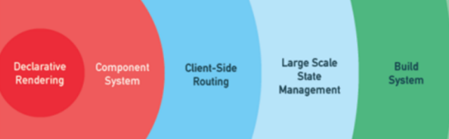

# Vue

Vue (读音 /vjuː/，类似于 view) 是一套用于构建用户界面的渐进式框架。

>按传统 web 页面架构`HTML` `CSS` `JS`的架构来归纳`Vue`的学习路径

**认识 Vue**

-   Vue 概述
-   MVC 模型和 MVVM 模型

**Vue 语法之视图构建 HTML**

-   指令系统
-   JSX

**Vue 语法之样式 CSS**

-   class 和 style 动态绑定

**Vue 语法之模型 JS**

-   基本内容： data/computed/watch/methods/filters/mixins
-   生命周期 lifecycle

**Vue 组件化核心**

-   组件概述
-   组件创建、注册、异步加载
-   组件三大核心概念： props event slot
-   组件间通信方式
-   vue 内置组件

**Vue 技术栈**

1. 构建项目脚手架`Vue-CLI`
1. 路由`Vue-Router`
1. 状态管理`Vuex`
1. 网络请求`Axios`
1. 项目构建`Webpack / vite + rollup`
1. 测试`Jest`
1. 同构`Vue-SSR`
1. 强类型`Typescript + vue-property-decorator`

**Vue 深入源码**

1. Vue 响应式原理 reactivity
    1. 侦测数据变化 detection chnage
    1. 收集依赖：（对象 / 数组) collect dependency
    1. 派发更新: (对象 / 数组) dispatch update
1. 初始化：Vue 构造函数及 Vue.prototype 原型对象
1. 实例化：new Vue => _init()
1. 挂载 $mount(selector)
    1. template 模板编译成 virtual DOM: compiler (parse => optimize => codegen)
    1. virtual DOM 生成真实 DOM 并挂载视图: render (create => diff => patch)
1. 组件 component
    1. 创建组件 createComponent
    1. 挂载组件 mountComponent
    1. 更新组件 updateComponent
    1. 内置组件实现 keepAlive / transition / transitionGroup / component
1. 指令实现：v-model / v-on / v-bind / v-if / v-show / v-slot
1. 事件系统: $on / $once / $off / $emit
1. 生命周期
1. Vue 全局 API：( Vue 和 Vue.prototype)
1. vm 实例 API
1. vue3 响应式原理
