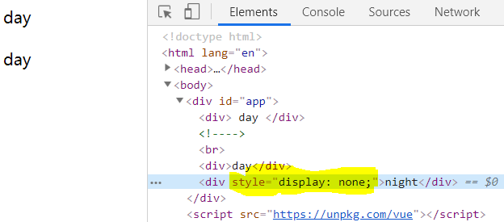

# 4 控制元素可见性的指令`v-if`和`v-show`

[[toc]]

## `v-if`指令

`v-if="value"`当value为真值时，绑定的元素显示；为假值时，绑定的元素不会被写入页面。

>假值falsy包括`false` , `nudefined`, `null`, `NaN`, `""`，除此为真值

```html
<div id="example">
    <p v-if="isMorning">Good morning</p>
    <p v-if="isAfternoon">Good afternoon</p>
    <p v-if="isEvening">Good evening</p>
</div>

<script>
    var hours = new Date().getHours();
    new Vue({
        el: "#app",
        data: {
            isMorning: hours < 12,
            isAfternoon: hours >= 12 && hours < 18,
            isEvening: hours >= 18,
        }
    )}
</script>
```
### `v-else`

同`if/else`一样，`v-if`也可以与`v-else`配合使用。非此即彼
```html
<div v-if="true">Day</div>
<div v-else>night</div>
```
>`v-else`不能单独使用，必须与`v-if`配合使用。但`v-if`可以独立使用。

### `v-else-if`

多重判断，可以使用`v-else-if`
```html
<div id="example">
    <p v-if="now === 'morning'">Good morning</p>
    <p v-else-if="now === 'afternoon'">Good afternoon</p>
    <p v-else-if="now === 'evening'">Good evening</p>
    <p v-else>now is wrong</p>
</div>
```
```js
<script>
    new Vue({
        el: "#app",
        data: {
            now: "morning" // afternoon or evening  or other
        }
    )}
</script>
```

## `<template>`

分组元素作为整块渲染，可以使用`<template>`作为虚拟的包裹元素，条件渲染分组，最终的渲染结果将不包含 `<template>` 元素
```html
<template v-if="true">
    <p>1</p>
    <p>2</p>
    <p>3</p>
</template>
<template v-else>
    <p>一</p>
    <p>二</p>
    <p>三</p>
</template>
```
    1
    2
    3

当然实际上，你也可以对分组元素包裹一个真正块状标签，如`<div>`标签，只是这样做会让页面多出一些无谓元素。
```html
<div v-if="true">
    <p>1</p>
    <p>2</p>
    <p>3</p>
</div>
<div v-else>
    <p>一</p>
    <p>二</p>
    <p>三</p>
</div>
```

## `key` 管理可复用的元素

Vue 框架的高效性体现在会尽可能复用已渲染的元素而不是从头开始渲染。这么做除了使 Vue 变得非常快之外，还有其它一些好处。

例如：模拟登录页面的输入框，允许用户选择不同的登录方式。那么在上面的代码中切换 loginType 将不会清除用户在切换前已经输入的内容。因为两个模板使用了相同的元素`lable`和`input`，如果用户没输入任何内容，也仅`input`框替换了它的 placeholder。

>代码中出现事件绑定指定`v-on:click`和逻辑层的方法`methods`，此节可忽略，后面会讲解。

[DEMO v-if中利用key来管理可复用的元素](https://jsrun.net/JsXKp/edit)

```html
<!-- 在input没有内容时点击按钮切换，和在input输入内容后再点击按钮切换，观察input的值变化 -->
<div id="app">
    <!--不添加key的效果 -->    
    <template v-if="!key">
        <template v-if="loginType === 'username'">
            <label>Username</label>
            <input placeholder="Enter your username">
        </template>
        <template v-else>
            <label>Email</label>
            <input placeholder="Enter your email address">
        </template>
    </template>
    
    <!--添加key的效果 -->
    <template v-else>
        <template v-if="loginType === 'username'" >
            <label>Username</label>
            <input placeholder="Enter your username" key="uername">
        </template>
        <template v-else>
            <label>Email</label>
            <input placeholder="Enter your email address" key="email">
        </template>
    </template>
    <button v-on:click="handleToggle">点击切换</button>
    <br/>
    <br/>
    <button v-on:click="changeKey">点击切换有KEY和无KEY的情形</button>
</div>
```
```js
new Vue({
    el: "#app",
    data: {
        loginType: "username",
        key: false,
        text: "点击看有KEY的情况"
        
    },
    methods: {
        handleToggle() {
            if (this.loginType === "username") {
                this.loginType = "email"
            } else if (this.loginType === "email") {
                this.loginType = "username"
            }
        },
        changeKey() {
            this.key = !this.key
        }
    }
})
```

## `v-show`指令

`v-show`的写法与`v-if`完全一样，看下在这段代码，在页面最终显示结果完全一样，但审查元素elements中的元素结构是不一样。

```html
    <div id="app">
        <div v-if = "true"> day </div>
        <div v-if = "false"> night </div>
        <br/>
        <div v-show = "true">day</div>
        <div v-show = "false">night</div>
    </div>
```


## `v-if`和`v-show`的区别

    v-if指令为假值时，绑定的元素不会显示，Vue也不会生成对应的DOM元素，等到为真假时才创建并添加到DOM树中。
    v-if指令每次显示都会创建元素并插入DOM树中，每次隐藏都会从DOM树中删除，绑定元素的显示和隐藏都需要更新DOM树。并且在v-if真假值的切换过程中，条件块内的事件监听器和子组件也会适当地被销毁和重建。所以v-if指令有很大的性能开销。
---
    v-show绑定的元素只在初始阶段被创建，并保留在 DOM 中。元素的显示与隐藏只是添加或删除元素的 CSS 属性 display:none。
    v-show 不支持 <template> 分组包裹元素，也不支持 v-else

所以如果某块内容需要频繁切换显示和隐藏，那最好用`v-show`指令绑定。

另外`v-show`也可能用于图片加载的优化。如果元素中包含图片，那么使用`v-show`绑定图片的父节点，一旦为真值时，图片会马上显示出来，因为在`v-show`为假值时图片已经被加载。如果是`v-if`指令，图片会等到`v-if`变为真值时才开始加载。

### `v-if=expression`和`v-show=expression` 值可以是表达式返回的`truthy` / `falsy`值

同`{{}}`插值中可以进行简单的表达式运算一样，`v-if`和`v-show`的值也可以是表达式，只要表达的结果是 `truthy`真值 或 `falsy`虚值 的值即可。
> 在 JavaScript 中，Truthy (真值)指的是在 布尔值 上下文中转换后的值为真的值。所有值都是真值

>falsy(虚值)是在 Boolean 上下文中已认定可转换为‘假‘的值。即false，0，""，null，undefined 和 NaN。

[传送门 `MDN`](https://developer.mozilla.org/zh-CN/docs/Glossary/Truthy)

```html
<div id="app">
    <p v-if="hours < 12">Good morning</p>
    <p v-if="hours >= 12 && hours < 18">Good afternoon</p>
    <p v-show="hours > 18">Good evening</p>
</div>
```

```html
<div id="app">
    <p v-if="obj.prop">如果属性值为truthy时显示，为falsy时不显示</p>
    <p v-show="arr[1]">也可以是数组中的某项值为truthy时显示，为falsy时隐藏</p>
</div>
```


