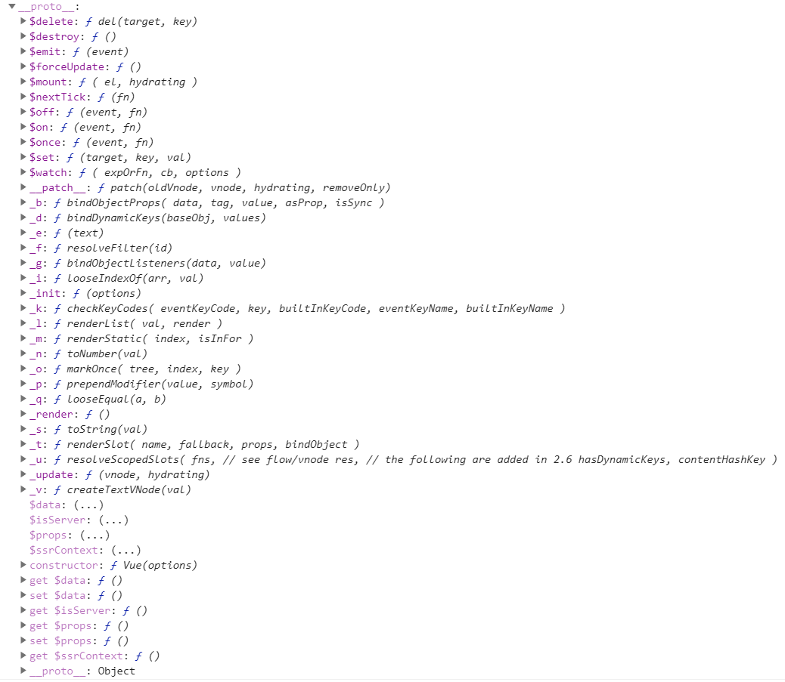
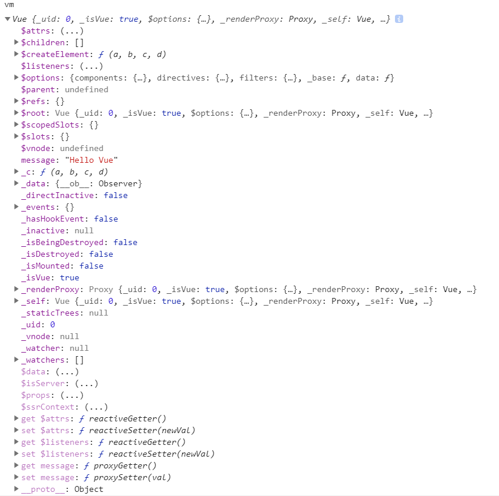

# Vue 构造函数及 new Vue 实例化

[[toc]]

以官网的一个简单例子开始，vue 的实例化的过程

```html
<div id="app" @click="handleClick">{{message}}</div>

<script src="https://cdn.bootcdn.net/ajax/libs/vue/2.6.12/vue.js"></script>
<script>
const vm = new Vue({
  data: {
    message: 'Hello Vue'
  },
  methods: {
    handleClick() {
      this.message = 'value change'
    }
  }
})
vm.$mount("#app")
</script>
```

## Vue 构造函数做了什么

1. 声明 Vue 构造函数
1. 向 Vue.prototype 原型对象挂载属性
1. 向 Vue 函数对象挂载全局 API
```js
function Vue (options) {
  if (!(this instanceof Vue)) {
    warn('Vue is a constructor and should be called with the `new` keyword');
  }
  this._init(options);
}

/**向 Vue.prototype 原型对象上挂载方法 */
initMixin(Vue); // Vue.prototype._init()
stateMixin(Vue); // Vue.prototype.$set = set / Vue.prototype.$delete = del / Vue.prototype.$watch() { new Watcher() }
eventsMixin(Vue); // Vue.prototype.$on / Vue.prototype.$once / Vue.prototype.$off / Vue.prototype.$emit
lifecycleMixin(Vue); // Vue.prototype.$forceUpdate / Vue.prototype.$destroy / Vue.prototype._update => vm.__patch__
renderMixin(Vue); // Vue.prototype.$nextTick / Vue.prototype._render
initGlobalAPI (Vue) // 全局api挂载 Vue.config/Vue.option / Vue.set / Vue.delete / Vue.nextTick / Vue.observable / Vue.use / Vue.mixin / Vue.components / Vue.directives / Vue.filters / Vue.extend 等
```
声明了一个 Vue 构造函数，接着用这个 Vue 构造函数作为入参，按功能组织代码向 Vue.prototype 原型对象上初始化各种属性，包括只在源码内部调用的内部属性，以_ 开头，如_patch/_update等。以及暴露出来供实例调用的内部属性，以 $ 开头，如 $set/$emit 等。


此时，我们可以打印 `Vue.prototype` 对象：



## `const vm = new Vue()` 做了什么

当我们调用 `new Vue()` 时， 做了两件：
- if 语句拦截了将 Vue 构造函数作为函数直接调用的情况，要求必须使用 new 调用构造函数。其中这里也可以使用 `new.target 是否 undefined`来判断，但该属性不兼容 IE。
- 核心代码是执行 `this._init()` 初始化函数。

> 注意，当 `new Vue()` 执行调用 `this._init()`时，通过下面的 `xxxMixin`函数已经在原型对象上完成了原型对象方法的初始化。所以在 `_init()`方法中可以使用所有 Vue.prototype 上的方法）。

具体看看，_init 函数做了什么？

1. 初始化实例对象 vm 的各种属性和方法
1. 适当时间调用 callHooks() 触发生命周期函数

```js
var uid$3 = 0;

function initMixin (Vue) {
  Vue.prototype._init = function (options) {
    var vm = this;
    // a uid
    vm._uid = uid$3++;

    // a flag to avoid this being observed
    vm._isVue = true;
    // merge options 合并处理 option
    if (options && options._isComponent) { // 如果是组件
      // optimize internal component instantiation
      // since dynamic options merging is pretty slow, and none of the
      // internal component options needs special treatment.
      initInternalComponent(vm, options);
    } else { // 本例到这里
      // 合并配置，将实例 vm.options 与 全局 Vue.options 合并，所以在全局注册的内容在各个组件也能调用。
      vm.$options = mergeOptions(
        resolveConstructorOptions(vm.constructor),
        options || {},
        vm
      );
    }
 
    // expose real self
    vm._self = vm;
    initLifecycle(vm); // 挂载内部属性：$root/$parent/$refs=[]/$children=[]/_watcher=null，以及一些生命状态标志 flag: _inactive=null/_isMounted=false/_isDestoryed=false/_isBeingDestoryed=false
    initEvents(vm); // 挂载父组件传入的事件监听器 listeners 到实例 vm._events 对象上，来源于 template 解析到的 v-on 绑定的事件函数
    initRender(vm); // 挂载 $attrs/$listeners，以及绑定 _c/$createElement
    callHook(vm, 'beforeCreate');
    initInjections(vm); // resolve injections before data/props 1. 解析 inject 属性的数据 resolveInject，从 _provided 取出值；2. 并将其在当前实例上转为getter/setter同时挂载到 vm 上，因为inject只读，所以setter是一个打印警告的自定义函数 warn
    initState(vm); // 初始 script 中的属性：initProps/initMethods/initData/initComputed/initWatch
    initProvide(vm); // resolve provide after data/props 将 provide 对象或函数赋值给 vm._provided 属性，供 initInjections 中使用
    callHook(vm, 'created');

    if (vm.$options.el) {
      vm.$mount(vm.$options.el);
    }
  };
}
```

此时，打印 vm 实例对象：
  

## vm.$mount("#app") 做了什么

在 Vue 源码中定义了两个 `prototype.$mount`：
- 一个是核心公共的 mount，主要是 render 渲染: vm._render 和 vm.update
- 一个是web平台重写的 mount，主要是模板解析compiler: parse / optimize / generate

我们看 web 环境下，vm.$mount('#app') 源码：

```js
// 先缓存核心的公共的 $mount 函数
var mount = Vue.prototype.$mount; 
// 在 web 平台下，重写 $mount 函数：主要处理：1. 解析拿到 template 字符串模板，2. 将 template 模板传入编译器，解析出 { render, staticRenderFns }
Vue.prototype.$mount = function ( el, hydrating) {
  el = el && query(el);

  /* 挂载点元素不能是 body 或者 document */
  if (el === document.body || el === document.documentElement) {
    warn(
      "Do not mount Vue to <html> or <body> - mount to normal elements instead."
    );
    return this
  }

  var options = this.$options;
  // resolve template/el and convert to render function
  // 1. 优先使用 render 属性，没有的话，就从 template 属性或 el 属性中解析出 template 模板字符串
  if (!options.render) { // 如果不存在 render
    var template = options.template;
    if (template) {
      if (typeof template === 'string') {
        if (template.charAt(0) === '#') {
          template = idToTemplate(template);
          /* istanbul ignore if */
          if (!template) {
            warn(
              ("Template element not found or is empty: " + (options.template)),
              this
            );
          }
        }
      } else if (template.nodeType) { // template 属性直接是 DOM 元素
        template = template.innerHTML;
      } else {
        {
          warn('invalid template option:' + template, this);
        }
        return this
      }
    } else if (el) { // 没有 template 属性，获取挂载点内的 html 节点
      template = getOuterHTML(el);
    }

    // 2. 如果解析出的 template 存在，则编译模板，返回 render 属性值。
    if (template) {
      /* istanbul ignore if */
      if (config.performance && mark) {
        mark('compile');
      }

      // 如果 template 值存在，则进行模板解析，创建渲染函数，赋值给 render 属性。
      var ref = compileToFunctions(template, {
        outputSourceRange: "development" !== 'production',
        shouldDecodeNewlines: shouldDecodeNewlines,
        shouldDecodeNewlinesForHref: shouldDecodeNewlinesForHref,
        delimiters: options.delimiters,
        comments: options.comments
      }, this);
      var render = ref.render;
      var staticRenderFns = ref.staticRenderFns;
      // 赋值给 options，即 vm.options.render
      options.render = render;
      options.staticRenderFns = staticRenderFns;

      /* istanbul ignore if */
      if (config.performance && mark) {
        mark('compile end');
        measure(("vue " + (this._name) + " compile"), 'compile', 'compile end');
      }
    }
  }
  // 完成模板编译后，调用核心公共的 $mount 方法，进行渲染
  return mount.call(this, el, hydrating)
};
```
看看公共的 $mount 函数，主要是调用 `mountComponent`函数
```js
Vue.prototype.$mount = function ( el, hydrating) {
  el = el && inBrowser ? query(el) : undefined;
  return mountComponent(this, el, hydrating)
};
```
`mountComponent(vm,el, hydrating)` 函数主要完成两件事：
- 创建组件更新的回调函数 `updateComponent`，核心代码是 `vm._update(vm._render())`
- 创建组件 render-watcher，创建依赖 `new Watcher()` 的同时，调用 `this.get()` ，触发 `this.getter()`调用，开始依赖收集，使回调函数 updateComponent 执行，完成渲染。

```js
function mountComponent ( vm, el, hydrating) {
  vm.$el = el;
  // 如果模板编译后，仍不存在 render 属性，则判断一个注释的空节点挂载
  if (!vm.$options.render) {
    vm.$options.render = createEmptyVNode;
    {
      /* istanbul ignore if */
      if ((vm.$options.template && vm.$options.template.charAt(0) !== '#') ||
        vm.$options.el || el) {
        warn(
          'You are using the runtime-only build of Vue where the template ' +
          'compiler is not available. Either pre-compile the templates into ' +
          'render functions, or use the compiler-included build.',
          vm
        );
      } else {
        warn(
          'Failed to mount component: template or render function not defined.',
          vm
        );
      }
    }
  }
  callHook(vm, 'beforeMount');

  var updateComponent;
  /* istanbul ignore if */
  if (config.performance && mark) {
    updateComponent = function () {
      var name = vm._name;
      var id = vm._uid;
      var startTag = "vue-perf-start:" + id;
      var endTag = "vue-perf-end:" + id;

      mark(startTag);
      var vnode = vm._render();
      mark(endTag);
      measure(("vue " + name + " render"), startTag, endTag);

      mark(startTag);
      vm._update(vnode, hydrating);
      mark(endTag);
      measure(("vue " + name + " patch"), startTag, endTag);
    };
  } else {
    // 核心代码，触发组件渲染：_render 创建 vdom; vm._update 根据 vdom 创建真实 dom 并挂载。
    updateComponent = function () {
      vm._update(vm._render(), hydrating);
    };
  }

  // we set this to vm._watcher inside the watcher's constructor
  // since the watcher's initial patch may call $forceUpdate (e.g. inside child
  // component's mounted hook), which relies on vm._watcher being already defined
  // 创建组件依赖 render watcher
  new Watcher(vm, updateComponent, noop, {
    before: function before () {
      if (vm._isMounted && !vm._isDestroyed) {
        callHook(vm, 'beforeUpdate');
      }
    }
  }, true /* isRenderWatcher */);
  hydrating = false;

  // manually mounted instance, call mounted on self
  // mounted is called for render-created child components in its inserted hook
  if (vm.$vnode == null) {
    vm._isMounted = true;
    callHook(vm, 'mounted');
  }
  return vm
}
```

其中 `vm._render` 和 `vm.update` 函数分别完成 virtual DOM 创建 和 vnode 更新和挂载。具体见上面视图渲染章节分析。

## message 值改变引发了什么

message 的变化会触发响应式代码的 setter，然后触发埋点 dep.notify，导致 render-watcher 执行，即 updateComponent 函数再次执行。具体响应式回路见上面响应式章节分析。

> 1.依赖收集其实就是收集每个数据被哪些Watcher（render-Watcher、computed-watcher、user-watcher）所引用，当这些数据更新时，就去通知依赖它的Watcher去更新。<br> 2. 依赖创建的同时，即完成依赖收集。因为 new Watcher 中调用 this.get，会触发 this.getter 执行开始依赖收集。

## 总结

源码可以分为两条主线：
1. Vue 构造函数初始化和 new Vue 实例化（即_init执行的一系列初始化），这里可以细分为全局 Vue 实例和组件实例过程。
1. 模板编译 parse / optimize / generate 生成代码字符串，到_.render 中 new VNode，至最后 _.update 中 patch 过程。