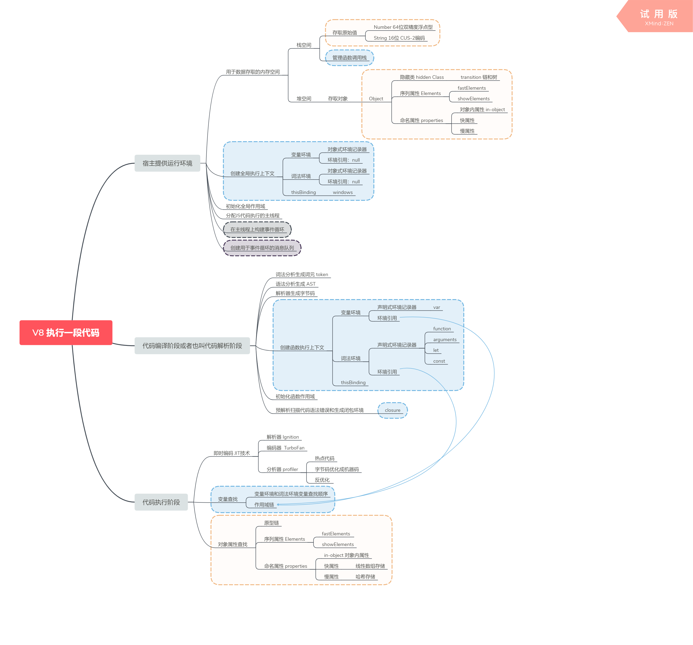

# EcmaScript

**从V8执行过程串起ES的主要知识脉路**

主要分三大部分：
1. ES中各种数据类型在内存堆栈中存储结构  ----> 对应[数据类型](/ES/type-0-index)中的内容
1. 执行上下文中概念 -----> 对应[函数运行时的概念](/ES/fn-3-runtime)
1. 事件循环和消息队列  ----> 对应[异步编程](/ES/async-0-history)

**目录**

- 前言
  - 软件概念
    - 计算领域五大学科
    - 程序与编程
    - 高级编程语言和低级编程语言
    - 高级编程语言通用概念
  - EcamScript历史
    - 创造JavaScript
    - 时间轴
    - 里程碑
    - EcamScript特性
- 基本语法
  - 表达式和操作符
    - 赋值运算符
      - 等号：`=`
      - 解构赋值
      - 展开运算符 spread (...)
    - 算术运算符
      - 加减乘除余幂： `- * / % **`
      - 加号运算符：`+`
    - 位运算符：`>> << & | ^`
    - 复合的运算符
      - 数值的复合算术运算符：`*= /=  %=  -= +=`
      - 位运算的算命运算符：`<<= >>= &= ^= |=`
      - 字符拼接复合运算：`+=`
    - 比较运算符：`> < == != === !== >= <=`
    - 逻辑运算符：`&& || !`
    - 条件运算符：`? :`
    - 逗号运算符：`,`
    - 括号运算符：`( )`
    - 类型检测运算符：typeof / instanceof
    - 对象属性相关操作符：点号. / 中括号[] / in / delete
    - 构造函数相或类相关的操作符：new / new.target / super / this / class
    - 其它：void / function* 和 yield  / async 和 await
  - 变量
    - 变量的命名规范
    - 变量的声明方式
    - 变量的初始值
    - 变量的生命周期
    - 变量的作用域范围
    - 变量提升
    - 全局变量
    - 常量
  - 语句
    - 声明语句
      - 标识符和变量声明（var / let / const / function / class / import）
    - 流程控制语句
      - 分支语句：if-else / switch-case / try-catch
      - 循环语句：for / for-in / for-of / forEach / while / do-while
      - 中断或跳转语句：return / throw / break / continue / debugger
  - 其它概念
    - 标识符
    - 关键字
    - 字面量
    - 注释
    - 分号
  - 严格模式 'use strict'
- 数据类型
  - 数据：二进制存储
  - 类型分类
    - 原始值类型：undefined null boolean number string symbol bigint
    - 引用类型
  - 类型检测
  - 原始值包装对象
  - 类型转换
  - 数据在内存中的存储形式
    - number: 64位双精度浮点数
      - 浮点数
      - IEEE-754 标准
    - string: 采用2字节16位的 UCS-2编码
      - 字符、字形、编码、解码概念
      - ASCII 编码
      - Unicode 编码：分层、区块、码位
      - UTF-32 / UTF-16 / UTF-8
      - UCS-2
      - string.length 的问题
      - Unicode 解码
      - 转义字符
    - symbol
      - Symbol类型的创建
      - Symbol类型的特征
      - Symbol全局注册表 和 全局Symbol
      - 系统Symbol
    - object
      - 序列属性
      - 基本属性
      - 快属性
      - 慢属性
- 面向对象
  - 理解面向对象：基于原型和基于类
  - 对象创建
    - 字面量形式
    - 通过 Object.create()
    - 通过构造函数 new + Function
    - 通过类 new + Class
  - 对象属性
    - 属性分类
      - 数据属性
      - 访问器属性
      - 内部属性
    - 属性描述符：设置对象属性的可操作性
      - 是否只读 writable
      - 是否能枚举 enumerable
      - 是否能删除或是否可配置 configurable
    - 属性定义
      - 点.
      - 中括号[]
      - Object.defineProperty() / Object.defineProperties()
    - 属性操作
      - 操作对象属性
        - 获取属性
        - 遍历属性
        - 删除属性
      - 操作整个对象
        - 阻止扩展对象
        - 封闭对象
        - 冻结对象
  - 原型与原型对象
    - 对象原型`[[prototype]]`
    - 构造函数原型`F.prototype`
    - 原生原型`Object.prototype`
    - 纯对象`Object.create(null)`
  - 构造函数实现面向对象
  - class实现面向对象
- 函数 Function
  - 认识函数：函数对象的内存形式
  - 函数种类
    - 普通函数
    - 构造器函数 constructor
    - 箭头函数 Arrow Function
    - 生成器函数 Generator
  - 函数创建
    - 函数声明
      - 具名函数声明
      - 匿名函数声明
    - 函数表达式
      - 匿名函数表达式
      - 具名函数表达式
    - 函数构造器创建 Function(arg1,arg2,..., funBody)
    - 函数声明 VS 函数表达式
  - 函数调用
    - 作为普通函数调用
    - 作为构造器函数调用（使用new 创建对象）=> 如何限制函数只作为构造器函数：1. 严格模式；2. new.target
    - 作为对象方法调用（obj.method）
    - 作为泛型方法调用（借调方法，使用call/apply/bind调用）
    - 作为右值表达式调用（自执行函数IIFE：括号（）、void、+ 、 - 、 ~）
  - 函数参数
    - 形参 parameter
    - 实参 argument
    - rest参数 和 spread参数
    - 参数默认值
    - 参数列表和具名参数
    - 隐含参数 this arguments
  - 函数运行时
    - 函数运行的两个阶段：编译阶段（标识符映射）和执行阶段
    - 函数声明提升
    - 执行上下文
      - 变量环境
      - 词法环境
      - 外部引用 scope （静态作用域）
      - this （动态作用域）
    - 作用域
    - 作用域链
    - 闭包
  - 高阶函数（函数作为一类对象，或者说一等公民的特性之一）
    - 函数入参
    - 返回函数
    - 函数嵌套
    - 函数回调
    - 函数递归
    - 函数柯里化
  - 函数技巧
    - 存储函数
    - 自记忆函数
    - 模拟私有变量
- 内置对象
  - GlobalThis，以及对象分类
  - Boolean
  - Number
  - String
  - Array
  - Map
  - Set
  - WeakMap / WeakSet
  - Date
  - RegExp
  - Error
- 异步编程
  - 回调
  - Promise
  - Generator
  - Async
- ES二进制流操作
  - ArrayBuffer
  - TypeArray
  - DataView
- 其它
  - es错误捕获
  - 模块规范
- ES Next 新特性目录

**参考资料**

《JavaScript程序设计》、《JavaScript高级程序设计》、《深入理解JavaScript》 
ECMAScript 6 入门：[http://es6.ruanyifeng.com/](http://es6.ruanyifeng.com/) 
[ECMAScript5.1中文版](http://yanhaijing.com/es5/) 
[ECMAScript 5（w3c 中文版）](https://www.w3.org/html/ig/zh/wiki/ES5) 
[李战：悟透JavaScript](https://yq.aliyun.com/articles/251558?spm=5176.11065265.1996646101.searchclickresult.5eac4d56CDJMaH) 

