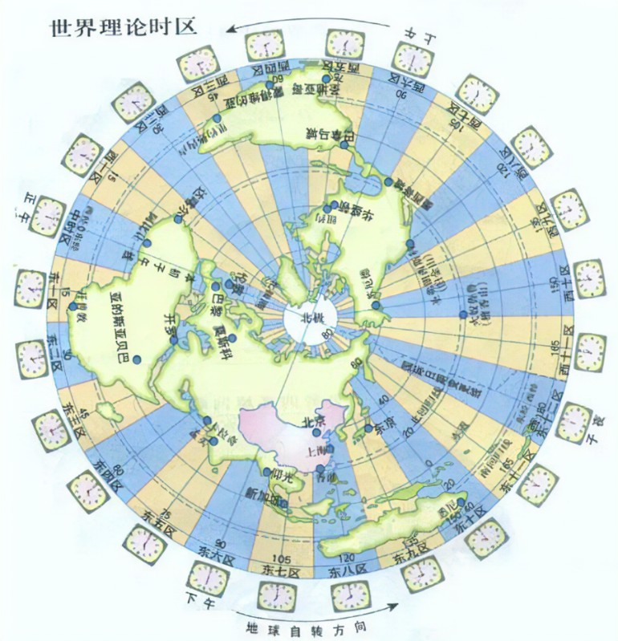
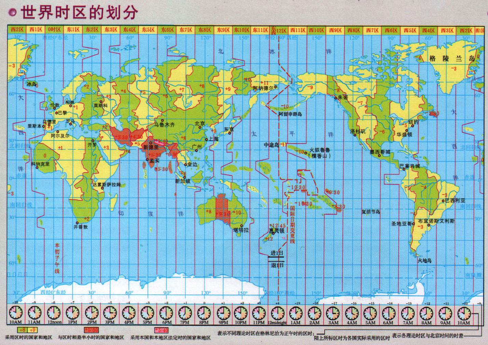
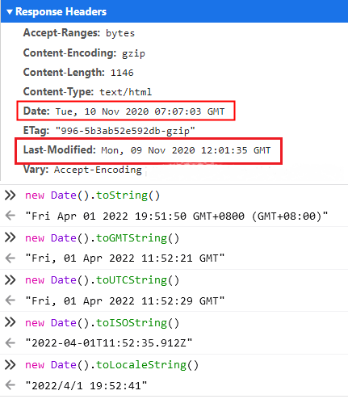

# Date

[[toc]]

## 时间单位

- 银河年：也称宇宙年，是太阳系在轨道上绕着银河系中心公转一周的时间，估计在2.25亿至2.5亿“地球年”之间 。
- 千年：是跨越一千年的时间跨度。
- 世纪：指连续的一百年，一个世纪一百年。
- 年代：一个世纪为100年，按每10年为一个历史时期，进行划分为10个年代，依次叫做10年代，20年代，30年代......90年代，100年代。
- 年：地球在轨道上绕太阳公转一周的时间。现代公历里，平年一年为365天（包含52周1天），闰年一年为366天（包含52周2天）。
- 季度：就是把一年平均分成四份，按照春、夏、秋、冬的顺序一年可以分为四个季度，每个季度历时3个月。第一季度：1月－3月；第二季度：4月－6月；第三季度：7月－9月；第四季度：10月－12月。
- 月：以传统月相来判断，一个朔望月周期为一个月，朔是看不到月亮，此时地球在太阳和月球中间；望是满月，月球在太阳和地球中间。理论上，月球在轨道上绕地球公转一周的时间约27.32天，但是因为地球自身也在绕太阳公转，在约27.32天之后日、地、月还不能共线，所以月相还没有完成一个周期，再次出现三星共线，月相变化才算是完成了一个周期，此时大约是27.32天+2.21天=29.53天，大约30天。至少月份有时28天、29天、31天，则与[儒略历法](https://zhuanlan.zhihu.com/p/25109680)有关。
- 旬：本义是十日，一月可以分为三旬，分别为上旬、中旬和下旬。旬的概念从夏朝开始已经存在，在甲骨文中就有旬字。中国古代天干纪日,每十日周而复始,称一旬。因此专门用一个“旬”字来表示这个时间概念。中国人仍然使用旬来表示十天这个时间，同时旬也可以作为十岁讲。如：八旬老者等。
- 周：星期，是古巴比伦人创造的一个时间单位，一个星期为七天。后来犹太人把它传到古埃及，又由古埃及传到罗马，公元3世纪以后，就广泛地传播到欧洲各国。明朝末年，它也随基督教传入了中国，因而称为礼拜，在民国成立后改称星期，所以在中文语境中，礼拜一和礼拜二同星期一和星期二。
- 日：地球自转一周的时间。
- 小时：古代把一天分12个时辰，采用十二地支作为时辰名称（[子丑寅卯辰巳午未申酉戌亥](http://www.guoxue.com/?p=4025)），北宋时开始将每个时辰分为“初”、“正”两部分，把十二时辰为二十四小时，称“小时”，也刚好与公历历法中的24小时对应。
- 分钟：一小时60分钟。
- 秒：一分钟60秒。秒是国际单位制中时间类的基本单位，符号是s。国际单位制(SI)和基本单位分为：长度(米m)、质量(千克kg)、时间(秒s)、电流(安A)、温度(开K)、发光强度(坎cd)、物质的量(摩mol)。

> 1小时等于60分钟，1分钟等于60秒，这大概是跟9000年前的苏美尔人那里学的。古代需要对士兵分组，需要分地，需要分粮食，为了好分，苏美尔人发明了60进制，因为60可以被2、3、4、5、6、10整除或分组。后来两河流域的巴比伦人在计时上学习了60进制。后来，全人类广泛推广并使用10进制，但人们早已经习惯了用60进制计算时间，习惯了也就懒得改了。1秒再细分的话就采用10进制了，例如，1秒等于10分秒等于100厘秒等于1000毫秒。

## 时间相关概念

### 时区
每当太阳当头照的时候，就是中午12点钟。但不同地方看到太阳当头照的时间是不一样的。所以如果各地方都有自己的本地时间标准。在18世纪，随着世界各国之间贸易往来，时间的不一致带来很多不便。在1879年，加拿大铁路工程师伏列明提出了“区时”的概念，这个建议在1884年由世界20多个国家的天文工作者在美国华盛顿召开的国际会议上得到认同，由此正式建立了统一世界计量时刻的“区时系统”。

区时系统规定，整个地球的表面就被划分为24个时区。以英国伦敦的格林威治天文台子午仪中心的一条经线作为零度参考线，即本初子午线；然后每向东或者向西间隔15°划分经度，分为东西经15°、东西经30°、东西经45°……直到180°经线。然后在每条经线东西两侧各7.5°范围内的所有地点，一律使用该经线的地方时作为标准时刻。
“区时系统”在很大程度上解决了各地时刻的混乱现象，使得世界上只有24种不同时刻存在， 而且由于相邻时区间的时差恰好为1个小时，这样各不同时区间的时刻换算变得极为简单。因此，一百年来，世界各地仍沿用这种区时系统。

> 为什么在美国华盛顿开会，确定英国伦敦作为时间中心点呢？主要是因为当时大部分的船只都已经以格林威治子午线做为参考标准，毕竟曾经的英国可是日不落帝国，大航海时代末便开始称霸世界。

> [二十四时区制的诞生渊源：美国铁路系统对于各地太阳时差异的解决](https://baike.baidu.com/tashuo/browse/content?id=aa3243d25266861aa52f989f&lemmaId=3389449&fromLemmaModule=pcBottom&lemmaTitle=%E5%A4%AA%E9%98%B3%E6%97%B6)




### 格林威治时间 GMT

**格林威治时间(Greenwich Mean Time)**，用 **GMT** 标识，它规定太阳每天经过位于英国伦敦郊区的皇家格林威治天文台的时间为中午12点。
```js
console.log(new Date()) // Thu Mar 31 2022 17:10:20 GMT+0800 (GMT+08:00)
```
因为世界时区划分是以格林威治天文台子午仪中心的一条经线作为零度参考线（叫本初子午线），所以格林威治时间也称为世界时间标准。

1972年之前，格林威治时间（GMT）一直是世界时间的标准。1972年之后，GMT 不再是一个时间标准了。

GMT 计量标准是根据地球自转和公转来计算时间的，自转一圈是一天，公转一圈是一年，但是由于地球在它的椭圆轨道里的运动速度不均匀，这个时刻可能和实际的太阳时相差16分钟。 地球每天的自转是有些不规则的，而且正在缓慢减速。误差较大给人感觉时间不那么“精准”了，因此现代社会迫切需要一个更加精准的方案来计时，所以UTC诞生了。

### UTC

UTC（Coodinated Universal Time），协调世界时，又称世界统一时间、世界标准时间、国际协调时间。由于英文（CUT）和法文（TUC）的缩写不同，作为妥协，简称UTC。

UTC 时间是经过平太阳时（以格林威治时间GMT为准，也就是）、以秒为单位的国际原子时，以及地轴运动修正后的新时标综合精算而成。
- 平太阳时，就是以格林威治时间GMT为准，我们日常生活中所使用的时间。
- 原子时，指的是以精确的原子时秒来定义的基础时间。原子时秒的定义是以化学元素铯(-133)的原子基态的两个超精细能级间在零磁场下跃迁辐射9,192,631,770周所持续的时间。

> 1967年第十三届国际计量大会(CGPM)决定，把在海平面实现的上述原子时秒，规定为国际单位制中的时间的基本单位，也就是单位秒。全世界大约有20多个国家的不同实验室分别建立了各自独立的地方原子时。国际时间根据比较、综合世界各地原子钟数据，最后确定的原子时，称为国际原子时，简称TAI。

UTC 比 GMT来得更加精准，两者误差值必须保持在0.9秒以内，若大于0.9秒则由位于巴黎的国际地球自转事务中央局发布闰秒，使 UTC 与地球自转周期一致。

总结：GMT 和 UTC
- 格林尼治标准时间的正午12点整是指当太阳横穿格林尼治子午线时的时间。属于旧标准时间。
- UTM 是一种以原子时为基础的更加精确的时间计量系统。在精确到秒的情况下，通常将 GMT 和 UTC 视作等同。成为新的标准时间。

### 本地时间
在日常生活中所使用的时间我们通常称之为本地时间。这个时间等于我们所在（或者所使用）时区内的当地时间，它由与世界标准时间(UTC)之间的时区偏移量来定义，东时间的时差为正，西时区为负。

时区的划分是没有考虑地球上的海陆分布和政治疆界的，大多数国家都不可能正好跨一个时区，所以在现实当中，世界各图往往根据本国具体情况，在区时的基础上，采用一些特别的计时方法。比如中国幅员辽阔，中国东西横跨5个时区，但考虑到不同地区的沟通和协调，统一采用北京时间，即首都北京所在的东8区的区时，即东经120°经线上的地方时，作为全国统一使用的标准时间。



### ISO8601

ISO 是国际标准化组织，其中 ISO8601 是日期和时间的标准规范，全称为数据存储和交换形式·信息交换·日期和时间的表示方法。第一版为ISO8601:1988，第二版为ISO8601:2000，目前最新为第三版ISO8601:2004。

ISO8601 规定了一种明确的、在全球范围内，不管是人还是计算机都能理解的显示日期和时间的方式。这样消除各种本地惯例、文化和时区对全球业务产生的影响。

几个常见的规范约束如下。

日期和时间有两种表示形式：
- 基本格式：只使用数字表示。
- 扩展格式：日期年月日使用短横线"-"间隔，时间时分秒使用冒号":"间隔。
#### 日期表示法
- 年：由4位数字组成YYYY，或者带正负号的四或五位数字表示±YYYYY。以公历公元1年为0001年，以公元前1年为 0000年，公元前2年为-0001年，其他以此类推。
- 月、日用两位数字表示：MM、DD。

比如：
- 2015年7月，基本格式：201507；扩展格式：2015-07。
- 2021年7月13日，基本格式：20210713；扩展格式：2021-07-13。

> 最新的ISO8601:2004不再允许缺省（默认）世纪，仅用两位数字表示年，这会与小时数的表示相混淆。而旧规范 ISO 8601:2000，以及基于旧规范的GB/T7408-2005，尚还存在这一问题。

#### 星期表示法
可以用2位数表示年内第几个日历星期，再加上一位数表示日历星期内第几天，每个星期从星期一开始，星期日为第7天。在书写时要在年和星期之间要加上一个大写字母W(Week)。

比如：2004年5月3日，即2004年第19周周一，基本格式：2004W191，扩展格式：2004-W19-1。

#### 时间表示法
小时、分和秒都用2位数表示。基本格式使用全数字，扩展格式通过冒号":"，间隔小时、分、秒。如果有秒后面的单位，如纳秒，以正常小数点开始。

- 午夜，一日的开始：基本格式表示为000000，扩展格式为00:00:00；仅有小时和分表示为0000或00:00
- 午夜，一日的终止：基本格式表示为240000，扩展格式为24:00:00；仅有小时和分表示为2400或24:00
- 14:20:18.992847200 表示14点20分18秒992847200纳秒。


#### 时间加时区
- 零时区，在时间最后加一个大写字母Z(Zoom)。Z是相对零时区偏移量的代号。比如在零时区的时间是下午2点30分5秒，则表示为 14:30:05Z 或 143005Z ；如果只表示小时和分，可以表示为14:30Z 或 1430Z ；如只表示小时，则为14Z。
- 其他时区，则用实际时间加时差表示，时差是当前时区相对零时间的时区偏移量，东时间的时差为正，西时区为负。比如北京时间晚上10点30分5秒，因为北京属于东8区，表示为 +0800 或 +08:00，所以基本格式表示为223005+0800，扩展格式表示为22:30:05+08:00，也可以简化成223005+08。
- 如果缺省时区默认为本地时间。

> 时区的计算
> 经度换算时区：如果已知经度，不知时区，求时区序号数。时区的序号=该地经度÷15=商+余数。若余数大于7.5°，则所求时区序号为商数加1。该地为东经度即在东时区，该地在西经度即在西时区。
> 时区差：若两地同在东时区或同在西时区，则求时区差为减法（大数减去小数）；若两地不同在东时区或西时区，则求时区差为加法，即：时区差=东时区序号+西时区序号。
> 计算跨时区时间：目标地的时间=（已知地的时间±时区差）×1小时。目的地在东半球用加号+，在西半球用减号-。如果求出的时间大于24小时，则减24，日期加1天；若所求时间为负值，则加24，日期减去一天。

#### 日期时间组合表示法
日期和时间组合表示时，需要在日期和时间之间加大写字母T(Time)。

比如北京时间2004年5月3日下午5点30分8秒，北京处于东八区，基本格式表示为：20040503T173008+0800，扩展格式表示为2004-05-03T17:30:08+08:00。

#### 时间段表示法
如果要表示某一作为一段时间间隔，前面加一大写字母P，并且时间段后都要加上相应的代表时间的大写字母。

比如时间段：一年三个月五天六小时七分三十秒内，可以写成：P1Y3M5DT6H7M30S。

#### 时间间隔表示法
从一个时间开始到另一个时间结束，或者从一个时间开始持续一个时间间隔，要在前后两个时间（或时间间隔）之间放置斜线符"/"。

格式为以下中的一种：
```
<起始時間>/<結束時間> 如：19850412/19860101
<起始時間>/<時長>    如：19850412/P6M
<時長>/<結束時間>    如：P6M/19860101
```
#### 循环时间表示法
以大写字母R开头，格式为：`R[循环次数][/开始时间]/时间间隔[/结束时间]`

- 比如要从2004年5月6日北京时间下午1点起时间间隔半年零5天3小时循环，且循环3次，可以表示为 R3/20040506T130000+08/P0Y6M5DT3H0M0S
- 比如以1年2个月为循环间隔，无限次循环，最后循环终止于2025年1月1日，可表示为R/P1Y2M/20250101

> 中华人民共和国国家标准GB/T 7408-2005《数据元和交换格式 信息交换 日期和时间表示法》与ISO 8601:2000等效采用。


### RFC2822

RFC2822: [Standard for ARPA Internet Text Messages](https://datatracker.ietf.org/doc/html/rfc2822)(ARPA 互联网文本消息的标准)，主要是用于电子邮件和HTTP网络报文的头字段格式。

其中 RFC2822: Date and Time Specification 小节中定义了日期和时间的语法和语义。
```
date-time    =   [ day-of-week "," ] date FWS time [CFWS]   # 星期可选，FWS：folding white space token 空白标志
day-of-week  =   ([FWS] day-name) / obs-day-of-week
day-name     =    "Mon" / "Tue" / "Wed" / "Thu" /
                 "Fri" / "Sat" / "Sun"
date         =   day month year
year         =   4*DIGIT / obs-year
month        =   (FWS month-name FWS) / obs-month
month-name   =   "Jan" / "Feb" / "Mar" / "Apr" /
                 "May" / "Jun" / "Jul" / "Aug" /
                 "Sep" / "Oct" / "Nov" / "Dec"
day          =   ([FWS] 1*2DIGIT) / obs-day
time         =   time-of-day FWS zone
time-of-day  =   hour ":" minute [ ":" second ]
hour         =   2DIGIT / obs-hour
minute       =   2DIGIT / obs-minute
second       =   2DIGIT / obs-second
zone         =   (( "+" / "-" ) 4DIGIT) / obs-zone
```
其它相关的规范还有:
- RFC1123 是RFC822的升级；相对于RFC822，将2位数年份改成4位数。
- RFC1945 是关于 HTTP/1.0 头字段语义规范，RFC7231 是关于 HTTP/1.1 头字段的语义规范，其中关于日期时间的要求是必须使用格林威治时间GMT表示，并且首选 RFC 822（updated by RFC 1123） 规范中关于日期时间的语法。



### UNIX纪元

- 纪元（Epoch）是指具有历史意义的某一刻，其实就是一个参考点。
- UNIX纪元是目前计算机系统使用的时间纪元，1970-01-01-00:00:00 称为 Unix 纪元的时间零点，以后的时间是正的，之前的时间就是负值。

这个时间是Unix 之父：肯.汤普逊(Ken Thompson) 和丹尼斯里奇(Dennis Ritchie) 选择的。为什么 Unix 系统中纪元的时间是 1970 年？
有一种说法是Unix 操作系统诞生于 1970 年，但实际上并不是的。在 1969 年左右，Unix 最早版本已经诞生了。Wired 网站上的一篇文章写道：Ritchie 说这个时间其实是随意选择的，因为需要一个统一的日期来作为时间的起点，而1970年的元旦，看起来是最方便的。于是就把纪元时间从1971-01-01调整到1970-01-01了。

> 1969年8月,贝尔实验室的程序员肯汤普逊使用B编译语言在老旧的PDP-7机器上开发出了Unix的一个版本。随后，汤普逊和同事丹尼斯里奇改进了B语言，开发出了C语言，重写了Unix，新版于1971年发布。
> 之后，需要在Unix上表示时间，就需要想办法定义一个能表示一份数据在某个特定时间之前已经存在的、完整的、可验证的数据来表示时间。
> 于是，Unix时间戳被定义出来，即通过当前时间和一个"纪元时间"进行对比，其间相差的秒数作为时间戳。为了让Unix时间戳表示时间这种方式用的尽可能久，最初就把Unix诞生的时间1971-1-1定义成"纪元时间"。第一版的 Unix 程序员手册是 1971年11月份出版的，上面定义Unix时间是：从1971年1月1日00:00:00开始，单位是一秒的六十分之一。最初的时间戳也不是每增加1秒时间戳就变动一次，而是时间计数器以 60Hz 的频率(芯片的振荡器频率)递增，每隔 1/60 秒，计数器就加一。但受限于当时使用的计算机是 32 位的，这样 Unix 时间能够表示的范围就非常受限了，用32位表示有整数，表示的最大值是2147483647(2^31-1)，Unix时间戳最多可以使用4294967296/（60*60*24）/60  = 828.5天（一天有60*60*24秒，每1/60秒会占用一个时间戳）。
> 后来，意识到这个时间问题后，将每1/60秒改变一次时间戳修改成每1秒改变一次时间戳。这样时间戳可以表示的时间就又放大了60倍。这时候有828.5*60/365 = 136年。这时候，一方面考虑136年已经足够久了，纪元时间稍微向前调一下影响也不大。另外一方面为了方便记忆和使用。于是，随着后面各种开发语言的诞生，就都沿袭了1970-1-1这个设定。
> 随着计算机位数扩大到64位，这样可以表示的时间也扩大到2000多亿年，足够人类使用了。

延伸阅读
- 2038年问题，又叫 Unix 千年臭虫或 Y2K38 错误。早期 Unix 用带符号的 32 位整数时间格式能表示的最新时间是 2038年1月19日03:14:07UTC，这是1970年1月1日之后过了2147483647秒。过了那个时间后，Unix 系统计算机最终将会耗尽存储空间来列举秒数。由于整数溢出，时间值将作为负数来存储，系统会将日期读为 1901年12月13日，而不是2038年1月19日。但随着现在64位计算机也就不会出现这个问题。
- 苹果"1970 事件"，一个名为vista980622的网友在国外网站Reddit的论坛上发表了一篇“把iPhone时间改成1970年1月1日，手机即可永远变砖”的帖子。因为时区问题，比如我们处于东八区，时间比标准时间要快8小时，如果我们把时间调整成1970-01-01 00:00:00，那么标准时间就会是比这个时间少8小时，即1969年12月31日16时0分0秒。IOS设备是以UTC时区(GMT时间)的1970年1月1日0点0时0秒为界限，数值为0，用户把时间调整到1969年12月31日16时0分0秒，系统就要出现负值的时间。系统版本为IOS 8.0至IOS 9.3 beta3，并且搭载64位处理器(即处理器为A7-A9X的设备)的苹果设备都会触发这个Bug，导致变砖！
- 计算机中的时间同步问题以及网络时间协议NTP，参考[你真的了解计算机的时间吗？](https://zhuanlan.zhihu.com/p/150340199)和[计算机系统的时间](https://www.cnblogs.com/sztom/p/10775779.html)

## Date
Date 是 JavaScript 标准库里的日期时间对象，它的实例能呈现当前时间，同样基于 UNIX 时间戳标准，由世界标准时间（UTC）1970年1月1日开始，用毫秒计时，一天由 86,400,000 毫秒组成。

### 获取时间戳
```js
// js 获取时间戳的方式
Date.now()
new Date().valueOf()
new Date().getTime()
```
其中性能最好的是 Date.now()。

### Date 纯函数调用
`Date` 作为纯函数调用，返回一个代表当前日期和时间的字符串，且入参无效。
```js
const d1 = Date()
console.log(d1) // 'Fri Apr 01 2022 22:10:42 GMT+0800 (GMT+08:00)'
console.log(Object.prototype.toString.call(d1)) // '[object String]'
console.log(Date('1995-12-17T03:24:00')) // 'Fri Apr 01 2022 22:10:42 GMT+0800 (GMT+08:00)'
```

- Date 构建函数调用
`Date` 作为构建函数，使用 `new` 调用时，返回一个时间对象，且接爱入参。
```js
// 语法
new Date();
new Date(value);        // value 为一个正整数的 Unix 时间戳，从1970年1月1日00:00:00 UTC标准时间算起的毫秒数
new Date(dateString);   // 一个符合 RFC2822规范的时间戳字段串 'Fri, 01 Apr 2022 14:23:37 GMT'，或者符合 ISO8601 规范的时间戳字符串 '2022-04-01T14:24:59.885Z'
new Date(year, monthIndex [, day [, hours [, minutes [, seconds [, milliseconds]]]]]); // 其中monthIndex 月份的整数值，从 0（1月）到 11（12月）

// 返回一个时间对象
// const date = new Date()
// const date = new Date(1648823447113)
// const date = new Date('Fri, 01 Apr 2022 14:23:37 GMT')
const date = new Date('2022-04-01T14:24:59.885Z')
// const date = new Date(1995, 11, 17, 3, 24, 0)
console.log(Object.prototype.toString.call(date)) // '[object Date]'

// 通过这个时间的实例对象，可以获取相对应的日期或时间信息
date.getFullYear() // 2022
date.getMonth() // 3
date.getDate() // 1
date.getDay() // 5 星期五
date.getHours() // 14
date.getMinutes() // 24
date.getSeconds() // 59
date.getMilliseconds() // 885
date.getTime() // 1648823099885 时间戳形式
```
特别注意，不管是使用 `Date` 线函数调用，还是作为构造函数实例化时间对象，都是代表本地时间。
如果要查看本地时间与标准时间GMT的时区差，可以使用 `date.getTimezoneOffset` 获取，有两点需要注意：
- 返回值的单位是分钟，但是时区一般以小时表示，所以需要除以60。
- 返回值是标准时间-本地时间，所以如果本地时间位于东时区则为负数，西时区为正数。
```js
// 返回协调世界时（UTC）相对于当前时区的时间差值，但单位为分钟。
date.getTimezoneOffset() / 60 === -8  // 当前为东八区
```
### 获取 UTC 标准时间
如果要从一个本地时间对象上直接获取相对应的标准时间，提供了一套以 UTC 标识的API。
```js
const date = new Date(2022, 3, 1, 14, 24, 59) // 东八区北京时间 2022年4月1日14点24分59秒，减8个小时时差，对应标准时间GMT：2022年4月1日6点24分59秒
date.getUTCFullYear() // 2022
date.getUTCMonth() // 3
date.getUTCDate() // 1
date.getUTCDay() // 5 星期五
date.getUTCHours() // 6
date.getUTCMinutes() // 24
date.getUTCSeconds() // 59
date.getUTCMilliseconds() // 885
date.toUTCString() // 'Fri, 01 Apr 2022 06:24:59 GMT'
```
### 获取各种时间戳字符串
```js
const date = new Date(2022, 3, 1, 14, 24, 59)
date.toString()     // 'Fri Apr 01 2022 14:24:59 GMT+0800 (GMT+08:00)' 本地时间
date.toDateString() // 'Fri Apr 01 2022' 本地时间的日期部分
date.toTimeString() // '14:24:59 GMT+0800 (GMT+08:00)' 本地时间的时间部分
date.toUTCString()  // 'Fri, 01 Apr 2022 06:24:59 GMT' 转成了标准时间 RFC2822 规范的格式
date.toISOString()  // '2022-04-01T06:24:59.000Z' 转成了标准时间的 ISO8601 规范的格式
date.toLocalString('en-US') // '4/1/2022, 2:24:59 PM' 转成了美式日期时间格式month-day-year，即西4区的美国纽约时间 
```
可以看到，上述 `toUTCString / toISOString` 都会把时间转成标准时再后，再输出。而且 `toLocalString` 也会以本地时区为基准进行时区换算后输出目标时区的时间。所以可以理解为 `new Date` 生成的时间对象是一个本地时间对象。

> toLocalString(locales, options) 和 Intl.DateTimeFormat 可以将一个本地时间按地区习惯输出字符串。可以参考 [张鑫旭 Intl对象完整简介](https://www.zhangxinxu.com/wordpress/2019/09/js-intl-zh/)

### 时间转换

首先要明确一个概念：**JS 的 `Date` 是一个以本地时间为基准的时间对象，不支持本地时区以外的时区**。

怎么理解这句话呢？

比如现在已知美国洛杉机时间04/01/2022 19:00:00，通过前面时区和日期时间的规范，我们知道洛杉机时间属于西8区，使用 RFC2822 规范的格式表示为`Fri, 01 Apr 2022 19:00:00 GMT-0800`，使用ISO8601规范的格式表示为`2022-04-01T19:00:00.000-08:00`。西八区美国洛杉机时间与东八区北京时间相差16个小时，所以美国洛杉机时间 `2022-04-01T19:00:00.000-08:00` 相当于北京时间 `2022-04-02T11:00:00.000+08:00`。

我们无法通过已知的`2022-04-01T19:00:00.000-08:00`时间生成一个表示美国洛杉机当地时间的时间对象。看下面代码：
```js
const date = new Date('2022-04-01T19:00:00.000-08:00')
date.getDate() // 2，返回的是北京时间的 3 号，并不是我们预期的洛杉机时间 1 号
date.getHours() // 11，返回的是北京时间 11 点，并不是我们预期的洛杉机时间 19 点
```
所以下面所说的转换并不是时间对象的转换，只是时间戳字符串`dateString`显示上的变化，Date 构造函数实例化的时间对象永远是一个本地时间对象。


JS 中 `Date` 对象除了上面说的只支持本地时区的缺点外，另一个缺点就是提供的 API 功能太简单，基本只涉及到日期时间格式中单项的取值上，如 `getFullYear / getMonth / getDate / getHours` 等，对于日期时间的计算、比较、跨时区的时间转换等功能上还需要特别繁琐的换算。

比如
- 日期时间的计算和比较上的情形包括：昨天、明天、几天前、几天后、相差N天等。实现逻辑基础是把比较的两个时间都转为时间戳进行计算和比较。
- 跨时区的时间转换上有以下几中情形：
  - 本地时间转成标准时间UTC
  - 标准时间转成本地时间
  - B时区的时间转成本地时间
  - 本地时间转成跨时区的B时区的时间

虽然日期时间虽然存在以上两个大的问题，但是有两个时间点是统一的，所以任何日期时间的转化都可以以此为基准进行换算。
- 现实世界中有标准时间UTC作基准，得到时区（间隔一个时区相差一个小时）
- 电子世界中有 UNIX 纪元(1970-1-1 00:00:00)作基准，得到时间戳（指定时间与纪元时间之间的差值，单位毫秒）

#### 日期时间的比较
日期时间的比较，实现逻辑的基础是把比较的两个时间都转为时间戳进行计算。
```js
const timestamp1 = new Date(2022, 3, 2, 14, 0, 0, 0) // 本地时间 2022年4月2日14点0分0秒
const timestamp2 = new Date(2022, 3, 2, 15, 0, 0, 0) // 本地时间 2022年4月2日15点0分0秒

const diff = (timestamp2 - timestamp1) / 1000 / 60 / 60 // 1 小时
```
Date 时间对象没有日期时间比较的直接API，一般会使用第三方库，如`dayjs / date-fn.js`等。

#### 本地时间转成标准时间输出
已知本地时间：东八区北京时间 2022年4月2日14点0分0秒
输出对应的标准时间UTC
```js
const localDate = new Date(2022, 3, 2, 14, 0, 0, 0) // 东八区北京时间 2022年4月2日14点0分0秒
const dateUTCString = localDate.toUTCString() // 'Mon, 02 May 2022 06:00:00 GMT'  RFC2822格式的标准时间 2022年4月2日6点0分0秒 周六
const DateISOString = localDate.toISOString() // '2022-04-02T06:00:00.000Z' ISO8601格式的标准时间 2022年4月2日6点0分0秒
```

#### 标准时间UTC转成本地时间
已知标准时间：格林威治时间（标准时间）2022年4月2日6点0分0秒，求本地时间。此时分两步：
1. 先获得标准时间对应的时间戳
2. 再根据这个时间戳生成一个本地时间

第一步的实现，JS 提供了 `Date.UTC` 方法，基于一个UTC标准时间生成一个时间戳。
```js
// 返回UTC标准时间1970-1-1 00:00:00 到指定的UTC日期之间的毫秒数。
Date.UTC(year,month[,date[,hrs[,min[,sec[,ms]]]]]) 
```
换算公式就是：`（已知的标准时间 - 标准时间的UNIX纪元时间） = （未知本地时间 - 本地的UNIX纪元时间）`，然后这个算式的左半部分差值通过`Date.UTC`可以获得，并且本地的UNIX纪元时间在计算机内部也是已知的。
`new Date(value)` 接受传入一个时间戳，自动生成本地时间对象。
```js
const timestamp = Date.UTC(2022, 3, 2, 6, 0, 0, 0) // 1651471200000 标准时间 2022年4月2日6点0分0秒 与标准时间1970-1-1 00:00:00 之间相差的毫秒数
const localDate = new Date(timestamp) // Date 是以本地时区为基准
localDate.toString() // Mon May 02 2022 14:00:00 GMT+0800 (GMT+08:00) 对应东八区北京时间 2022年4月2日14点0分0秒
```

#### 本地时间转成跨时区的 A 地区的时间
已知本地时间：东八区北京时间 2022年4月2日14点0分0秒
输出对应的西四区的美国纽约时间
```js
const localDate = new Date(2022, 3, 2, 14, 0, 0, 0) // 东八区北京时间 2022年4月2日14点0分0秒
localDate.toLocaleString('en-US') // '4/2/2022, 2:00:00 PM' 关于 toLocaleString 方法见下面Date国际化内容
```
但如果要输出对应的西八区美国洛杉机时间，可以传入第二个参数指定时区
```js
const localDate = new Date(2022, 3, 2, 14, 0, 0, 0)
const date =localDate.toLocaleDateString('en-US', {
  timeZone:'America/Los_Angeles',
  minute: 'numeric',
  hour: 'numeric',
  weekday: 'short',
  day: 'numeric',
  year: 'numeric',
  month: 'short',
});
console.log(date)// 输出 'Fri, Apr 1, 2022, 11:00 PM PDT'
```

### A 地区时间转成本地时间
已知时区的美国洛杉机时间 12/19/2012 19:00:00
求对应的本地时间，即北京时间

这同样是Date的问题之一，JS 中的 Date 对象只支持本地时区，不支持其它时区。也就是说在生成实例的时候，我们没办法告诉它这是一个其它时区的时间，Date 函数对任务传入的参数都当做本地时间对待。

所以这里的实现需要我们人为的手动换算，换算的准则就是上面提到的标准时间和固定的UNIX纪元。

在现实世界，根据时区规律，把这个时间点转化本地时间显示，需要进行以下换算：
- 美国洛杉机在西八区，北京时间是东八区，时差16个小时
- 因为两个时间不在同一个时间半球内，东时区比西时间快，所以用西时区已知的时间加上16个小时就是东时区的北京时间，又因为小时总数超过24小时，所以进一天，就是北京时间2012年12月20日11时19点整。

然后要在 JS 中实现的换算逻辑，前提也是必须知道两个时间的时区：
- 已知两个时间所在的时区，就可以知道两个时间的差值，转换成毫秒。其中已知时间的时区要求输入，本地时间的时区可以通过`getTimezoneOffset`方法获取。
- 使用已知时间模拟一个过去的或者未来的本地时间，获得它相对UNIX纪元的时间戳，再加上两个时区的差，就是本地时间戳了。然后使用本地时间戳生成对应时刻的本地时间

```js
function toLocalDate(timezone, year, mouth, date=0, hour=0, minute=0, second=0, millisecond=0) {
  // 获得本地时间的时区，它是标准时间-本地时间的时差，单位是分钟，所以西时区为正，东时区为负。
  // 同样的，约定已知时间的时区是同样的规则，西时区为正，东时区为负
  const localTimezone = new Date().getTimezoneOffset() / 60

  // 两个时区的差值
  const diff = (localTimezone - timezone) * 60 * 60 * 1000

  // 用已知时间模拟一个过去或者未来的本地时间点
  const beforeDate = new Date(year, mouth, date, hour, minute, second, millisecond)
  const timestamp = sourceDate.getTime()

  // 获得本地时间戳
  const localTimestamp = timestamp + diff

  // 用本地时间戳生成时间对象
  const localDate = new Date(localTimestamp)
  return localDate.toString()
}

console.log(toLocalDate(8, 2012, 11, 19, 19, 0, 0, 0)) // Thu Dec 20 2012 11:00:00 GMT+0800 (中国标准时间)
```

- ### Date 的国际化

除了世界通用的公历历法外，世界不同的地区有各自不同的日历，比如中国的农历，可以参考[公历出现之前，世界各地都在使用什么历法？](https://www.zhihu.com/question/267059153)
另外，对日期时间的表述，也都有各个地区自己的习惯，比如中国的公历年月日时分秒的形式，也有农历使用天干地支的表述，美式英语的month-day-year形式，和英式英语的day-month-year形式等等。
所以在 JS 提供了`toLocaleString(locales, options)` 和 `Intl.DateTimeFormat` 可以将一个本地时间按不同地区习惯输出字符串。

具体用法可以参考：
- [张鑫旭 Intl对象完整简介](https://www.zhangxinxu.com/wordpress/2019/09/js-intl-zh/)
- [想偷懒的话，toLocaleString 了解一下？](https://juejin.cn/post/6844903587919691784)
- [每个国家对应的语言Locale和国家代码对照表](https://www.cnblogs.com/jacksoft/p/5771130.html)
- [ IANA 时区标识符](https://www.iana.org/time-zones)

## Temporal
Temporal 是 javascript 中关于日期时间新的API，处于 tc39 流程的第三个阶段。用来取代现有的 Data 对象。

### Date 的问题

> JS 中 Date 标准库的实现背景
> 众所周知，在 1995 年，Brendan（JavaScript之父） 被网景公司安排了一个巨大而紧急的工作任务，用 10 天的时间来编写 JavaScript 语言。而日期处理是几乎所有编程语言的基本部分，所以 JavaScript 也必须拥有它。这是一个非常复杂的领域，但留给作者编写它的时间却很短。最终 Brendan 选择了借鉴当时红极一时的 java 语言，从 java.Util.Date 日期实现中复制了 Javascript 的日期对象。坦率地说，这个实现很糟糕。事实上 Java 在两年后的 1.1 版本中就弃用和替换这种实现。然而 20 年后，我们仍然在 JavaScript 编程语言中使用这个 API。

目前 Data 存在的一些问题：
1. 仅支持本地时区和标准时间UTC，不支持其它时区，开发人员无法通过 API 来切换时区信息。也导致同一时间戳，在不同的时区显示不同，也就是说 Date 对象的可变性，因为 Date 是一个以本地时间为准的时间对象。
2. 仅支持公历，不支持公历以外的其他历法。
3. 月份从0开始计算，一月份为“0”，十二月份为“11”，反常规。
4. 时间计算 API 缺失，涉及时间的运算逻辑通常都需要开发人员自己去写，比如比较两个时间的长短，时间之间的加减运算，没有自己的计算API。
### Temporal 介绍

针对 Date 对象的这些问题，看下 Temporal 如何解决的。
```js
// Temporal 完全实现了 ISO8601 的日期时间规范，并扩展了时区和日历。
// 一个 Temporal 实例对象的字符串输出形式：ISO8601规范格式 + 时区 + 日历
// 1970-01-01T08:00:00+08:00[Asia/Shanghai][u-ca=chinese]
// 这里要注意一点，+08:00 表示的是具体经度时间，[Asia/Shanghai] 表示是国家或地区统一的法定时区。比如中国乌鲁木齐是在东六区，可以表示为 2022-04-01T20:00:00+06:00[Asia/Shanghai][u-ca=chinese]

// Temporal 实现了指定时区和日历的入参，解决了上述问题1和2
const zdt = Temporal.ZonedDateTime.from({ calendar:'chinese', timeZone: 'Asia/Shanghai', year: 2022, month: 1, day: 31}) // 中国的 IANA 时区标识符为 Asia/Shanghai。北京的经度是116.46，上海的经度是121.29，而东八区的中央经线是120度，显然上海更接近

// 月份不管是传入还是获取都是从1开始，修正了问题3
const month = zdt.month // 1

// 时区转换
zdt = Temporal.ZonedDateTime.from('1995-12-07T03:24:30+09:00[Asia/Tokyo]');
zdt.toString(); // => '1995-12-07T03:24:30+09:00[Asia/Tokyo]'
zdt.withTimeZone('Africa/Accra').toString(); // => '1995-12-06T18:24:30+00:00[Africa/Accra]'

// 历法转换
zdt = Temporal.ZonedDateTime.from('1995-12-07T03:24:30.000003500+09:00[Asia/Tokyo][u-ca=japanese]');
`${zdt.era} ${zdt.eraYear}`; // => 'heisei 7'
zdt.withCalendar('gregory').eraYear; // => 1995

// 加
zdt = Temporal.ZonedDateTime.from('2020-03-08T00:00+08:00[Asia/Shanghai]');
laterDay = zdt.add({ days: 1 }); // 2020-03-09T00:00:00+08:00[Asia/Shanghai]
laterDay.since(zdt, { largestUnit: 'hour' }).hours; // 24

laterHours = zdt.add({ hours: 24 }); // 2020-03-09T00:00:00+08:00[Asia/Shanghai]
laterHours.since(zdt, { largestUnit: 'hour' }).hours; // => 24

// 减
earlierDay = zdt.subtract({ days: 1 }); // // 2020-03-07T00:00:00+08:00[Asia/Shanghai]
earlierDay.since(zdt, { largestUnit: 'hour' }).hours; // -24

// 比较
one = Temporal.ZonedDateTime.from('2020-11-01T01:45-07:00[America/Los_Angeles]');
two = Temporal.ZonedDateTime.from('2020-11-01T01:15-08:00[America/Los_Angeles]');
Temporal.ZonedDateTime.compare(one, two);  // => -1 在现实世界中比较真实时间，西7区时间 one 早于西八区 two
Temporal.PlainDateTime.compare(one.toPlainDateTime(), two.toPlainDateTime()); // => 1 钟表时间显示 one 更晚
Temporal.Instant.compare(one.toInstant(), two.toInstant()); // => -1 Temporal.Instant 方法和 Temporal.ZonedDateTime 方法一样，都是比较现实世界的真实时间
```

Temporal 对象整体包含以下部分：
- 不区分时区和历法，用来表达以UTC标准时间为准的某一刻精确时间 `Instant`
- 仅区分历法的日期，不区时区的挂钟时间，以`Plain`为前缀表示，如 `PlainDate / PlainTime / PlainDateTime`
- 时区完备和历法完备的日期时间对象 `ZoneDateTime`。
- 历法对象 `Calendar`
- 时区对象 `Timezone`
- 时间范围对象 `Duration`

这里用一个例子说明下，仅区分历法的日期，不区时区的挂钟时间的 `Plain-*`对象
```js
dt = Temporal.PlainDateTime.from('1995-12-07T03:24:30'); // => 1995-12-07T03:24:30
dt = Temporal.PlainDateTime.from('1995-12-07T03:24:30+01:00[Europe/Brussels]'); // 同上面一样，时区会被忽略
dt = Temporal.PlainDateTime.from({calendar:'chinese', year: 2022, month: 1, day: 31}) // 没有 timeZone 入参, 中国日历日期2022年1月31日0时0分0秒
```

更多介绍，请参考以下链接
- [JS 的新一代日期时间 API Temporal，比起 Date 它真的好用（Temporal教程）](https://juejin.cn/post/7065588689040048164)
- [tc39 Temporal 中文](https://tc39.es/proposal-temporal/docs/zh_CN/index.html)
- [Temporal Cookbook](https://tc39.es/proposal-temporal/docs/cookbook.html)

## 参考链接
- [为什么二月只有28天](https://zhuanlan.zhihu.com/p/25109680)
- [为什么月份是28,29,30,31天，怎么来的？](https://www.zhihu.com/question/31613046)
- [ISO 8601](https://www.wanweibaike.net/wiki-ISO_8601)
- [漫话：为什么计算机起始时间是1970年1月1日？](https://cloud.tencent.com/developer/article/1630408)
