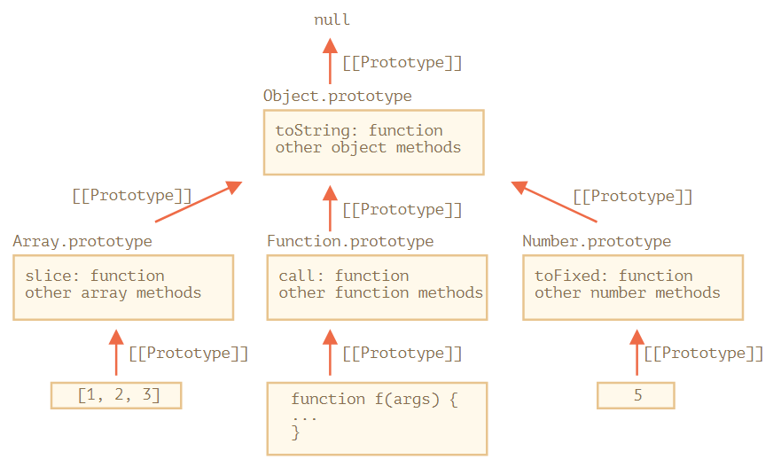

# 原型和原型链


在本章第一节[理解对象和面向对象](./oop-0-index)，我们知道JS的创造选择了基于原型引用的方式，并且也提到了原型机制的历史。

在这一节的内容，我们主要更深入理解和区别ES中原型相关的三个概念。

[[toc]]

## 对象原型 `[[prototype]]`

回顾本章第一节[理解对象和面向对象](./oop-0-index)的内容，对于ES语言的原型系统概括起来就两点，也就是原型对象和原型链的概念：

- **在 JavaScript 中，对象有一个特殊的内部属性 `[[Prototype]]`, 它要么为 null，要么就是对另一个对象的引用，这个被引用的对象就被称为“原型”，或者叫“原型对象”。**
- **读一个属性，如果对象本身没有，则会继续访问对象的原型，直到原型为null或者找到为止，这种属性访问形成的路径就是原型链。**

```js
    -----------------            -------------------            -----------------
    | third |  | second |  | first |
    | ----- ||     --------    |            |    -------    |
    | [[prototype]] |----------->|  [[prototype]]  |----------->| [[prototype]] |
    -----------------            -------------------            -----------------
    /**
     * 1. 所有对象都有一个内部私有属性[[prototype]]，指向对象的原型。
     * 2. 读一个属性，如果对象本身没有，则会继续访问对象的原型，直到原型为空或者找到为止。
     * 3. 而通过[[prototype]]属性连接起来的这个链条就称为原型链。
    */
```

原型系统有以下几点特征：

### 1. 通过原型可以在多个对象间共享数据

多个对象可以有相同的原型，这个原型持有所有共享属性。

> 软件中很多概念都是为了实现代码复用而创建的，比如函数、原型、继承等等。

举个例子，比如我们需要建立两个对象 admin 和 guest。

```js
let admin = {
  name: 'admin',
  getIdentityInfo() {
    return `My identity is ${this.name}`
  }
}

let guest = {
  name: 'guest',
  getIdentityInfo() {
    return `My identity is ${this.name}`
  }
}
```
可以看到两个对象的结构基本一致，并且还重复了一个相同的方法。此时我们可以将两者相同的属性`getIdentityInfo`托管到第三个对象身上，然后让这个对象成为两者的原型对象，从而实现代码复用。

```js
let IdenetityProto = {
  getIdentityInfo() {
    console.log(`My identity is ${this.name}`)
  }
}

// 不理解下面对象创建和对象属性定义，可以看上一节内容。
let admin = Object.create(IdenetityProto)
admin.name = 'admin'

let guest = Object.create(IdenetityProto, {
  name: {
    value: 'guest',
    writable: true,
    enumerable: true,
    configurable: true
  }
})

admin.getIdentityInfo()   // My identity is admin
guest.getIdentityInfo()   // My identity is guest
```
admin和guest对象身上都没有`getIdentityInfo`属性，但它们都通过原型链找到了原型对象身上的方法，并调用。

相当于生成了下面结构的两个对象
```js
let admin = {
  name: 'admin'
  [[prototype]]: IdenetityProto
}

let guest = {
  name: 'admin'
  [[prototype]]: IdenetityProto
}
```

### 2. 属性覆写

如果对象自身有属性与原型对象的属性重名，根据属性在原型链上的查找规则：一旦在原型链上找到某个相同key的属性将使用此属性，并停止查找，所以自身同名属性将优先被访问。

```js
// 比如我们为guest对象添加一个getIdentityInfo属性
guest.getIdentityInfo = function () {
  console.log(`getIdentityInfo in ${this.name}`)
}
guest.getIdentityInfo()  // getIdentityInfo in guest
```
这种工作原理类似“基于类”语言中的方法重写。

### 3. 对象设置和删除属性仅影响其自身，不会改变原型

像上面的例子，我们为guest定义了一个原型上的同名属性，仅使得guest自身调用结果不同，并不会影响admin.getIdentityInfo()的调用结果，说明并不会影响到原型。

另外，不能从对象身上删除原型上的属性。
```js
delete admin.getIdentityInfo   // false 删除失败
```

如果你希望改变继承的某个属性，只能找到拥有这个属性的对象上操作，然后基于这个原型的对象都会受到影响。

```js
// 获取某个属性在原型链上的哪个对象身上，没有原生的方法，我们可以根据原型链最终是null来自己定义一个函数

function getDefiningObject(obj, prop) {
  let proto = obj;
  while (proto) {
    if (proto.hasOwnProperty(prop)) return proto;
    proto = Object.getPrototypeOf(proto)
  }
}

// 此时可以删除属性
delete getDefiningObject(admin, 'getIdentityInfo').getIdentityInfo
admin.getIdentityInfo()   // Error
```

## 函数的原型属性 `F.prototype`

在第一节[理解对象和面向对象](./oop-0-index.html#面向对象编程)中提到过，为了实现类似“基于类”语言的语法设施，在JS中实现了一种`new + Function`创建对象的方式。

在JS中，函数是一类特殊的对象（函数是一等公民）。

- **所有函数默认都有`prototype`属性，指向其new出来的实例对象的原型**
- **并且所有原型对象都有一个`constructor`属性指向创建实例对象的构造函数**

即默认情况下，所以函数都有一个类似<strong>`F.prototype = {constructor：F}`</strong>的关系。

> 注意这里的属性的区别，`[[prototype]]`是内部属性，语言实现内部使用，外部无法调用。而函数对象的prototype属性是常规属性。<br> JavaScript 从一开始就有了原型继承。这是 JavaScript 编程语言的核心特性之一。<br>但是在过去，没有直接对其进行访问的方式,唯一可靠的方法就早通过构造函数的 "prototype" 属性来访问。<br>鉴于对象的`[[prototype]]`内部属性访问只能通过`obj.constructor.prototype`这样变扭的方式，所以各浏览器厂商自己实现了`__proto__`属性，但它不是语言规范中定义的。在ES6中才实现了`Objecdt.getPrototypeOf()`方法，同`__proto__`功能一样。点击查看[内部属性](./oop-2-object-property.html#内部属性-internal-properties)

### new F() 创建对象

使用new + Function构造器模式创建对象也是为代码复用，减少重复代码书写。

比如我们要建立一个班的学生信息，为每个学生建立一个对象模型，但每个学生对象拥有相同的结构，即姓名、学号，我们不可能采用字面量的形式重复书写每个学生对象。

此时我们可以采用构造器模式来批量创建类似的对象。

```js
function Student(name,id) {
  this.name = name
  this.id = id
}
// 使用new运算符创建对象
let tom = new Student('tom',1)
let jerry = new Student('jerry',2)
```
此时，我们可以将每个学生对象共享的描述方法`describe()`托管到共享的原型对象上，以达到数据共享。

```js
Student.prototype.describe = function() {
  return `${this.name}'s student number is ${this.id}`
}

tom.describe() // tom's student number is 1
```


### F.prototype 与新创建对象没有关联

F.prototype 属性仅在 new F 被调用时使用，它为新对象的`[[Prototype]]` 赋值。之后，F.prototype 和新对象之间就没有任何联系了。可以把它看成“一次性的礼物”。

如果在创建之后，F.prototype 属性有了变化`F.prototype = <another object>`，那么通过 new F 创建的新对象也将随之拥有新的对象`<another object>`作为 `[[Prototype]]`，但之前new F 已经存在的对象将保持旧的原型。

```js
// 例子
function Student(name,id) {
  this.name = name
  this.id = id
}
Student.prototype.describe = function() {
  console.log(`${this.name}'s student number is ${this.id}`)
}
let tom = new Student('tom',1)
tom.describe() // tom's student number is 1

Student.prototype = {
  sayName() {
    console.log(`My name is ${this.name}`)
  }
}
let jerry = new Student('jerry',2)
jerry.sayName()  // My name is jerry

// 此时对象tom 和 对象jerry 的原型不一样，tom无法调用sayName方法
console.log(Object.getPrototypeOf(tom) !== Object.getPrototypeOf(jerry))  // true
```


### 脆弱的 "constructor" 属性。

JavaScript 自身并不能确保正确的 "constructor" 函数值。它只存在于函数的默认 "prototype" 中，如果我们将整个默认 prototype 替换掉，那么其中就不会有 "constructor" 了。这样会导致一些问题：

1. 首要问题是实例对象的constructor属性引用出问题
```js
tom.constructor === Student  // true
jerry.constructor === Student // false
```
为了弥补这种指向错误问题，我们需要手动添加上这个属性：
```js
Student.prototype = {
  constructor: Student,
  sayName() {
    console.log(`My name is ${this.name}`)
  }
}
let jerry = new Student('jerry',2)
console.log(jerry.constructor === Student) // true
```
但是因为原生constructor是不可枚举的，但是像上面这样添加的constructor会出现在jerry对象的遍历属性中。
```js
for (key in tom) {
  console.log('tom: ', key); // name id describe
}

for (key in jerry) {
  console.log('tom: ', key); // name id sayName constructor
}
```
所以更好的处理是进一步设置添加的constructor属性不可枚举
```js
Object.defineProperty(Student.prototype, 'constructor', {
  enumerable: false
})
```
在使用构造函数实现面向对象继承时，采用原型继承的写法，需要我们自己手动确保"constructor" 引用的正确性。

2. 另一问题：instanceof运算符出错。

因为Student原型对象已经被更改，所以`instanceof`运算是基于对象原型进行比较的，自然也会有错误结果。

像上面的例子中，Student.prototype被直接赋值一个对象，改变了默认原型，此时`tom.__proto__`与`Student.prototype`不是同一个对象了。自然会导致最初创建的tom对象在instanceof运算符判断出错。

```js
tom instanceof Student   // false 
```
> 关于 instanceof 运算的检测原理可以查看[类型检测](./type-7-checking)


## 原生原型 `Object.prototype`

我们反复在强调，JS是基于原型引用的面向对象语言，而构造函数和原型对象在ES中被广泛应用。包括内置对象的都有相应的构造器，各种内置的对象的方法都托管在各自的原型对象上。

其中有一个最基础和核心的原型对象，即`Object.prototype`，它存在于JS所有对象的原型链顶端，它自己的原型对象为`null`。



```js
new Nubmer(5) instanceof Object // true
[] instanceof Object // true
{} instanceof Object // true
```
```js
// 手动验证
let arr = [1, 2, 3];

// 它继承自 Array.prototype
alert( arr.__proto__ === Array.prototype ); // true

// 接下来继承自 Object.prototype
alert( arr.__proto__.__proto__ === Object.prototype ); // true

// 原型链的顶端为 null。
alert( arr.__proto__.__proto__.__proto__ ); // null
```

## 无原型的对象

通常在ES中创建的每个对象都至少包含一个原型对象`Object.prototype`，然后这个原型对象的原型是`null`，这是原型链的终点。

但是我们可以利用`Object.create()`第一个参数可以是Null，来创建一个没有原型的对象。

```js
Object.create(null)
```

通常这样没有原型的对象适合用于创建字典对象（枚举对象）。

### ES中模拟枚举

ES中没有枚举的概念（当然，ECMA-262第三版中已经将enum作为关键字保留）。然而，如同JavaScript中没有class一样，但我们仍然可以通过间接的方式来实现它。

利用对象是键值的映射，一般像下面这样创建一个枚举对象：

```js
let DaysEnum = {
  MONDAY: 1,
  TUESDAY: 2,
  // ..
  SUNDAY: 7
};
// 或者
let SizeEnum = {
  SMALL: {name: "small", value: 1, code: "S"},
  MEDIUM: {name: "medium", value: 2, code: "M"},
  LARGE: {name: "large", value: 3, code: "L"},
};
```
但这样字面量形式创建的对象因为存在原型对象`Object.prototype`，而原型对象上可以挂载一些共享属性，而ES中有一些判断的操作符是可以遍历到原型对象的属性。就导致我们定义的检举变量的检举成员并不唯一。

```js
let DaysEnum = {
  MONDAY: 1,
  TUESDAY: 2,
};
Object.prototype.FRIDAY = 5

console.log(FRIDAY in DaysEnum) // true
```
即使我们可以用`obj.hasOwnProperty()`方法来验证当前属性是否为自身属性，但这个方法也是继承至`Object.prototype.hasOwnProperty()`，如果在实例对象自身拥有一个`hasOwnProperty`属性，就会覆盖原型上的方法，导致`obj.hasOwnProperty()`判断可以无效。

```js
// 正常
console.log(DaysEnum.hasOwnProperty(FRIDAY)) // false

// 覆写原型方法
DaysEnum.hasOwnProperty = 'abc'
console.log(DaysEnum.hasOwnProperty(FRIDAY)) // TypeError: Property 'hasOwnProperty' is not a function
```
当然，这种情况自己开发中很少会出现，很多意外是因为另一方造成方法覆写。我们也有很多方法来避免情况：

- 定义枚举变量时，使用`const`声明常量，避免后续添加属性
- 使用`Object.frezze()`彻底冻结对象

但这只能解决`hasOwnProperty`被覆写的问题，无法解决`in`运算符会遍历原型对象的问题。

所以更好的方式是使用无原型的对象来创建检举变量。

```js
// 一般都会在其它地方维护一张常量表
const MONDAY = 'monday'
const TUESDAY = 'tuesday'

const DaysEnum = Object.create(null)
DaysEnum[MONDAY] = 1
DaysEnum[TUESDAY] = 2
```

虽然麻烦了点，但很安全，避免了可能存在的缺陷。

[详解Object.create(null)](https://juejin.im/post/5acd8ced6fb9a028d444ee4e)


## 总结

- 对象的原型`[[prototype]]`
  - 在 JavaScript 中，对象有一个特殊的内部属性 `[[Prototype]]`, 它要么为 null，要么就是对另一个对象的引用，这个被引用的对象就被称为“原型”，或者叫“原型对象”。
  - 读一个属性，如果对象本身没有，则会继续访问对象的原型，直到原型为null或者找到为止，这种属性访问形成的路径就是原型链。
- 函数的`prototype`属性
  - 所有函数默认都有`prototype`属性，指向其new出来的实例对象的原型
  - 并且所有原型对象都有一个`constructor`属性指向创建实例对象的构造函数
- 原生原型`Object.prototype`
  - 所有的内建原型顶端都是`Object.prototype`
- 所有的内建对象都遵循相同的模式：
  - 方法都存储在 `prototype` 中，如`Array.prototype / Object.prototype / Date.prototype`，包括原始类型方法也放在包装器对象的原型上`Number.prototype / String.prototype / Boolean.prototype`。只有 undefined 和 null 没有包装器对象。