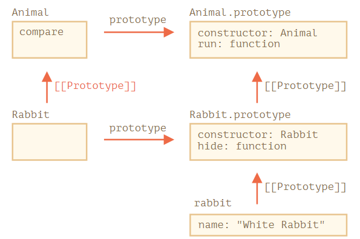
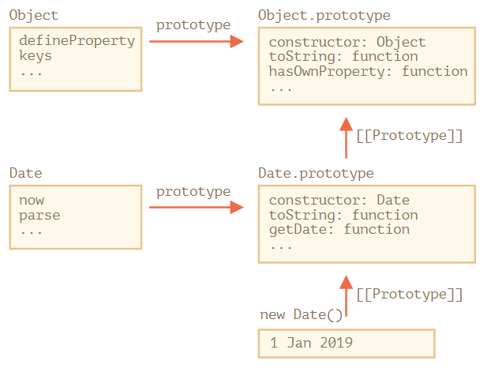

# class实现面向对象

[[toc]]

上一节[ES 构造函数](./oop-4-constructor)中，我们讲解了使用`new + F`实现面向对象编程的几个核心概念，最终优化后的代码例子如下：

```js
// 封装继承的公共代码，并避免父构造函数名的硬编码
function setInherit(Sub, Super) {
     Sub.prototype = Object.create(Super.prototype)
     Sub.prototype.constructor = Sub
     Sub._super = Super.prototype
}
```
```js
function Super(prop1) {
     this.prop1 = prop1
}
Super.prototype.method = function() {return 'Super prototype method'}

function Sub(prop1,prop2) {
     Sub._super.constructor.call(this, prop1)
     this.prop2 = prop2
}
setInherit(Sub,Super)
// 继承之后，再实现方法覆写
Sub.prototype.method1 = function(x) {
     let superResult =  Sub._super.method.call(this)
     return superResult + x
}
```

像上面这个基本例子，早期ES使用构造函数和原型实现面向对象的方式并不够优雅。

1. 代码结构松散，不具有统一性
1. 实现面向对象的几个核心概念需要开发者手动编写代码，还要注意规避一些陷阱，比如需要确保原型的`constructor`指向的正确性、自己实现封装代码等。

在发布ES2015语言规范后，现代ES在语言规范层面提供了一种更高级的面向对象编程方式：`Class`类构造方法，使得我们实现面向对象更加方便。

## 基本语法
```js
// class 方法
class MyClass {
  constructor() { ... }
  method() { ... }
}
let instance = new MyClass()
```

后面的内容还是以面向对象的几个基本概念作为内容的目录，理解使用`Class`语法如何实现这些概念

## 面向对象的基本概念

> OOP: Object Oriented Programming

- 对象： 对象是最核心概念，在JS中一切实现都依赖于对象
- 类：   类抽象了对象的共同特征
- 封装： 封装实现了数据隐藏和数据访问权限的设置，比如私有属性的保护。
- 继承： 继承非常优雅地实现了代码的重用。
- 多态： 通过函数的重载或方法的覆写实现自定义行为
- 聚合： 功能实现的最小化

## 生成对象

Class语法生成一个对象，基本和构造函数方式创建一个对象类似：
1. 声明一个Class
1. 使用new Class生成实例对象

```js
// 声明 Class
class User {

  constructor(name) {
    this.name = name;
  }

  sayHi() {
    console.log(this.name);
  }

}

// new 实例
let user = new User("John");
user.sayHi();
```

ES中对象有三种属性，开发都使用的有数据属性和访问器属性。在ES中面向对象中涉及到三类对象：
1. new出来的实例对象
1. 构造函数本身也是一个对象，也可以有自身的属性
1. 用于共享数据的原型对象

所以使用`Class`语言如何定义这些对象属性呢？

### 实例属性

```js
class User {

  constructor(name) {
    this.name = name;
  }
}
```

每一个Class都包含一个构造函数`constructor()`，即使你省略，语言也会默认创建一个空的`constructor()`。所以在这个构造函数内通过`this`挂载的即是实例属性。如上面的`name`属性定义。

有一份提案，可以将属性直接在类内部声明，声明后仍可以在构造器内赋值。
```js
class User {
  // 直接定义实例属性，并可以初始化（最新的ES提案阶段，暂未成为规范标准）
  name
  age = 18
  
  constructor(name) {
    this.name = name;
  }
}
```


### 原型上共享属性

```js
class User {

  constructor(name) {
    this.name = name;
  }

  sayHi() {
    console.log(this.name);
  }
}
```
以前需要在构造函数原型对象`F.prototype`上定义共享属性的方式，在`Class`语法中可以直接定义，如上面的`sayHi()`函数
> 函数也是属性，但有时也被称为方法

### 访问器属性
```js
class User {

  constructor(name) {
    this.name = name;
  }

  get age() {
    return 18
  }

  set age(val) {
    if (val > 20) return
  }
}
```
可以看到访问器属性也是直接在类中，而不是`constructor`构造函数中定义的。所以同原型上定义共享方法一样，`Class`声明的`getter / setter`方法也都是在原型上定义的。
> 稍后原理会具体说明

### 静态属性 static

静态属性是属性类对象本身属性，类实例无法调用。以前需要将构造函数当作对象添加静态属性，比如上面使用`Sub._super`实现静态属性。

在ES6的`Class`语法，使用关键字`static`来声明静态属性.
```js
class User {
  // 静态属性(属性于新ES提案阶段，暂未成为规范标准)
  static staticProperty = 'static property'

  constructor(name) {
    this.name = name;
  }

  sayHi() {
    console.log(this.name);
  }

  // 静态方法 （在ES2015版已成为规范标准）
  static describe() {
    console.log(`this is ${this}`)
  }
}

// 调用静态方法
User.describe()
// 区别于实例方法
let tom = new User('tom')
tom.sayHi()
```

### 私有属性 `#`

在构造函数中实现私有属性，开发都需要采用自己的方式去实现，比如使用IIFE自执行行函数创建闭包来实现。但是有一个马上就会被加到最新ES规范中的已完成的 Javascript 提案，它为私有属性和方法提供语言级支持。

私有属性和方法应该以 # 开头。它们只在类的内部可被访问(静态方法和实例方法都可以），但私有属性不被子类继承。
```js
class User {
  #privateProperty = 'private value'

  constructor(name,prop) {
    this.name = name;
    // 可以在构造函数中对私有属性赋值
    this.#privateProperty = prop
  }

  sayHi() {
    console.log(this.name);
    console.log(this.#privateProperty)
  }

  // 静态方法
  static describe() {
    console.log(`this is ${this}`)
    console.log(this.#privateProperty)
  }
}
```

### 未来Class属性语法

如果关于属性的提案都在未来成为规范的话，那关于在class内定义属性的代码将更加统一规范

```js
class User {
  // 属性在一处统一声明，初始化可选
  #privateProperty = 'private value';
  static staticProperty = 'static property';
  name
  age = 19
  
  // 构造函数，可以对任何属性初始化
  constructor(name,age) {
    this.name = name
  }

  // 访问器属性
  get age() {
    return 18
  }

  set age(val) {
    if (val > 20) return
  }

  // 静态方法
  static getStaticProp() {
    console.log(User.staticProperty)
  }

  // 原型共享方法
  sayHi() {
    console.log(this.name);
    console.log(this.#privateProperty)
  }
}
```

## class的本质还是基于原型机制的

> 引用自[MDN class](https://developer.mozilla.org/zh-CN/docs/Web/JavaScript/Reference/Classes)

ECMAScript 2015 中引入的 `Class`语法实质上也是基于原型的继承。类语法不会为JavaScript引入新的面向对象的继承模型。

```js
class User {
  name
  static age = 18

	constructor(name) {
		this.name = name
	}

	// 静态方法，添加static
	static getStaticProp() {
    // 静态方法中的this指向构造函数本身，此处 this指向 MyClass，因为调用对象是类本身 
		console.log('static:', this)
		return this.age
	}
	// 实例方法
	describe() {
		// 实例方法中的this指向实例本身，此处 this 指向 new MyClass()出来的实例
		console.log('instance:', this)
		return this.name
	}

	// 存取器 之 取值，this 指向实例
	get age() {
    console.log('getter',this)
		return User.age
	}
	// 存取器 之 存值，this 指向实例
	set count(newValue) {
    console.log('setter',this)
    if (User.age>20) return
    User.age = newValue 
	}
}
```
上述代码编译成 ES5 代码，可以看看静态属性和方法，以及存取器是怎么实例的，也就知道 this 的指向啦。

```js
const User = (function() {
	function User(name) {
		this.name = name
	}

	// 静态属性和方法
	MyClass.age = 18
	MyClass.getStaticProp = function() {
		console.log('static:', this)
		return this.age
	}

	// 实例方法挂载到对象原型上
	MyClass.prototype.describe = function() {
		console.log('instance:', this)
		return this.name
	}

	// class的存取器方法的定义构造器的原型上
	Object.defineProperty(User.prototype, 'age', {
		get: function() {
			console.log('getter',this)
			return User.age
		},
		set: function(newValue) {
        console.log('setter', this)
        if (User.age>20) return
        User.age = newValue 
      },
		enumerable: true,
		configurable: true
	})

	return MyClass
})()
```

`class`类实际上是个“特殊的构造函数”，只能使用`new + class()`，不能像纯函数那样调用。
```js
class User{ }
console.log(typeof User) // function
User() // Error
```

### `new + class`与`new + F`区别

1. `class`类实际上是个“特殊的构造函数”，只能使用`new + class()`，不能像纯函数那样调用。

虽然`new + F`也可以通过`new.target`属性设置只能使用new调用，函数调用返回错误的效果，但class是在语法规范层面做的限制。
```js
function Fn(name) {
  if (new.target !== Fn) {
    throw new TypeError('Fn只能通过new Fn()调用')
  }
  this.name = name
  // ...
}
```

2. `class`类内部的方法不可枚举

类定义将 "prototype" 中的所有方法的 enumerable 标志设置为 false。

这很好，因为如果我们对一个对象调用 for..in 方法，我们通常不希望 class 方法出现。

3. 类总是使用 use strict。 在类构造中的所有代码都将自动进入严格模式。

```js
class User {
  // 类似于
  'use strict'
}
```

4. 类的继承中，子类会继承父类的静态方法。但构造函数不会，旧的内置类也没有继承静态属性（见下面继承extends内容。

## 封装

1. 受保护的字段以 _ 开头。

同构造函数实现面向对象封装一样，这是一个众所周知的约定，不是在语言级别强制执行的。程序员应该只通过它的类和从它继承的类中访问以 _ 开头的字段。

2. 私有字段以 # 开头。

这是一个马上就会被加到规范中的已完成的 Javascript 提案，它为私有属性和方法提供语言级支持，确保我们只能从类的内部的方法中访问它们。例子可以看上面生成对象的私有属性。

## 多态

基于原型链查找规则，只要在子类中覆写一个父类的同名方法，即实现多态。例子可看下面继承的例子。

## 继承

在构造函数模式实现继承，我们需要手工处理很多代码。但在`class`类模式中，使用`extends`关键字创建一个类作为另一个类的一个子类。

### extends 关键字

```js
class Animal { 
  constructor(name) {
    this.name = name;
  }
  
  speak() {
    console.log(this.name + ' makes a noise.');
  }
}

// 继承
class Dog extends Animal {}

var d = new Dog('Mitzie');
d.speak();// 'Mitzie makes a noise.'
```

### extends 继承对常规方法和静态方法都有效

`Sub extends Super` 创建了两个 `[[Prototype]]` 引用：
- Sub 函数作为对象自身的原型继承自 Super 函数对象，这一点实现了静态属性继承
- Sub.prototype 原型继承自 Super.prototype，这一点实现实例属性和原型属性继承

所以说：`extends`继承对常规方法和静态方法都有效。

```js
class Animal {
  static planet = "Earth";

  constructor(name, speed) {
    this.speed = speed;
    this.name = name;
  }

  run(speed = 0) {
    this.speed += speed;
    alert(`${this.name} runs with speed ${this.speed}.`);
  }

  static compare(animalA, animalB) {
    return animalA.speed - animalB.speed;
  }

}

// 继承于 Animal
class Rabbit extends Animal {
  hide() {
    alert(`${this.name} hides!`);
  }
}

let rabbits = [
  new Rabbit("White Rabbit", 10),
  new Rabbit("Black Rabbit", 5)
];

rabbits.sort(Rabbit.compare);

rabbits[0].run(); // Black Rabbit runs with speed 5.

alert(Rabbit.planet); // Earth
```
上例中，我们在子类Rabbit中调用了父类Animal的静态方法`compare`和属性`compare`都有效。



可以使用代码验证下：
```js
class Animal {}
class Rabbit extends Animal {}

// 对于静态的
alert(Rabbit.__proto__ === Animal); // true

// 对于常规方法
alert(Rabbit.prototype.__proto__ === Animal.prototype); // true
```

此内容的原文链接[继承静态属性和方法](https://zh.javascript.info/static-properties-methods#ji-cheng-jing-tai-shu-xing-he-fang-fa)


### 内建的类不继承静态方法

通常，使用`class`的`extends`时，一个类继承另一个类时，静态方法和非静态方法都会被继承。这已经在上面中解释过了。

但内建类却是一个例外。**内建类相互间不继承静态方法**。

内建对象有它们自己的构造类，如`Object / Function / Array`等，除了在其原型对象共享方法，也提供了类本身的静态方法，例如 `Object.keys / Array.isArray` 等。

例如，Array 和 Data 都继承自 Object，所以它们的实例都有来自 `Object.prototype` 的方法。但 `Array.[[Prototype]]` 并不指向 Object，所以它们没有例如 `Array.keys()`（或 `Data.keys()`这些静态方法。



如上图所看到的，Date 和 Object 之间没有连结。它们是独立的，只有 Date.prototype 继承自 Object.prototype，仅此而已。

与新语法class通过 extends 获得的继承相比，这是内建对象之间继承的一个重要区别。


### 实现多态：重写方法

接上例，我们可以在Dog类的重写父类的speak方法：

```js
class Animal { 
  constructor(name) {
    this.name = name;
  }
  
  speak() {
    console.log(this.name + ' makes a noise.');
  }
}

// 继承
class Dog extends Animal {
  // 方法重写
  speak() {
    console.log(this.name + ' barks.');
  }
}

var d = new Dog('Mitzie');
d.speak();// 'Mitzie barks.'
```

但是通常来说，我们不希望完全替换父类的方法，而是希望在父类方法的基础上进行调整或扩展其功能。我们在我们的方法中做一些事儿，但是在它之前或之后或在过程中会调用父类方法。

Class 为此提供了 "super" 关键字。

### super 关键字

super在class类中使用的方式有两种：
- 对象调用：`super.property`
- 函数调用：`super(params)`

super出现在类的位置不同，表现的意义也不同：

- 在`constructor`函数中使用函数调用形式`super(params)`，表示调用继承的父类构造函数，并获取到`this`的正确指向。
- 在静态方法中使用`super.method()`调用，此时super指向父构造器
- 在原型方法中使用`super.method()`调用，此时super指向原型对象

```js
class Animal { 
  constructor(name) {
    this.name = name;
  }
  
  speak() {
    console.log(this.name + ' makes a noise.');
  }
}

// 继承
class Dog extends Animal {
  // 方法重写
  speak() {
    super.speak()  // super === Animal.prototype
    console.log(this.name + ' barks.');
  }
}

var d = new Dog('Mitzie');
d.speak();// 'Mitzie makes a noise.' \n 'Mitzie barks.'
```

### 重写constructor

目前为止，我们继承的子类是没有自己的构造器的。像我们定义一个类时缺省constructor时，语法会默认添加一个空的constructor一样，继承的子类如果缺省了，也会被默认添加。但代码有些不同。

```js
class Animal {}
// 相当于
class Animal {
  constructor() {}
}
```
子类的缺省相当于
```js
class Dog extends Animal {}
// 相当于
class Dog extends Animal {
  constructor(...args) {
    super(...args)  // super === Animal.prototype.constructor
  }
}
```
这里有一个规则：

**继承的子类如果要声明自己的 constructor ，则必须调用 super(...)，并且一定要在使用 this 之前调用。**

在ES中，继承的子类（所谓的“派生构造函数”，英文为 “derived constructor”）的构造函数与其他函数之间是有区别的。

在构造函数模式，或class的父类constructor中，通过 new 执行一个构造函数时，它将创建一个空对象，并将这个空对象赋值给 this。

但派生的构造函数，因为具有特殊的内部属性 `[[ConstructorKind]]:"derived"`。这是一个特殊的内部属性，它会影响new运算的操作：

当new 继承的子类的` constructor` 执行时，它不会执行上述正常的操作，而是期望父类的 `constructor` 来完成这项工作，但new结果返回的对象是作为子类实例的，虽然调用的是父构造器来生成新对象的。

在继承子类构造函数中，this调用在super调用之前，将会报错，因为此时未执行父构造器生成子实例，即this暂无指向。

```js
class Dog extends Animal {
  constructor(name,speed) {
    // this.speed = speed   // 此时将会报错
    super(name)  // super === Animal.prototype.constructor
    this.speed = speed

  }
}
```

### super 内部的实现原理 `[[HomeObject]]`

在类或对象的方法中（即函数）添加了一个新的内部属性 `[[HomeObject]]` 属性，它记住了方法声明时所在的类或对象。而super.method()就是引用了method内部的该属性值来解析执行的。

```js
let animal = {
  name: "Animal",
  eat() {         // animal.eat.[[HomeObject]] == animal
    alert(`${this.name} eats.`);
  }
};

let rabbit = {
  __proto__: animal,
  name: "Rabbit",
  eat() {         // rabbit.eat.[[HomeObject]] == rabbit
    super.eat();
  }
};

let longEar = {
  __proto__: rabbit,
  name: "Long Ear",
  eat() {         // longEar.eat.[[HomeObject]] == longEar
    super.eat();
  }
};

// 正确执行
longEar.eat();  // Long Ear eats.
```


重要的一点：**明确方法而不是函数声明的属性才有该内部属性**

 `[[HomeObject]]` 属性只在使用ES6新语法，在对象或类的方法时使用 `method()`，而不是 `method: function()`时才具有。

```js
let animal = {
  eat: function() { // 早期旧语法是这样写的，此时eat函数不具有 [[HomeObject]]属性
    console.log('eating')
  }
};

let rabbit = {
  __proto__: animal,
  eat: function() {
    super.eat();
  }
};

rabbit.eat();  // 错误调用 super（因为animal.eat函数里没有 [[HomeObject]]
```
修正上面的错误，改用新语法声明对象方法，即省略function关键字
```js
let animal = {
  eat() { // ES2015新语法，此时eat函数具有 [[HomeObject]]属性
    console.log('eating')
  }
};

let rabbit = {
  __proto__: animal,
  eat: function() {
    super.eat();
  }
};

rabbit.eat();  // eating
```

至于新增`[[HomeObject]]`内部属性是为了解决什么问题？具体可以参看下面链接：

[深入内部探究 `[[HomeObject]]`](https://zh.javascript.info/class-inheritance#shen-ru-nei-bu-tan-jiu-he-homeobject)


## 聚合

Mixin — 是一个通用的面向对象编程术语：一个包含其他类的方法的类。

一些其它编程语言允许多重继承，但JavaScript 不支持多重继承。

在 JavaScript 中，我们只能继承单个对象。每个对象只能有一个 `[[Prototype]]`,并且每个类只可以扩展另外一个类。

但是可以通过将方法拷贝到原型中来实现 mixin。这里的实现和上一节构造函数中聚合的实现一样。

使用ES提供的`Object.assign()`方法可以轻松实现这类需求。

> Object.assign() 方法用于将所有可枚举属性的值从一个或多个源对象复制到目标对象，但同名属性会被覆盖

```js
// mixin
let sayHiMixin = {
  sayName() {
    alert(`Hello ${this.name}`);
  },
  sayGender() {
    alert(`Bye ${this.gender}`);
  }
};

// 父类
class Person {
  constructor(name) {
    this.name = name;
  }
}

// 子类
class User extends Person {
  constructor(name, gender) {
    super(name)
    this.gender = gender;
  }
}

Object.assign(User.prototype, sayHiMixin);
```

`Object.assign` 会覆盖同名的属性，因此，通常应该仔细考虑 mixin 的命名方法，以最大程度地降低发生这种冲突的可能性。
