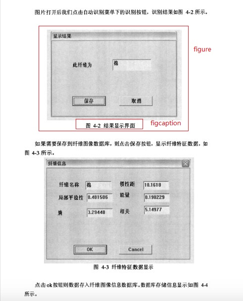
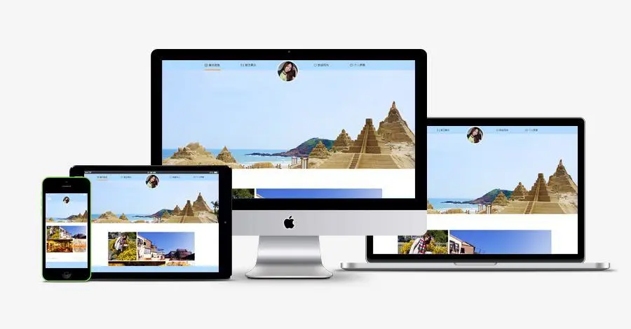
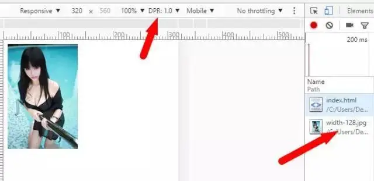
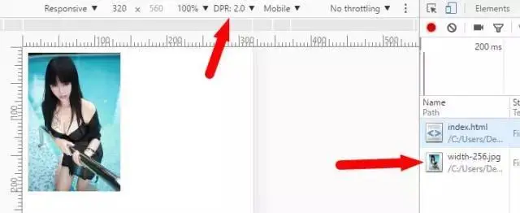
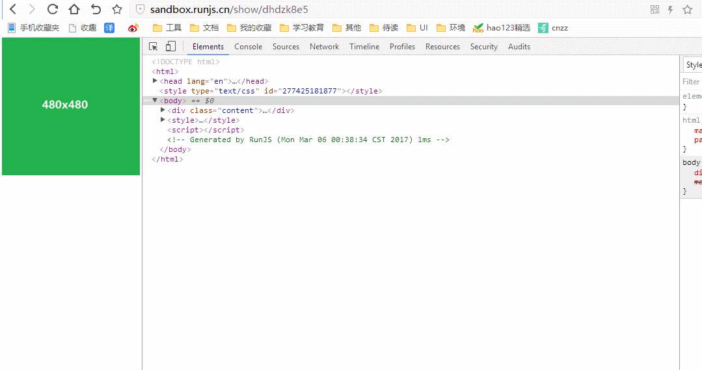

# 图片元素 img

[[toc]]

- img 基本语法: src alt title
- figure / figcaption元素
- srcset / sizes 特性
- picture元素
- 图片热点区域元素 map area

[MDN 图像嵌入元素img](https://developer.mozilla.org/zh-CN/docs/Web/HTML/Element/img)<br>
[MDN HTML中的图片](https://developer.mozilla.org/zh-CN/docs/Learn/HTML/Multimedia_and_embedding/Images_in_HTML)<br>
[MDN 响应式图片](https://developer.mozilla.org/zh-CN/docs/Learn/HTML/Multimedia_and_embedding/Responsive_images)<br>

## 基本语法

HTML中使用``元素来把图片放到网页上。

它是一个空元素（它不需要包含文本内容或闭合标签），最少只需要一个 src （一般读作其全称 source）来使其生效。

src 属性包含了指向我们想要引入的图片的路径，可以是相对路径或绝对URL。

**特性：**

- src: 图像URL地址，必须的特性
- alt: 图像替代文本，供探索引擎抓取使用，或者图像加载失败时显示
- height: 图像高度
- width: 图像宽度
- srcset: 
- sizes: 用来设置图片的尺寸零界点，主要跟响应式布局打交道。属性格式：媒体查询 宽度描述(支持px)，多条规则用逗号分隔，必须跟srcset一起使用
- usemap: 为图像定义客户端图像映射 `usemap=#<map>`,使用map元素的name或id属性"
- ismap: 为图像定义为服务器端图像映射
- crossorigin: 使得在canvas中使用图片资源时可以突破跨越限制

**基本用法**

```html
<!-- 相对路径：图片与HTML在同一目录下 -->

<!-- 相对路径：但最好的做法是在HTML目录下新建一个images文件夹存放页面引用到的所有静态图片 -->

<!-- 绝对路径 -->

```


## 添加图片备选文本 alt

alt属性主要用于图片不能显示情况下显示的备用内容，比如图片加载失败、客户端关闭图片显示、屏幕阅读器访问等情况下的替补方案。关键在于在图片无法被看见时也提供一个可用内容增强了体验。

所以alt文本最好对图片的描述，以便看不到图片的情况下仍然了解上下文意思。
```html

```
> 网页中的图片大体分为两类：作为内容显示和装饰性，对装饰性图片尽量使用CSS背景属性插入。

## 添加图片描述文本 title

title是一个全局特性，像超链接a元素一样，图片img元素也可以添加一个title特性。但与alt文本语义区别，title主要是对图片的一些附加信息，鼠标悬浮时显示。
```html

```

## 设定图片宽高 width height

在img元素中指明图片宽高的好处是更利于浏览器渲染，页面加载更流畅。因为img是一个替换元素，标签只是一个占位符作用，实现显示需要根据替换元素实际大小重新计算页面位置，如果能提前明确宽高，那浏览器渲染Img标签时就确定了替换元素的位置，但替换元素加载后不会导致页面重排。

但这样要注意一些问题，img元素宽高比要与替换元素实际宽高比一致，不然图片显示会出现拉伸或变形。最佳做法就是在把图片放到网站页面之前，应该就确定要使用的图片的尺寸。当图片实际尺寸比img元素宽高小时，如何显示在框中应通过CSS属性设置，如`background-image/background-size/background-position/background-repeat/background-origin/background-clip/background-attachment`

```html

```

## 关联图片和文字描述 figure figcaption

上面通过title特性为图片添加了辅助性的描述文本，但缺点是该特性只有鼠标悬浮时才显示。

如果要文本与图片一起显示，以前常规的做法是添加与img元素相邻的一个p元素中添加要显示的描述文本。但这种做法语义性较差，因为p元素和img元素是两个单独的元素，没有语义关联性。

HTML5提供了两个更好的标签来实现此类功能: `<figure>` 和 `<figcaption>` 元素，提供一个语义容器，这个 `<figcaption>` 元素 告诉浏览器和其他辅助的技术工具，这段说明文字描述了 `<figure>` 元素的内容。

`<figure>` 可以是几张图片、一段代码、音视频、方程、表格或别的。

```html
<figure>
    
     <figcaption>image-1：The cat is now adopted by Tom</figcaption>
</figure>
```
类似word排版中图例的显示效果



## 响应式图片



现代设备终端各种各样(PC、laptop、pad、phone)，并且同一终端显示的像素细腻度也不同，比如移动端手机有高清屏，视网膜屏等。所以不可能在一个网页里用同一张图片显示在所有终端设置上。

比如在PC端显示的一张大尺寸高清图片，不适合在移动端手机上显示，因为网络加载时间会更长影响用户体验。反进来一样，在手机上加载的一张小图片，同样也不适合在PC端大屏上显示。

在同一设置中，适用于视网膜屏，比如像素比4的图片也不适合在普通屏（像素比1）的设置显示，因为没必要，显示效果高清度在普通屏没体现出来，但图片大太导致加载时间长。反过来，低像素图片在高清屏上显示就会显得模糊，影响用户体验。

所以HTML5对img元素增加了两个特性`srcset`和`sizes`，以及增加了一对标签`<picture>`和`<source>`来解决上述问题，实现图片的响应式加载。

### 传统JS脚本按需加载图片

这种方式的原理其实就是跟踪window的resize事件，图片加载前获取屏幕宽度或者设置像素比DPR，然后判断修改一下图片的路径。

比如我们准备三张图片，1-480.png、1-800.png、1-1600.png，分别对应三种大小设备屏幕宽度响应：
```js
$(function(){
    function makeImageResponsive() {
        var width = $(window).width(); // 设备像素比获取：window.devicePixelRatio
        var img = $('.container img');
        var imgUrlPrefix = 'http://sandbox.runjs.cn/uploads/rs/496/pkutja85/';
        if (width <= 480) {
            img.attr('src',imgUrlPrefix + '1-480.png');
        } else if (width <= 800) {
            img.attr('src',imgUrlPrefix + '1-800.png');
        } else {
            img.attr('src',imgUrlPrefix + '1-1600.png');
        }
    }
    
    $(window).on('resize load', makeImageResponsive);
});
```
还有一种变种的方式， 就是把屏幕信息写入Cookie中，HTTP请求默认带上cookie信息，请求到达服务器端时由后端读取请求头cookie，决定返回哪一张图片，这样的话就不需要我们来写脚本了，我们通过Cookie和在服务器端进行控制就可以达到目的。

但HTML5提供了更为简便的声明式实现。

### srcset特性的x描述符：不同清晰度（不同像素比）的设备响应不同清晰度的图片

img元素增加`srcset`特性，srcset的特性值的格式是一个或多个包含逗号分隔的列表，每个列表包含一个文件路径、空格、图像固有宽度。

其中固有宽度带有两种单位：`w`和`x`（`w`是`width`简写，是图片宽度描述符；`x`是像素比描述符）

例子：
假如有一张图片的显示宽度为200px，那么：

- 它在 1x（即设备像素比为 1 的显示器） 的显示器上，是占了 200 个物理像素（即实际所占的像素）；
它在 2x 的显示器上，实际上是占了 400 个物理像素；
- 在 3x 的显示器上，实际上是占了 600 个物理像素；
- 在 4x的显示器上就是占了 800 个物理像素。

如果这个图片只提供 200 像素的尺寸，那么在 2x~4x 的显示器上看起来就很模糊。如果只提供 800 像素的版本，那么在 1x~3x 的设备上会显得多余，因为图片越高清，图片大小会更大，加载时间会相较长，所以我们要使用响应式图片。

```html

```
此时浏览器根据屏幕不同的像素密度（x）来显示对应尺寸的图片，也可以说是根据设备的像素比来显示不同的图片。




请注意红色箭头，DPR就是设备像素比，不同的像素比，会显示不同的图片。

### srcset特性的w描述符配合sizes特性：加载不同分辨率尺寸的图片

另一个问题是根据屏幕宽度不同显示不同像素要求的图片，则可以通过HTML5新标准的特性w描述符和sizes特性来设置。

这里sizes特性值的格式同srcset特性值类似：一个或多个包含逗号分隔的列表，每个列表包含一个媒体查询条件、空格、一个图像槽的宽度。

注意：
- 这个图像槽宽度的单位不能是百分比%，可以是px/em/vw，也可以过calc()函数计算。
- 并且sizes特性值列表最后一项必须没有查询条件
- sizes没有时，默认sizes为100vw，即视口宽度（v就是viewport，w就是width）。
- srcset和sizes特性值匹配都是从列表第一个到最后一个，当前面匹配成功就会自动忽略后续值，所以列表条件应从小到大。

```html
 
```
当浏览器不支持img元素的响应式特性srcset/sizes时，会使用备用的src特性值加载图片。



当我们加载到最大的图片后，然后再把屏幕缩小后，加载的图片却并没有改变，这是什么样的一个逻辑呢？

这个逻辑就是：浏览器会根据屏幕的宽度和我们声明的图片的尺寸描述符去决定应该使用哪张图片，但是呢，因为我们浏览器已经在大的分辨率下加载了大的图片，那么浏览器会默认你的图片已经放在缓存中了，使用大的图片不会再有网络的消耗，那么当然是使用更大的图片更好的了，所以在我们再缩小屏幕的时候浏览器不会再去使用小图片了，这是浏览器的一个默认的行为。

### 加载不同的图片 picture source

还有一种场景：当大屏显示时我们使用一张大图(比如一张全景图片），如果放在小屏显示，大图缩小，图像里的目标场景也会显得很小，此时我们为了在小屏里突出图片中的目标场景，就需要对其裁剪出一张适合的小图来显示。

这种不同场景用图的响应不同终端宽度时的解决，可以使用HTML5提供的`picture`元素。

```html
<picture>
  <source media="(max-width: 799px)" srcset="elva-480w-close-portrait.jpg">
  <source media="(min-width: 800px)" srcset="elva-800w.jpg">
  
</picture>
```
- media属性，含一个媒体条件，同CSS的媒体查询条件一样。当第一个条件返回真，那么就会显示这张图片，后续条件忽略。
- srcset属性，包含要显示图片的路径。
- 在任何情况下，你都必须在 `<picture>`元素里最后正确提供一个``元素以及它的src和alt属性作为后备方案，这样当媒体条件都不满足时候会使用img元素提供的图片；如果浏览器不支持 `<picture>`元素时也会使用img元素。

> 正如我们在``上面看到的那样，在picture的`<source>`可以再引用多个图像的srcset属性，还有sizes属性来响应同一画面图片响应多分辨率的情况，不过实际上，你可能不想经常做这么复杂的事情。

参考链接：

[响应式图片](https://developer.mozilla.org/zh-CN/docs/Learn/HTML/Multimedia_and_embedding/Responsive_images)<br>
[响应式图片实战](https://www.jianshu.com/p/cb2354003613)<br>
[简单-聊聊响应式图片](https://www.jianshu.com/p/b0ac5bc59a40) --- 用图

## 映射图片热点区域 map area

### 什么是图片热点区域

把一幅图像分成多个区域，每个区域指向不同的URL地址或响应不同的事件。

例如，将一幅中国地图的图像按照省市划分为若干个区域，这些区域就被称为热点，单击热点区域，就可以连接到与相应的省市有关的页面，这就是图像热点区域。

### 制作步骤

- 首先必须定义出图像上的各个热点区域的形状，位置坐标，及其指向的URL地址等信息，这个过程叫图像热点映射。图像热点映射需要使用`<map name=mapname id=mapname></map>`标签对进行说明，其中的name属性为该图像热点映射指定了一个名称。
- 图像热点映射中的各个区域用`<area>`标签说明，格式为：`<area shape="形状" coords="坐标" href="URL">`，href部分也可以用nohref替换，表示在该区域单击鼠标无效。`<area>`标签还可以有一个`target`特性，像超链接a元素一样用来指明浏览器在哪个窗口或者帧中显示href属性所指向的网页资源。
- 定义好了图像热点之后，接着就要在`` 图像标签中增加一个名为usemap的属性设置，usemap属性指定该图像被用作图像地图，其设置值为所使用的图像热点映射名称，格式为：'#' + 使用在`<map>`标签中的name属性或id属性设置值前多加一个"#"字符。``

```html


<map name="planetmap" id="planetmap">
  <area shape="circle" coords="180,139,14" href ="venus.html" alt="Venus" />
  <area shape="poly" coords="129,161,234,123,323,232" href ="mercur.html" alt="Mercury" />
  <area shape="rect" coords="0,0,110,260" href ="sun.html" alt="Sun" />
  <area shape="default" nohref />
</map>
```
- map元素中id特性是必需的，name特性是可选的，但是img元素中的usemap特性引用的是id还是name取决于浏览器的实现，所以一般都id和name都定义。
- area 元素永远嵌套在 map 元素内部。
    - shape特性：定义区域的形状，值可以为：rect矩形 circle圆形 poly多边形
    - coords特性：定义可点击区域（对鼠标敏感的区域）的坐标。具体坐标以shape开关决定，见上例
    - href特性：定义此区域的跳转目标 URL
    - nohref特性：排队该区域，点击无效
    - target特性：规定在何打开 href 属性指定的目标 URL。值为：_blank / _parent / _self / _top

[演示地址](https://www.w3school.com.cn/tiy/t.asp?f=html_areamap)

参考链接：
[MDN map元素](https://developer.mozilla.org/zh-CN/docs/Web/HTML/Element/map)
[MDN area元素](https://developer.mozilla.org/zh-CN/docs/Web/HTML/Element/area)
[HTML图片热区map area的用法](https://www.cnblogs.com/mq0036/p/3337327.html)

## 图片跨域设置 crossorigin

跟HTML中img元素没有太大关系，主要为在canvas画布中导出Img的安全性，具体参考[MDN](https://developer.mozilla.org/zh-CN/docs/Web/HTML/CORS_enabled_image)

## 最佳实践

1. 合适的图片名称

搜索引擎也读取图像的文件名并把它们计入SEO。因此你应该给你的图片取一个描述性的文件名：dinosaur.jpg 比 img835.png 要好。

2. 使用相对路径，避免http(s)引用的绝对路径

http绝对路径会使浏览器做更多的工作，比如重新通过 DNS 再去寻找 IP 地址，重新建立TCP连接等。通常我们都会把图片和 HTML 放在同一个服务器上。（CDN部署除外）。

3. 添加alt文本

添加alt文本主要是为图片显示失败时也提供一个可访问的体验。如果Img作为内容显示在HTML中，那就尽量添加alt文本描述图片，以屏幕阅读器等设备具有更好访问性。如果图片作为装饰性元素，尽量使用CSS属性background-image设置，如果不可避免使用img标签，则也应该添加`alt=""`

4. 设定图片宽高占位，以便浏览器更好的渲染
5. 响应式图片始终提供后备img元素