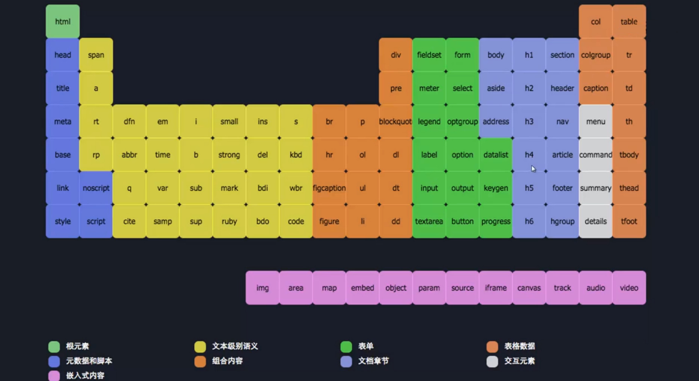

# HTML 内容模型（元素分类）

HTML4中，元素被分成两大类: inline(内联元素)与block(块级元素)。

但在实际的开发过程中，因为页面表现的需要，前端工程师经常把inline元素的display值设定为block(比如a标签)，也经常把block元素的display值设定为inline；之后更是出现了inline-block这一对外呈现inline、对内呈现block的属性。因此，简单地把HTML元素划分为inline与block已经不再符合实际需求。


在HTML5中，标准制定者重新定义了HTML元素的分类，将HTML元素扩展为7大类。并根据这一新的分类定义了元素的内容模型(Content Model)，内容模型主要定义了一个元素嵌套哪些子元素是合法的，而哪些子元素是非法的，这样更清楚的指导我们元素正确的嵌套关系。

比如，对于p元素而言，其内容模型为Phrasing, 这意味着p元素只接受类型为Phrasing的元素为子元素，而对于像div这样的非Phrasing元素嵌套在P元素里是不接受的。类似的，li元素的内容模型为Flow，因此任何可以放置在body中的元素都可以作为li元素的子元素。

HTML5中，元素主要分为7类：
- Metadata 元数据型：定义文档元数据信息的元素
- Flow 文档流型：所有可以放在`<body>`标签内，构成文档内容的元素
- Sectioning 区块型：定义页面分区的元素
- Heading 标题型：定义区块内容标题的元素
- Phrasing 语句型（文本型）：所有可以放在`<p>`标签内，构成段落内容的元素，基本上有点等同于HTML4里的内联（inline）元素
- Embedded 嵌入型：嵌入外部资源的元素，元素只起占位符作用的元素
- Interactive 交互型：所有与用户交互有关的元素

另外，除了这7大分类，还存在一些较小的分类，比如：
- Script-supporting 脚本支持元素：自身不做任何页面展现，但与页面脚本相关的元素，具体包括2个：`script` `template`
- Palpable 可见的元素：所有应当拥有子元素的元素称之为Palpable元素。比如，br元素因不需要子元素，因此也就不属于Palpable。


但即使是这7个类别也没有完全覆盖所有元素的所有情况，元素可以不属于任何一个类别，被称为穿透的；很多元素可能属于不止一个类别，称为混合的

下面这种图可能更好的展示元素的分类：

[HTML5 标签含义之元素周期表1](http://www.html5star.com/manual/html5label-meaning/)
[HTML5 标签含义之元素周期表2](http://www.xuanfengge.com/funny/html5/element/)

## Metadata（元数据元素）

顾名思义，Metadata元素意指那些定义文档元数据信息的元素，主要就是head元素包含的子元素。
```
title, base, link, style, script, noscript, meta
```

## Flow（流式元素）
所有可以放在body标签内，构成文档内容的元素均属于Flow元素。

因此，除了title, base, link, style, meta等只能放在head标签内的元素外，剩下的所有元素均属于Flow元素，包括script, noscript，以及后面所划分的其它类型元素。

## Sectioning（章节元素）
指定义页面结构的元素，具体包含以下四个：
```
article, aside, nav, section
```
> 由于 header，footer元素不会引入新的分节到大纲中，所以不属于Sectioning（章节元素），但属于HTML结构化分区元素中。可以参考word排版，页眉页脚是不会进入文章大纲章节中的，但也确实定义了文档头尾的两部分结构。实际上HTML对元素的划分，可以参考word排版结构。

## Heading（标题元素）
所有标题元素属于Heading，也即以下元素：
```
h1, h2, h3, h4, h5, h6, hgroup
```

## Phrasing（语句元素）
所有可以放在p标签内，构成段落内容的元素均属于Phrasing元素。

语句型(phrasing)元素均属于文档流型(flow)元素。基本上有点等同于HTML4里的内联元素。

```
span，em，strong，small，sub， sup， time， cite，abbr，mark，dfn，ins, del, bdi， bdo， meter， 
b， u， i，s， q，br，wbr， 
ruby， rb,  rp, rt, rtc,
code， kbd, samp，var，
a, img，canvas，audio， video，svg，iframe，embed， object，  
label， input， button， textarea，datalist，select，progress，output， 
script，noscript，
```

## Embedded（嵌入元素）
所有用于在网页中嵌入外部资源的元素均属于Embedded元素，具体包含以下9个：
```
img,  canvas, svg, audio, video, iframe, embed, object, math
```

## Interactive（交互元素）
所有与用户交互有关的元素均属于Interactive元素。
```
a， img（如果设置了usemap属性）， label， input（如果type属性不为hidden状态）， textarea， button， select， details，summary,  embed， iframe， menu（如果type属性为toolbar状态），object（如果设置了usemap属性）， video（如果设置了controls属性）, audio（如果设置了controls属性）
```

## Script-supporting
自身不做任何页面展现，但与页面脚本相关的元素，具体包括2个：
```
script, template
```


