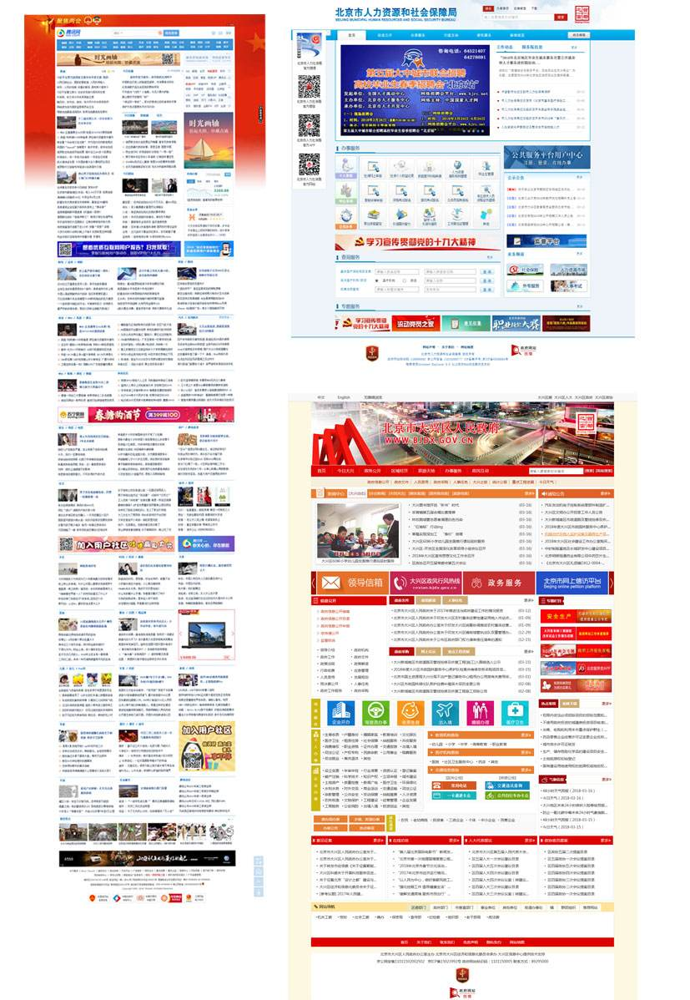
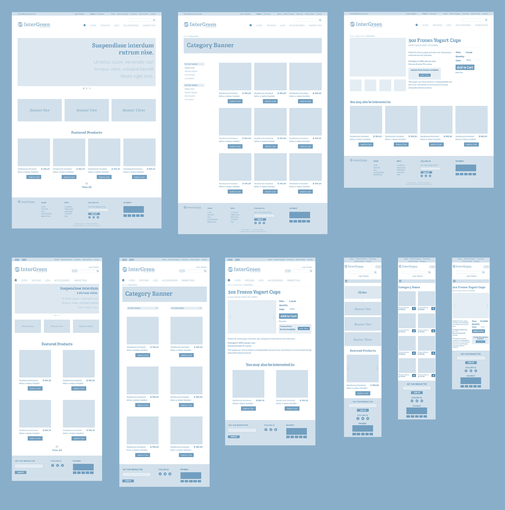
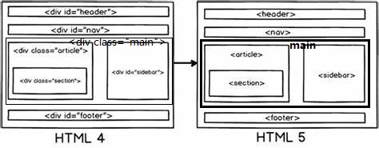
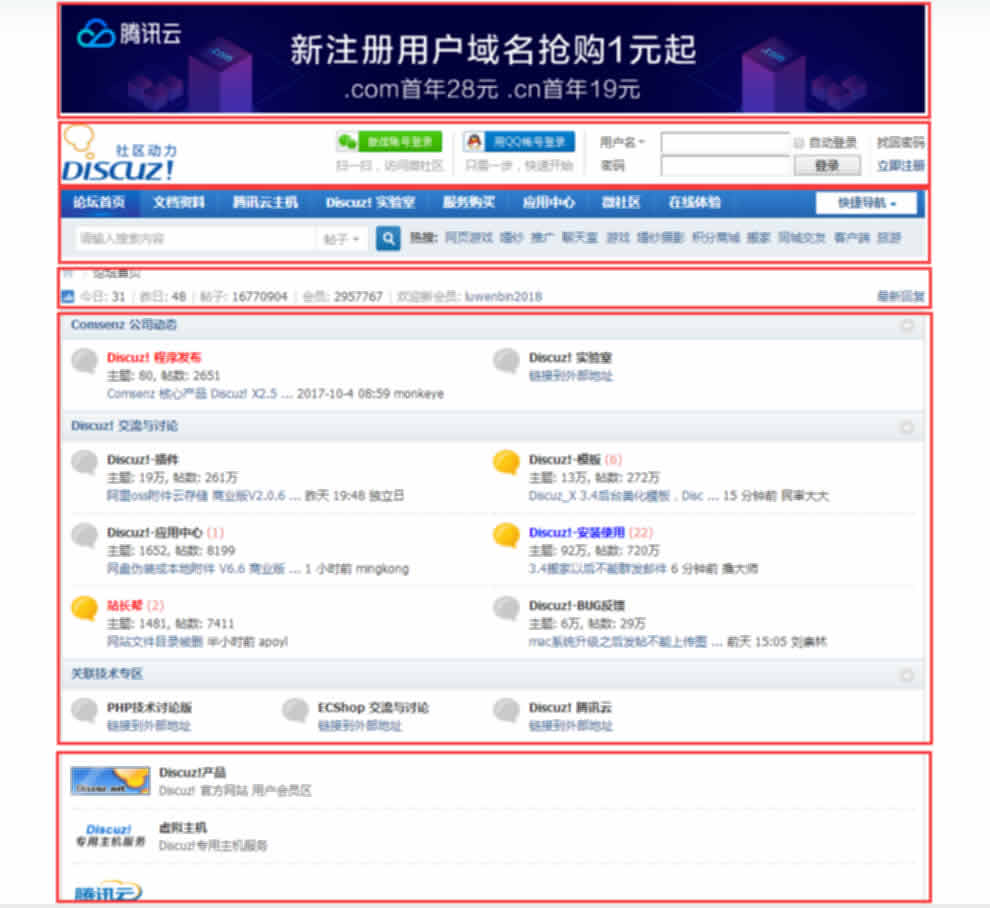
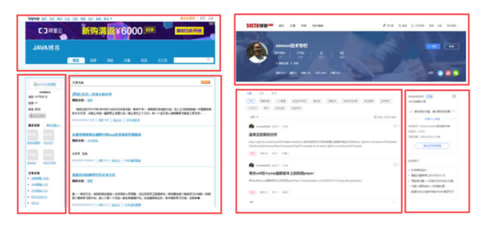
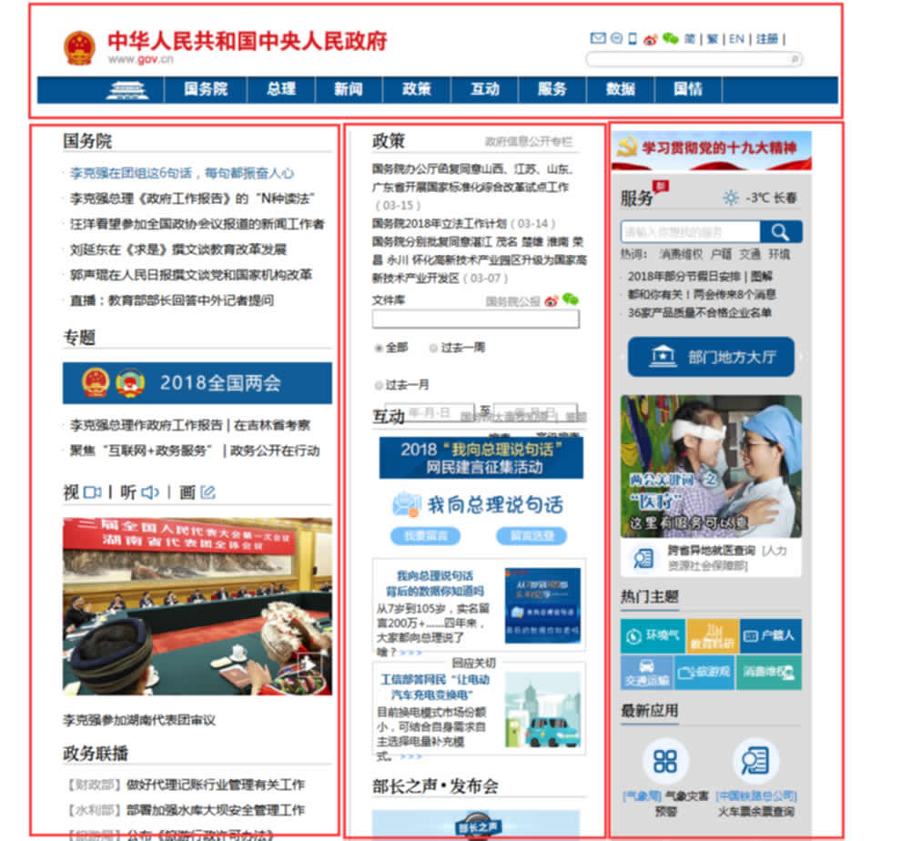
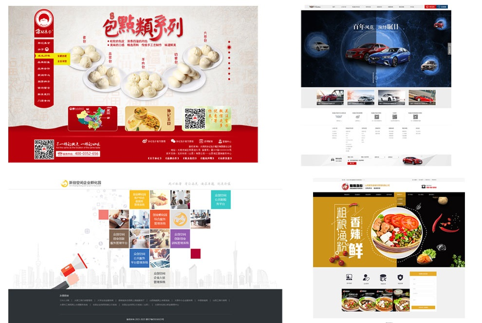

# 页面布局语义化元素

[[toc]]

网页的外观多种多样，但是除了全屏视频或游戏，或艺术作品页面，或只是结构不当的页面以外，大部分网页结构都是非常类似的，像报纸版面或者word文档结构一样。



总体来说，大部分网页相似的结构有以下几类标准区块：
- 页眉

通常横跨于整个页面顶部有一个大标题 和/或 一个标志。 这是网站统一的头部区域，通常存在于所有网页。

- 导航栏

指向网站各个主要区段的超链接。通常用菜单按钮、链接或标签页表示。

- 主内容

中心的大部分区域是当前网页大多数的独有内容，例如视频、文章、地图、新闻等。这些内容是网站的一部分，且会因页面而异。

- 侧边栏

一些外围信息、链接、引用、广告等。通常与主内容相关（例如一个新闻页面上，侧边栏可能包含作者信息或相关文章链接），还可能存在其他的重复元素，如辅助导航系统。

- 页脚

横跨页面底部的狭长区域。和标题一样，页脚是放置公共信息（比如版权声明或联系方式）的，一般使用较小字体，且通常为次要内容。 还可以通过提供快速访问链接来进行 SEO。



## 布局语义化元素 header nav main aside article section footer

在HTML4及以前，使用DIV来布局时，使用类名来标识不同的区块。在HTML5提供了更好的布局结构语义化标记来明确这些区段，避免统一使用div，屏幕阅读器等辅助技术可以识别这些特定的元素，并帮助执行“找到主导航 “或”找到主内容“等任务，提供了更好的可访问性。

HTML5 提供了明确这些区块的专用标签，例如：

- `<header>`：页眉。如果它是 `<body>` 的子元素，那么就是网站的全局页眉。如果它是 `<article>` 或`<section>` 的子元素，那么它是这些部分特有的页眉。
- `<nav>`：导航栏。也可以在其它元素内，如header内嵌套nav。
- `<main>`：主内容。主内容中还可以有各种子内容区段，可用`<article>`、`<section>` 和 `<div>` 等元素表示。
- `<article>`: 包围的内容即一篇文章，与页面其它部分无关（比如一篇博文）。
- `<section>`: 适用于组织页面使按功能分成更细的区块。
- `<aside>`：侧边栏，经常嵌套在 `<main>` 中。
- `<footer>`：页脚。

> article 和 section 区别：article以文章结构理解，section就是文章中各个章节划分的区块。一般的最佳用法是：以 标题 作为开头；也可以把一篇 `<article>` 分成若干章节并分别置于不同的 `<section>` 中，也可以把一个区段 `<section>` 分成若干部分并分别置于不同的 `<article>` 中，取决于上下文。



有时也会发现，对于一些要组织的项目或要包装的内容，现有的语义元素均不能很好对应。有时候你可能只想将一组元素作为一个单独的实体用来响应CSS 或 JavaScript处理效果。为了应对这种情况，可以继承使用无语义的 `<div>` 和 `<span>` 元素，配合使用 class 属性提供一些样式。

**示例：**

```html
<!DOCTYPE html>
<html>
  <head>
    <meta charset="utf-8">
    <title>网页结构示例</title>
    <link href="style.css" rel="stylesheet">
  </head>

  <body>
    <header> <!-- 本站所有网页的统一主标题 -->
      <h1>标题header部分</h1>
    </header>
    
    <nav> <!-- 本站统一的导航栏 -->
      <ul>
        <li><a href="#">主页</a></li>
        <!-- 共n个导航栏项目，省略…… -->
      </ul>

      <form> <!-- 搜索栏是站点内导航，所以还是在nav元素中。 -->
        <input type="search" name="q" placeholder="要搜索的内容">
        <input type="submit" value="搜索">
      </form>
    </nav>
    
    <main> <!-- 网页主体内容 -->
      <article>
        <!-- 此处包含一个 article（一篇文章），内容可分区块组织 -->
        <header>文章标题</header>
        <section>
            <header>章节标题<header>
            <div>这一段展示的内容</div>
        </section>
      </article>
      
      <aside> <!-- 侧边栏在主内容右侧 -->
        <h2>相关链接</h2>
        <ul>
          <li><a href="#">这是一个超链接</a></li>
          <!-- 侧边栏有n个超链接，略略略…… -->
        </ul>
      </aside>
    </main>
    
    <footer> <!-- 本站所有网页的统一页脚 -->
      <p>© 2050 某某保留所有权利</p>
    </footer>
  </body>
</html>
```
## 常见的网页布局结构

一般网页的常见布局有：
- 上下结构叠加型（如论坛）
- "T"型左右结构型（如博客）
- “川”字型（所谓老三栏，政府居多）
- “国”字综合型（综合门户、政府，或是企业网站等），企业封面型（目前flash站的没有了H5）
- 企业封面弄（全屏展示）

### 上下结构




### "T"型结构



### “川”字型（所谓老三栏)



### “国”字综合型


### 企业封面型



## 建站流程

[MDN 规划一个简单的网站](https://developer.mozilla.org/zh-CN/docs/learn/HTML/Introduction_to_HTML/%E6%96%87%E4%BB%B6%E5%92%8C%E7%BD%91%E7%AB%99%E7%BB%93%E6%9E%84)
[网站流程参考](http://www.wangyexueyuan.com/resource/html/1/1.1.html)

1. 确定用户和应用场景。

你的产品是在何种场景下被使用，你的用户角色是怎样特征的人。把场景和角色描述清楚，并且让整个团队理解透彻，这能保证产品流程逻辑没有问题。

2. 讨论用户体验流程。

讨论主要流程和主要功能，此环节要敲定用户流程及其中的关键步骤，每一步骤可能都是一个主要界面，梳理出所有功能，对功能进行分组，提取通用的功能，形成网站的地图。

3. 需求文档整理

把项目需求整理好，包括功能设计思路、界面需要展示的内容、功能布局摆放，各个页面之间的关系等，可以做成线框图，或是简单但线框原型，供UI设计师和其他工程师参考了解需求。

4. 原型制作

按确定的用户流程及确定的布局风格来继续做其它界面的线框图。如果项目产品需要展示可动原型，就需要有交互设计师。设计师配合把相关素材图片提供好，交互设计师完成高保真原型。

5. UI设计

UI设计师根据项目经理的需求文档及线框图，对项目进行理解分析，考虑用色、设计风格、合理布局为设计做好准备。开始做关键界面的视觉设计，进行配色、样式不同风格的尝试。此环节要确定产品界面的视觉设计风格。

6. 项目开发

7. 项目测试

8. 项目部署上线