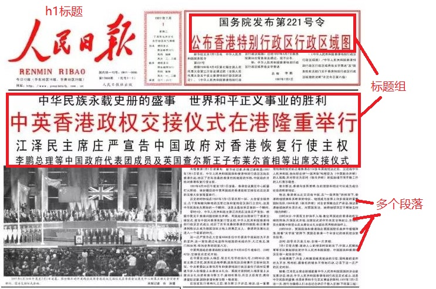

# 文本结构语义化元素

[[toc]]

HTML（HyperText Markup Language），全称是超文本标记语言，描述网页的内容和结构。现代网页内容种类越来越丰富，真得算是“超文本”内容了，不仅仅是文本，还包括图版、音视频等媒体内容。但在最初，HTML的主要工作是编辑文本，包括文本结构和内容两部分，早期HTML工作组的有很多出版界书籍排版的专家，所以在HTML语言中，对文本表示的标签最多，也是语义最丰富。

我一直认为在最初学习html时，可以参考word文档或者报纸来理解，编写html就像当初大学毕业论文格式的要求，有章节、资源引用、页眉、页脚、参考引用标注等。



大部分的文本结构主要由标题和段落组成，另外的文本排版结构还列表（有序列表、无序列表、自定义列表）
- 标题：h1-h6, hgroup

## 标题：h1-h6, hgroup

标题(Heading)元素呈现了六个不同的级别的标题，h1级别最高，而 h6级别最低。对于主副标题还有一个标题组元素hgroup。
> MDN文档写明，hgroup元素已经从HTML5（W3C）规范中删除，但是它仍旧在 WHATWG 的 HTML 版本里。大多数浏览器都部分地实现，所以它不太可能完全在浏览器里消失。

h1-h6标题，在浏览器实现中都带有各自的默认样式，表现为字号逐级减小。

```html
<h1>一级标题</h1>
<h2>二级标题</h2>
<h3>三级标题</h3>
<h4>四级标题</h4>
<h5>五级标题</h5>
<h6>六级标题</h6>
```
效果：
<h1>一级标题</h1>
<h2>二级标题</h2>
<h3>三级标题</h3>
<h4>四级标题</h4>
<h5>五级标题</h5>
<h6>六级标题</h6>

如果在页面中，存在主副标题或标题和描述的情形，可以使用标题组元素来包裹，使得页面语义更为完整，不是孤立的两个标题。

```html
<hgroup>
  <h1>Main title</h1>
  <h2>Secondary title</h2>
</hgroup> 
```

## 段落 p

同word内容一样，每个分段的内容都用一个p标签来包裹即可。

```html
<p>这是一段示例文字，虽然文字内容较短</p>
```

## 列表 list

列表在生活中随处可见——从你的购物清单到你的回家路线方案列表，再到你遵从的教程说明列表。在网络上，列表也到处存在，我们需要学习三种不同类型的列表。
### 有序列表 Ordered List

有序的列表是根据项目的顺序列出来的，强调的重点是列表项之间是有顺序先后关系的。

使用ol标签包裹列表项li，列表项前使用数字标识。

比例指引方向的例子，各项是有先后顺序来指引方向。
```html
<ol>
  <li>沿着条路走到头</li>
  <li>右转</li>
  <li>直行穿过第一个十字路口</li>
  <li>在第三个十字路口处左转</li>
  <li>继续走 300 米，学校就在你的右手边</li>
</ol>
```


### 无序列表 Unordered List

无序的列表中项目的顺序并不重要，更像是一个清单项的罗列。

使用 ul 标签包裹列表项。列表项前用点或圈表示。

如一个餐点的列表项：
```html
<ul>
  <li>豆浆</li>
  <li>油条</li>
  <li>豆汁</li>
  <li>焦圈</li>
</ul>
```

### 描述列表 Description List

描述列表包含描述术语（description terms）和描述部分（description description），属于键值对的形式。更适用于词汇表，或其它术语定义。

使用dl包裹列表项，单个列表项的由dt定义列表项的标题，dd定义列表项内容。其中dd定义的内容有缩进效果。

>.不要将元素（也不要用 dl-dt-dd 元素）用来在页面创建具有缩进效果的内容。虽然这样的结果样式看上去没问题，但是，这是很糟糕的做法，并且语义也不清晰。要改变描述列表中描述的缩进量请使用 CSS 。

一个dl标签包裹的dt dd数量并没有限制，所以可以一个dt对多个dd，或相反，比如下面例子。
```html
// dl 和 dd 一对一
<dl>
  <dt>Firefox</dt>
  <dd>A free, open source, cross-platform, graphical web browser
      developed by the Mozilla Corporation and hundreds of volunteers.
  </dd>
  <!-- other terms and definitions -->
</dl>

// dl 和 dd 一对多：单条术语对应多个描述
<dl>
  <dt>Firefox</dt>
  <dd>A free, open source, cross-platform, graphical web browser
      developed by the Mozilla Corporation and hundreds of volunteers.</dd>
  <dd>The Red Panda also known as the Lesser Panda, Wah, Bear Cat or Firefox,
      is a mostly herbivorous mammal, slightly larger than a domestic cat
      (60 cm long).</dd>

  <!-- other terms and definitions -->
</dl>

// dl 和 li 多对一
<dl>
  <dt>Firefox</dt>
  <dt>Mozilla Firefox</dt>
  <dt>Fx</dt>
  <dd>A free, open source, cross-platform, graphical web browser
      developed by the Mozilla Corporation and hundreds of volunteers.</dd>

  <!-- other terms and definitions -->
</dl>

// 也可以是多对多。
```

不同列表单也可以相互嵌套
```html
<ul>
  <li>豆浆
      <ol>
          <li>甜味</li>
          <l>咸味</li>
      </ol>
  </li>
  <li>油条</li>
  <li>豆汁</li>
  <li>
      <dl>
          <dt>焦圈</dt>
          <dd>甜味</dd>
          <dd>咸味</dd>
      </dl>
  </>
</ul>
```

## 显示隐藏 details summary

`<details>`元素可创建一个挂件，仅在被切换成展开状态时，它才会显示内含的信息。<br>
`<summary>` 元素可为该部件提供概要或者标题。
示例：
```html
<details>
    <summary>标题</summary>
    <p>显示summary元素内容作为标题.</p>
</details>
```
<details>
    <summary>标题</summary>
    <p>显示summary元素内容作为标题.</p>
</details>

**延伸内容：**
- 如果details元素缺少summary，则默认标题为Details(中文显示"详细信息")

```html
<details>
    <p>使用默认内容显示“详细信息”.</p>
</details>
```
<details>
    <p>使用默认内容显示“详细信息”.</p>
</details>

- details有一个`open`的布尔值属性。details元素默认是隐藏状态，如果加了Open特性，则为显示状态

```html
<details open>
    <summary>open默认显示</summary>
    <p>使用open特性，默认显示，这是布尔值特性.</p>
</details>
```
<details open>
    <summary>open特性</summary>
    <p>使用open特性，默认显示，这是布尔值特性.</p>
</details>

- summary元素默认显示的箭头标识可以通过css修改

summary元素的list-style，包括list-style-type list-style-image

```css
details > summary {
  padding: 2px 6px;
  width: 15em;
  background-color: #ddd;
  border: none;
  list-style: none;
}
/* chrome不兼容，使用其为元素 */
details > summary::-webkit-details-marker {
  display: none;
}
```

- details的显示隐藏切换可以通过自身的toggle事件来监听。

```js
details.addEventListener("toggle", event => {
  if (details.open) {
    /* the element was toggled open */
  } else {
    /* the element was toggled closed */
  }
});
```

