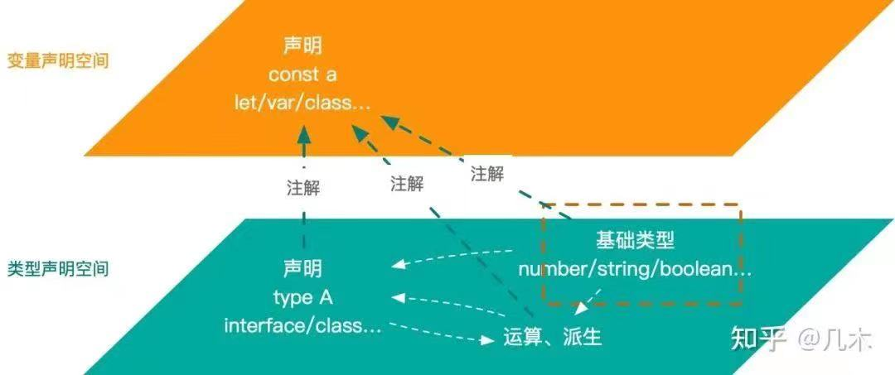

# 类型编程 type programming

通过TypeScript操作符，把类型当作参数进行逻辑处理，从而获得新的类型的过程称为类型编程。

我们写JS处于一个叫值空间的世界，对值进行编码，面向运行时编程。而在类型空间中，我们对类型进行编码，面向编译时编程。


>参考链接：
>- [类型体操](https://zhuanlan.zhihu.com/p/384172236)
>- [第2425期】浅谈 Typescript（二）：基础类型和类型的声明、运算、派生](https://mp.weixin.qq.com/s/IIRlhUNCV-hh14FrFDnaTQ)

- 类型修饰符（+ - ? readonly)
- 类型运算符
  - 定义类型： type interface 泛型`<T>` `infer U`声明推荐类型
  - 获取类型： typeof 类型索引`[key] / [number]` keyof(获取对象所有键组成的联合类型)
  - 类型逻辑运算：| &
  - 联合类型的遍历 in
  - 条件类型 extends
- 工具类型
  - 条件工具类型
  - 对象映射工具类型
  - 对象属性裁剪工具类型

## 类型修饰符[P169]

结构化类型中，字段可以使用以下修饰符：
- `?`：标记属性为可选的，此时该属性类型会被拓宽为 `T | undefined`
- `readonly`：标记属性为只读，此时该属性不能被重新赋值，类似为使用 const 声明基础类型的效果。
- `-`：减号运算符，一个特殊的类型运算符，只应用于映射类型，可以把 `?` 和 `readonly` 修饰符的类型约束去掉，分别还原为必须属性和可写属性。
- `+`：一般不直接使用加号运算符，因为它的作用通常已经包含在其它运算符中。比如在映射类型中，`readonly` 等效于 `+readonly`，`?` 等效于 `+?`。`+` 的存在只是为了确保整体协调。
```ts
type Account = {
  id: number,
  isEmployee?: boolean,
  readonly notes: string[]
}

/**
 *  关于 in keyof 运算符见下面[类型运算符]
 */
// 把所有字段都变为可选的
type OptionalAccount = {
  [K in keyof Account]?: Account[K]
}

// 把所有字段都变为只读的
type ReadonlyAccount = {
  readonly [K in keyof Account]: Account[K]
}

/**
 *  - 减号运算会只应用于 in 运算符的映射类型中
 */

// 恢复所有字段为必须的
type EssentialAccount = {
  [K in keyof Account]-?: Account[K]
}

// 恢复所有字段为可写的
type WritableAccount = {
  -readonly [K in keyof Account]: Account[K]
}
```

## 类型运算符

### 定义类型

#### `type` 定义类型别名[P42]

类型别名可以更清楚地表明变量的作用，并且类型别名也有助于减少重复书写复杂的类型（DRY原则： Dont Repeat Yourself）。[P44]

类型别名的特点：
- TS 无法推导类型别名，使用时必须显式注解
- 任何使用类型别名的地方，都可以替换成源类型，程序语义不受影响
- 同一作用域内不能重复声明同名的类型别名
- 类型别名采用块级作用域，内部的类型别名将覆盖外部同名的类型别名


```ts
type UserID = number
type User = {
  id: UserID,
  name: string
  age: number
}
type Sum = (a: number, b: number) => number // 简写的函数调用签名
type Sum = {  // 完整的函数调用签名，可以声明多个
  (a: number, b: number): number,
  (a: string, b: string): number,
}
type List = {
  [index: number]: string  // 对象索引签名
}

// TS 无法推导类型别名，使用时必须显式注解
let user: User = {
  id: 10,
  name: 'Tom',
  age: 19,
}

// 同一作用域内不能重复声明同名的类型别名
type Color = 'red'
type Color = 'blue' // Error TS2300: Duplicate identifier 'Color'

// 类型别名采用块级作用域，内部的类型别名将覆盖外部同名的类型别名
if (Math.random() < 0.5) {
  type Color = 'blue'   // 不会报错，并且覆盖外面声明的 Color
  let b: Color = 'blue'
} else {
  let c: Color = 'red'
}
```

#### `interface` 接口定义类型[P113]

与类型别名类似，接口也是一种命名类型的方式。

接口的特点：
- 声明合并：同名接口会进行声明合并：同名属性类型要兼容，同名方法签名会重载
- 接口继承：可以使用 `extends` 关键字进行扩展
- 接口实现：可以使用 `implements` 关键字被类实现

```ts
/*************************************************
 * 用 interface 接口约束对象类型（对象、数组、函数）
 ***********************************************/
// 接口声明对象类型
interface IPerson {
	name: string
	age: number
}
const person: IPerson = {
	name: 'tom',
	age: 18
}

// 接品声明函数调用签名
interface ISum {
	sum(a: string, b: string): number
}
const sum: ISum = function(a: string, b: string): number {
	return a + b
}

// 使用接口利用索引签名定义数组结构
interface IList {
	[index: number]: number
}
const arr: IList = [1, 2, 3]

/***************************************************************
 * 接口继承：可以使用 `extends` 关键字进行扩展，并且可以同时扩展多个
 **************************************************************/
interface Shape {
	color: string
}
interface PenStroke {
	penWidth: number
}
interface Square extends Shape, PenStroke {
	sideLength: number
}
let square = <Square>{}
square.color = 'blue'
square.sideLength = 10
square.penWidth = 5.0

/*************************************************************************
 * 接口实现：当需要使用接口约束类时，可以使用 `implements` 关键字被类实现
 ************************************************************************/
// 定义了一个报警器的接口规范，它有一个发出警告的方法alert
interface Alarm {
	alert(): void
}

// 防盗门可以安装报警器，所以Alarm可以在防盗门的类上实现
class SecurityDoor implements Alarm {
	constructor() {}
	alert() {
		console.log('be be be ...')
	}
}

// 汽车也有防盗报警功能，所以汽车的类也可以实现Alarm接口
class Car implements Alarm {
	constructor() {}
	alert() {
		console.log('di di di ...')
	}
}

/************************************************************************
 * 接口声明合并：同名接口会进行声明合并：同名属性类型要兼容，同名方法签名会重载
 ************************************************************************/
interface Box {
	height: number
	width: number
}
interface Box {
	scale: number
}
let box: Box = { height: 5, width: 6, scale: 10 }

// 接口声明合并有几条规则：
// 1. 多个同名接口中声明了同名的非函数成员且它们的类型不同，则编译器会报错。
// 2. 对于函数成员，每个同名函数声明都会被当成这个函数的一个重载。
//    2.1 并且当接口 A 与后来的接口 A 合并时，后面接口的函数重载具有更高的优先级。
//    2.2 如果其中一个接口的函数签名里有一个参数的类型是单一的字符串字面量（不是字符串字面量的联合类型），那么它将会被提升到重载列表的最顶端。
interface Box {
	height: number
	width: number
}
interface Box {
	width: 100    // Error TS2717: Subsequent property declarations must have the same type.  Property 'width' must be of type 'number', but here has type '100'.
	scale: number
}
interface Document {
	createElement(tagName: any): Element
}
interface Document {
	createElement(tagName: 'div'): HTMLDivElement
	createElement(tagName: 'span'): HTMLSpanElement
}
interface Document {
	createElement(tagName: string): HTMLElement
	createElement(tagName: 'canvas'): HTMLCanvasElement
}

// 合并后的，类似下面这种效果
interface Document {
	createElement(tagName: 'canvas'): HTMLCanvasElement
	createElement(tagName: 'div'): HTMLDivElement
	createElement(tagName: 'span'): HTMLSpanElement
	createElement(tagName: string): HTMLElement
	createElement(tagName: any): Element
}
```

类型别名和接口算是同一概念的两种句法，就像函数表达式和具名函数声明之间的关系一样。但还是有些细微的区别：
- 类型别名更为通用，`type`的右边可以是任何类型，包括类型表达式，所以在类型编程中广泛使用类型别名。而接口只能声明结构化类型。
- 同一作用域内，同名的多个接口将进行接口合并(同名的属性类型要相同，同名的函数调用签名会进行函数重载，且越后声明重载优先级越高)；而同名的类型别名将会报错。
- 扩展接口时，TS 将检查扩展的接口是否可赋值给被扩展的接口，如果不兼容将会报错。但是使用别名使用交叉类型运算符 `&` 时，将扩展和被扩展的类型组合在一起，最终的结果是会重载类型。

```ts
/************************************************************************
 * 类型别名更为通用，`type`的右边可以是任何类型，包括类型表达式，所以在类型编程中广泛使用类型别名。
 * 而接口只能声明结构化类型。
 ************************************************************************/
type type UserID = number
type Exclude<T, U> = T extends U ? never : T; // 获取在 T 中但不在 U 中的类型


/************************************************************************
 *  同一作用域内，同名的多个接口将进行接口合并(同名的属性类型要兼容，同名的方法属性将进行函数重载，且越后声明重载优先级越高)；
 * 而同名的类型别名将会报错
 ************************************************************************/
type Color = 'red'
type Color = 'blue' // Error TS2300: Duplicate identifier 'Color'

interface Box {
	height: number
	width: number
}
interface Box {
	width: 100    // Error TS2717: Subsequent property declarations must have the same type.  Property 'width' must be of type 'number', but here has type '100'.
	scale: number
}

interface Document {
	createElement(tagName: any): Element
}
interface Document {
	createElement(tagName: string): HTMLElement
	createElement(tagName: 'canvas'): HTMLCanvasElement
}
// 合并后的，类似下面这种效果
interface Document {
	createElement(tagName: 'canvas'): HTMLCanvasElement
	createElement(tagName: string): HTMLElement
	createElement(tagName: any): Element
}

/************************************************************************
 * 扩展接口时，TS 将检查扩展的接口是否可赋值给被扩展的接口，如果不兼容将会报错。
 * 但是使用别名使用交叉类型运算符 `&` 时，将扩展和被扩展的类型组合在一起，最终的结果是属性类型成联合类型，函数会变成重载类型。
 ************************************************************************/
// TODO: 例子
```
#### 泛型 `<T>` 

一、为什么需要泛型

之前讲的不管是显式注解类型，还是使用 type interface 定义类型，都在使用具体类型，就是我们在使用类型前都明确知道需要什么类型，并且确认传入的类型确实是那个类型。
```ts
let a: boolean
type User = {
  id: UserID,
  name: string
  age: number
}
interface Document {
	createElement(tagName: string): Element
}
```
但是也有时候，定义类型时并不知道需要什么类型，只有等待到使用时，给足了其它类型条件，TS 才会推导出具体类型。

比如下面一个例子，需要自定义实现一个 filter 函数，这个函数迭代数组筛选出符合给定条件的元素。如果使用纯 JS 实现可以这样写
```ts
function filter(arr, fn) {
	let result = []
	for (let item of arr) {
		fn(item) ? result.push(item) : continue
	}
	return result
}
```

现在在 TS 中实现，需要给函数注解类型，我们先用 unknown 提取函数的完整签名。
```ts
type Filter = {
	(arr: unknown[], (item: unknown) => boolean): unknown[]
}
```

要保证函数的通用性，入参的数组可以传入数字数组、字符串数组、对象数组等，此时我们会想到使用函数重载来实现

但这个实现在遇到对象数组时就会报错，因为我们注解对象的类型为 object，但我们知道，object 类型无法描述对象结构，它不能进行任何操作。但此时如果我们用 type 或 interface 注解为某个具体类型，显然又会让函数变得不通用了。

此时我们就可以使用泛型，在提前不知道具体类型的时候，在 filter 函数需要类型注解的地方先注解为一个抽象类型 T ，T 就像一个类型占位符，TS 类型检查器会在使用时根据类型上下文推导出 T 的具体类型，然后将 T 出现的每一处都替换为具体类型。

> T 只是一个名称，也可以使用任何其它名称来表示这个类型占位符。按约定成俗的惯例，使用单个大写字母来表示，并且从 T 开始，依次使用 U V W 等。常见泛型变量代表的意思：
> T（Type）：表示类型；
> K（Key）：表示对象中的键类型；
> V（Value）：表示对象中的值类型；
> E（Element）：表示元素类型。

至此，我们可以引出泛型的定义：

二、理解泛型

泛型（Generic Type）是对通用类型系统(Common Type System, CTS )的一种实现，用于定义未指定某些细节的类型。实际上，代码本身就是泛型。

所以这里有两种理解：

第一种理解是针对前半段意思：用于定义未指定某些细节的类型。在`《Typescript编程》[P85]`书中阐述，泛型完整名称叫泛型参数，指的是在类型层面中施加类型约束的占位符。

另一种理解更广义，针对后半段的理解：代码本身就是泛型。泛型是一种创建可复用代码的工具，相当于类型层面的“函数”，可以根据传入的泛型参数，进行类型运算。

```ts
type Filter = <T>(arr: T[], fn: (T) => boolean) => T[]

// 如果用第一种理解，其中泛型，也就是泛型参数是指 T，它是暂时未知类型的一个占位符
// 如果用第二种理解，上述的整体 Filter 就是一个泛型，它代表了可以实现数组元素筛选功能的可复用的通用类型。
```
这里倾向于第二种理解，然后把第一种理解特指为泛型参数，另外，把含有泛型参数的函数声明称为泛型函数，含有泛型参数的类型别名称为泛型别名，含有泛型参数的类称为泛型类。

```ts
// 泛型别名：含有泛型参数的类型别名定义
type Filter = <T>(arr: T[], fn: (T) => boolean) => T[]

// 泛型接口：含有泛型参数的接口
interface GenericInterface<U> {
  value: U
  getIdentity: () => U
}

// 泛型函数：含有泛型参数的具名函数声明
function filter = <T>(arr: T[], fn: (T) => boolean): T[] {
  let result: T[] = []
  for (let item of arr) {
    if (fn(item)) {
      result.push(item)
    }
  }
  return result
}

// 泛型类
class IdentityClass<T> implements GenericInterface<T> {
  value: T

  constructor(value: T) {
    this.value = value
  }

  getIdentity(): T {
    return this.value
  }
}
```

泛型的强大，可以理解为是类型空间中实现类型编程的基石，相当于值空间中“函数是一等公民”的意义。
> 通过TypeScript操作符，把类型当作参数进行逻辑处理，从而获得新的类型的过程称为类型编程。其中把类型当作参数就称为泛型参数。

三、泛型的特点

- 泛型参数使用尖括号`<>`来声明，在一对尖括号中可以声明任意个泛型参数，以逗号分隔
- 尖括号声明的位置决定了泛型参数的作用域，以及 TS 会在什么时候推导出泛型的具体类型
- 泛型参数的默认值：泛型参数可以声明一个默认类型，类似函数参数的默认值。
- 泛型约束 `T extends type` [P95]


#### `infer U` 声明推断类型[P177]

使用 `infer` 关键字在条件类型中声明泛型参数。通常应用在条件类型编程中，定义工具类型。
```ts
type ItemType<T> = T extends (infer U)[] ? U : T // 获取数组元素的类型
type Parameters<T extends (...args: any) => any> = T extends (...args: infer P) => any ? P : never; // 获取函数类型的参数类型组成的元组类型
type ReturnType<T extends (...args: any) => any> = T extends (...args: any) => infer R ? R : any; // 获取函数返回值类
```

### 获取类型

- typeof
- 索引访问类型 `T[key] / T[number]`
- keyof: 获取对象所有键组成的联合类型

TS 提供了一个 `typeof` 操作符，在类型层面中，使用它来获取变量或属性的类型。
> 区别于 JS 原生的 `typeof` 操作符，它是在值层面中，获取变量的类型，返回字符串。
```ts
let a: number = 123
let b: typeof a  // b 的类型同样是 number

const c = {
  name: 'tom',
  age: 18
}

type Obj = typeof c  // Obj 等效于 {name: string, age: number}
```
如果要获取对象中某个属性的类型，要如何操作？使用索引访问类型 `T[key]` 和 `T[number]`
```ts
type Obj = {
	name: string
	age: number
}
type Age = Obj['age'] // number

type Arr = [number, string]
type Index1 = Arr[1] // 元组或数组可以认为是索引是数值的对象。

// 注意区分类型层面编码和值层面编码，不能混用
const key = "age";
type Age = Obj[key] // Type 'any' cannot be used as an index type.
                    // 'key' refers to a value, but is being used as a type here. Did you mean 'typeof key'?
// 可以定义一个类型别名替代
type key = "age";
type Age = Obj[key]
```
另一种情形，需要获取对象所有的键， TS 提供了一个 `keyof` 操作符，它会将对象的所有键组成一个字符串字面量的联合类型。
```ts
type Obj = {
	name: string
	age: number
}

type Key = keyof Obj // 相当于 key = 'name' | 'age'
let key1: Key = 'name'
let key2: Key = 'age'
```
所以上面不管是 typeof 操作符和获取索引类型基本都和 JS 操作保持一致。

### 类型逻辑运算

#### 联合类型
- 联合类型运算符 `|`
- 句法：`A | B`

联合类型 `A | B` 表示一个集合，该集合是与类型A关联的一组值和与类型 B 关联的一组值的并集。

```ts
// 基础类型的联合，取值域只能是其中一种
type Age = number | string
let age: Age
age = 18
age = '18'

// 如果将联合类型用于复杂类型，将只取它们中共有的属性。
// 下列中接口中同名属性类型也会被转为 联合类型
type A = {
	name: string
	age: number
	sayName: (name: string) => void
}
type B = {
	name: number
	gender: string
	sayGender: (gender: string) => void
}
let p: A | B
p.name = 'tom' // 此时p.name 类型是 string | name
p.name = 123
p.gender // 报错，不属于两者的共有部分。
```
#### 交叉类型
- 交叉类型运算符 `&`
- 句法： `A & B`

交叉类型 A & B 表示一个集合，该集合是与类型 A 关联的一组值和与类型 B 关联的一组值的交集。

```ts
// 取 number 和 string 的交集，就是说要有一种类型即是 number 子集，又是 string 的子集，只能是类型 never
type A = number & string
let a: A = null // Error TS2322: Type 'null' is not assignable to type 'never'.
let b: undefined & void = undefined


type A = {
	name: string,
	age: number,
}
type B = {
	name: string,
	gender: string,
}

type Corss = A & B
let corss: Corss = {
	name: 'tom',
	age: 18,
	gender: 'male'
}

/**
 * A & B 的结果表面上看更像联合了 A 和 B 类型的所有属性。
 *
 * 从 TS 采用结构化类型（鸭子类型）的协变规则：
 * 如果 A 对象可赋值给 B 对象，那么会检查 A 对象中是否有 B 对象声明的每个属性，且 A 对象中这个属性的类型必须是 B 对象对应属性的子类型。
 * 
 * 要取 A & B 的交集，那这个对象必须既是 A 的子类型，也是 B 的子类型。
 * 如果一个对象要是 A 的子类型，必定要包含 A 的所有属性且每个属性的类型要兼容(<:T)。
 * 同样它也要是 B 的子类型，必定要包含 B 的所有属性且每个属性的类型要兼容(<:T)。
 * 那要存在这样的对象，必然是包含了 A 和 B 类型的所有属性。
 */
```
> 上达内容涉及到类型兼容性：超类型、子类型、协变，可查阅[类型检查](3-type-checking.md)

### 联合类型的遍历： in 运算符

JS 中的 `for...in` 语法可以遍历对象的属性，类似的， TS 中的 `in` 运算符可以遍历联合类型中的每一项，常常用在工具类型的编程中定义结构类型的索引签名。

这里拿[类型检查-全面性检查](3-type-checking.md)中的例子。
```ts
type Weekday = 'Mon' | 'Tue' | 'Wed' | 'Thu' | 'Fri'
type Day = Weekday | 'Sat' | 'Sun

// 通过 in 运算符遍历联合类型 Weekday 中每一项，建立类似 { Mon: Day, Tue: Day, ...} 的类型结构
type NextDay = {
  [K in Weekday]: Day
}

let nextDay: NextDay = {
	Mon: 'Tue',
	Tue: 'Wed',
	Wed: 'Thu',
	Thu: 'Fri',
	Fri: 'Sat',
}

/**
 * 延伸: TS 内置工具类型 Record 的实现，更多例子见后面工具类型推导
 * keyof any 结果是 string | number | symbol
 * K extends keyof any 是泛型约束，K 只能为  string | number | symbol 联合类型的子类型
 */
type Record<K extends keyof any, T> = {
  [P in K]: T
}
```

### 条件类型 conditional type

条件类型指的是可以根据一个条件表达式进行类型推导，从两个类型中选出其中一个。

句法： `T extends U ? X : Y`
语义表示：若 T 是 U 的子类型，则类型为 X，否则类型为 Y。若无法确定 T 是否为 U 的子类型，则类型为 `X | Y`。

在语义上类似于值层面的三元表达式，只是现在位于类型层面，并且同样支持嵌套。

#### 为什么需要条件类型？

在 TS 使用过程中，我们一般会直接指定具体类型:
```ts
let str: string = 'get'
```
但是，有时候我们在编写代码中，会遇到不能马上明确指定它的具体类型，需要根据输入才能做出具体判断的情况。比如下面例子：
```ts
/**
 * 在编写 IsString 工具类型时只有等到使用时传入的类型进行推导才能确定。
 * 换句话说，只有类型系统中给出充足的条件之后,它才会根据条件推断出类型结果。
 */
type IsString<T> = T extends string ? true : false
type A = IsString<string> // true
type A = IsString<number> // false
```

也就是说条件类型的应用场景是：在初始状态时不能直接确定具体类型，而是需要通过一定的类型运算才能得到最终的变量类型。

#### 条件类型的分配特性，也叫可分配条件类型(distributive conditional type)。

规律是：条件类型 `T extends U ? X : Y` 中，当泛型参数 T 取值为类似 `A | B | C` 这样的联合类型时，这个条件类型就等价于 `(A extends U ? X : Y) | (B extends U ? X : Y) | (C extends U ? X : Y)`，这就是可分配条件类型，有点类似乘法分配律`(1+2+3)*10 = 1*10+2*10+3*10`。

```ts
// 定义一个泛型类型 Without<T, U>，用于筛选在T中但不在U中的类型:
type Without<T, U> = T extends U ? never : T
// 可以这样使用
type A = Without<boolean | number | string, boolean>; // number | string

// 下面一步一步拆解下 TS 是如何计算这个类型的
// 1. 给泛型指定具体类型
type A = Without<boolean | number | string, boolean>
// 2. 把条件分配到联合类型的各个子类型中
type A = Without<boolean, boolean>
				| Without<number, boolean>
				| Without<string, boolean>
// 3. 替换为具体的定义：
type A = (boolean extends boolean ? never : boolean)
				| (number extends boolean ? never : number)
				| (string extends boolean ? never : string)
// 4. 计算结果联合
type A = never
				| number
				| string
// 5. 根据类型拓宽规则，子类型被忽略：never 是所有类型的子类型，必须也是 number 或 string 的子类型
type A = number | string
```
TS 内置工具类型 `Exclude<T, U>`就是上述 Without 的实现。

可分配条件类型有一个限制是：其中被检查的类型 `T` 必须是裸类型参数（naked type parameter）。裸类型指的是没有被包装过的类型，（如：`Array<T>、[T]、Promise<T>` 等都不是裸类型），简而言之**裸类型就是未经过任何其他类型修饰或包装的类型**。
> 裸类型概念有点类似多余属性检查中的新鲜对象字面量类型。

```ts
// 泛型参数 T 是裸类型，因为没有被其它类型包裹
type NakedType<T> = T extends boolean ? 'Yes': 'No'

// 泛型参数不是裸类型，因为它被包裹在元组中
type WrappedType<T> = [T] extends [boolean] ? 'Yes' : 'No'
```

#### infer：声明待推断的泛型参数

在 extends 条件类型的子句中，可以使用 infer 声明一个需要推断的泛型参数，它可以在条件类型为真的分支中引用 infer 声明的这个待推断的泛型参数。另外，infer 同一类型变量可以存在多个位置上。
简单说： infer 关键字就是声明一个待推断泛型参数，当类型系统给足条件的时候类型就会被推断出来。

```ts
// 提取函数返回值类型
type ReturnType<T> = T extends (...args: any[]) => infer R ? R : any

// 在协变位置上同一类型变量声明多个候选类型将会被推断为联合类型，即在对象多个属性类型上使用 infer 声明待推断类型时会被推断为联合类型
type Foo<T> = T extends { a: infer U, b: infer U } ? U : never
type f1 = Foo<{a: string, b: string }> // string
type f2 = Foo<{a: string, b: number }>  // string | number

// 利用上面这特性，我们可以声明一个工具类型提取对象所有属性值类型的联合类型，或者元组元素类型的联合类型
// 对应 keyof 能提取对象键的联合类型
type valueof<T> = T extends { [k: string]: infer U } ? U : T;
type Obj = { x: string, y: number, z: boolean }
type Value = valueof<Obj>; // string | number | boolean
type Key = keysof Obj // x | y | z

type ExtractArrayItemType<T> = T extends (infer U)[] ? U : T;
type ItemTypes = ExtractArrayItemType<[string, number]>; // string | number


// 在逆变位置上同一类型变量声明的多个候选类型将会推断为交叉类型，即在函数多个参数位置上使用 infer 声明待推断类型时会被推断为交叉类型
type Bar<T> = T extends { a: (x: infer U) => void, b: (x: infer U) => void } ? U : never
type b1 = Bar<{a: (x: string) => void, b: (x: string) => void }> // string
type b1 = Bar<{a: (x: string) => void, b: (x: number) => void }> // string & number ，即 never
```
> never类型表示不会是任何值，即什么都没有。它是任何类型的子类型，根据条件分配特性，与任务类型的联合都是是原类型 `T | nerver === T`，与任何类型的交叉类型是本身 `T & never === never`
> 关于类型型变参考[类型检查](3-type-checking.md)


## 工具类型的推导源码

社区中也有更多的工具类型，可以参照[utility-types](https://github.com/piotrwitek/utility-types)
```ts
/*********************************************************************************************
 * 条件工具类型
 *********************************************************************************************/
type Exclude<T, U> = T extends U ? never : T; // 获取在 T 中但不在 U 中的类型
type Extract<T, U> = T extends U ? T : never; // 获取 T 中可赋值给 U 的类型
type NonNullable<T> = T extends (null | undefined) ? never : T; // 排除 T 中不是 null undefined 的类型
type Parameters<T extends (...args: any) => any> = T extends (...args: infer P) => any ? P : never; // 获取函数类型的参数类型组成的元组类型
type ReturnType<T extends (...args: any) => any> = T extends (...args: any) => infer R ? R : any; // 获取函数返回值类型
type ConstructorParameters<T extends new (...args: any) => any> = T extends new (...args: infer P) => any ? P : never; // 获取类构建函数的参数类型，相当于 Parameters，但它用于类
type InstanceType<T extends new (...args: any) => any> = T extends new (...args: any) => infer R ? R : any; // 获取一个类的实例类型，相当于 ReturnType，但它用于类
type ThisParameterType<T> = T extends (this: infer U, ...args: any[]) => any ? U : unknown; // 获取函数 this 的类型，如果没有返回 unknown 类型

/**********************************************************************************************
 * 对象映射工具类型
 *********************************************************************************************/
// 把 T 类型中的每个字段都转为可选属性的新类型
type Partial<T> = {
  [K in keyof T]?: T[k];
};

// 将可选属性转为必要属性的新类型
type Required<T> = {
    [K in keyof T]-?: T[K];
};

// 转为只读属性的新类型
type Readonly<T> = {
    readonly [K in keyof T]: T[K];
};

// 创造一个新类型，同时将 Keys 中所有的属性的值的类型转化为 T 类型。
// 这里的 keyof any 也可以用内置的 PropertyKey 代替，等同于 number | string | symbol，即可用作对象属性的联合类型
type Record<K extends keyof any, T> = {
    [P in K]: T;
};

/************************************************************************************************
 * 对象属性裁剪工具类型
 ************************************************************************************************/
// 在 T 类型中的 Keys 类型提取出来，创建为一个新类型。
type Pick<T, K extends keyof T> = {
    [P in K]: T[P];
};

// 从 Type 的所有属性中，移除 Keys 键用剩下的键来创建新类型。
type Omit<T, K extends keyof any> = { 
  [P in Exclude<keyof T, K>]: T[P];
}

```


