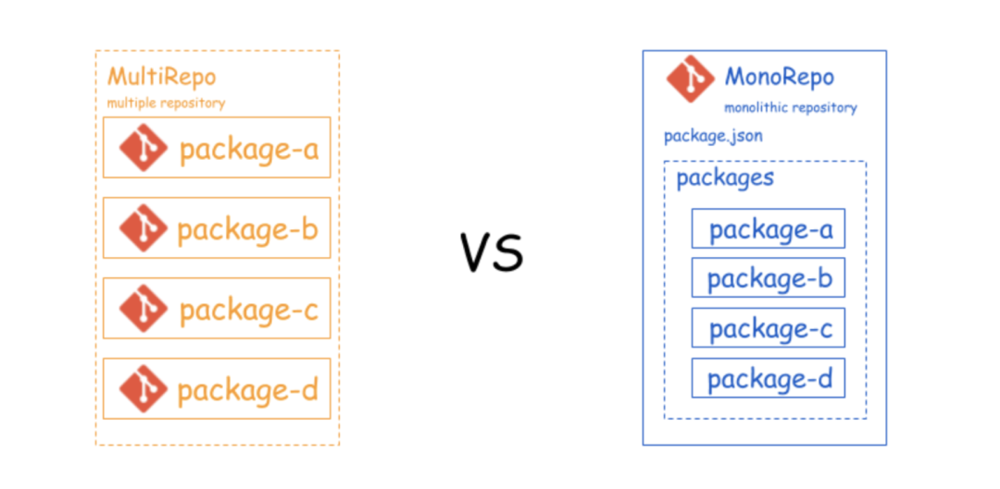

# Monorepo

## what: monorepo 是什么

> monorepo: monolithic repository 单一仓库

Monorepo 是一种管理团队代码的方式，它摒弃了传统一个项目一个仓库的方式，而是在一个项目仓库 (repo) 中管理多个子项目 (package)的方式。



## why: 为什么用 monorepo ，它解决了什么了问题

要知道 monorepo 方式解决了什么问题，就需要先了解与之对应的传统多项目多仓库方式(multiple repository)的弊端。

我们从一个项目开发工作流的角度来比较两者优劣势：

### 项目初始化配置

- multirepo：类似linter之类配置、CI/CD 的配置等，每个独立仓库都要重复一遍，虽然同类项目可以自定义脚手架来统一，但像全栈项目前后端项目结构差异较大时，无法统一脚手架，这类配置代码仍会重复配置
- monorepo：单一代码仓库可以将配置统一收敛到根目录上配置。

### 依赖安装与管理

multirepo：依赖问题主要集中在以下三个方面：
  - 依赖重复安装，浪费磁盘空间，特别是一些工具性依赖包，可能在每个项目里都会被安装一遍；
  - 本地依赖 link 关系难以管理，当多个项目间有依赖关系时，需要人为管理 npm link 和 npm unlink 操作

另外的问题是 npm / yarn 这两类包管理器自身采用扁平化依赖管理机制产生的问题：
  - 项目里 node_modules 中的依赖跟项目 package.json 中声明的依赖不一致，也就产生了“幽灵依赖”问题。
  - **幽灵依赖 Phantom dependencies**，指的是在项目内可以引用未在 package.json 中定义的包。
  - **重复依赖**，通过npm/yarn 扁平化依赖管理虽然会提升一个共同版本的依赖，但是当依赖有不同版本时仍会被重复安装在各自的node_modules 中。

monorepo：单一代码库可以借助工具解决上述问题。

### 代码开发和调试

- multirepo: 
  - 开发过程中不管是在 IDE 还是命令行终端，多代码库需要来回切换。
  - 调试代码时，如果多个子项目都依赖于某些共同的模块时，常见的做法是将这些公共模块代码发布成 npm 包，各个子项目通过 npm 包安装来使用。但如果想要本地调试这些公共依赖包时，需要通过 npm link 的方式将依赖包链接到需要调试的项目中。一旦 link 的项目多了，手动去管理 link / unlink 操作就很心累。

### 单元测试

- multirepo: 多个项目多个仓库就要多套单元测试的配置和脚本命令，然后多个项目分别执行 test 的 run-script 命令。
- monorepo: 有两种方式：
  - 在根目录上统一生成单元测试的配置，全局跑 test 的 run-script 命令。好处是可以方便统计所有代码的测试覆盖率。坏处是如果packages 各个子项目比较异构（如小程序，安桌、ios、前端，node 服务端等），统一的测试配置不太好编写。
  - 每个 package 单独进行单测配置和 test 命令，然后在根目录下借助实现 monorepo 方式的工具批量执行 test 的 run-script 命令。比如`​yarn workspace run test`​，坏处是不好统一收集所有代码的测试覆盖率。

### 代码构建和部署

- multirepo: 这个阶段问题大致上同项目配置一样，代码构建工具的配置和脚本命令会在各个项目仓库里都实现一套，无法复用。在操作上需要不断的重复 `cd` 命令切换目录。
- monorepo：将这些脚本统一到根目录上实现，然后批量执行。比如可以使用 `scripty` 包的功能将所有脚本收敛到根目录上的 `scripts` 目录中。

在 monorepo 方式下，这个阶段突出的问题是：
- 如何实现增量构建：主动识别出有代码变动的仓库，实现增量构建，减少整个项目的构建时间。
- 如何实现以拓扑排序规则进行构建：如果各个package之间存在相互依赖，比如项目A依赖于自定义的业务组件库B，则需要组件库B构建成功后，执行项目A的构建。

> 一个较大的工程往往被划分成许多子工程，我们把这些子工程称作活动(activity)。在整个工程中，有些子工程(活动)必须在其它有关子工程完成之后才能开始，有些可以安排在任何时间开始。为了形象地反映出整个工程中各个子工程(活动)之间的先后关系，可用一个有向图来表示，我们把这种顶点表示活动、边表示活动间先后关系的有向图称做顶点活动网(Activity On Vertex network)，简称AOV网。
> 一个AOV网不应该带有回路，因为若带有回路，则回路上的所有活动都无法进行。比如一个具有三个顶点的回路，A -> B -> C -> A 形成了闭环，这种情况若在程序中出现，则称为死锁或死循环，是必须避免的。
> 一个AOV网应该是一个有向无环图，所有活动可排列成一个线性序列，我们把此序列叫做拓扑序列(Topological order)，由AOV网构造拓扑序列的过程叫做拓扑排序(Topological sort)。AOV网的拓扑序列不是唯一的，满足上述定义的任一线性序列都称作它的拓扑序列。比如好像你早上穿衣服，可以先穿上衣也可以先穿裤子，只要保证内衣在外套之前穿就行。

### 项目发布时更新版本号

发版的时候需要更新版本号，现代项目工程基本都是遵循语义化版本规范(semVer: Semantic Versioning)：`Major.minor.patch [-alpha / -beta / -rc]`。

这个时候涉及的问题是如果更新版本号？
- 一种就是最原始的手动更新版本号，这种容易失误，并不采用。
- 另一种是根据 git commit 提交记录来更新。通常约定规则如下：
  - 存在fix提交： 需要更新 patch 版本
  - 存在feat提交： 需要更新 minor 版本
  - 存在BREAKING CHANGE提交： 需要更新 major 大版本
> BREAKING CHANGE 提交是在脚注 footer 中包含 BREAKING CHANGE: 或 `<type>(scope)` 后面有一个 ! 的提交`<type>(scope)!`，表示引入了破坏性变更（它和语义化版本中的 MAJOR 相对应）。 破坏性变更可以是任意 类型 提交的一部分。

```sh
# 包含了描述并且脚注中有破坏性变更的提交说明
feat: allow provided config object to extend other configs

BREAKING CHANGE: `extends` key in config file is now used for extending other config files

# 包含了 ! 字符以提醒注意破坏性变更的提交说明
feat!: send an email to the customer when a product is shipped
feat(api)!: send an email to the customer when a product is shipped

# 同时包含了 ! 和 BREAKING CHANGE 脚注的提交说明
chore!: drop support for Node 6

BREAKING CHANGE: use JavaScript features not available in Node 6.
```

采用第二种方式来确定版本号就需要使用工具配合约定式提交规范[ conventional commit](https://www.conventionalcommits.org/zh-hans/v1.0.0/) 来约束开发人员的代码提交信息。

在 monorepo 方式下，还需要考虑的问题是：
- 每个子项目是单独版本号更新，还是多个项目统一版本号更新？
- 如果是子项目独立更新版本号，且子项目存在依赖关系时，需要按拓扑排序规则进行版本更新，比如 ui-form 依赖了ui-button，如果 ui-button 发生了版本变动，需要自动的将 ui-form 中依赖的 ui-button 更新为最新版本。
- 如果子项目独立更新版本号，需要实现增量更新，比如 ui-form 依赖了 ui-button，ui-form 发生了版本变动，只对 ui-form 进行版本号更新，不更新 ui-button 的版本号。


### 总结

monorepo 优势：
相较于传入 multirepo 方式的优点，总结为两个方面：
- **统一管理、批量操作**：不管是项目初始化配置(linter)、单元测试、项目构建、发布的脚本都可以收敛到根目录下统一管理，可以选择批量执行子项目的脚本命令或者指定子项目的脚本命令。还有就是子项目存在依赖关系时需要自动进行拓扑排序。
- **依赖提升，减少磁盘占用**：将共同依赖包提升到根目录下，并且自动建立本地依赖关系。

monorepo 劣势：
随着单一代码的发展，不管是子项目的增加还是其中单个项目代码量和复杂性的增加，在项目代码版本控制、CI/CD过程中会出现问题：
- CI/CD 时间长，项目庞大，IDE 也会变得缓慢。
- 版本控制管理要求更严格，单一代码库每天都要处理大量的数据和提交，主线代码的破坏可能会影响到每一个子项目的团队开发。
- 项目权限控制：无法像多项目多仓库那样进行权限控制精准到每个项目成员

所以这是一种收益权衡问题，虽然多代码仓库允许每个团队独立管理他们的项目，但同时也阻碍了协作。让开发人员只关注自己所拥有的部分，而忽略了整体。单一代码库就像一个枢纽，每个项目团队成员可以更好的对话和协作。
现在在一些知名的工具类库的项目工程中已经出现了很多采用 monorepo 方式，比如 `Babel React Vue` 等。在企业项目中，现阶段随着微前端的实践，monorepo 项目架构方式会也会变得普遍起来。

## how: monrepo 实践

monorepo 只是项目代码组织的一种架构方式，具体如何落地这种架构，需要相应的工具来实现。

- 在依赖安装和管理方面:
  - npm@7.7 提供了 npm workspace 功能支持 monorepo 项目；
  - yarn 提供了 yarn workspace 功能来支持 monorepo 项目；
  - pnpm 同样提供了 pnpm workspace 功能来支持 monorepo 项目。
- 在项目构建方面：
  - [Lerna](https://www.lernajs.cn/)：一个管理工具，用于管理包含多个软件包（package）的 JavaScript 项目。
  - [Rush](https://rushjs.io/)：微软用于 JavaScript 的可扩展的单一代码库管理器，能够从一个代码库构建和部署多个包。
  - [Buck](): Facebook 开源的快速构建系统，支持在多种语言和平台上进行不同的构建。
  - [Nx](https://nx.dev/): 是一个智能且可扩展的构建框架，提供对 Monorepos 的最佳支持。
- 在源代码管理方面：
  - Git CODEOWNERS：项目代码权限控制，允许定义哪个团队拥有代码库中的子目录。当有人提交 pull request 或 push 代码到受保护的分支时，代码所有者会自动被要求进行审查。GitHub 和 GitLab 都支持这一特性。
  - 使用 [shallow clone](https://github.blog/2020-12-21-get-up-to-speed-with-partial-clone-and-shallow-clone/)和 [filter-branch](https://git-scm.com/docs/git-filter-branch)来处理大容量代码库。

每个都有专长，有些工具也能独立实践 monorepo 项目，也能与其它工具组合使用，在各自专长的方面发挥作用。

### Monorepo 管理最佳实践

monorepo 项目的最佳实践：
- 定义一个的统一的目录组织，普遍约定以 `lerna init` 生成的 `packages` 目录下组织子项目
- 明确一套git flow规则：基于主干的开发，维护分支整洁，保持较小的分支。
- 明确项目依赖项与package.json中对应，并提供公共依赖，一次升级所有依赖项，迫使每个项目都跟上依赖项。目前使用 pnpm 实现。
- 源代码管理，使用Git，并学习如何使用 shallow clone 和 filter-branch 来处理大容量代码库。
- 项目构建，寻找像 Bazel 或 Buck 这样的智能构建系统，能实现拓扑排序规则和增量执行的功能，以加速构建和测试。
- 如果需要限制对某些项目的访问权限，请使用 Git CODEOWERS。
- 使用 CI/CD 云平台来大规模测试和部署应用程序。

常用的工具组合：
- npm workspace
- yarn workspace
- pnpm workspace
- lerna + yarn workspace
- rush + pnpm workspace
- nx + pnpm workspace

## 参考链接
- [5 分钟搞懂 Monorepo](https://xie.infoq.cn/article/4f870ba6a7c8e0fd825295c92)
- [基于lerna和yarn workspace的monorepo工作流](https://zhuanlan.zhihu.com/p/71385053) --- 以工作流角度对比了multirepo和monorepo的差异
- [开源项目都在用 monorepo，但是你知道居然有那么多坑么？](https://juejin.cn/post/6950082433647640612) --- 从 multirepo 痛点引出monorepo优势及带来的新问题
- [All in one：项目级 monorepo 策略最佳实践](https://zhuanlan.zhihu.com/p/348898271) --- 了解到两个工具Volta(锁定环境)、Verdaccio(本地发布)
- [如何评价 rushjs?](zhihu.com/question/333587242)