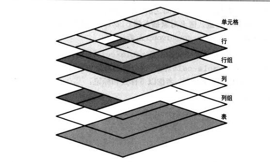

# 表格元素 table

- table 基本结构： table tr th td
- 合并行和列的特性：colspan rowspan
- 列的样式统一设置： colgroup col span
- 表格的语义化： 
    - 表格结构语义化元素：caption thead tfoot tbody （表格默认设置tbody元素）
    - 指明行、行组、列、列组的标题的th元素特性：scope=row rowgroup col colgroup
- 表格的分层原理： 单元格 > 行 > 行组 > 列 > 列组 > 表格
- 表格元素特有的CSS属性
- DOM操作表格的API


## table 基本结构：table tr th td

一个基本表格结构：
- 表格以`<table></table>`元素包裹
- 表格行以`<tr></tr>`元素开始
- 单元格内容写在`<td></td>`元素内
- 表格标题行（列标题和行标题）以`<th></th>`包裹

```html
<table>
  <tr>
  <!-- 列标题 -->
    <td></td>
    <th>Knocky</th>
    <th>Flor</th>
    <th>Ella</th>
    <th>Juan</th>
  </tr>
  <tr>
    <th>Breed</th><!-- 行标题 -->
    <td>Jack Russell</td>
    <td>Poodle</td>
    <td>Streetdog</td>
    <td>Cocker Spaniel</td>
  </tr>
  <tr>
    <th>Age</th><!-- 行标题 -->
    <td>16</td>
    <td>9</td>
    <td>10</td>
    <td>5</td>
  </tr>
  <tr>
    <th>Owner</th><!-- 行标题 -->
    <td>Mother-in-law</td>
    <td>Me</td>
    <td>Me</td>
    <td>Sister-in-law</td>
  </tr>
</table>
```
<table>
  <tr>
  <!-- 列标题 -->
    <td></td>
    <th>Knocky</th>
    <th>Flor</th>
    <th>Ella</th>
    <th>Juan</th>
  </tr>
  <tr>
    <th>Breed</th><!-- 行标题 -->
    <td>Jack Russell</td>
    <td>Poodle</td>
    <td>Streetdog</td>
    <td>Cocker Spaniel</td>
  </tr>
  <tr>
    <th>Age</th><!-- 行标题 -->
    <td>16</td>
    <td>9</td>
    <td>10</td>
    <td>5</td>
  </tr>
  <tr>
    <th>Owner</th><!-- 行标题 -->
    <td>Mother-in-law</td>
    <td>Me</td>
    <td>Me</td>
    <td>Sister-in-law</td>
  </tr>
</table>

## 合并行或列 colspan rowspan

在实际中经常有单元格跨越多行或多列的场景，可以使用`colspan` 和 `rowspan` 属性，接受一个数值，代表跨越的行或列数

```html
<table>
  <tr>
    <th colspan="2">Animals</th>
  </tr>
  <tr>
    <th colspan="2">Hippopotamus</th>
  </tr>
  <tr>
    <th rowspan="2">Horse</th>
    <td>Mare</td>
  </tr>
  <tr>
    <td>Stallion</td>
  </tr>
  <tr>
    <th colspan="2">Crocodile</th>
  </tr>
  <tr>
    <th rowspan="2">Chicken</th>
    <td>Cock</td>
  </tr>
  <tr>
    <td>Rooster</td>
  </tr>
</table>
```
<table>
  <tr>
    <th colspan="2">Animals</th>
  </tr>
  <tr>
    <th colspan="2">Hippopotamus</th>
  </tr>
  <tr>
    <th rowspan="2">Horse</th>
    <td>Mare</td>
  </tr>
  <tr>
    <td>Stallion</td>
  </tr>
  <tr>
    <th colspan="2">Crocodile</th>
  </tr>
  <tr>
    <th rowspan="2">Chicken</th>
    <td>Cock</td>
  </tr>
  <tr>
    <td>Rooster</td>
  </tr>
</table>

## 统一设置列的样式 colgroup col span

如果我们要设置整行的样式，比如设置某行背景色，可以直接选择`tr`元素或它的类名来设置，但是如果我们要设置某一列的样式，则好像没有统一的元素来选择这一列，如果把这一列没有单元格td元素添加同一个列，又显得很麻烦。

HTML提供了定义整列数据的样式信息元素：就是 `<colgroup>` 和 `<col>` 元素，同时`<col>`元素有一个`span`特性，表示当前`col`元素跨域几列。

> 表格中有几列就要定义几个col元素，默认第一列是应用第一个col元素。如果有相邻列应用相同的样式，可以写一个col，然后用span定义几列，可以少写col元素。

```html
<table>
    <colgroup>
        <col span="2"><!--第一列和第二列不需要样式，所以用span来表示跨域2列 -->
        <col style="background-color:#97DB9A;">
        <col style="width: 42px;">
        <col style="background-color: #97DB9A;">
        <col style="background-color:#DCC48E; border:4px solid #C1437A;">
        <col style="width: 42px;">
    </colgroup>
    <tr>
        <th></th>
        <th>Mon</th>
        <th>Tues</th>
        <th>Wed</th>
        <th>Thurs</th>
        <th>Fri</th>
        <th>Weekend</th>
    </tr>
    <tr>
        <th>1st period</th>
        <td>English</td>
        <td></td>
        <td></td>
        <td>German</td>
        <td>Dutch</td>
        <td></td>
    </tr>
    <tr>
        <th>2st period</th>
        <td>English</td>
        <td>English</td>
        <td></td>
        <td>German</td>
        <td>Dutch</td>
        <td></td>
    </tr>
    <tr>
        <th>3st period</th>
        <td></td>
        <td>German</td>
        <td></td>
        <td>German</td>
        <td>Dutch</td>
        <td></td>
    </tr>
    <tr>
        <th>4st period</th>
        <td></td>
        <td>English</td>
        <td></td>
        <td>German</td>
        <td>Dutch</td>
        <td></td>
    </tr>
</table>
```
<table>
    <colgroup>
        <col span="2">
        <col style="background-color:#97DB9A;">
        <col style="width: 42px;">
        <col style="background-color: #97DB9A;">
        <col style="background-color:#DCC48E; border:4px solid #C1437A;">
        <col style="width: 42px;">
    </colgroup>
    <tr>
        <th></th>
        <th>Mon</th>
        <th>Tues</th>
        <th>Wed</th>
        <th>Thurs</th>
        <th>Fri</th>
        <th>Weekend</th>
    </tr>
    <tr>
        <th>1st period</th>
        <td>English</td>
        <td></td>
        <td></td>
        <td>German</td>
        <td>Dutch</td>
        <td></td>
    </tr>
    <tr>
        <th>2st period</th>
        <td>English</td>
        <td>English</td>
        <td></td>
        <td>German</td>
        <td>Dutch</td>
        <td></td>
    </tr>
    <tr>
        <th>3st period</th>
        <td></td>
        <td>German</td>
        <td></td>
        <td>German</td>
        <td>Dutch</td>
        <td></td>
    </tr>
    <tr>
        <th>4st period</th>
        <td></td>
        <td>English</td>
        <td></td>
        <td>German</td>
        <td>Dutch</td>
        <td></td>
    </tr>
</table>

## 表格语义化元素

- 表格结构语义化元素：
    - 表格标题：caption
    - 表头部分：thead
    - 表尾部：tfoot （如表格合计部分作为表尾部）
    - 表格内容主体： body （表格默认设置tbody元素，像上面的表格元素没有thead/tboby/tfoot，但实际DOM结构默认有tbody）
- 标题元素: tr （浏览器知道这是标题元素，但不知道是行标题还是列标题，所以需要我们用scope属性指明）
- 指明行、行组、列、列组的标题的th元素特性：scope=row rowgroup col colgroup

```html
<table border style="border-collapse: collapse;">
    <!-- 表格标题 -->
    <caption>Items Sold August 2016</caption>
    <!-- 整列样式 -->
    <colgroup>
        <col span="2">
        <col style="background-color:#97DB9A;">
        <col span="3">
        <col style="background-color:#DCC48E; border:4px solid #C1437A;">
    </colgroup>
    <!-- 表头 -->
    <thead>
        <tr>
            <th colspan="2" rowspan="2"></th>
            <th scope="colgroup" colspan="3">Clothes</th><!-- 列组标题-->
            <th scope="colgroup" colspan="2">Accessories</th><!-- 列组标题-->
        </tr>
        <tr>
            <!-- 列标题-->
            <th scope="col">Trousers</th>
            <th scope="col">Skirts</th>
            <th scope="col">Dresses</th>
            <th scope="col">Bracelets</th>
            <th scope="col">Rings</th>
        </tr>
    </thead>
    <!-- 表主体内容 -->
    <tbody>
        <tr>
            <th scope="rowgroup" rowspan="3">Belgium</th><!-- 行组标题-->
            <th scope="row">Antwerp</th><!-- 行标题-->
            <td>56</td>
            <td>22</td>
            <td>43</td>
            <td>72</td>
            <td>23</td>
        </tr>
        <tr>
            <th scope="row">Gent</th>
            <td>46</td>
            <td>18</td>
            <td>50</td>
            <td>61</td>
            <td>15</td>
        </tr>
        <tr>
            <th scope="row">Brussels</th>
            <td>51</td>
            <td>27</td>
            <td>38</td>
            <td>69</td>
            <td>28</td>
        </tr>
        <tr>
            <th scope="rowgroup" rowspan="2">The Netherlands</th><!-- 行组标题-->
            <th scope="row">Amsterdam</th><!-- 行标题-->
            <td>89</td>
            <td>34</td>
            <td>69</td>
            <td>85</td>
            <td>38</td>
        </tr>
        <tr>
            <th scope="row">Utrecht</th>
            <td>80</td>
            <td>12</td>
            <td>43</td>
            <td>36</td>
            <td>10</td>
        </tr>
    </tbody>
    <!-- 表尾 -->
    <tfoot>
        <tr>
            <th scope="row" colspan="2">SUM</th><!-- 行标题-->
            <td>321</td>
            <td>232</td>
            <td>424</td>
            <td>313</td>
            <td>313</td>
        </tr>
    </tfoot>
</table>
```
<table>
    <caption>Items Sold August 2016</caption>
    <colgroup>
        <col span="2">
        <col style="background-color:#97DB9A;">
        <col span="3">
        <col style="background-color:#DCC48E; border:4px solid #C1437A;">
    </colgroup>
    <thead>
        <tr>
            <th colspan="2" rowspan="2"></th>
            <th scope="colgroup" colspan="3">Clothes</th>
            <th scope="colgroup" colspan="2">Accessories</th>
        </tr>
        <tr>
            <th scope="col">Trousers</th>
            <th scope="col">Skirts</th>
            <th scope="col">Dresses</th>
            <th scope="col">Bracelets</th>
            <th scope="col">Rings</th>
        </tr>
    </thead>
    <tbody>
        <tr>
            <th scope="rowgroup" rowspan="3">Belgium</th>
            <th scope="row">Antwerp</th>
            <td>56</td>
            <td>22</td>
            <td>43</td>
            <td>72</td>
            <td>23</td>
        </tr>
        <tr>
            <th scope="row">Gent</th>
            <td>46</td>
            <td>18</td>
            <td>50</td>
            <td>61</td>
            <td>15</td>
        </tr>
        <tr>
            <th scope="row">Brussels</th>
            <td>51</td>
            <td>27</td>
            <td>38</td>
            <td>69</td>
            <td>28</td>
        </tr>
        <tr>
            <th scope="rowgroup" rowspan="2">The Netherlands</th>
            <th scope="row">Amsterdam</th>
            <td>89</td>
            <td>34</td>
            <td>69</td>
            <td>85</td>
            <td>38</td>
        </tr>
        <tr>
            <th scope="row">Utrecht</th>
            <td>80</td>
            <td>12</td>
            <td>43</td>
            <td>36</td>
            <td>10</td>
        </tr>
    </tbody>
    <tfoot>
        <tr>
            <th scope="row" colspan="2">SUM</th>
            <td>321</td>
            <td>232</td>
            <td>424</td>
            <td>313</td>
            <td>313</td>
        </tr>
    </tfoot>
</table>

## 表格结构的分层原理

CSS对表格定义了6个不同的层，表格各个方面的样式都在其各自的层上绘制，并且上层样式覆盖下层样式。

默认地，所有层元素背景都是透明的，如果单元格、行、列等没有自己的背景，则table元素的背景将透过这些中间层可见。



所以对一个单元格设置了样式，优先级：单元格 > 行 > 列 > 表格

> 表格模型是“以行为主”，创建标记需要显式声明行，而列是从行单元格中推导出来的。这点从我们的代码结构可以看出来。

```html
<table style="background-color:gray"><!--表格整体背景色 -->
    <colgroup>
        <col span="2" style="background-color: aquamarine;"><!--列背景色 -->
    </colgroup>
    <tr style="background-color:#fbb;"><!--行背景色 -->
        <td style="background-color:coral;">一</td><!--单元格背景色 -->
        <td>二</td>
        <td>三</td>
    </tr>
    <tr>
        <td>四</td>
        <td>五</td>
        <td>六</td>
    </tr>
</table>
```
<table style="background-color:gray">
    <colgroup>
        <col span="2" style="background-color: aquamarine;">
    </colgroup>
    <tr style="background-color:#fbb;">
        <td style="background-color:coral;">一</td>
        <td>二</td>
        <td>三</td>
    </tr>
    <tr>
        <td>四</td>
        <td>五</td>
        <td>六</td>
    </tr>
</table>

## 表格样式CSS属性的特殊性

- table
    - 若处于分隔边框模型（border-collapse: separate;) ，margin和padding都可设置
    - 若处于合并边框模型（border-collapse: collapse;），只可设置margin
- thead / tbody / tfoot / tr / col / colgroup
    - margin和padding都不可设置
- td / th 
    - 不可设置margin，但可以设置padding
- caption
    - margin和padding都可设置

- 表格特有的CSS属性
    - 表格渲染布局模式： `table-layout: auto / fixed`; 两者最显著的差异是浏览器渲染速度，使用固定布局，浏览器可以更快计算出表格布局位置。
    - 表格边框模型：`border-collapse: collapse / separate`
    - 表格标题位置：`caption-side: top / bottom`
    - 空单元格是否显示：`empty-cells: show / hide`

## DOM操作表格的API

[参考链接](https://www.cnblogs.com/xiaohuochai/p/4839792.html)

```js
// 表格table对象的属性和方法
caption:保存着对<caption>元素的指针
tBodies:是一个<tbody>元素的HTMLCollection
tFoot:保存着对<tfoot>元素的指针
tHead:保存着对<thead>元素的指针

createCaption():创建<caption>元素，将其放到表格中，返回引用
createTHead():创建<thead>元素，将其放到表格中，返回引用
createTFoot():创建<tfoot>元素，将其放到表格中，返回引用

deleteCaption():删除<caption>元素
deleteTHead():删除<thead>元素
deleteTFoot():删除<tfoot>元素

// 表格主体tbody对象的属性和方法
rows:保存着<tbody>元素中行的HTMLCollection
deleteRow(pos):删除指定位置的行
insertRow(pos):向rows集合中的指定位置插入一行，返回对新插入行的引用

// 表格行tr对象的属性和方法
cells:保存着<tr>元素中单元格的HTMLCollection
deleteCell(pos):删除指定位置的单元格
insertCell(pos):向cells集合中的指定位置插入一个单元格，返回对新插入单元格的引用
```

```html
<script>
//创建表格
var table = document.createElement("table");
table.border = "1";
table.width = "100%";

//创建tbody
var tbody = document.createElement("tbody");
table.appendChild(tbody);

//创建第一行
tbody.insertRow(0);
tbody.rows[0].insertCell(0);
tbody.rows[0].cells[0].appendChild(document.createTextNode("Cell 1,1"));
tbody.rows[0].insertCell(1);
tbody.rows[0].cells[1].appendChild(document.createTextNode("Cell 2,1"));

//创建第二行
tbody.insertRow(1);
tbody.rows[1].insertCell(0);
tbody.rows[1].cells[0].appendChild(document.createTextNode("Cell 1,2"));
tbody.rows[1].insertCell(1);
tbody.rows[1].cells[1].appendChild(document.createTextNode("Cell 2,2"));

//将表格添加到文档主体中
document.body.appendChild(table);
</script>
```