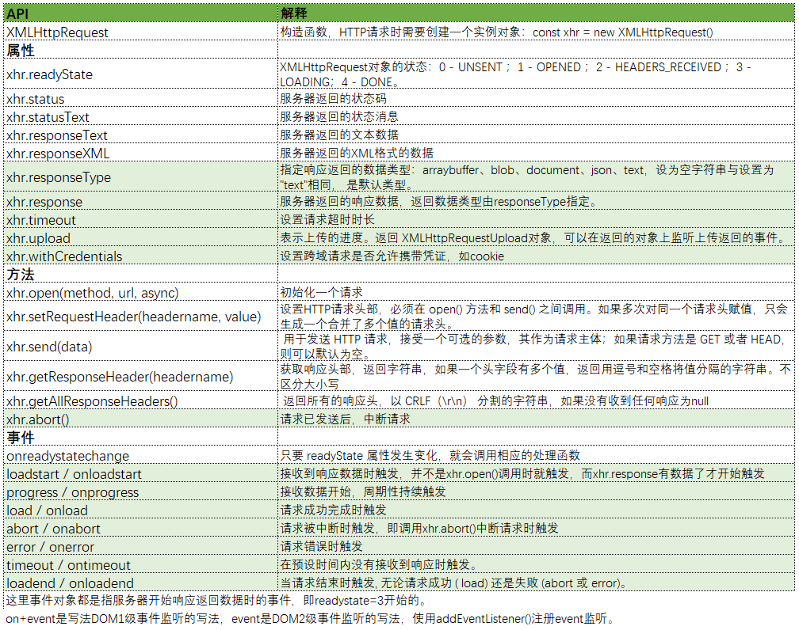
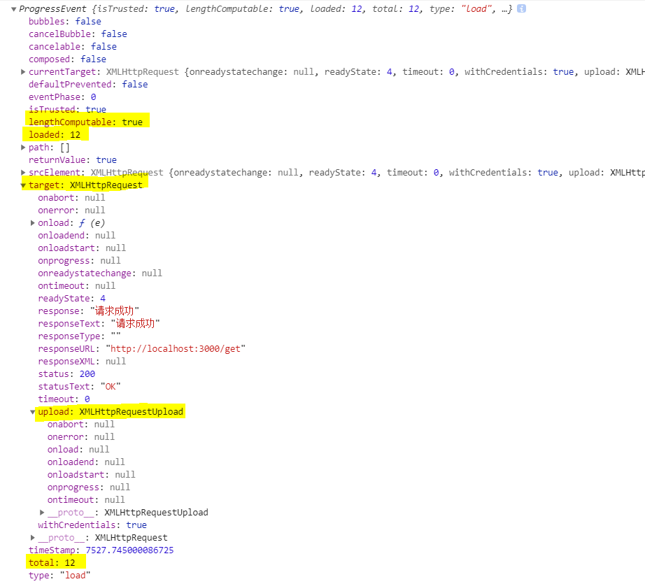

# XMLHttpRequest

XMLHttpRequest是一个构造函数，是web提供的一个API，用于发起HTTP请求，与服务器端进行数据交互。


## XMLHttpRequest 历史

XMLHttpRequest对象背后的概念，最开始是被微软Outlook Web Access工作组为Microsoft Exchange Server 2000提出的，实现了一个IXMLHTTPRequest接口，第二代的MSXML库实现了这个概念。1999年的发布的IE5使用了第二代的MSXML库，IXMLHTTPRequest接口进行了包装，通过ActiveXObject对象来访问。

在2000年12月6号发布的Gecko 0.6版本中，Mozilla项目组为Gecko内核实现了类似的接口称为nsIXMLHttpRequest。这个接口被建模成尽可能的接近微软的IXMLHTTPRequest接口。Mozilla项目组同样在js层面为这个接口提供了一个包装器，称为XMLHttpRequest。至此，XMLHttpRequest首次可以在JS编程中可用，但是此时的功能还不完全，直到2002年6月5号发布的1.0版本的Gecko才实现了较全功能的XMLHttpRequest对象。所以XMLHttpRequest的名称是Mozilla公司提出的。

之后，XMLHttpRequest对象在其他主要的web客户端中慢慢变成了一个大家都认同的事实上的标准，在2004年2月发布得Safari 1.2版本，2005年4月发布的Konqueror，Opera8.0版本，2005年9月发布的iCab 3.0b352版本中都实现了这个对象。微软在2006年发布的IE7时，也定义了XMLHttpRequest对象标识符。

鉴于各大浏览器都实现了XMLHttpRequest对象的功能，W3C在2006年4月5号发布了一个关于XMLHttpRequest对象的工作草案规范，起草人是Opera的Anne van Kesteren和W3C的Dean Jackson。

W3C在2008年2月25号又发布了另一个关于XMLHttpRequest对象的工作草案，称为"XMLHttpRequest Level 2"。这个版本的XMLHttpRequest包括了XMLHttpRequest对象的扩展功能，例如事件处理，支持跨域请求，支持处理字节流。但在2011年底，这个规范被遗弃了，其中的内容被收录在原始的规范中。

在2012年底，WHATWG接管了这个事情，并且用Web IDL定义了一个标准。W3C目前的草案就是基于WHATWG标准创建的。

> W3C和WHATWG之间联系也是一段web的动荡历史，现在的情况是WHATWG组织起草规范，W3C依据WHATWG草案建立标准，比如HTML5的规范和标准。

- 1999年 Mircosoft 微软提出了IXMLHTTPRequest的概念，在1999年的IE5中实现了通过ActiveXObject对象建立http请求
- 2000年12月6号 Mozilla首次提出了实现微软同样功能的XMLHttpRequest对象
- 2006年4月5号 W3C发布了一个关于XMLHttpRequest对象规范的工作草案
- 2008年2月25号 W3C发布了另一个关于XMLHttpRequest对象的工作草案，称为"XMLHttpRequest Level 2"。
- 2012年底 WHATWG接管了XMLHttpRequest规范的起草，W3C目前的草案就是基于WHATWG标准创建的。

XMLHttpRequest规范仍是草案状态，没有被W3C完全定义为标准。

现在 Fetch被称为下一代XMLHttpRequest技术,采用Promise方式来处理数据，简洁明了的API，比XMLHttpRequest更加简单易用，各大浏览器最新版本都实现了Fetch标准。


## XMLHttpRequest Level 1

第一代主要实现的XMLHttpRequest API 如下：

> 识记方法，按对象的属性、方法、事件记忆API

API | 解释
--|--
XMLHttpRequest | 构造函数，HTTP请求时需要创建一个实例对象：const xhr = new XMLHttpRequest()
属性 |
xhr.readyState | XMLHttpRequest对象的状态：<br>0 - UNSENT - 代理被创建，但尚未调用 open() 方法。<br>1 - OPENED - open() 方法已经被调用。<br>2 - HEADERS_RECEIVED - send() 方法已经被调用，并且头部和状态已经可获得。<br>3 - LOADING - 下载中,responseText 属性已经包含部分数据。<br>4 - DONE - 下载操作已完成。
xhr.status | 服务器返回的状态码
xhr.statusText | 服务器返回的状态文本
xhr.responseText | 服务器返回的文本数据
xhr.responseXML | 服务器返回的XML格式的数据
xhr.responseURL | 返回请求的URL
方法 | 
xhr.open(method, url, async) | 初始化一个请求
xhr.setRequestHeader(headername, value) | 设置HTTP请求头部，必须在  open() 方法和 send()   之间调用。如果多次对同一个请求头赋值，只会生成一个合并了多个值的请求头。
xhr.send(data) | 用于发送 HTTP 请求，接受一个可选的参数，其作为请求主体；如果请求方法是 GET 或者 HEAD，则可以默认为空。
xhr.getResponseHeader(headername) | 获取响应头部，返回字符串，如果一个头字段有多个值，返回用逗号和空格将值分隔的字符串。不区分大小写
xhr.getAllResponseHeaders() | 返回所有的响应头，以 CRLF（\r\n） 分割的字符串，如果没有收到任何响应为null
事件 | 
onreadystatechange | 只要 readyState 属性发生变化，就会调用相应的处理函数

示例：

```js
// 新建一个XMLHttpRequest的实例
var xhr = new XMLHttpRequest();
// 初始化一个请求
xhr.open('GET', 'example.php', true);
// 设置一个自定义的头
xhr.setRequest('x-custom-header', '123')

// 设置监听请求状态回调
xhr.onreadystatechange = function(){
    if ( xhr.readyState == 4 && xhr.status == 200 ) {
        // 获取响应头
        console.log(xhr.getAllResponseHeaders())
        console.log(xhr.getResponseHeader('server'))
        // 获取响应内容
        console.log( xhr.responseText );
    } else {
        console.log(xhr.status)
        console.log( xhr.statusText );
    }
};
// 发送请求
xhr.send()
```

老版本的XMLHttpRequest对象有以下几个缺点：

- 只支持文本数据的传送，无法用来读取和上传二进制文件，比如响应数据只能以responseText 和 rsponseXML读取。
- 传送和接收数据时，没有进度信息，只能提示有没有完成。
- 受到"同域限制"（Same Origin Policy），只能向同一域名的服务器请求数据。无法发起跨域请求


## XMLHttpRequest Level 2

新版本的XMLHttpRequest对象，针对老版本的缺点，做出了大幅改进。

- 可以设置HTTP请求的时限，增加的属性 xhr.timeout，以及超时监听事件timeout。
- 可以发送多种数据类型，改写了xhr.send(data)，data的类型可以是bolb等类型。
- 可以上传文件，xhr.upload。
- 可以请求不同域名下的数据（跨域请求，主要是服务器实现CORS头），并且可以允许跨域携带凭证xhr.withCredentials。
- 服务器返回的数据不在仅有text和XML，可以指定其它多种类型，使用xhr.responseType指定类型，并且xhr.response接收指定类型的数据。
- 可以获得请求过程的整个进度监听，监听事件loadstart/loadend/load/error/progress/abort。

完整的 XMLHttpRequest API列表：




示例：

```js
// 新建一个XMLHttpRequest的实例
var xhr = new XMLHttpRequest();
// 初始化一个请求
xhr.open('GET', 'example.php', true);
// 设置一个自定义的头
xhr.setRequest('Content-Type', 'Application/json')

// 设置响应数据类型
xhr.responseType = 'json'

// 设置监听响应
xhr.onload = function(){
    if ( xhr.status == 200 ) {
        // 获取响应头
        console.log(xhr.getAllResponseHeaders())
        console.log(xhr.getResponseHeader('server'))
        // 获取响应内容
        console.log( xhr.response );
    } else {
        console.log(xhr.status)
        console.log( xhr.statusText );
    }
};

// 监听请求进度
xhr.onprogress = function(e) {
    if (e.lengthComputable) {
      console.log((e.loaded / e.total) * 100);
    }
};

// 发送请求
xhr.send(dataobj)
```

## progressEvent 事件对象

ProgressEvent 是一个用来测量底层操作进度的接口，可以测量HTTP请求。同时继承它的父元素 Event 的属性。

XHR的事件监听回调函数接受的事件参数就是一个ProgressEvent对象的实例。

除了正常事件对象的属性外，还具有ProgressEvent对象独有的三个属性：

- lengthComputable 布尔值，表示这个过程是否是可以测量。
- loaded 是一个unsigned long类型值，表示底层进程已经执行的工作量。当使用HTTP上传或下载资源时，可以表示内容已传送部分，而不包括HTTP头和其他的开销。
- total 是一个unsigned long类型值，表示底层进程正在执行的工作总量。当使用HTTP上传或下载资源时，可以表示内容数据总量，而不包括HTTP头和其他的开销。



正常工作中，基本项目开发都涉及上百个接口调用，如果使用原生XMLHttpRequest对象请求，每次都得调用xhr对象的各属性和方法完成一次请求基本是不可能的，所以正常都会使用封装的第三方库，比如jQuery的$.ajax()方法，或者基于promise的axios，或者直接使用最新的Fetch。

**参考资源：**

[MDN XMLHttpRequest](https://developer.mozilla.org/zh-CN/docs/Web/API/XMLHttpRequest)<br>
[XMLHttpRequest2 新技巧](https://www.html5rocks.com/zh/tutorials/file/xhr2/)<br>
[你真的会使用XMLHttpRequest吗？](https://segmentfault.com/a/1190000004322487#articleHeader15)<br>
[全面分析前端的网络请求方式](https://mp.weixin.qq.com/s/zSB7X2ka6GtxtupUtal7ig)
