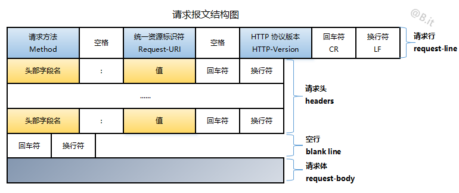
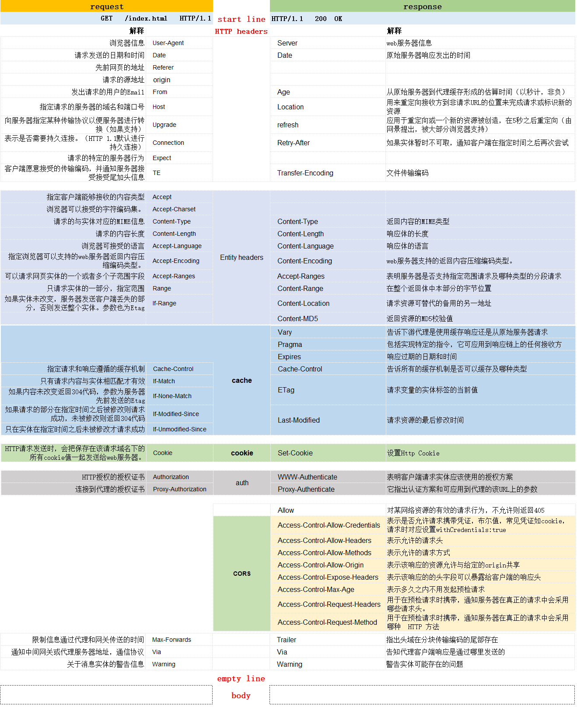

# HTTP 会话-连接-消息

## HTTP 会话

在像 HTTP 这样的Client-Server（客户端-服务器）协议中，会话分为三个阶段：

- 客户端建立一条 TCP 连接（如果传输层不是 TCP，也可以是其他适合的连接）。
- 客户端发送请求并等待应答。
- 服务器处理请求并应答，回应包括一个状态码和对应的数据。

从 HTTP/1.1 开始，连接在完成第三阶段后不再关闭，客户端可以再次发起新的请求。这意味着第二步和第三步可以连续进行数次。然后主动或长时间没有数据传送自动关闭连接。

## HTTP 连接

HTTP 的传输协议主要依赖于 TCP 来提供从客户端到服务器端之间的连接。

连接管理是一个 HTTP 的关键话题：打开和保持连接在很大程度上影响着网站和 Web 应用程序的性能。在 HTTP/1.x 里有多种模型：短连接, 长连接, 和 HTTP 流水线。

在早期，HTTP/0.9 和 HTTP/1.0 使用一个简单的模型来处理连接。这些连接的生命周期是短暂的：每发起一个请求时都会创建一个新的连接，并在收到响应时立即关闭连接。

这个简单的模型对性能有先天的限制：打开每一个 TCP 连接都是相当耗费资源的操作。而在现代浏览器网页加载一个文档时，文档解析出来需要附加请求的资源会很多，包括图片、音视频等等，往往要发起很多次请求(十几个或者更多)才能拿到所需的完整文档信息，这么多请求每次都要重新建立一个连接，证明了这个早期模型的效率是非常低下的。

在 HTTP/1.1 标准发布时，有两种新的连接模型：

- 长连接模型（HTTP/1.1的默认连接方式），它会保持连接去完成多次连续的请求，减少了不断重新打开连接的时间。
- 流水线模型，它还要更先进一些，多个连续的请求甚至都不用等待立即返回就可以被发送，这样就减少了耗费在网络延迟上的时间。

长连接也还是有缺点的；请求是按顺序发出的。下一个请求只有在当前请求收到应答过后才会被发出。由于会受到网络延迟和带宽的限制，在下一个请求被发送到服务器之前，可能需要等待很长时间处于空闲状态，但此时空闲状态还是在消耗服务器资源。

流水线是在同一条长连接上发出连续的请求，而不用等待应答返回。这样可以避免连接延迟。理论上讲，性能还会因为两个 HTTP 请求有可能被打包到一个 TCP 消息包中而得到提升。


改进后的连接管理极大的提升了 HTTP 的性能。不管是 HTTP/1.1 还是 HTTP/1.0，使用长连接 – 直到进入空闲状态 – 都能达到最佳的性能。然而，解决流水线故障需要设计更先进的连接管理模型，HTTP/2 已经在尝试了。

**延伸：TCP连接建立，三次握手四次挥手过程**

[“三次握手，四次挥手”你真的懂吗？](https://zhuanlan.zhihu.com/p/53374516)

参考链接 [MDN HTTP/1.x 的连接管理](https://developer.mozilla.org/zh-CN/docs/Web/HTTP/Connection_management_in_HTTP_1.x)

## HTTP 消息

HTTP消息是服务器和客户端之间交换数据的方式。有两种类型的消息︰ 

- 请求（requests）--由客户端发送用来触发一个服务器上的动作；
- 响应（responses）--来自服务器的应答。

HTTP消息由采用ASCII编码的多行文本构成。在HTTP/1.1及早期版本中，这些消息通过连接公开地发送。在HTTP/2中，为了优化和性能方面的改进，消息被分到多个HTTP帧中。

HTTP 请求和响应具有相似的结构，由以下部分组成︰

- 一行起始行：在请求中用于描述要执行的请求方式、地址等，在响应中描述请求对应的状态是成功或失败。这个起始行总是单行的。
- 一个可选的HTTP头集合指明请求或响应的描述信息。
- 一个空行指示所有关于请求或响应的元数据（头信息）已经发送完毕。
- 一个可选的包含请求或响应相关数据的正文。 正文的大小有起始行的HTTP头（Content-Length)来指定。


### HTTP Request 请求报文


- 请求行： methods请求方法  url目标绝对路径  protcol/version
- 请求头：分为三组：General headers通用头   Entity headers实体头   Request headers请求约束头
- 请求体：不是所有的请求都有一个body，GET，HEAD，DELETE 和 OPTIONS，通常它们不需要 body。POST, PUT, PATCH通常会有body。


### HTTP Response 响应报文


- 响应行：protcol/version   statusCode  statusMessage
- 响应头：同样分为三组：General headers通用头   Entity headers实体头   Response  headers响应约束头
- 响应体：不是所有的响应都有 body：具有状态码 (如 201 或 204) 的响应，通常不会有 body。

### HTTP Headers

识记方法：http是客户端和服务器端的数据交换约定的规则，所以可以想你现实生活中两个人交换东西。

我向他取东西：
1. 要自报家门吧 --> 对应UA信息、referer、date等头信息
1. 我找谁 ---> 对应origin host
1. 我要的东西是什么样的  ---> 对应实体相关的头entity header，Accept-*头等
1. 我带上的信物有哪些  ---> cookie auth相关头，及缓存相关头

对方收到请求后：
1. 验证信物 ---> 如跨域检查CORS， 验证要的东西是不是之前已经给过了（缓存对比策略），auth头等
1. 返回东西是什么的  --> 实体头 content-*头等
1. 告诉我东西应该怎么保存 --> 缓存相关头
1. 也带上自己的信息 ---> server date

补充：
- 请求头`origin`当跨域请求时会携带，表示当前请求的域名。同域请求不携带。
- 请求头`referer`代表当前访问来源，即当前浏览器地址栏的网址。
- 请求头`host`代表要访问的目标域

示例一个跨域请求
```js
Request URL: http://localhost:8000/get
Host: localhost:8000
Origin: http://localhost:3000
Referer: http://localhost:3000/
```



## HTTP Methods
index |	method | 描述
:--:|:--|:-- 
1 | GET	| 请求指定的资源。使用 GET 的请求应该只用于获取数据。
2 |	POST | 发送数据给服务器。通常用于创建新数据。
3 |	PUT	| 使用请求中的数据对目标资源进行对整体替换。
4 |	PATCH | 使用请求的数据对目标资源进行部分修改。
5 |	DELETE | 请求服务器删除指定的资源。
6 |	OPTIONS	| "用于获取目的资源所支持的通信选项。<br><br> 比如主动发起一个OPTIONS请求，响应报文包含一个 Allow 首部字段，该字段的值表明了服务器支持的所有 HTTP 方法；<br><br> 在 CORS 中，对非简单请求会自动发起一个 OPTIONS 预检请求，以检测实际请求是否可以被服务器所接受。预检请求报文中的 Access-Control-Request-Method 首部字段告知服务器实际请求所使用的 HTTP 方法；Access-Control-Request-Headers 首部字段告知服务器实际请求所携带的自定义首部字段。服务器基于从预检请求获得的信息来判断，是否接受接下来的实际请求。"
7 | HEAD | 类似于get请求，只不过只获取响应报文，不返回响应主体。即使后端有返回也会被忽略。<br><br>该请求方法的一个使用场景是在下载一个大文件前先获取其大小再决定是否要下载, 以此可以节约带宽资源。
8 | TRACE | 回显服务器收到的请求，主要用于测试或诊断。
9 | CONNECT | HTTP/1.1协议中预留给能够将连接改为管道方式的代理服务器。


**HTTP StatusCode**

### HTTP statusCodes：

分类 | 分类描述
--|--
1**	| 信息，服务器收到请求，需要请求者继续执行操作
2**	| 成功，操作被成功接收并处理
3**	| 重定向，需要进一步的操作以完成请求
4**	| 客户端错误，请求包含语法错误或无法完成请求
5**	| 服务器错误，服务器在处理请求的过程中发生了错误

HTTP状态码列表:

code|message|解释
--|--|--
100 | Continue | 继续。客户端应继续其请求
101 | Switching Protocols | 切换协议。服务器根据客户端的请求切换协议。只能切换到更高级的协议，例如，切换到HTTP的新版本协议

code|message|解释
--|--|--
200	| OK	| 请求成功。一般用于GET与POST请求
201	| Created	| 已创建。成功请求并创建了新的资源
202	| Accepted	| 已接受。已经接受请求，但未处理完成
203	| Non-Authoritative Information	| 非授权信息。请求成功。但返回的meta信息不在原始的服务器，而是一个副本
204	| No Content	| 无内容。服务器成功处理，但未返回内容。在未更新网页的情况下，可确保浏览器继续显示当前文档
205	| Reset Content	| 重置内容。服务器处理成功，用户终端（例如：浏览器）应重置文档视图。可通过此返回码清除浏览器的表单域
206	| Partial Content	| 部分内容。服务器成功处理了部分GET请求

code|message|解释
--|--|--
300 |	Multiple Choices	| 多种选择。请求的资源可包括多个位置，相应可返回一个资源特征与地址的列表用于用户终端（例如：浏览器）选择
301 |	Moved Permanently	| 永久移动。请求的资源已被永久的移动到新URI，返回信息会包括新的URI，浏览器会自动定向到新URI。今后任何新的请求都应使用新的URI代替
302 |	Found	| 临时移动。与301类似。但资源只是临时被移动。客户端应继续使用原有URI
303 |	See Other	| 查看其它地址。与301类似。使用GET和POST请求查看
304 |	Not Modified	| 未修改。所请求的资源未修改，服务器返回此状态码时，不会返回任何资源。客户端通常会缓存访问过的资源，通过提供一个头信息指出客户端希望只返回在指定日期之后修改的资源
305 |	Use Proxy	| 使用代理。所请求的资源必须通过代理访问
306 |	Unused	| 已经被废弃的HTTP状态码
307 |	Temporary Redirect	| 临时重定向。与302类似。使用GET请求重定向

code|message|解释
--|--|--
400 |	Bad Request	| 客户端请求的语法错误，服务器无法理解
401 |	Unauthorized	| 请求要求用户的身份认证
402 |	Payment Required	| 保留，将来使用
403 |	Forbidden	| 服务器理解请求客户端的请求，但是拒绝执行此请求
404 |	Not Found	| 服务器无法根据客户端的请求找到资源（网页）。通过此代码，网站设计人员可设置"您所请求的资源无法找到"的个性页面
405 |	Method Not Allowed	| 客户端请求中的方法被禁止
406 |	Not Acceptable	| 服务器无法根据客户端请求的内容特性完成请求
407 |	Proxy Authentication Required	| 请求要求代理的身份认证，与401类似，但请求者应当使用代理进行授权
408 |	Request Time-out	| 服务器等待客户端发送的请求时间过长，超时
409 |	Conflict	| 服务器完成客户端的 PUT 请求时可能返回此代码，服务器处理请求时发生了冲突
410 |	Gone	| 客户端请求的资源已经不存在。410不同于404，如果资源以前有现在被永久删除了可使用410代码，网站设计人员可通过301代码指定资源的新位置
411 |	Length Required	| 服务器无法处理客户端发送的不带Content-Length的请求信息
412 |	Precondition Failed	| 客户端请求信息的先决条件错误
413 |	Request Entity Too Large	| 由于请求的实体过大，服务器无法处理，因此拒绝请求。为防止客户端的连续请求，服务器可能会关闭连接。如果只是服务器暂时无法处理，则会包含一个Retry-After的响应信息
414 |	Request-URI Too Large	| 请求的URI过长（URI通常为网址），服务器无法处理
415 |	Unsupported Media Type	| 服务器无法处理请求附带的媒体格式
416 |	Requested range not satisfiable	| 客户端请求的范围无效
417 |	Expectation Failed	| 服务器无法满足Expect的请求头信息

code|message|解释
--|--|--
500 |	Internal Server Error	| 服务器内部错误，无法完成请求
501 |	Not Implemented	| 服务器不支持请求的功能，无法完成请求
502 |	Bad Gateway	| 作为网关或者代理工作的服务器尝试执行请求时，从远程服务器接收到了一个无效的响应
503 |	Service Unavailable	| 由于超载或系统维护，服务器暂时的无法处理客户端的请求。延时的长度可包含在服务器的Retry-After头信息中
504 |	Gateway Time-out	| 充当网关或代理的服务器，未及时从远端服务器获取请求
505 |	HTTP Version not supported	| 服务器不支持请求的HTTP协议的版本，无法完成处理


