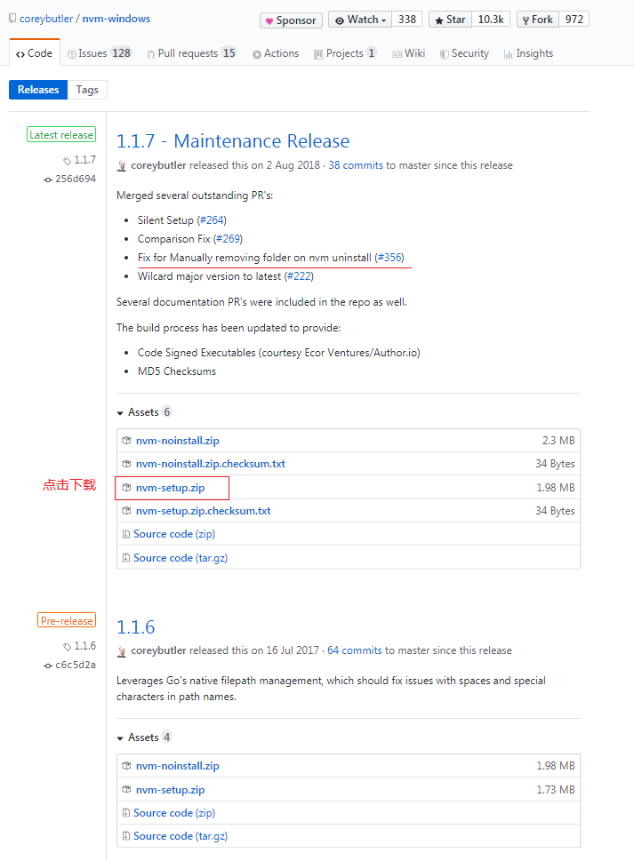
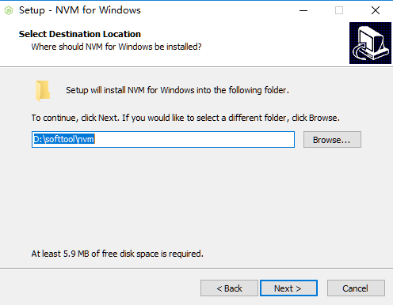
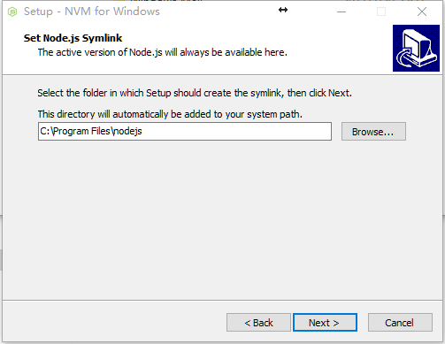
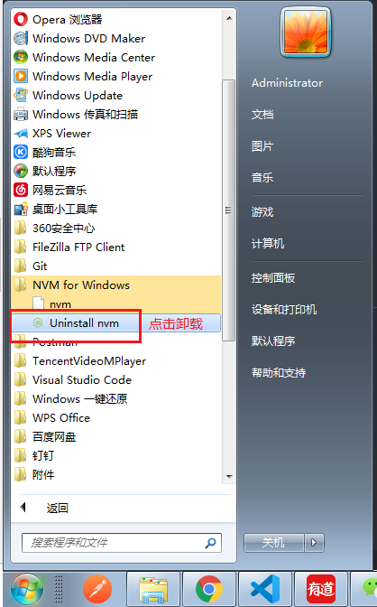
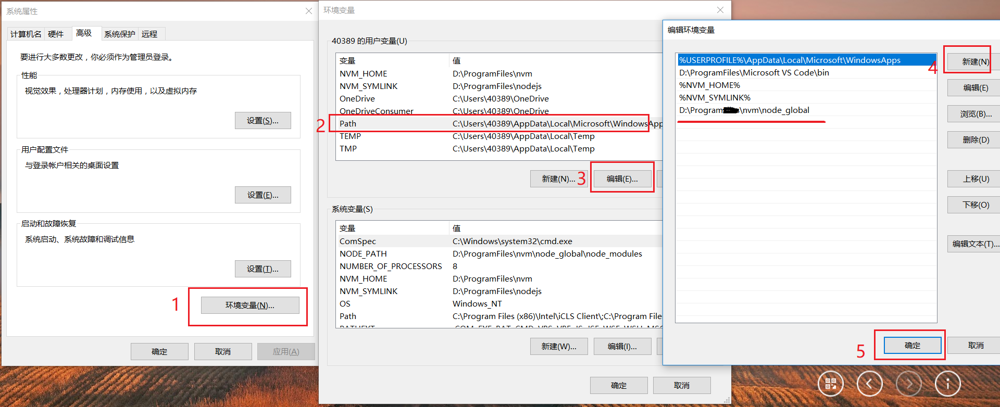
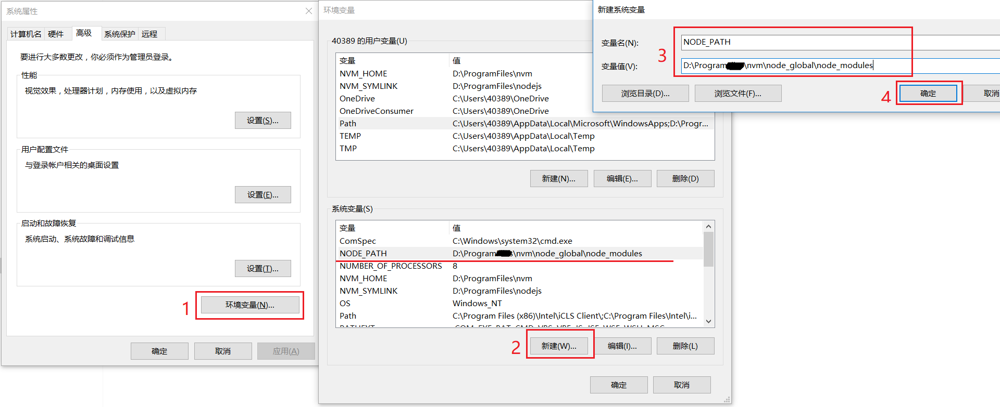

# nvm

**1. nvm 是什么**

所谓 `nvm` 就是 `Node Version Manager` 的缩写，即 `node`的版本管理工具，当我们需要在电脑中安装多个不同版本的`node`，时就要由 NVM 来实现。

`node`管理工具主流两个`n` `nvm`，但实际上都不支持 windows 系统。所以出现了`gnvm`和`nvm-windows`可以运行在 windows 上运行的管理工具。我这边选择`nvm-windows`，因为`gnvm`安装了报错一直没成功就放弃了。

**2. 下载**
nvm-windows 在 github 下载[链接](https://github.com/coreybutler/nvm-windows/releases)



看到有两个版本【Pre-release 1.1.6】和 【Latest release 1.1.7]。
本来不想下载最新的，怕不稳定。下了 1.1.6，但是 1.1.6 的版本有两个问题：

-   `npm`无法安装，`nvm install`时只安装了`node`，但`npm`提示安装成功但实际上安装目录并没有相关文件，导致`npm`不可用。
-   `nvm unistall`命令无效。卸载某个版本时没有效果，提示需要手动删除文件夹。

看到上图版本 1.1.7 修复了上述问题，实际安装成功也没有上面二个问题，所以这里下载 1.1.7。（1.1.7 是当前最新版本，后续以最新版本为主）。

这里又有四个可下载的文件解释下：

```
nvm-noinstall.zip： 这个是绿色免安装版本，但是使用之前需要配置
nvm-setup.zip：这是一个安装包，下载之后点击安装，无需配置就可以使用，方便。
Source code(zip)：zip压缩的源码
Sourc code(tar.gz)：tar.gz的源码，一般用于*nix系统
```

**3. 安装之前操作**

如果电脑已经安装了`node`，最好卸载掉按下面步骤清理下文件目录，以免安装不成功。

在安装`nvm for windows`之前：

-   你需要卸载任何现有版本的`node.js`。并且需要删除现有的 nodejs 安装目录（例如："C:\Program Files\nodejs’）。因为，nvm 生成的 symlink（符号链接/超链接)不会覆盖现有的（甚至是空的）安装目录。
-   你还需要删除现有的 npm 安装位置（例如“C:\Users\weiqinl\AppData\Roaming\npm”），以便正确使用 nvm 安装位置。

**4. 安装**
将之前下载的文件解压，双击执行安装文件`nvm-setup.exe`，傻瓜式的下一步就行。
这里注意的地方就是两个安装路径的问题：

-   nvm 的安装路径名称中最好不要有空格，如默认的`program Files`路径，最好自定义一下。我不喜欢把软件安装在 C 盘，所以更改到 D 盘目录下。
    

-   node 快捷方式的设置目录最好选择在 nvm 同目录下。这里改到 D:\program\nodejs
    

之后，继续点击 Next-->Install-->Finish 完成本次安装。

打开`cmd`命令行窗口，输入`nvm version`

-   如果正确出现 nvm 版本号，则说明 nvm 安装成功。
-   否则，可能会提示 nvm: command not found

**5. 更改 nvm 的数据源**

默认 nvm 下载 node 数据请求的是国外的数据源，因为网络问题很容易导致安装失败。所以我们使用国内的淘宝镜像的数据源。

有两种方式设置：

-   命令行方式
    打开`cmd`命令窗口，分别输入下列内容回车

```bash
nvm node_mirror: https://npm.taobao.org/mirrors/node/
```

```bash
nvm npm_mirror https://npm.taobao.org/mirrors/npm/
```

-   修改配置文件`setting.txt`
    在`nvm`目录下打到`setting.txt`文件打开，添加以下内容镜像内容，最终为

```
root: D:\program\nvm
path: D:\program\nodejs
node_mirror: http://npm.taobao.org/mirrors/node/
npm_mirror: https://npm.taobao.org/mirrors/npm/
```

root 和 path 为 nvm 之前安装设置的文件目录。
node_mirror 和 npm_mirror 修改为对应的国内淘宝镜像目录。

**6. nvm 的使用**

Windows 下 nvm 的常用命令：

```bash
nvm arch                         查看当前系统的位数和当前nodejs的位数
nvm install <version> [arch]     安装制定版本的node 并且可以指定平台 version 版本号  arch 平台
nvm list [available]
  - nvm list   查看已经安装的版本
  - nvm list installed 查看已经安装的版本
  - nvm list available 查看网络可以安装的版本
nvm on                           打开nodejs版本控制
nvm off                          关闭nodejs版本控制
nvm proxy [url]                  查看和设置代理
nvm node_mirror [url]            设置或者查看setting.txt中的node_mirror，如果不设置的默认是 https://nodejs.org/dist/
nvm npm_mirror [url]             设置或者查看setting.txt中的npm_mirror,如果不设置的话默认的是：https://github.com/npm/npm/archive/.
nvm uninstall <version>          卸载制定的版本
nvm use [version] [arch]         切换制定的node版本和位数
nvm root [path]                  设置和查看root路径
nvm version                      查看当前的版本
```

**7. nvm 的卸载**
因为 nvm 是一个程序，不是一个包，所以在开始菜单的`所有程序`中找到`NVM for Windows`目录中点击`Uninstall nvm`，像常规电脑软件一样卸载即可。

卸载后，之前安装在 nvm 目录下的所有文件都会清空。


## 用 NVM 安装 Node.js

打开命令行窗口，输入以下命令:

```bash
nvm list available
```

查看网络上可用的 node 版本：

```
C:\Users\Administrator>nvm list available

|   CURRENT    |     LTS      |  OLD STABLE  | OLD UNSTABLE |
|--------------|--------------|--------------|--------------|
|   12.12.0    |   10.16.3    |   0.12.18    |   0.11.16    |
|   12.11.1    |   10.16.2    |   0.12.17    |   0.11.15    |
|   12.11.0    |   10.16.1    |   0.12.16    |   0.11.14    |
|   12.10.0    |   10.16.0    |   0.12.15    |   0.11.13    |
|    12.9.1    |   10.15.3    |   0.12.14    |   0.11.12    |
|    12.9.0    |   10.15.2    |   0.12.13    |   0.11.11    |
|    12.8.1    |   10.15.1    |   0.12.12    |   0.11.10    |
|    12.8.0    |   10.15.0    |   0.12.11    |    0.11.9    |
|    12.7.0    |   10.14.2    |   0.12.10    |    0.11.8    |
|    12.6.0    |   10.14.1    |    0.12.9    |    0.11.7    |
|    12.5.0    |   10.14.0    |    0.12.8    |    0.11.6    |
|    12.4.0    |   10.13.0    |    0.12.7    |    0.11.5    |
|    12.3.1    |    8.16.2    |    0.12.6    |    0.11.4    |
|    12.3.0    |    8.16.1    |    0.12.5    |    0.11.3    |
|    12.2.0    |    8.16.0    |    0.12.4    |    0.11.2    |
|    12.1.0    |    8.15.1    |    0.12.3    |    0.11.1    |
|    12.0.0    |    8.15.0    |    0.12.2    |    0.11.0    |
|   11.15.0    |    8.14.1    |    0.12.1    |    0.9.12    |
|   11.14.0    |    8.14.0    |    0.12.0    |    0.9.11    |
|   11.13.0    |    8.13.0    |   0.10.48    |    0.9.10    |

This is a partial list. For a complete list, visit https://nodejs.org/download/r
elease

C:\Users\Administrator>
```

> 关于 node 版本中 current 和 LTS 的区别：[链接](https://www.jianshu.com/p/014a14713dce)

一般选择 LTS 版本安装：

```bash
nvm install 10.16.3
// 如果是多个可以连写
nvm install 10.16.3 10.14.0 10.13.0
```

等待下载安装成功，然后查看本地已经安装的版本

```bash
nvm list
```

输出像下面这样。

```bash
C:\Users\Administrator>nvm list

    10.16.3
    10.14.0
    10.13.0

C:\Users\Administrator>
```

然后通过指定版本使用

```bash
nvm use 10.14.0
```

再查看当前版本列表

```bash
nvm list
```

输出像下面这样

```bash

C:\Users\Administrator>nvm list

    10.16.3
  * 10.14.0 (Currently using 64-bit executable)
    10.13.0

C:\Users\Administrator>
```

`* 10.14.0 (Currently using 64-bit executable)`代表当前系统在使用的`node`版本。

确认 node 是否安装成功

```bash
node -v
```

```bash
npm -v
```

正确输出版本号即安装成功，可以正常使用。

## 解决 nvm 切换 node 版本后 npm 安装的全局包不能共用的问题

此时如果我们在当前node版本下安装了全局包，比如`cnpm` 及各类脚手架`vue-cli` `typescript` `create-react-app`等。
然后切换另一个node版本运行时，没办法直接使用之前安装的全局包，会报错。一种办法是再全局重新安装一遍，但这不是最好的办法。

查看`nvm`管理的每个`node`版本都维护在单独的文件目录下，所有每个版本安装的全局包也都是在其所属版本的目录下。必然获取不到。

所以我们可以像以前单个`node`版本不想在 C 盘目录下安装全局包一样，将全局包安装目录提出来到指定目录。

**1. 在 nvm 安装路径下新建两个文件夹**

-   node_global 全局包下载存放
-   node_cache node 缓存

**2. 修改 npm 配置文件**
在 cmd 命令行窗口输入以下两条命令

```bash
npm config set prefix "D:\program\nvm\node_global"
```

```bash
npm config set cache "D:\program\nvm\node_cache"
```

**3. 修改系统环境变量**

-   在用户变量`path`中添加`D:\program\nvm\node_global`



-   在系统变量中新增变量`NODE_PATH`，变量值为`D:\program\nvm\node_global\node_modules`


**4. 验证**
查看当前node版本号
```bash
nvm list
```
输出
```bash
C:\Users\Administrator>nvm list

    10.16.3
  * 10.14.0 (Currently using 64-bit executable)
    10.13.0

C:\Users\Administrator>
```
全局安装cnpm
```bash
npm i -g cnpm
```
查看是否安装成功
```bash
cnpm -v
```
如果输出版本号即cnpm全局安装成功
此时打开文件目录`D:\ProgramFiles\nvm\node_global`可以正常看到cnpm包文件

再切换node版本号
```bash
nvm use 10.16.3
```
查看是否切换成功
```bash
nvm list
```
输出
```bash
C:\Users\Administrator>nvm list

  * 10.16.3 (Currently using 64-bit executable)
    10.14.0 
    10.13.0

C:\Users\Administrator>
```
这个版本下，我们没有直接全局安装`cnpm`,但是我们使用以下命令仍然有效，不会报错
```bash
cnpm -v
```
至此，nvm环境下共用全局包解决了。

开发所需的node环境配置完毕。