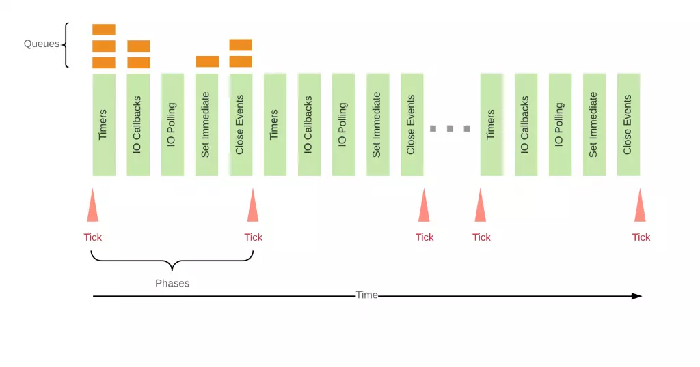
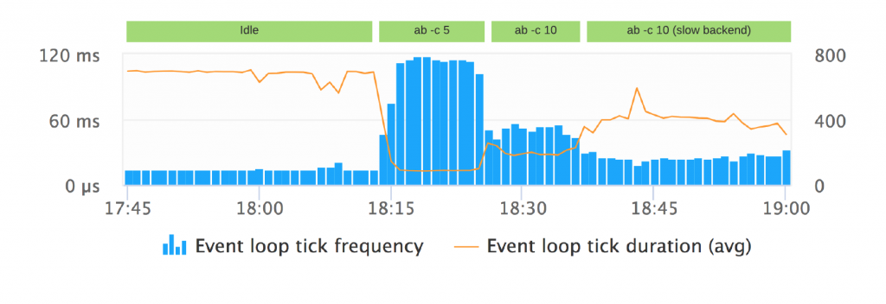

# 事件循环机制

[[toc]]

参考资料[官网文档](https://nodejs.org/zh-cn/docs/guides/event-loop-timers-and-nexttick/)

## 什么是事件循环

事件循环是 Node.js 处理非阻塞 I/O 操作的机制。这种机制成就了Node高性能和高并发的表现。

## 事件循环的阶段
当node启动时，会完成一系列的初始化操作之后进入事件循环。比如：同步任务 发出异步请求 规划定时器生效的时间 执行process.nextTick() 处理 require 加载的模块 注册事件回调等等。

进入事件循环后，具体将循环以下阶段：如下图所示：

**框里每一步都是事件循环机制的一个阶段。**

```js
   ┌───────────────────────────┐
┌─>│           timers          │
│  └─────────────┬─────────────┘
│  ┌─────────────┴─────────────┐
│  │     pending callbacks     │
│  └─────────────┬─────────────┘
│  ┌─────────────┴─────────────┐
│  │       idle, prepare       │
│  └─────────────┬─────────────┘   ┌───────────────┐
│  ┌─────────────┴─────────────┐   │   incoming:   │
│  │           poll          <─────┤  connections, │
│  └─────────────┬─────────────┘   │   data, etc.  │
│  ┌─────────────┴─────────────┐   └───────────────┘
│  │           check           │
│  └─────────────┬─────────────┘
│  ┌─────────────┴─────────────┐
└──┤      close callbacks      │
   └───────────────────────────┘
```
**基础过程是：**

每个阶段都有一个 FIFO（先进先出） 队列来存放执行后的回调(timer阶段使用小堆）。

当事件循环进入给定的阶段时，它将执行该阶段队列中的回调，直到队列清空或达到最大回调数限制。

当该队列已清空或达到回调限制时，事件循环将移动到下一阶段。

**各阶段主要的任务**

- **timers 阶段：** 执行setTimeout() 和 setInterval() 的回调函数。
- **pending 阶段：** 处理一些上一轮循环中的少数未执行的 I/O 回调。
- **idle 阶段, prepare阶段：** 仅系统内部使用。
- **poll 轮询阶段：** 检索新的 I/O 事件;执行与 I/O 相关的回调（几乎所有情况下，除了关闭的回调函数，它们由计时器和 setImmediate() 排定的之外），其余情况 node 将在此处阻塞。
- **check 阶段：** 执行setImmediate() 回调函数在这里。
- **close 阶段：** 一些准备关闭的回调函数，如：socket.on('close', ...)。

上述七个阶段的循环是libuv库实现的，除了它们，实际上还有一个特殊的阶段：

- **rocess.nextTick：** 虽然它也是异步API的一部分，但从技术上讲它不是循环的一部分。

- **microtask 微任务** 这个 microtask（微任务）。它由 V8 实现，被 Node 调用。在这个阶段常见是Promise.resolve。

    microtask微任务之所以没放在上图阶段中，是因为它是由V8实现，node只是调用执行而已。微任务队列被node调用的时机则是在每个阶段中每一个回调执函数执行后都清空一次微任务队列。

    > 在node v11.0.0之前，微任务队列是在每个阶段切换时。在v11之后则是每一个回调结束后，使得js执行表现与浏览器中微任务执行效果一样。

    > 在浏览器环境下，我们常说事件循环中包括宏任务（macrotask 或 task）和微任务（microtask），这两个概念是在 HTML 规范中制定，由浏览器厂商各自实现的。而在 Node 环境中，是没有宏任务这个概念的，至于所说的微任务，则是由 V8 实现，被 Node 调用的；虽然名字相同，但浏览器中的微任务和 Node 中的微任务实际上不是一个东西，至少在node中的微任务还实现了process.nextTick方法。当然，不排除它们间有相互借鉴的成分。

**Tick概念**

完成一次循环过程称为一个tick。如下图：


## Timers 阶段

timers 阶段会执行 setTimeout 和 setInterval 回调。进入该阶段，实际代码执行的是一个for循环，把到期的回调拿出执行，直到遇到一个还未到期的回调，则退出循环。且后面的回调将在下一下tick执行。

看一段C的源码：
```c
void uv__run_timers(uv_loop_t* loop) {
    struct heap_node* heap_node;
    uv_timer_t* handle;

    // for循环
    for (;;) {
        heap_node = heap_min(timer_heap(loop));  // 最小堆
        if (heap_node == NULL)
        break;

        handle = container_of(heap_node, uv_timer_t, heap_node);
        if (handle->timeout > loop->time)  // 如果遇到第一个还未到触发时间的事件回调，退出循环
        break;

        uv_timer_stop(handle);
        uv_timer_again(handle);
        handle->timer_cb(handle);
    }
}
```

在这个阶段有几个值得注意的地方：
- 该阶段不是采用队列形式存放回调，从源码看，是采用最小堆的数据结构。因为 timeout 回调需要按照超时时间的顺序来调用，而不是先进先出的队列逻辑。所以这里用了最小堆。
- node无法保证按用户期望的确切时间执行回调，只能保证不会在指定时间之前执行。因为系统内部的任务调度和其它回调的执行的都有可能导致延迟。
- 即使在`setTimeout(fn,0)`，Node 做不到0毫秒，最少也需要1毫秒，也就是说，`setTimeout(fn,0)`等同于`setTimeout(f, 1)`。根据官方文档，第二个参数的取值范围在1毫秒到2147483647毫秒之间，第三个参数开始之后的参数将作为回调函数的实参传入。`setTimeout(fn, time, ...args)` `setInterval(fn, time, ...args)`

## pending 阶段

这个阶段开始使用的是队列。使用一个while循环取出队列里的回调执行。

```c
while (!QUEUE_EMPTY(&pq)) {
    q = QUEUE_HEAD(&pq);
    QUEUE_REMOVE(q);
    QUEUE_INIT(q);
    w = QUEUE_DATA(q, uv__io_t, pending_queue);
    w->cb(loop, w, POLLOUT);
  }
```
在这个阶段主要是一些应该在上一轮循环（上一个tick)的 poll 阶段执行的回调，因为某些原因不能执行，就会被延迟到这一轮循环的 pending 阶段执行。也就是说，这个阶段执行的回调都是上一轮残留的。

## idle 阶段, prepare阶段

node内部调用，外部业务无法使用。

## poll 阶段

poll 是一个至关重要的阶段。

当事件循环进入 poll阶段 时，如果没有设定了到期的 timer  ，则会按根据下面两种情况执行：

- 如果 poll 队列不为空，会遍历回调队列并同步执行，直到队列为空或者达到系统限制
- 如果 poll 队列为空时，则又以下情况：

    - 如果有 setImmediate 回调需要执行，poll 阶段会停止并且进入到 check 阶段执行回调。
    - 会判断是否有 timer 超时，如果有的话会直接回到 timer 阶段执行回调，开始一次新tick。
    - 如果没有 setImmediate 回调也没有到期的timer需要执行，则会在此阶段阻塞，等待有回调被加入到队列中，然后执行回调。当然这里阻塞时长同样会有个超时时间设置，防止一直等待下去。

下图是一个利用ab作的压力测试，记录事件循环持续时间和被动态调整频率
图片来源[所有你需要知道的关于完全理解 Node.js 事件循环及其度量](https://juejin.im/post/5984816a518825265674c8f6#heading-0)


从图中可以看到，应用程序处于空闲状态，这意味着没有执行任何任务（定时器、回调等），此时如果仍然全速运行每个事件循环的阶段是没有意义的，所以此时事件循环就会在这种空闲状态的情况下，在poll轮询阶段阻塞一段时间以等待新的外部事件进入。所以图上看到左边部分，tick调用频率极低，tick duration很长。

该演示的场景中运行得“最好”的是并发 5 个请求，效率最高。

总结下：poll阶段会做了以下事情：

- 执行poll队列的回调
- 监控是否有到期的timer和是否有setImmediate回调
- 如果在空闲状态下，会计算阻塞时间

## ckeck 阶段

该阶段会执行setImmediate() 回调。

setImmediate() 实际上是一个在事件循环的单独阶段运行的特殊计时器。它使用一个 libuv API 来安排回调在 poll轮询阶段完成后立即执行。

只要存在setImmediate()回调，那么Poll阶段为空或到最大回调限制，那就会马上进入check阶段执行回调。

## close 阶段
该阶段执行一个关闭事件回调，一些准备关闭的回调函数，如：socket.on('close',...)

所以在事件循环中需要关注理解的就是timer、poll、 check阶段。总体来说，事件循环线程执行事件的回调函数，负责对处理类似网络 I/O 的非阻塞异步请求。

## process.nextTick

这个函数其实是独立于 Event Loop 之外的，它在它有一个自己的队列nextTickQueue，当每个回调执行后，如果存在 nextTick 队列，就会清空队列中的所有回调函数，并且优先于其他 microtask 执行。

> 为什么要存在使用 process.nextTick()? 还没找到答案


## promise
这是ES实现的异步API，由V8引擎管理，node调用。

## 各阶段的运行时机的比较

### setTimeout 和 setImmediate

下面这段代码输出顺序是怎样的？
```js
setTimeout(() => console.log(1));
setImmediate(() => console.log(2));
```
如果你将上面的代码运行多次，可以看到输出结果是随机的，可能是1 2，也可能是 2 1

之所以这样，是因为执行计时器的顺序将根据调用它们的上下文而异。

因为setTimeout的第二个参数默认为0。但是实际上，Node 做不到0毫秒，最少也需要1毫秒。

实际执行的时候，进入事件循环前有一个初始化过程，当程序开始到进入循环，执行timer阶段经历时间有可能到了1毫秒，也可能还没到1毫秒，取决于系统当时的状况。如果没到1毫秒，那么 timers 阶段就会跳过，进入 check 阶段，先执行setImmediate的回调函数。如果起过1毫秒，那会进入timer阶段执行回调，然后依次进入一个阶段。

### setImmediate 和 process.nextTick

```js
setImmediate(() => console.log(2));
process.nextTick(()=>console.log('nextTick'))
```
上面代码，在进入循环前的初始化时，process.nextTick()就会被执行，然后进入循环。

实质上，这两个名称应该交换，因为从字面上理解 process.nextTick()是下一次tick循环，而setImmediate() 是立即触发，但这是过去遗留问题，因此不太可能改变。如果贸然进行名称交换，将破坏 npm 上的大部分软件包。每天都有新的模块在不断增长，这意味着我们我们每等待一天，就有更多的潜在破损在发生。所以说尽管这些名称使人感到困惑，但它们的名字本身不会改变。

### process.nextTick 和 Promise.resolve().then

```js
Promise.resolve().then(()=>console.log('then'))
process.nextTick(()=>console.log('nextTick'))
```
process.nextTick()始终都是优先于其他 microtask 执行的。


## 一道综合面试题

```js
async function async1(){
    console.log('async1 start')
    await async2()
    console.log('async1 end')
  }
async function async2(){
    console.log('async2')
}

console.log('script start')
setTimeout(function(){
    console.log('setTimeout0') 
},0)  
setTimeout(function(){
    console.log('setTimeout3') 
},3)  
setImmediate(() => console.log('setImmediate'));
process.nextTick(() => console.log('nextTick'));
async1();
new Promise(function(resolve){
    console.log('promise1')
    resolve();
    console.log('promise2')
}).then(function(){
    console.log('promise3')
})
console.log('script end')
``
