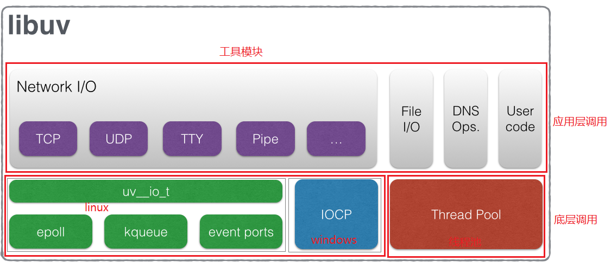

# Node 介绍

[[toc]]

在web浏览器里可以运行JS代码，因为浏览器为JS代码的运行提供了一个合适的环境，比如JS引擎可以将JS代码编译成电脑可执行代码。JS能够操作网页，是因为浏览器为JS提供DOM相关的API供其调用。所以我们经常说浏览器是JS的宿主，JS寄生于浏览器才能使用。

直到NODE出现，JS的宿主环境又多了一个。JS通过寄生于NODE这个新宿主，实现了可以在服务器端使用JS语言开发应用。

那NODE之所以能成为JS新一种宿主环境，是因为NODE也为JS的运行搭建了一个合适的环境。但是Node 不是一个从零开始搭建的运行环境，它是“站在巨人肩膀上”进行一系列拼凑和封装得到的结果，node.js使用了Google的V8解析引擎和Marc Lehmann的libev。

Node使用V8（Chrome V8）作为 JavaScript 解析引擎，V8是由谷歌开源，以 C++ 语言编写，具有高性能和跨平台的特性的，同时也用于 Chrome 浏览器。

另外在浏览器端有一个事件循环机制来实现JS运行异步I/O的高性能。在NODE同样实现了一个libuv库，实际上它才是为 Node 重新开发的，使用C语言编写。libuv库实现了跨平台的事件循环。作为一个在操作系统之上的中间层，libuv 使得开发者使用JS语言开发时不用像传统后端语言一样需要开发者自己管理线程，而只需要调用由libuv库提供的API来轻松的实现异步I/O。

```js
  --------------------------------
  |  Node                        |
  |        --------------        |
  |        | Javascript |        |
  |        --------------        |
  |        --------------        |
  |        | V8 engine  |        |
  |        --------------        |
  |        --------------        |
  |        | libuv      |        |
  |        --------------        |
  |  --------  -------  ------   |
  |  | 网卡 |  | 硬盘 | | ... |   |
  |  --------  ------- -------   |
  --------------------------------
```

V8引擎对JS代码解析原理在浏览端的笔记来写。这里我们介绍下libuv库。

## libuv库

[libuv中文教程](http://luohaha.github.io/Chinese-uvbook/index.html)

Libuv是一个高性能的，事件驱动的异步I/O库，它本身是由C语言编写的，具有很高的可移植性。libuv封装了不同平台底层对于异步IO模型的实现，使得它本身具备在Windows, Linux都可使用的跨平台能力。

Libuv库专为Node.js而设计，但是后来因为它这种事件驱动的异步IO的高效模型逐步被很多语言和项目采纳而成为一个通用库，作为其它项目的底层库来使用，像 Luvit, Julia, pyuv等。

>Nodejs刚出来的时候并不是使用libuv，而是Marc Lehmann开发的libev。libev本身也是一个异步IO的库，但是它只能在POSIX标准下的unix或linux系统使用。随着nodejs被越来越多人使用，由于windows的用户量巨大，所以开始考虑Nodejs的有windows平台的实现。这时候Nodejs在libev基础上开发了libuv库来作为抽象封装层，因为libev已经在linux系统下封装了epoll 或 kqueue的调用，而在window系统下与epoll或者kqueue功能相同的机制是IOCP，所以在Windows平台上对系统原生的IOCP进行封装，自此之后使Nodejs具备了跨平台能力，由Libuv作为中间层本身提供的跨平台的抽象，根据运行系统环境来决定调用那些系统层原生提供的相关I/O的API。如Window系统下使用IOCP。后来在node-v0.9.0版本中，libuv移除了libev的内容。

libuv库提供了很多核心工具模块，例如定时器，非阻塞的网络支持，异步文件系统访问，子进程等。



从左往右可分为两部分，Network I/O的相关部分，和另一部分File I/O，DNS Ops和User Code等组成。
从上往下看，上面为对外使用的应用层，下面为内部调用的底层接口

那现的问题是当大量I/O请求进入后，node是如何组织和调用这些内部I/O模块，并且是如何接受和执行它们返回的结果呢？

## Node 怎么决定下一步该运行哪些代码？

在 Node 中维护着两个类型的线程：

### 事件循环线程（也称为主线程）：

主线程是node启动时执行的线程。负责任务的编排，包括所有事件的回调，以及I/O的异步请求等。

node启动时，会完成一系列的初始化操作之后进入事件循环。比如：同步任务 发出异步请求 规划定时器生效的时间 执行process.nextTick() 处理 require 加载的模块 注册事件回调，启动V8 engine，等等。

### 工作线程池：
线程池的数量可以通过环境变量UV_THREADPOOL_SIZE配置，最大不超过128个，默认为4个。它专门处理繁重的高成本任务。

- **I/O 密集型任务**
DNS：用于 DNS 解析的模块，dns.lookup(), dns.lookupService()
FS文件系统：所有文件系统 API，除了 fs.FSWatcher() 和显式调用 API 如 fs.readFileSync() 之外
- **CPU 密集型任务**
Crypto：用于加密的模块
Zlib：用于压缩的模块，除了那些显式同步调用的 API 之外

事件轮询线程本身并不维护队列，它持有一堆要求操作系统自带I/O机制去监听的文件描述符。 这些文件描述符可能代表一个网络套接字，一个监听的文件等等。 当操作系统确定某个文件的描述符发生变化，事件循环线程将把它转换成合适的事件，然后触发与该事件对应的回调函数。

工作线程池则使用一个真实的队列，里边装的都是要被处理的任务。 一个工作线程从这个队列中取出一个任务，开始处理它。当完成之后这个工作线程向事件循环线程中发出一个“至少有一个任务完成了”的消息，然后事件循环线程触发与该任务对应的回调函数。


## 事件循环

参考资料：[从源码解读 Node 事件循环](https://juejin.im/post/5d439f016fb9a06b29752d5a)

事件循环是 Node 的执行模型，执行事件的回调函数，负责对处理类似网络 I/O 的非阻塞异步请求等。同时还协同另一个线程池处理诸如文件 I/O 等高成本任务。

当node启动时，会完成一系列的初始化操作之后进入事件循环。比如：同步任务 发出异步请求 规划定时器生效的时间 执行process.nextTick() 处理 require 加载的模块 注册事件回调等等。

> 我们通常定义node具有事件驱动、单线程、异步 I/O 等特性。其中的单线程指的node运行的主线程。


上图描述了 Node 的运行原理，从左到右，从上到下，Node 被分为了四层：

- 应用层。JavaScript 交互层，常见的就是 Node 的模块，如 http，fs，我们在业务代码中调用的API就是这层暴露出来的。
- V8 引擎层。利用 V8 来解析 JavaScript 语法，进而和下层 API 交互
- Node 桥接层。为上层模块提供和系统底层的调用或交互的转译通信
- libuv 层。跨平台的底层封装，实现了事件循环、文件操作等，是 Node 实现异步的核心。它将不同的任务分配给不同的线程，形成一个事件循环（event loop），以异步的方式将任务的执行结果返回给 V8 引擎。


这个事件循环机制给Node带来了突出的优势：

**基于事件循环可以构造高性能服务器**

高性能表现为更少的内存占用和更低的上下文切换代价。
经典的服务器模型有以下几种：

- 同步式。一次只能处理一个请求，其他请求都处于等待状态。
- 每进程/每请求。会为每个请求启动一个进程，这样就可以同时处理多个请求，但由于系统资源有限，不具备扩展性。
- 每线程/每请求。会为每个请求启动一个线程，虽然线程比进程轻量，但是对于大型站点而言，依然不够。因为每个线程都要占用一定内存，当大并发请求到来时，内存将会很快耗光。
- 事件驱动。通过事件驱动的方式处理请求，无需为每个请求创建额外的线程，可以省去创建和销毁线程的开销，同时操作系统在调度任务时因为线程较少，上下文切换的代价较低。这种模式被很多平台所采用，如 Nginx(C)、Event Machine(Ruby)、AnyEvent(Perl)、Twisted(Python)，以及本文讨论的 Node。

    事件驱动的实质，是通过主循环来加载事件的触发来运行程序。

    > 为什么 Ryan Dahl 偏偏选了 JavaScript 呢？在开发 Node 时，Ryan Dahl 曾经评估过多种语言。最终结论为：C 的开发门槛高，可以预见不会有太多开发者将其作为日常的业务开发；Lua 自身已经包含很多阻塞 I/O 库，为其构建非阻塞 I/O 库也无法改变人们继续使用阻塞 I/O 库的习惯；Ruby 的虚拟机性能不够高。相比之下，JavaScript 比 C 开发门槛低，比 Lua 历史包袱少，在浏览器中已经有广泛的事件驱动应用，V8 引擎又具有超高性能，于是，Javascript 就成为了 Node 的开发语言。


**基于事件循环可以实现异步任务调度**

事件循环的使用场景可以分为真实异步 I/O 和非真实 I/O 的异步操作两种。

- 真实异步 I/O 的实质是指 I/O 操作与 CPU 操作分离的操作，从而实现非阻塞的调用底层接口。常见的使用场景有网络通信、磁盘 I/O、数据库访问等。
- 非真实 I/O 的异步操作实质是程序设计的一种模式，异步执行逻辑还是在CPU中执行。如异步操作的定时器，如 setTimeout、setInterval，以及 process.nextTick、setImmediate、promise。

    >那程序为什么要实现这种非真实的I/O异步模式呢？一个 Node 进程只有一个主线程，在任何时刻都只有一个事件在执行。如果这个事件占用大量 CPU 时间，事件循环中的下一个事件就要等待很久。所以可以使用 process.nextTick()、nextTick、setImmediate、promise等把复杂的工作拆散，变成一个个较小的事件去执行。循环的存在使得这个事件每次执行一点，多次循环后完成事件。这样事件即完成了也没有阻塞其它事件的执行，因为每次过程过程中会执行其它进入的事件。

这里最关键就是主线程中事件循环的机制。下节讲解。


