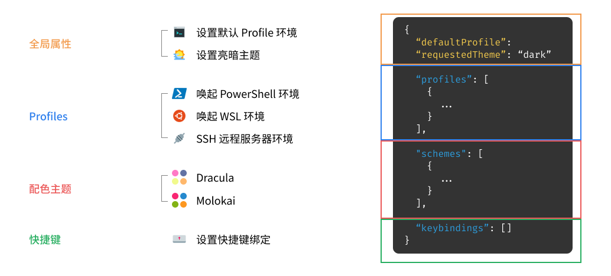

# Windows Teriminal

[[toc]]

[新生代 Windows 终端：Windows Terminal 的全面自定义](https://sspai.com/post/59380)

## 下载

- windows store 直接下载安装

## 配置文件



[记录十 Windows Terminal配置](https://www.jianshu.com/p/13e832853926)

Scheme 的颜色主题在 [mbadolato/iTerm2-Color-Schemes](https://github.com/mbadolato/iTerm2-Color-Schemes/tree/master/windowsterminal) 仓库中选择 windowsterminal 文件夹里面选择用于Windows Terminal的格式。复制之后，粘贴到schemes这个数组里，然后在想应用的配置文件里的 colorScheme 设置为你新指定的主题的名字。

## 添加额外的主题

1. 安装 oh-my-posh 和 posh-git

以管理员身份运行：
```
Install-Module posh-git
Install-Module oh-my-posh
```
过程中，如果让你允许什么不可信的来源，输入Y和A表示同意即可。

2. 安装 powerline 字体, 你可在 [Powerline/fonts](https://github.com/powerline/fonts) 仓库中选择，克隆或下载整个仓库，选择某个字体后右键选择“适用全体用户”安装。

安装完成后，打开 windows terminal ，按 CTRL+, 打开配置文件，在 profiles/list 的各个终统中设置含有 powerline 结尾的字体： "fontFace": "Source Code Pro for Powerline"

3. 设置自启动文件 $profiles

打开~\Documents\WindowsPowerShell，新建文本文档，叫做Microsoft.PowerShell_profile.ps1（记得开拓展名显示），输入以下内容，保存。
```
Import-Module posh-git
Import-Module oh-my-posh
Set-Theme PowerLine
```
这样，在每次PoweShell打开的时候都能启用PowerLine主题。

## 添加 git Bash

1. 配置文件中list列表复制一项，终端下拉箭头中显示的顺序与List列表顺序一致，所以如果想要 git Bash 显示在上面，可以放在 list 第一项。
2. 使用这个[网站](https://www.guidgen.com/)生成一个唯一的 GUID，并替换配置文件中对应的字段
3. 启动命令 commandline 使用 Git\bin\bash.exe，切勿使用 Git\git-bash.exe，否则会弹出新窗口
4. 图标 icon 同样可以在 git 安装路径中找到：D:\\Program Files (x86)\\Git\\mingw64\\share\\git\\git-for-windows.ico

## 添加右键菜单

[添加 window terminal 到右键菜单](https://blog.csdn.net/Jioho_chen/article/details/101159291)

## 快捷键

使用默认的快捷键就可以啦，参考[https://aka.ms/terminal-keybindings](https://aka.ms/terminal-keybindings)

主要关于窗口的操作快捷键
```
alt+shift+-			            往下切分窗口（水平方向）		
alt+shift++			            往右切分窗口（垂直方向）		
alt+down/up/left/right			窗口焦点切换		
alt+shift+down/up/left/right	窗口大小调整		
ctrl+shift+w			        关闭窗口		
ctrl+shift+t			        新建窗口

ctrl+tab			            顺向切换标签选项卡		
ctrl+shift+tab			        逆向切换标签选项卡		
ctrl+alt+num			        切换到第几个标签选项卡		
ctrl+f4			                关闭标签		
```

## 我的完整配置
```json
{
    "$schema": "https://aka.ms/terminal-profiles-schema",
    "defaultProfile": "{61c54bbd-c2c6-5271-96e7-009a87ff44bf}", // 启动默认打开的程序 list 中定义的 guid
    "copyOnSelect": false,
    "copyFormatting": false,
    "theme": "dark",
    "profiles":
    {
        "defaults":
        {
            // Put settings here that you want to apply to all profiles.
            "fontFace": "Source Code Pro for Powerline"
        },
        "list":
        [
            {
                // Make changes here to the powershell.exe profile.
                "guid": "{057b9343-8935-4ab9-9512-79589c9601f3}", //唯一标识符，随机生成
                "name": "Git Bash", //在下拉菜单里显示的名称
                "commandline": "D:\\Program Files (x86)\\Git\\bin\\bash.exe",
                "hidden": false,
                "background" : "#000", //背景颜色，PS默认为蓝色
                "closeOnExit" : true, //关闭窗口的时候退出所有挂载的程序
                "colorScheme" : "Snazzy", //配色方案（Dracula需导入）
                "cursorColor" : "#FFFFFF", //光标颜色
                "cursorShape" : "bar", //光标形状（默认为bar，即条状）
                "fontFace" : "Source Code Pro for Powerline", //所用字体
                "fontSize" : 10, //字体大小
                "historySize" : 9001, //缓存大小
                "icon" : "D:\\Program Files (x86)\\Git\\mingw64\\share\\git\\git-for-windows.ico", //图标
                "tabTitle" : "PowerShell", //在选项卡上显示的名称
                "padding" : "8, 8, 8, 8", //内容的边框距，默认填充全部空间
                "snapOnInput" : true, //输入的时候自动滚动到输入位置
                "startingDirectory" : "./", //初始工作目录，默认为用户目录,配合右键功能改成当前目录
                "acrylicOpacity" : 0.8, //亚克力背景透明度（需启用useAcrylic）
                "useAcrylic" : true //使用亚克力效果
            },
            {
                // Make changes here to the powershell.exe profile.
                "guid": "{61c54bbd-c2c6-5271-96e7-009a87ff44bf}", //唯一标识符，随机生成
                "name": "Windows PowerShell", //在下拉菜单里显示的名称
                "commandline": "powershell.exe",
                "hidden": false,
                "background" : "#000", //背景颜色，PS默认为蓝色
                "closeOnExit" : true, //关闭窗口的时候退出所有挂载的程序
                "colorScheme" : "Snazzy", //配色方案（Dracula需导入）
                "cursorColor" : "#FFFFFF", //光标颜色
                "cursorShape" : "bar", //光标形状（默认为bar，即条状）
                "fontFace" : "Source Code Pro for Powerline", //所用字体
                "fontSize" : 10, //字体大小
                "historySize" : 9001, //缓存大小
                "icon" : "ms-appx:///ProfileIcons/{61c54bbd-c2c6-5271-96e7-009a87ff44bf}.png", //图标
                "tabTitle" : "PowerShell", //在选项卡上显示的名称
                "padding" : "8, 8, 8, 8", //内容的边框距，默认填充全部空间
                "snapOnInput" : true, //输入的时候自动滚动到输入位置
                "startingDirectory" : "./", //初始工作目录，默认为用户目录,配合右键功能改成当前目录
                "acrylicOpacity" : 0.8, //亚克力背景透明度（需启用useAcrylic）
                "useAcrylic" : true //使用亚克力效果
            },
            {
                // Make changes here to the powershell.exe profile.
                "guid": "{0caa0dad-35be-5f56-a8ff-afceeeaa6101}", //唯一标识符，随机生成
                "name": "命令提示符", //在下拉菜单里显示的名称
                "commandline": "cmd.exe",
                "hidden": false,
                "background" : "#000", //背景颜色，PS默认为蓝色
                "closeOnExit" : true, //关闭窗口的时候退出所有挂载的程序
                "colorScheme" : "Snazzy", //配色方案（Dracula需导入）
                "cursorColor" : "#FFFFFF", //光标颜色
                "cursorShape" : "bar", //光标形状（默认为bar，即条状）
                "fontFace" : "Source Code Pro for Powerline", //所用字体
                "fontSize" : 10, //字体大小
                "historySize" : 9001, //缓存大小
                "padding" : "8, 8, 8, 8", //内容的边框距，默认填充全部空间
                "snapOnInput" : true, //输入的时候自动滚动到输入位置
                "startingDirectory" : "./", //初始工作目录，默认为用户目录,配合右键功能改成当前目录
                "acrylicOpacity" : 0.8, //亚克力背景透明度（需启用useAcrylic）
                "useAcrylic" : true //使用亚克力效果
            },
            {
                "guid": "{b453ae62-4e3d-5e58-b989-0a998ec441b8}",
                "hidden": true, // 这项删除不了，所以只能隐藏
                "name": "Azure Cloud Shell",
                "source": "Windows.Terminal.Azure"
            }
        ]
    },

    // Add custom color schemes to this array.
    // To learn more about color schemes, visit https://aka.ms/terminal-color-schemes
    // [mbadolato/iTerm2-Color-Schemes](https://github.com/mbadolato/iTerm2-Color-Schemes/tree/master/windowsterminal)
    "schemes": [
        {
            "name": "Snazzy",
            "black": "#000000",
            "red": "#fc4346",
            "green": "#50fb7c",
            "yellow": "#f0fb8c",
            "blue": "#49baff",
            "purple": "#fc4cb4",
            "cyan": "#8be9fe",
            "white": "#ededec",
            "brightBlack": "#555555",
            "brightRed": "#fc4346",
            "brightGreen": "#50fb7c",
            "brightYellow": "#f0fb8c",
            "brightBlue": "#49baff",
            "brightPurple": "#fc4cb4",
            "brightCyan": "#8be9fe",
            "brightWhite": "#ededec",
            "background": "#1e1f29",
            "foreground": "#ebece6"
        }
    ],

    // Add custom keybindings to this array.
    // To unbind a key combination from your defaults.json, set the command to "unbound".
    // To learn more about keybindings, visit https://aka.ms/terminal-keybindings
    "keybindings":
    [
        // Copy and paste are bound to Ctrl+Shift+C and Ctrl+Shift+V in your defaults.json.
        // These two lines additionally bind them to Ctrl+C and Ctrl+V.
        // To learn more about selection, visit https://aka.ms/terminal-selection
        { "command": {"action": "copy", "singleLine": false }, "keys": "ctrl+c" },
        { "command": "paste", "keys": "ctrl+v" },

        // Press Ctrl+Shift+F to open the search box
        { "command": "find", "keys": "ctrl+shift+f" },

        // Press Alt+Shift+D to open a new pane.
        // - "split": "auto" makes this pane open in the direction that provides the most surface area.
        // - "splitMode": "duplicate" makes the new pane use the focused pane's profile.
        // To learn more about panes, visit https://aka.ms/terminal-panes
        { "command": { "action": "splitPane", "split": "auto", "splitMode": "duplicate" }, "keys": "alt+shift+d" }
    ]
}
```

## 解决在 PowerShell/CMD/Window Terminal 中，git log 中文显示乱码（unicode）问题

1. 在PowerShell中输入以下命令
```bash
git config --global core.quotepath false
git config --global gui.encoding utf-8
git config --global i18n.commit.encoding utf-8
git config --global i18n.logoutputencoding utf-8
$env:LESSCHARSET='utf-8'
```
2. 在系统环境变量中添加变量 LESSCHARSET 为 utf-8

参考链接：[PowerShell | git log 中文乱码问题解决](https://blog.csdn.net/FollowGodSteps/article/details/96271359)