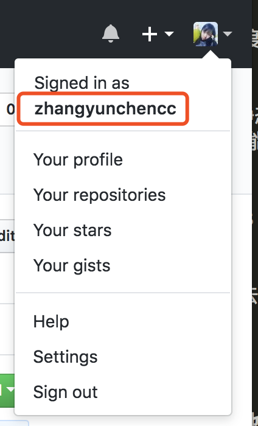
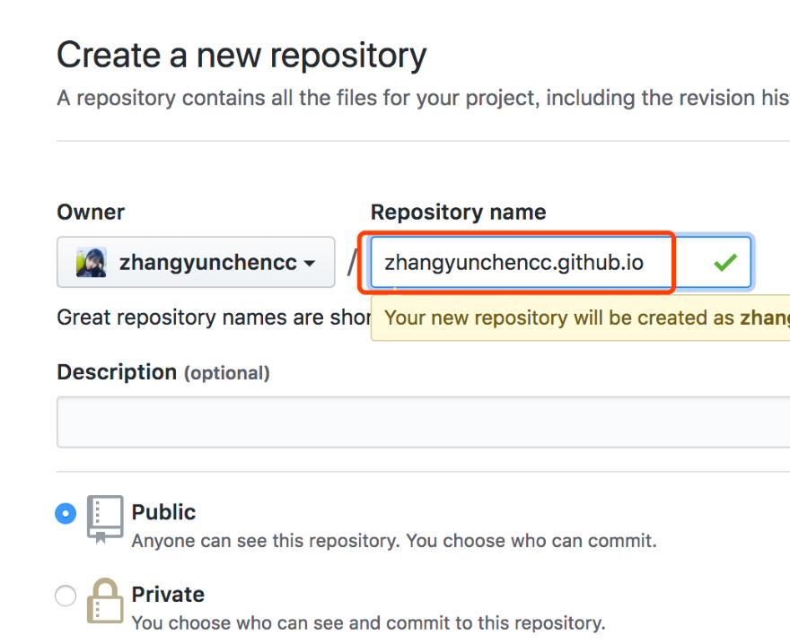

# Vuepress 快速上手指南

## 前言

写这篇文档主要是方便自己以后回看，能快速完成一个 Vuepress 项目搭建。自己一开始直接从官方文档学习，被文档中指引的链接跳来跳去弄得很迷糊，很挫败。借鉴视频（文未有链接）的学习路径梳理出一条学习主线，有自己的学习步骤，再对应参照官方文档能少走弯路，更快掌握。这也是本文档的写作目的。

## 项目构建

```sh
# 1. 打开cmd，用shell命令快速构建一个本地项目，取名为VuepressDemo
mkdir VuepressDemo
cd VuepressDemo

# 2. 初始化本地仓库，用git进行版本管理，也方便后续跟远程仓库交互和部署
git init
# 建立.gitignore文件，写入内容
node_modules
deploy.sh # 部署到线上会用到的一个脚本文件
docs/.vuepress/dist # 项目打包编译后输出的目录

# 3.初始化项目，安装Vuepress包
# 可以选择本地项目安装，也可以全局安装。但因为最后需要自动部署到github page，官方文档要求是本地依赖安装。见官方文档：指南 -> 部署 -> GitHub Pages
npm init -y
npm i -D vuepress # 本地项目依赖安装

# 4. 新建docs目录，vuepress所有页面构建基于此目录，固定命名
mkdir docs
# 新建一个README.md文件，vuepress会将README.md文件转换成.html文件,所以docs目录下的README.md文件会作为vuepress项目的首页，即index.html
echo '# Hello VuePress!' > README.md # 新建README.md文件，并写入'# Hello VuePress!'，作为h1标题

# 5.启动Vuepress，开始写作
npx vuepress dev docs # 本地开发状态
# npx vuepress build docs # 构建编译，生成HTML文件。默认情况下，文件将会被输出在 .vuepress/dist目录。

# 6.使用npm脚本管理vuepress命令，在项目根目录的package.json 里加一些脚本语句
"scripts": {
    "docs:dev": "vuepress dev docs",
    "docs:build": "vuepress build docs"
}
# 启动vuepress命令变为
npm run docs:dev # 开发
npm run docs:build # 生产
```

::: warning 官方文档提示
如果你的现有项目依赖了 webpack 3.x，推荐使用 Yarn 而不是 npm 来安装 VuePress。
因为在 webpack 3.x 这种情形下，npm 会生成错误的依赖树。
:::

此时的项目目录结构：

```
VuepressDemo
.
├─ docs
│  ├─ README.md
├─ node_modules
├─ .gitignore
└─ package.json
```

此时的页面效果是这样的，默认集成了项部搜索框


## 完善页面

### 添加配置文件.config.js

参照官方文档页面，一个完整的首页页面包括(后面也可以自定义页面布局)

-   顶部导航栏： 页面标题、搜索框（默认）、导航栏链接、外部跳转链接等
-   侧边栏
-   页脚： 上下页跳转（配置侧边栏自动生成）、更新时间等

::: tip 提示
vuepressDemo 是我们整个项目或本地仓库的文件，
而 vuepressDemo/docs 才是真正的 vuepress 管理的目录。后续所有页面管理和配置都在 docs 目录下操作。
:::

所以我们现在按照这个顺序配置页面结构，进入 docs 目录，创建一个.vuepress 目录，新建配置文件.config.js
此时项目结构为：

```
VuepressDemo
.
├─ docs
│  ├─ README.md
│  └─ .vuepress
│     └─ config.js
├─ node_modules
├─ .gitignore
└─ package.json
```

配置文件.config.js，遵循 commonjs 模块规范，默认导出一个对象

```js
// .vuepress/config.js
module.exports = {
    // 1.页面标题
    title: 'Vuepress快速入门指南'
}
```

### 头部导航栏配置

导航栏链接配置在 themeConfig.nav 对象属性下：

```js
// .vuepress/config.js
module.exports = {
    // 1.页面标题
    title: 'Vuepress快速入门指南',
    // 2.导航栏链接：通过themeConfig.nav配置
    themeConfig: {
        nav: [
            { text: 'Home', link: '/' }, // 首页也可以不配置，因为点击页面标题也会跳转到首页
            { text: 'webpack', link: '/webpack/' }, // 配置一个页面跳转链接
            { text: 'External', link: 'https://google.com' } // 配置一个外部跳转链接
        ]
    }
}
```

按照导航栏跳转配置的页面，我们需要增加一个 webpack 目录，新建一个 README.md 文件，作为 webpack 页面的 html 文件。
此时项目结构为：

```
VuepressDemo
.
├─ docs
│  ├─ webpack
│  │  └─ README.md
│  ├─ README.md
│  └─ .vuepress
│     └─ config.js
├─ node_modules
├─ .gitignore
└─ package.json
```

在 webpack/README.md 写入内容

```
# webpack
This is webpack page
```

页面展示效果：

#### 导航栏下拉链接

导航栏链接的展示效果可以有很多种，比如有下拉链接，还有分组的下拉链接，此类链接配置就是 items 属性的嵌套。具体配置看[官方文档-导航栏链接](https://vuepress.vuejs.org/zh/default-theme-config/#%E5%AF%BC%E8%88%AA%E6%A0%8F%E9%93%BE%E6%8E%A5)

#### 禁用导航栏链接：全局和局部页面

禁用不显示顶部导航，有两种情况：全局禁用不显示 和 指定页面禁用不显示

```js
// .vuepress/config.js
module.exports = {
    themeConfig: {
        // 全局禁用不显示，设置navbar:false，此时nav配置项不生效
        navbar: false
    }
}
```

指定页面禁用不显示，比如在 webpack/README.md 页面最上面写入`YAML front matter`语法的语句：

```yaml
---
navbar: false
---

```

### 侧边栏配置

#### 自动生成侧边栏

第一种需求是，侧边栏仅仅导航当前页面各级标题的链接，那可以使用`YAML front matter`语句来实现。在当前页面顶部添加如下语句：

```yaml
---
sidebar: auto
---

```

如果在全局配置文件中添加如下语句，那当前整个 vuepress 项目中每个页面的做侧边栏都将基于其当前活动页面的标题生成。

```js
// .vuepress/config.js
module.exports = {
    themeConfig: {
        sidebar: 'auto'
    }
}
```

#### 手动配置嵌套分组的侧边栏

第二种需求是，当前主题内容比较多，划分了多个页面来组织，希望侧边栏是基于整个主题相关页面的导航，而不是当前页面。则可以在`themeConfig.sidebar`数组中配置。
假如有一个 webpack 相关介绍的主题，我分了很多页面来组织内容。此时页面结构如下

```
VuepressDemo
.
├─ docs
│  ├─ README.md
│  ├─ .vuepress
│  │  └─ config.js
│  └─ webpack
│     │─ README.md
│     │─ Intro.md
│     │─ Install.md
│     │─ Entry.md
│     │─ Output.md
│     │─ Html.md
│     │─ Css.md
│     └─ ResourceCode.md
├─ node_modules
├─ .gitignore
└─ package.json
```

在配置文件中配置侧边栏

```js
// .vuepress/config.js
module.exports = {
    themeConfig: {
        nav: {
            /*省略代码*/
        },
        sidebar: {
            // 对象的key键对应目录，特别注意目录必须/开头，/结尾
            '/webpack/': [
                '' /* /webapck.README.html */,
                'Intro' /* /webapck/Intro.md,下面类同*/,
                'Module',
                'InstallAndUsage',
                'Entry',
                'Output',
                'Html',
                'ResourceCode'
            ]
        }
    }
}
```

但生成的侧边栏，并没有我最终想要的，我希望按由浅入深作个分组显示。数组内以对象形式，修改下配置

```js
// .vuepress/config.js
module.exports = {
    themeConfig: {
        nav: {
            /*省略代码*/
        },
        sidebar: {
            // 对象的key键对应目录，特别注意目录必须/开头，/结尾
            '/webpack/': [
                '' /* /webapck.README.html */,
                {
                    title: '基础入门',
                    collapsable: false, // 侧边栏的每个子组默认是可折叠的，你可以设置 collapsable: false 来让一个组永远都是展开状态。
                    children: ['Intro', 'Module', 'InstallAndUsage']
                },
                {
                    title: '配置项',
                    collapsable: false,
                    children: ['Entry', 'Output']
                },
                {
                    title: '项目构建实践',
                    collapsable: false,
                    children: ['Html', 'Css']
                },
                {
                    title: '进阶深入源码',
                    collapsable: false,
                    children: ['ResourceCode']
                }
            ]
        }
    }
}
```

最终效果
侧边栏显示内容取自文档内`h1`标签。


#### 禁用侧边栏

如果有些页面不希望显示侧边栏，同样在页面头部，通过 `YAML front matter` 语法来禁用当前页面的侧边栏：

```yaml
---
sidebar: false
---

```

### 页脚配置

页脚配置主要内容有两部分：

-   文档更新时间和 github 编辑链接
-   <-- 上一篇 下一篇 -->

#### 文档更新时间

通过配置文件中`themeConfig.lastUpdated`选项配置

```js
module.exports = {
    //省略其它代码
    themeConfig: {
        lastUpdated: '上次更新' // 给定一个字符串，它将会作为前缀显示（默认值是：Last Updated）, 此选项默认关闭，即lastUpdated:false
    }
}
```

::: danger 坑点

1.获取的时间是通过每个文件最后一次 git 提交的 UNIX 时间戳(ms)，如果你的项目没有建立本地仓库，也就是没有经过`git init` 和 `git push`步骤是获取不到时间的。<br> 2.时间格式不正确，默认是英文时间格式，需要更换成中国时区的格式，需要更改默认语言设置。
:::

```js
module.exports = {
    // 省略其它代码
    locales: {
        '/': {
            lang: 'zh-CN'
        }
    }
}
```

#### github 编辑链接

通过配置文件中`themeConfig.repo`选项，将会自动在固定的头部导航栏生成一个 GitHub 链接，以及在页面的底部生成一个 "Edit this page" 链接。

```js
module.exports = {
    // 省略其它代码
    themeConfig: {
        // 比如我的配置：xutao0793/blog
        repo: 'accountName/reponame',
        // 头部导航栏链接显示的标签字符，默认根据repo配置推断，如果是github，则显示GitHub字样
        repoLabel: '查看源码',

        // 配置页脚的链接是否显示，默认是 false, 设置为 true 来启用
        editLinks: true,
        // 配置显示的标签字符，默认为 "Edit this page"
        editLinkText: '在 GitHub 上编辑此页'
    }
}
```

最后效果是：


#### 上一篇 下一篇 跳转

上一篇和下一篇文章的链接将会自动地根据当前页面的侧边栏的顺序来获取，前提是你侧边栏是按多页面配置的。

你也可以使用 `YAML front matter`语句在页面中重定向到指定页面，或者禁用它。

```yaml
---
prev: ./some-other-page
next: false
---

```

### 页面跳转

#### 跳转到内部指定页面或指定锚点

第一种：如果是多页面项目，需要能跳转到指定页面。
比如项目文件结构如下：

```
VuepressDemo
.
├─ docs
│  ├─ README.md
│  ├─ .vuepress
│  │  └─ config.js
│  ├─ webpack
│  │   │─ README.md
│  │   │─ Intro.md
│  │   │─ Html.md
│  │   └─ Css.md
│  └─ vuepress
│      └─ README.md
├─ node_modules
├─ .gitignore
└─ package.json
```

```md
<!-- 当前页面：docs/vuepress.README.md -->

[Home](/) <!-- 跳转到根部docs的 README.md -->
[webpack](/webpack/) <!-- 跳转到 webpack 文件夹的 index.html -->
[webpack content anchor](/webpack/#content) <!-- 跳转到 webpack/index.html 的特定锚点（ #content 位置） -->
[webpack - Intro](/webpack/Intro.html) <!-- 具体文件可以使用 .html 结尾 -->
[webpack - Intro](/webpack/Intro.md) <!-- 也可以用 .md -->
```

#### 跳转到外部链接

正常的`markdown`链接语法

```md
[vuepress 官方文档](https://vuepress.vuejs.org/zh/)
```

## 部署上线

说了这么多都是在本地开启服务器进行的，现在我们要把本地的内容推送到某个服务器上，这样只要有网络，就可以随时随地看自己的网站了。

一般来说，有两种方案可供选择：

1. 自己买一个服务器，阿里云、腾讯云等，这种方式的好处是速度有保证、可以被搜索引擎收录，坏处是要花钱啊 💰 土豪同学可以考虑。
2. 使用 Github Pages 。什么是 Github Pages 呢？简单说就是 Github 提供的、用于搭建个人网站的静态站点托管服务。很多人用它搭建个人博客。这种方式的好处是免费、方便，坏处是速度可能会有些慢、不能被国内的搜索引擎收录。

下面按照免费的 Github Pages 服务，记录下布置步骤。这里自己踩了个大坑，后面讲。

参照这位大佬的步骤，和借用下图片，就懒得截图了。
[手把手教你使用 VuePress 搭建个人博客](https://www.zhangyunchen.cc/guide.html#%E4%B8%80%E3%80%81%E4%B8%BA%E4%BB%80%E4%B9%88%E4%BD%A0%E9%9C%80%E8%A6%81%E4%B8%80%E4%B8%AA%E5%8D%9A%E5%AE%A2%EF%BC%9F)

### 登录[GitHub](https://github.com/)

打开 github 网站，登陆自己的 github 账号（没有账号的快去注册并面壁思过作为一个优秀的程序员为啥连一个 github 账号都没有）
接下来，我们新建两个仓库：

### 新建仓库一：USERNAME.github.io

::: warning 注意
USERNAME 必须是你 Github 的账号名称，不是你的名字拼音，也不是你的非主流网名，不要瞎起，要保证和 Github 账号名一模一样！
:::
查看自己的 USERNAME



新建仓库，Repository name 就填写为：USERNAME.github.io



这个仓库建好后，不用克隆到本地，内容更新修改都在下面创建的仓库中进行。

### 新建仓库二：比如：vuepressBlog

这个远程项目仓库是用来储放博客内容的，需要关联到本地仓库，以后只需要改这个项目就够了。

这个时候你也可以按上面大佬的步骤先克隆远程仓库到本地，通过复制代码的方法转移仓库。

如果是参照我这个文档操作下来的。应该已经初始化本地 git 仓库。现在要作的就是将本地仓库与刚刚新建的 vuepressBlog 远程仓库绑定。

**git push 前确保.gitignore 忽略文件中写入了 node_module deploy.sh docs/.vuepress/dist 内容**，不然错误推送后再删除比较麻烦。

git 命令如下：

```sh
# 进入项目根目录，即VuepressDemo
# 添加远程仓库 vuepressBlog
git remote add origin repo_url

# 首次推送推送远程分支并建立追踪关系
#git push --set-upstream origin master
git push -u origin master
```

如果`git push`时报错，可能是当初新建远程仓库二时，选择生成了 README.md，此时需要先拉下来，强制合并两个不关联的仓库，使用下面 git 命令：
[本地仓库关联远程仓库首次关联问题解决](https://blog.csdn.net/qq_31617409/article/details/82085861)

```sh
# 拉取远程仓库代码并合并到本地，因为是首次拉取合并两个不同仓库，需要添加参数  --allow-unrelated-histories
git pull  --allow-unrelated-histories

# 如果有冲突，解决冲突并添加提交到本地仓库。确保缓冲干净
git add -A
git commit -m 'pull allow unrelated histories'

# 将本地master分支与远程仓库master分支建立追踪关系
git branch --set-upstream-to=origin/master master

# 再推送
git push

# 查看本地仓库主分支与远程仓库主分支是否建立跟踪关系
git branch -vv
```

### 创建部署脚本：deploy.sh

在整个项目 VuepressDemo 根目录下创建 deploy.sh 文件，内容如下：

```sh
#!/usr/bin/env sh

# 确保脚本抛出遇到的错误
set -e

# 生成静态文件,与项目package.json中script中build构建命令一样。
npm run docs:build

# 进入生成的文件夹
cd docs/.vuepress/dist

# 如果是发布到自定义域名
# echo 'www.yourwebsite.com' > CNAME

git init
git add -A
git commit -m 'deploy'

# 这里直接在USERNAME.github.io仓库根目录下部署。注意替换USERNAME
# 如果你想要部署到 https://USERNAME.github.io
git push -f git@github.com:USERNAME/USERNAME.github.io.git master

# 如果发布到 https://USERNAME.github.io/<REPO>  REPO=github上的项目
# git push -f git@github.com:USERNAME/<REPO>.git master:gh-pages

cd -
```

**把文件中的 USERNAME 改成 Github 账号名，例如我的账号名是 xutao0793**

```sh
# 如果你想要部署到 https://USERNAME.github.io
git push -f git@github.com:xutao0793/xutao0793.github.io.git master
```

简单说二者的关系是：仓库一负责显示网站内容，我们可以通过站点链接访问，我们不需要改动它；日常开发和新增内容，都在推送仓库二中。

### 增加发布命令： npm run deploy

```json
"scripts": {
    "deploy": "bash deploy.sh"
}
```

### 运行发布命令

```
npm run deploy
```

此时切换到 GigHub 网页，进入新建的仓库一，点击仓库的`settings`,一直下拉到`GitHub Pages`位置，看到`https://zhangyunchencc.github.io/` ，即可看到自己的主页啦。


### 发布失败解决

#### 提示`bash deploy.sh`命令不可用错误

因为 bash 是 linux 系统下的命令，`.sh`文件也是 linux 系统下的脚本执行文件。在 windows 系统下不识别。当初自己也是在网上查找了很久，也没有解决。

[在 windows 用 vuepress 搭建最后部署的时候怎么执行.bash 文件](https://segmentfault.com/q/1010000019523548)

然后误打误撞，印象中打开 git 命令窗口，通常右键时会看到`Git Bash Here`，其中`Bash`与它是不是有关系啊？？然后再找手动执行`.sh`文件的命令，琢磨着是不是可以用 git 工具手动`.sh`文件呢？

没办法，无奈下操作一下，还真成功了。

```sh
# 在VuepressDemo下面根目录下，右键打开Git命令工具，输入
sh deploy.sh
```

#### 提示不能读取远程仓库的错误

实际上第一次执行`sh deploy.sh`并没有成功，但是从窗口结果看，该命令确实能执行`.sh`文件里的命令。但是在最后推送时又报了下面错误。又是一顿查找爬坑的方法
结果是自己仓库的公钥不知道为什么没用，还是过期了，既然没用，就照着方法重新生成一个吧。

错误类型：[vuepress 构建静态页面，部署到 github pages 报错](https://segmentfault.com/q/1010000019705888)<br>
解决方案：[github 提示 Permission denied (publickey)，如何才能解决？](https://my.oschina.net/u/1377923/blog/1822038)<br>
SSH 公钥：[服务器上的 Git - 生成 SSH 公钥](https://git-scm.com/book/zh/v2/%E6%9C%8D%E5%8A%A1%E5%99%A8%E4%B8%8A%E7%9A%84-Git-%E7%94%9F%E6%88%90-SSH-%E5%85%AC%E9%92%A5)

到这里，终于算大功告成了。现在就是可以编写文档，然后发布了。

## 后续

待后续文档写中，再深入学习后，计划后续再写二篇 vuepress 进阶内容：

-   Vuepress 进阶：自定义样式覆盖、使用 Vue 组件替换默认布局、配置评论插件 valine、使用 Algolia 替换默认搜索、添加一键到顶部 Back-To-Top、增加 Markdown 扩展插件等
-   Vuepress 深入：源码浅析，可以阅读[深入浅出 Vuepress,共四篇](https://www.jianshu.com/p/c7b2966f9d3c)

## 参考链接

[文档：一步步搭建 VuePress 及优化](https://juejin.im/post/5c9efe596fb9a05e122c73f1)<br>
[视频：一步步搭建 VuePress 及优化](https://www.bilibili.com/video/av43316513/)<br>
[深入浅出 Vuepress,共四篇](https://www.jianshu.com/p/c7b2966f9d3c)
