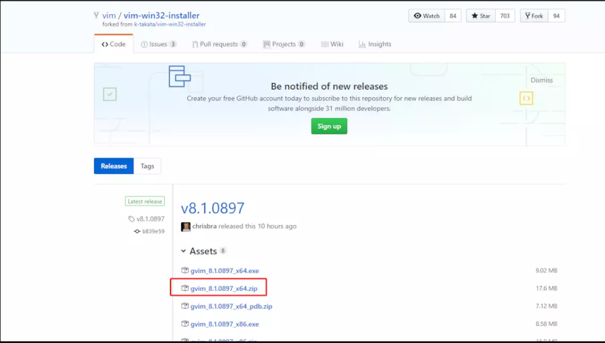
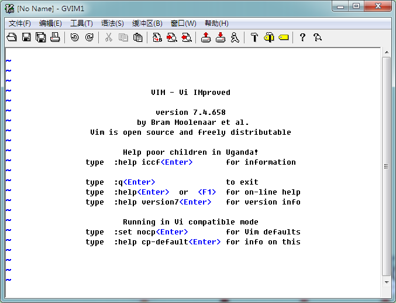

# vim 安装

[[toc]]

## 下载

在 github 的 vim 官方仓库地址下载对应的版本安装 [https://github.com/vim/vim-win32-installer/releases](https://github.com/vim/vim-win32-installer/releases)


也可以选择 .exe 文件下载，直接一路安装，安装完成后，打开 gVim，默认界面如下图:


初始默认界面非常粗糙，我们要在此基础上进行一系列配置，达到两个目的：
- 优化界面UI效果
- 支持前端编程语言 html css js vue 等语法高亮

## 认识 _vimrc

Vim 启动时，会根据配置文件（_vimrc）来设置 Vim，因此我们可以通过此文件来定制适合自己的 Vim。

Vim 配置文件分为系统配置文件和用户配置文件，Vim 用户配置文件比系统配置文件的优先级高，换句话说，Vim 启动时，会优先读取 Vim 用户配置文件（位于主目录中的），所以我们只需要修改用户配置文件即可（不建议直接修改系统配置文件）。
- 系统配置文件位于 Vim 的安装目录（默认路径为 /etc/_vimrc）；
- 用户配置文件位于主目录 ~/_vimrc，即通过执行 vim ~/_vimrc 命令即可对此配置文件进行合理修改。通常情况下，Vim 用户配置文件需要自己手动创建，所以如果在该路径下如果没有，可以手动创建。

> windows 用户主目录路径：C:\Users\your computer name

## 配置 _vimrc

由于 vimrc 里面会有很多的配置项，为了避免混乱，建议按类型将配置分成了几个小组：

- Startup - 编辑器启动时需要添加的一些配置
- General - 通用配置
- Lang & Encoding - 语言和编码
- GUI - 界面
- Format - 基本的代码格式
- Keymap - 通用的快捷键
- Plugin - 插件相关（包括和当前插件相关的配置和快捷键等）
- Function - vimrc 里面用到的常用方法

> 参考链接 [可能是 Windows 下最漂亮的 Gvim 配置了](https://zhuanlan.zhihu.com/p/21328642)

## 插件 plugin

vim 的插件分为三种，比较常用的就是第二种
- 在Github vim-scripts 用户下的repos, 只需要写出repos名称: Plugin '插件名称' 实际上是 Plugin 'vim-scripts/插件仓库名' 只是此处的用户名可以省略
- 在Github其他用户下的repos, 需要写出”用户名/repos名”: Plugin '用户名/插件仓库名'
- 不在Github上的插件，需要写出git全路径: Plugin 'git clone 后面的地址', 或者： 本地的Git仓库(例如自己的插件) Plugin file:///+本地插件仓库绝对路径

使用 Vundle 来管理插件，简要命令
- :PluginList       - 列出所有已配置的插件
- :PluginInstall    - 安装插件,追加 `!` 用以更新或使用 :PluginUpdate
- :PluginSearch foo - 搜索 foo ; 追加 `!` 清除本地缓存
- :PluginClean      - 清除未使用插件,需要确认; 追加 `!` 自动批准移除未使用插件

安装
- 1. 安装 Vundle: git clone https://github.com/VundleVim/Vundle.vim.git ~/vimfiles/bundle/Vundle.vim
- 2. 现代 Windows 在用户根目录新建 _vim 而不是旧的 .vim，并写入插件，格式：Plugin 'plugin_name'
- 3. 打开 vim，运行 :PluginInstall

注意事项
1. 开启 filetype off
2. set nocompatible 去除VI一致性,必须
3. Plugin 'VundleVim/Vundle.vim'
4. 设置包括vundle和初始化相关的runtime path
   set rtp+=~/vimfiles/bundle/Vundle.vim 设置包括vundle和初始化相关的runtime path
   call vundle#begin()
另一种选择, 将vundle安装的插件独立一个文件，并在下面指定路径
    call vundle#begin('~/some/path/here')
5. 安装插件的命令必须放在vundle#begin和vundle#end之间.

## 主题

- 在 github 仓库里找到主题对应的 .vim 文件，可以下载或者复制文件内容，在 vim 安装目录的 color 文件夹下新建一个以对应主题命名的.vim文件，粘贴之前复制的内容。
- 然后在配置文件 _vimrc 中设置 set colorscheme theme_name

## 字体

字体容易踩坑，因为很多主题需要配合对应的字体，特别是配置状态栏的样式，如果使用以前的 powerline 插件或者现在更新的 airline 插件，需要配合安装 powerline 结尾的字体文件。

1. 参考网址 [https://github.com/powerline/fonts](https://github.com/powerline/fonts)下载字体，如果按 install.sh 安装无效，在 windows 10 系统中打开字体文件，双击即可安装到本机上。
2. 然后打开Gvim 字体设置选择含有 prowerline 结尾的字体，如果隐藏了菜单栏，可通过命令 :set guifont=* 打开字体选择框
3. 上述设置只是临时的，如果需要每次启动都上效，需要将字体配置写入 _vimrc 文件，通过命令行查看当前字体设置信息 :set guifont，复制并写入配置文件 
4. 在 _vimrc 配置文件的插件配置项中增加状态栏插件：Plugin 'vim-airline/vim-airline' Plugin 'vim-airline/vim-airline-themes'
5. 按 airline 官方仓库指导添加如下必要配置

```
" vim-airline
let g:airline_powerline_fonts = 1
let g:airline#extensions#tabline#enabled = 1
set t_Co=256
set guifont=Ubuntu_Mono_derivative_Powerlin:h12:cANSI:qDRAFT
```

## 本机配置 _vimrc

```
" 由于 vimrc 里面会有很多的配置项，为了避免混乱，进行分组，参考链接：https://zhuanlan.zhihu.com/p/21328642
" Startup - 编辑器启动时需要添加的一些配置
" General - 通用配置
" Lang & Encoding - 语言和编码
" GUI - 界面
" Format - 基本的代码格式
" Keymap - 通用的快捷键
" Plugin - 插件相关（包括和当前插件相关的配置和快捷键等）
" Function - vimrc 里面用到的常用方法

" Startup {{{
" 按照折叠所依据的规则，可以分为Manual（手工折叠）、Indent（缩进折叠）、Marker（标记折叠）和Syntax（语法折叠）等几种。
" set foldmethod=marker 启用标记折叠，所有文本将按照特定标记（默认为{{{和}}}）自动折叠。
" za 打开/关闭当前折叠 zo 打开当前折叠 zc 关闭当前打开的折叠 zj移到下一个折叠 zk移到上一个折叠 zm 关闭所有折叠 zr 打开所有折叠 zd 删除当前折叠
augroup ft_vim
  au!
  au FileType vim setlocal foldmethod=marker
augroup END
" }}}

" General {{{
set nocompatible                                   " 不与 Vi 兼容（采用 Vim 自己的操作命令）
set backspace=indent,eol,start                     " vim默认与vi相同，bs键不能删除，所以重设，包括 indent: 如果用了:set indent,:set ai 等自动缩进，想用退格键将字段缩进的删掉，必须设置这个选项。eol:如果插入模式下在行开头，想通过退格键合并两行，需要设置eol。start：要想删除此次插入前的输入，需设置这个。
set nobackup                                       " 在保持默认writebackup选项的情况下，不创建备份文件。默认情况下，文件保存时，会额外创建一个备份文件，它的文件名是在原文件名的末尾，再添加一个波浪号（〜）。
set noswapfile                                     " 不创建交换文件。交换文件主要用于系统崩溃时恢复文件，文件名的开头是.、结尾是.swp。
set history=1024                                   " Vim 需要记住多少次历史操作
set autochdir                                      " 自动切换工作目录。这主要用在一个 Vim 会话之中打开多个文件的情况，默认的工作目录是打开的第一个文件的目录。该配置可以将工作目录自动切换到，正在编辑的文件的目录。
set whichwrap=b,s,<,>,[,]                          " 默认情况下，在 VIM 中当光标移到一行最左边的时候，我们继续按左键，光标不能回到上一行的最右边。同样地，光标到了一行最右边的时候，我们不能通过继续按右跳到下一行的最左边。但是，通过设置 whichwrap 我们可以对一部分按键开启这项功能。如果想对某一个或几个按键开启到头后自动折向下一行的功能，可以把需要开启的键的代号写到 whichwrap 的参数列表中，各个键之间使用逗号分隔。
set nobomb                                         " 删除文件的BOM
set clipboard+=unnamed                             " Vim 的默认寄存器和系统剪贴板共享。这样在其它地方 copy 了一段文字回到 vim 里面可以粘贴进来
set winaltkeys=no                                  " 设置 alt 键不映射到菜单栏。windows 下应用程序的 alt 是用来定位菜单栏目的快捷键，我们需要禁用它，因为我们后面很多设置都需要使用 alt，需要使用 alt 来定位菜单的情况很少
" }}}

" Lang & Encoding {{{
set fileencodings=utf-8,gbk2312,gbk,gb18030,cp936
set encoding=utf-8
set langmenu=zh_CN
let $LANG = 'en_US.UTF-8'
"language messages zh_CN.UTF-8
" }}}

" GUI {{{
colorscheme molokai
source $VIMRUNTIME/delmenu.vim
source $VIMRUNTIME/menu.vim
set cursorline                          " 高亮当前行
set hlsearch                            " 搜索结果高亮
set number                              " 显示行事情
set showmatch                           " 显示括号匹配
set lines=35 columns=140                " 设置启动时窗口大小，也可以设置为全屏 
set splitbelow                          " 分割出来的窗口位于当前窗口下边/右边
set splitright
set guioptions-=T                       " 不显示Gvim界面的工具栏 T 菜单栏 m 各种滚动条L R B
set guioptions-=m
set guioptions-=L
set guioptions-=r
set guioptions-=b
set guioptions-=e                       " 使用内置 tab 样式而不是 gui
set list                                " 如果行尾有多余的空格（包括 Tab 键），该配置将让这些空格显示成可见的小方块。
set listchars=tab:»■,trail:■
set paste                               " 设置粘贴模式：在Vim中通过鼠标右键粘贴时会在行首多出许多缩进和空格，通过set paste可以在插入模式下粘贴内容时不会有任何格式变形、胡乱缩进等问题
set ruler                               " 显示光标当前位置
set laststatus=2                        " 总是显示状态栏
" set statusline=%F%m%r%h%w\ [FORMAT=%{&ff}]\ [TYPE=%Y]\ [POS=%l,%v][%p%%]\ %{strftime(\"%d/%m/%y\ -\ %H:%M\")}  " 状态行显示的内容（包括文件类型和解码)
set statusline=[%F]%y%r%m%*%=[Line:%l/%L,Column:%c][%p%%]\
" }}}

" Format {{{
set shiftwidth=2    " << >> 缩进的列数
set expandtab       " 在插入模式下按tab输入空格
set tabstop=2       " tab键输入2个空格
set autoindent      " 新增加的行和前一行具有相同的缩进形式
set smartindent     " 每一行都有相同的缩进量，直到遇到右大括号 (}) 取消缩进形式。如果某一行以 # 开头，那么该行不会采用上述缩进格式规则。可以认为smartindent是autoindent的升级版缩进方法。
set softtabstop=-1  " 设为负数，会使用 shiftwidth 值，两者保持一致，方便统一缩进
syntax on           " 开启语法向亮
" }}}

" Keymap {{{
let mapleader=","                                               " 设置 leader 键，使用 ，替换默认的 \
nmap <leader>uv :source $HOME/_vimrc<cr> " update vimrc         " 更新 update vimrc 配置
nmap <leader>ev :tabnew $HOME/_vimrc<cr> " edit vimrc           " 打开编辑 edit vimrc 配置文件

" tab 操作快捷键映射
map <leader>tn :tabnew<cr>
map <leader>tc :tabclose<cr>
map <leader>th :tabp<cr>
map <leader>tl :tabn<cr>

" 窗口切换：在已分割的窗口切换 M 代表 alt 键
nmap <M-j> <C-W>j    " 下边窗口
nmap <M-k> <C-W>k    " 上边窗口
nmap <M-h> <C-W>h    " 左边窗口
nmap <M-l> <C-W>l    " 右边窗口
nmap <M-c> <C-W>c     "关闭当前分割的窗口 命令:close 也是关闭当前窗口，但最后一个会报错

" 窗口大小调整： ctrl + j,k,h,l 调整分割窗口大小
nnoremap <C-j> :resize +5<cr>               " 往下拉长
nnoremap <C-k> :resize -5<cr>               " 往上缩短
nnoremap <C-h> :vertical resize -5<cr>      " 往左边缩窄
nnoremap <C-l> :vertical resize +5<cr>      " 往右边拉宽

" normal 标准模式下
nnoremap H ^          " 将光标移到第一个字符处
nnoremap L $          " 将光标移到最后一个字符处
nnoremap ^ H          " 将光标移动当前窗口第一行行首
nnoremap $ L          " 将光标移动窗口最后一行行首

" visual 视图模式下同上
vnoremap H ^
vnoremap L $
vnoremap ^ H
vnoremap $ L

" 命令模式下的行首尾
cnoremap <C-a> <home>
cnoremap <C-e> <end>

" 插入模式移动光标 alt + jkhl 代替方向箭头
inoremap jj <Esc>
inoremap <M-j> <Down>
inoremap <M-k> <Up>
inoremap <M-h> <left>
inoremap <M-l> <Right>
" 插入模式下(, [, {, “的时候都会自动补全，并且把光标移到括号的内部
inoremap ( ()<Esc>i
inoremap [ []<Esc>i
inoremap { {}<Esc>i
inoremap " ""<Esc>i

" like IDE operator
inoremap <C-BS> <Esc>bdei               " 插入模式下 crtl + backspace 删除整个单词
nnoremap vv ^vg_                        " 全选当前行
nnoremap <F2> :setlocal number!<cr>     " f2 开关行号
nnoremap <leader>w :set wrap!<cr>       " 长行是否自动换行
imap <C-v> "+gP                         " crtl+v 粘贴系统剪贴板内容
imap <C-V>		"+gP
vmap <C-c> "+y                          " crtl+c 复制到系统剪贴板
vnoremap <C-C> "+y
vnoremap <BS> d
cmap <C-V>		<C-R>+

exe 'inoremap <script> <C-V>' paste#paste_cmd['i']
exe 'vnoremap <script> <C-V>' paste#paste_cmd['v']

" 打开当前目录 windows
map <leader>ex :!start explorer %:p:h<CR>

" 打开当前目录CMD
map <leader>cmd :!start<cr>
" 打印当前时间
map <F3> a<C-R>=strftime("%Y-%m-%d %a %I:%M %p")<CR><Esc>

" 复制当前文件/路径到剪贴板
nmap ,fn :let @*=substitute(expand("%"), "/", "\\", "g")<CR>
nmap ,fp :let @*=substitute(expand("%:p"), "/", "\\", "g")<CR>

" 设置切换Buffer快捷键"
nnoremap <C-left> :bn<CR>
nnoremap <C-right> :bp<CR>

" }}}

" Plugin {{{
" Vundle 插件管理简要说明：
" vim 的插件分为三种，比较常用的就是第二种
" 1. 在Github vim-scripts 用户下的repos, 只需要写出repos名称: Plugin '插件名称' 实际上是 Plugin 'vim-scripts/插件仓库名' 只是此处的用户名可以省略
" 2. 在Github其他用户下的repos, 需要写出”用户名/repos名”: Plugin '用户名/插件仓库名'
" 3. 不在Github上的插件，需要写出git全路径: Plugin 'git clone 后面的地址', 或者： 本地的Git仓库(例如自己的插件) Plugin file:///+本地插件仓库绝对路径

" 简要帮助文档
" :PluginList       - 列出所有已配置的插件
" :PluginInstall    - 安装插件,追加 `!` 用以更新或使用 :PluginUpdate
" :PluginSearch foo - 搜索 foo ; 追加 `!` 清除本地缓存
" :PluginClean      - 清除未使用插件,需要确认; 追加 `!` 自动批准移除未使用插件

" 必须项
" 1. filetype off
" 2. set nocompatible 去除VI一致性,必须
" 3. Plugin 'VundleVim/Vundle.vim'
" 4. 设置包括vundle和初始化相关的runtime path
"    set rtp+=~/vimfiles/bundle/Vundle.vim 设置包括vundle和初始化相关的runtime path
"    call vundle#begin()
" 另一种选择, 将vundle安装的插件独立一个文件，并在下面指定路径
"     call vundle#begin('~/some/path/here')
" 5. 安装插件的命令必须放在vundle#begin和vundle#end之间.

" 踩坑
" 解决链接：https://github.com/VundleVim/Vundle.vim/wiki/Vundle-for-Windows
" 1. 安装 Vundle: git clone https://github.com/VundleVim/Vundle.vim.git ~/vimfiles/bundle/Vundle.vim
" 2. 现代 Windows 在用户根目录新建 _vim 而不是旧的 .vim
" 3. 打开 vim，运行 :PluginInstall

filetype off
set shellslash
set rtp+=~/vimfiles/bundle/Vundle.vim
call vundle#begin('~/vimfiles/bundle')
Plugin 'VundleVim/Vundle.vim'

Plugin 'fholgado/minibufexpl.vim'
Plugin 'Shutnik/jshint2.vim'
Plugin 'leshill/vim-json'
Plugin 'mislav/vimfiles'
Plugin 'leafgarland/typescript-vim'
Plugin 'tpope/vim-markdown'
Plugin 'tpope/vim-surround'
Plugin 'tpope/vim-fugitive'
Plugin 'marijnh/tern_for_vim'
Plugin 'Xuyuanp/nerdtree-git-plugin'
Plugin 'ctrlpvim/ctrlp.vim'
Plugin 'vim-airline/vim-airline'
Plugin 'vim-airline/vim-airline-themes'

" vim actions
Plugin 'easymotion/vim-easymotion'

" React
Plugin 'pangloss/vim-javascript'
Plugin 'mxw/vim-jsx'

" Vue
Plugin 'posva/vim-vue'

" Es6
Plugin 'tomtom/tlib_vim'
Plugin 'MarcWeber/vim-addon-mw-utils'
Plugin 'garbas/vim-snipmate'
Plugin 'isRuslan/vim-es6'

call vundle#end()            " 必须
filetype plugin indent on    " 必须 加载vim自带和插件相应的语法和文件类型相关脚本
" }}}

" vim-airline
let g:airline_powerline_fonts = 1
let g:airline#extensions#tabline#enabled = 1
set t_Co=256
set guifont=Ubuntu_Mono_derivative_Powerlin:h12:cANSI:qDRAFT
```

参考链接：
- [https://www.jianshu.com/p/a0b452f8f720](https://www.jianshu.com/p/a0b452f8f720)
- [Vundle 使用](https://github.com/VundleVim/Vundle.vim/blob/master/README_ZH_CN.md)
- [Vundle windows系统下的安装路径](https://github.com/VundleVim/Vundle.vim/wiki/Vundle-for-Windows)


